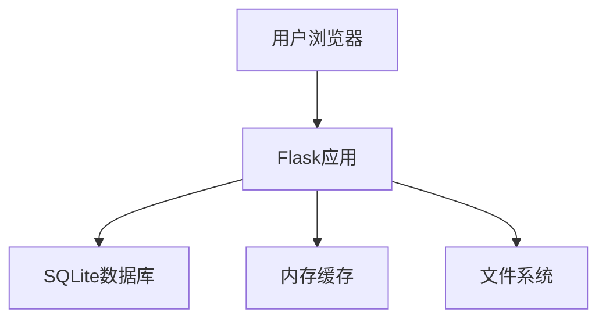

# 校园摄影征集大赛平台重构设计文档

## 1. 概述

### 1.1 项目背景
校园摄影征集大赛平台是一个用于组织和管理校园摄影比赛的Web应用，支持用户注册、照片上传、审核、投票和排行榜等功能。

### 1.2 重构目标
根据需求，本次重构的目标是：
1. 简化项目架构，仅保留核心功能
2. 使用SQLite作为数据库存储方案
3. 使用内存缓存替代Redis
4. 移除不必要的复杂组件和依赖

### 1.3 技术选型
- 数据库：SQLite
- 缓存：内存缓存
- 后端框架：Flask
- 前端技术：HTML、CSS、JavaScript

### 1.4 核心功能
- 用户注册、登录、权限管理
- 照片上传、审核、展示
- 投票机制
- 排行榜展示
- 系统设置管理

## 2. 架构设计

### 2.1 整体架构


### 2.2 组件说明
- **Flask应用**：处理HTTP请求，实现业务逻辑
- **SQLite数据库**：持久化存储用户、照片、投票等数据
- **内存缓存**：缓存热点数据，提高访问速度
- **文件系统**：存储上传的照片文件

### 2.3 目录结构
```
src/
├── app.py              # 应用主文件
├── models/             # 数据模型
│   ├── __init__.py
│   ├── base.py         # 基础模型
│   ├── photo.py        # 照片模型
│   ├── user.py         # 用户模型
│   └── settings.py     # 设置模型
├── services/           # 业务逻辑层
│   ├── __init__.py
│   └── cache_service.py # 缓存服务
├── utils/              # 工具类
│   ├── __init__.py
│   └── image_utils.py  # 图片处理工具
├── templates/          # 前端模板
└── static/             # 静态资源
```

## 3. 数据模型设计

### 3.1 用户模型 (User)
| 字段名 | 类型 | 说明 |
|--------|------|------|
| id | Integer | 主键 |
| real_name | String(50) | 真实姓名，用作登录账号 |
| password_hash | String(120) | 密码哈希值 |
| school_id | String(20) | 校学号 |
| qq_number | String(15) | QQ号 |
| class_name | String(50) | 班级 |
| role | Integer | 用户角色(1=普通用户, 2=管理员, 3=系统管理员) |
| is_active | Boolean | 账户是否激活 |
| created_at | DateTime | 创建时间 |

### 3.2 照片模型 (Photo)
| 字段名 | 类型 | 说明 |
|--------|------|------|
| id | Integer | 主键 |
| url | String(128) | 原图路径 |
| thumb_url | String(128) | 缩略图路径 |
| title | String(100) | 作品名称 |
| class_name | String(32) | 班级 |
| student_name | String(32) | 学生姓名 |
| vote_count | Integer | 投票数 |
| user_id | Integer | 关联用户ID |
| status | Integer | 状态(0=待审核, 1=已通过, 2=已拒绝) |
| created_at | DateTime | 创建时间 |

### 3.3 投票模型 (Vote)
| 字段名 | 类型 | 说明 |
|--------|------|------|
| id | Integer | 主键 |
| user_id | Integer | 用户ID |
| photo_id | Integer | 照片ID |
| ip_address | String(45) | 投票IP地址 |
| created_at | DateTime | 投票时间 |

### 3.4 系统设置模型 (Settings)
| 字段名 | 类型 | 说明 |
|--------|------|------|
| id | Integer | 主键 |
| contest_title | String(100) | 比赛标题 |
| allow_upload | Boolean | 是否允许上传 |
| allow_vote | Boolean | 是否允许投票 |
| one_vote_per_user | Boolean | 每人只能投一票 |
| vote_start_time | DateTime | 投票开始时间 |
| vote_end_time | DateTime | 投票结束时间 |
| show_rankings | Boolean | 是否显示排行榜 |
| risk_control_enabled | Boolean | 是否启用风控 |
| max_votes_per_ip | Integer | 单IP最大投票次数 |
| watermark_enabled | Boolean | 是否启用水印 |

### 3.5 数据库配置
使用SQLite作为数据库，通过Flask-SQLAlchemy进行ORM映射。数据库文件存储在项目目录下的`instance/`文件夹中。

## 4. 核心功能模块

### 4.1 用户系统
- 用户注册/登录/登出
- 密码修改
- 权限控制（普通用户、管理员、系统管理员）

### 4.2 照片管理
- 照片上传
- 照片审核（管理员）
- 照片展示
- 水印添加

### 4.3 投票系统
- 投票功能
- 投票限制（每人一票/IP频率限制）
- 投票统计

### 4.4 排行榜
- 按票数排序展示照片
- 排名计算

## 5. 缓存策略

### 5.1 缓存实现
使用Flask-Caching的SimpleCache作为内存缓存实现，替代原有的Redis缓存。

### 5.2 缓存键设计
- 用户信息缓存：`user:{user_id}`
- 照片列表缓存：`photos:approved:{limit}:{offset}`
- 排行榜缓存：`ranking:top:{limit}`
- 系统设置缓存：`settings:current`

### 5.3 缓存失效策略
- 用户信息：10分钟
- 照片列表：5分钟
- 排行榜：2分钟
- 系统设置：30分钟

### 5.4 缓存配置
在应用配置中设置`CACHE_TYPE = 'SimpleCache'`，并配置相应的缓存大小和超时时间。

## 6. 数据库优化

### 6.1 索引优化
- User表：real_name(唯一索引)、school_id(唯一索引)
- Photo表：status、vote_count、user_id
- Vote表：user_id、photo_id、ip_address

### 6.2 查询优化
- 分页查询优化
- 统计查询优化
- 关联查询优化

## 7. 安全机制

### 7.1 身份认证
- Session认证机制
- 密码哈希存储

### 7.2 访问控制
- 基于角色的访问控制(RBAC)
- 文件访问权限控制

### 7.3 风控机制
- IP频率限制
- 投票行为监控

## 8. 部署方案

### 8.1 环境要求
- Python 3.8+
- Flask及相关依赖
- SQLite数据库

### 8.2 部署步骤
1. 安装依赖：`pip install -r requirements.txt`
2. 初始化数据库：`python migrate.py`
3. 启动应用：`python run.py`

### 8.3 配置管理
通过环境变量配置应用：
- SECRET_KEY：应用密钥
- FLASK_ENV：运行环境

### 8.4 简化内容
相比于原项目，本次重构移除了以下组件：
- PostgreSQL数据库依赖
- Redis缓存依赖
- Celery异步任务系统
- 复杂的监控和性能分析组件
- 部分不常用的管理功能