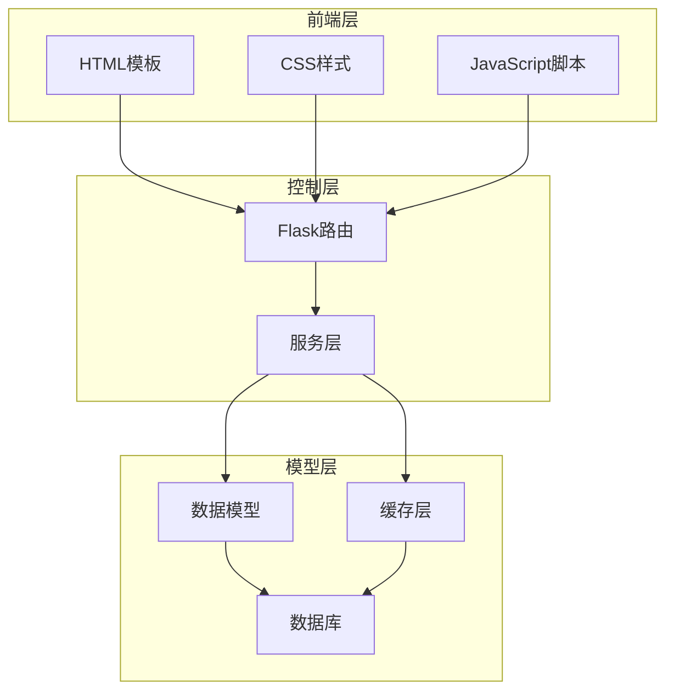
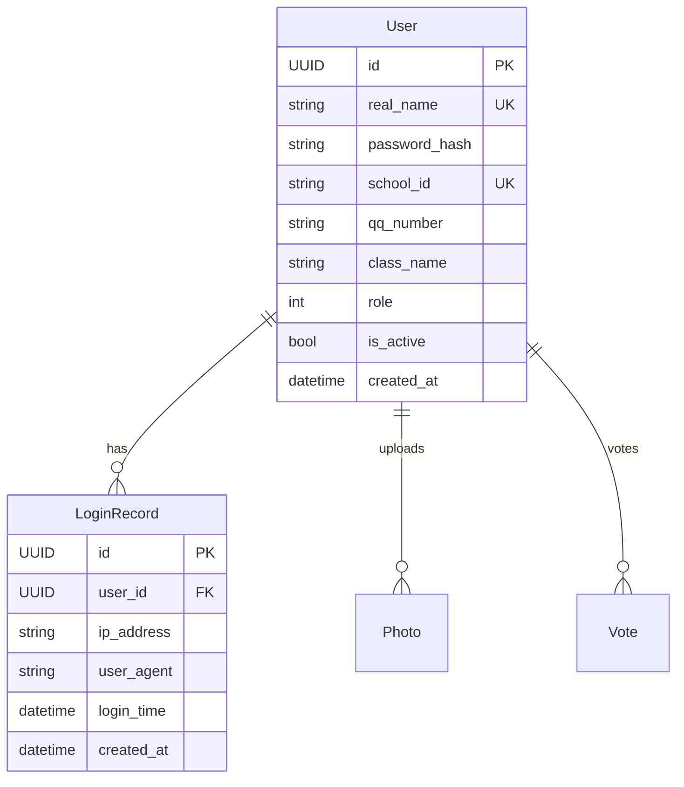
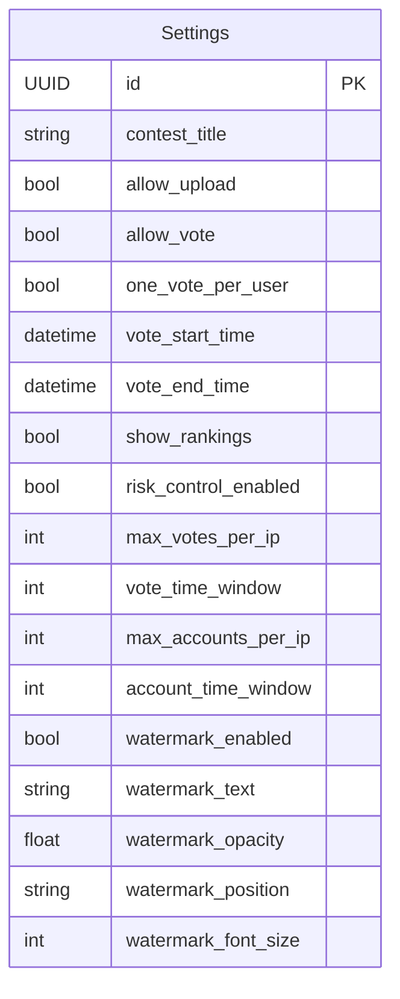

# 摄影比赛投票系统重构优化方案

## 1. 概述

### 1.1 项目简介
摄影比赛投票系统是一个基于Flask框架开发的Web应用，用于组织和管理摄影比赛活动。系统支持用户注册登录、照片上传、审核、投票和排行榜展示等功能，并实现了多级权限管理体系。

### 1.2 重构目标
本次重构旨在优化项目结构、提升代码质量、增强系统性能并简化部署流程。具体目标包括：
- 简化项目结构，提高代码可维护性
- 优化数据库访问性能，使用SQLite和内存缓存
- 提升系统响应速度和并发处理能力
- 确保项目精简易读，降低维护成本
- 使用现代Python 3.13.7特性和高性能库
- 优化前端代码和网页浏览性能
- 使用鸿蒙字体提升界面美观度
- 支持多种照片格式和高质量展示

### 1.3 设计原则
- **简洁性**: 保持代码结构清晰，易于理解和维护
- **高性能**: 通过缓存、异步处理和高性能库提升系统响应速度
- **可扩展性**: 采用模块化设计，便于功能扩展
- **安全性**: 实现完善的权限控制和风控机制
- **现代化**: 使用Python 3.13.7最新特性和最佳实践
- **前端优化**: 使用原生JS/CSS，确保页面加载速度和用户体验
- **美观性**: 使用鸿蒙字体和现代化设计提升界面美观度
- **高质量展示**: 支持多种照片格式和高质量渲染

## 2. 架构设计

### 2.1 整体架构
系统采用经典的MVC架构模式，通过应用工厂模式组织代码，实现关注点分离和模块化设计。



### 2.2 技术栈
- **后端框架**: Flask 3.0+
- **数据库**: SQLite (使用aiosqlite异步驱动)
- **缓存**: 内存缓存 (使用cachetools高性能缓存库)
- **模板引擎**: Jinja2
- **ORM**: SQLAlchemy 2.0+ (异步支持)
- **图片处理**: Pillow-SIMD (比标准Pillow性能提升4-6倍)
- **序列化**: orjson (比标准json库快3-10倍)
- **异步任务**: asyncio (Python原生异步，替代Celery以简化架构)
- **前端优化**: Vanilla JS (无框架依赖)，现代CSS (Flexbox/Grid)

### 2.3 目录结构
```
src/
├── app.py              # 应用工厂和主配置
├── config/
│   ├── __init__.py
│   └── base.py         # 配置管理
├── models/
│   ├── __init__.py
│   ├── base.py         # 基础模型
│   ├── user.py         # 用户模型
│   ├── photo.py        # 照片模型
│   └── settings.py     # 设置模型
├── routes/
│   ├── __init__.py
│   ├── auth.py         # 认证路由
│   ├── photos.py       # 照片路由
│   ├── admin.py        # 管理路由
│   └── api.py          # API路由
├── services/
│   ├── __init__.py
│   ├── auth_service.py # 认证服务
│   ├── photo_service.py# 照片服务
│   ├── vote_service.py # 投票服务
│   └── cache_service.py# 缓存服务
├── utils/
│   ├── __init__.py
│   ├── decorators.py   # 装饰器工具
│   └── image_utils.py  # 图片处理工具
├── tasks/
│   ├── __init__.py
│   └── image_tasks.py  # 异步图片处理任务
└── static/
    ├── css/            # CSS样式文件
    ├── js/             # JavaScript脚本
    ├── images/         # 静态图片资源
    └── fonts/          # 字体文件 (包含鸿蒙字体)
```

## 3. 核心模块设计

### 3.1 用户认证模块
用户认证模块负责处理用户注册、登录、权限验证等功能。

#### 3.1.1 功能特性
- 用户注册与登录
- 密码安全存储（使用Argon2算法）
- 会话管理
- 权限控制（三级权限体系）
- 登录频率限制与安全检查
- 使用typing hints提升代码可读性
- 使用dataclass简化数据模型

#### 3.1.2 数据模型


#### 3.1.3 权限体系
系统定义三种用户角色：
- **普通用户 (Level 1)**: 上传照片、参与投票、管理个人作品
- **管理员 (Level 2)**: 审核照片、管理内容、访问管理面板
- **系统管理员 (Level 3)**: 用户管理、系统设置、全局控制

### 3.2 照片管理模块
照片管理模块处理照片上传、审核、展示等功能。

#### 3.2.1 功能特性
- 多文件上传支持（支持JPEG、PNG、GIF、WEBP、BMP等多种格式）
- 自动生成高质量缩略图
- 照片审核机制（待审核/已通过/已拒绝）
- 水印添加功能
- 照片分类与搜索
- 使用现代类型注解提升代码质量
- 使用pathlib替代os.path提升路径处理性能
- 支持响应式图片适配不同设备屏幕

#### 3.2.2 数据模型

```mermaid
erDiagram
Photo ||--o{ Vote : receives
Photo }|--|| User : belongs_to

Photo {
    UUID id PK
    string url
    string thumb_url
    string title
    string class_name
    string student_name
    int vote_count
    UUID user_id FK
    int status
    datetime created_at
}

Vote {
    UUID id PK
    UUID user_id FK
    UUID photo_id FK
    string ip_address
    datetime created_at
}
```


#### 3.2.3 状态管理
照片具有以下状态：
- **0**: 待审核
- **1**: 已通过
- **2**: 已拒绝
- **3**: 已删除（软删除）

### 3.3 投票系统模块
投票系统模块实现安全的投票机制和防刷票功能。

#### 3.3.1 功能特性
- 实时投票与票数更新
- 防重复投票机制
- 投票频率限制
- IP地址追踪
- 投票统计与分析
- 使用frozenset优化白名单检查性能
- 使用enum定义投票状态提升代码可读性

#### 3.3.2 安全机制
- 单用户单票限制
- IP投票频率限制
- 自动封禁机制
- 白名单机制（IP白名单、用户白名单）

#### 3.3.3 投票规则
- 支持设置投票时间窗口
- 可配置每人投票上限
- 支持撤销投票功能
- 记录投票行为用于分析

### 3.4 系统设置模块
系统设置模块管理比赛配置和安全策略。

#### 3.4.1 功能特性
- 比赛标题配置
- 上传/投票功能开关
- 投票时间窗口设置
- 风控参数配置
- 水印设置管理
- 使用pydantic进行配置验证
- 使用enum定义配置选项提升代码质量

#### 3.4.2 数据模型


#### 3.4.3 风控配置
- **投票风控**: 限制单IP投票次数和时间窗口
- **登录风控**: 限制单IP登录账号数量
- **频率控制**: 防止恶意刷票和注册行为
- **白名单机制**: 绕过风控限制的可信用户/IP

## 4. 性能优化策略

### 4.1 数据库优化
- 使用SQLite内置索引优化查询性能
- 合理设计表结构和字段类型
- 实现数据库连接池管理
- 采用延迟加载策略减少数据库访问
- 使用SQLAlchemy 2.0异步API提升并发性能

### 4.2 缓存策略
- 实现内存缓存机制，减少数据库查询
- 对热点数据进行缓存（如排行榜、设置信息）
- 使用缓存键前缀管理缓存数据
- 实现缓存失效策略确保数据一致性
- 使用cachetools LRU缓存提升缓存命中率

### 4.3 图片处理优化
- 异步处理图片上传（缩略图生成、水印添加）
- 使用Pillow-SIMD库进行高效的图片处理
- 实现图片缓存避免重复处理
- 优化图片压缩算法减少存储空间
- 使用生成器处理大图片避免内存溢出
- 支持多种图片格式（JPEG、PNG、GIF、WEBP、BMP等）
- 保持原始图片质量的同时优化文件大小
- 实现自适应缩放算法保持图片比例

### 4.4 请求处理优化
- 使用Flask应用工厂模式提升应用性能
- 实现请求频率限制防止系统过载
- 采用装饰器模式简化权限验证
- 实现错误处理和日志记录机制
- 使用orjson加速JSON序列化/反序列化

### 4.5 内存优化
- 使用生成器减少内存占用
- 实现对象池复用频繁创建的对象
- 优化数据结构选择
- 及时释放不需要的资源
- 使用__slots__减少对象内存占用

### 4.6 异步处理优化
- 使用asyncio实现异步任务处理
- 异步数据库操作提升I/O密集型任务性能
- 异步文件处理避免阻塞主线程
- 使用异步上下文管理器管理资源

### 4.7 前端性能优化
- 使用Vanilla JS减少框架开销
- 实现图片懒加载提升页面加载速度
- 使用CSS Sprites合并小图标减少HTTP请求
- 实现资源压缩和缓存策略
- 使用CDN加速静态资源加载
- 实现响应式设计适配不同设备
- 使用现代CSS (Flexbox/Grid)提升渲染性能
- 使用鸿蒙字体提升界面美观度
- 实现字体子集化减少字体文件大小
- 使用font-display优化字体加载性能
- 实现照片画廊功能支持高质量图片展示
- 使用CSS3动画提升用户交互体验
- 实现照片预加载提升浏览流畅度

## 5. 安全机制设计

### 5.1 身份认证安全
- 使用Werkzeug安全函数进行密码哈希存储
- 实现会话管理机制保护用户状态
- 采用装饰器实现权限控制
- 实现登录失败次数限制防止暴力破解

### 5.2 风控策略
- 实现登录频率限制机制
- 实现投票频率限制机制
- 实现IP封禁和白名单机制
- 记录用户行为日志用于安全分析

### 5.3 数据安全
- 使用UUID作为主键提高安全性
- 实现数据验证防止非法输入
- 采用参数化查询防止SQL注入
- 实现文件上传安全检查

### 5.4 传输安全
- 使用HTTPS加密传输（生产环境）
- 设置安全的Cookie属性
- 实现CSRF保护机制
- 配置适当的HTTP安全头

## 6. 部署方案

### 6.1 环境要求
- Python 3.13.7
- SQLite数据库
- 512MB以上内存
- 1GB以上存储空间

### 6.2 部署步骤
1. 安装Python依赖：
   ```bash
   pip install -e .
   ```

2. 初始化数据库：
   ```bash
   python -m flask init-db
   ```

3. 启动应用：
   ```bash
   python -m flask run
   ```

### 6.3 配置管理
- 使用环境变量管理敏感配置
- 实现配置文件分层管理（开发/生产环境）
- 支持通过配置文件自定义系统行为

### 6.4 性能调优
- 调整SQLite性能参数
- 配置适当的缓存大小
- 优化图片存储路径
- 设置合理的日志级别
- 使用uvicorn替代默认WSGI服务器提升性能
- 配置Gunicorn多进程部署（生产环境）
- 启用Gzip压缩减少传输数据量
- 配置HTTP/2提升传输效率
- 使用浏览器缓存策略优化资源加载
- 优化鸿蒙字体加载策略提升页面渲染速度
- 实现图片CDN加速提升照片加载速度
- 配置图片懒加载和预加载策略

## 7. 测试策略

### 7.1 单元测试
- 对核心服务层函数进行单元测试
- 使用pytest框架编写测试用例
- 实现测试覆盖率统计
- 使用mock对象隔离外部依赖
- 使用pytest-asyncio测试异步函数

### 7.2 集成测试
- 测试数据库操作流程
- 验证路由和业务逻辑集成
- 测试缓存和异步任务处理
- 验证权限控制机制
- 测试异步任务执行流程

### 7.3 性能测试
- 压力测试评估系统并发处理能力
- 测试数据库查询性能
- 验证缓存机制效果
- 评估图片处理性能
- 使用locust进行负载测试
- 使用Lighthouse测试前端性能

### 7.4 安全测试
- 验证身份认证机制
- 测试权限控制有效性
- 检查输入验证和过滤
- 验证风控策略执行
- 使用bandit进行安全漏洞扫描
- 使用Cypress进行前端安全测试