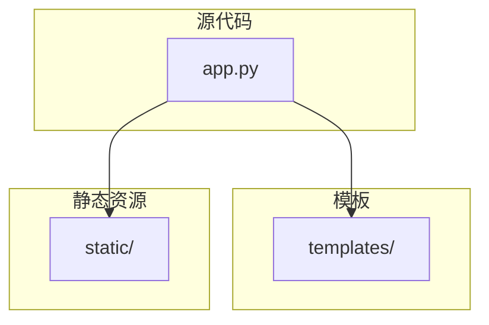
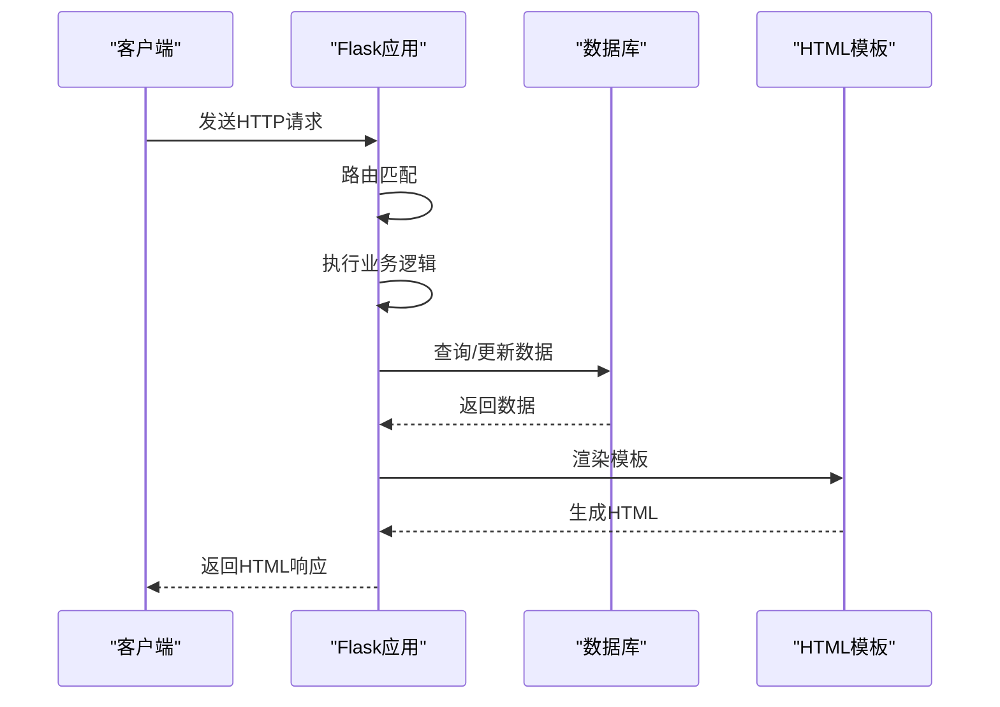
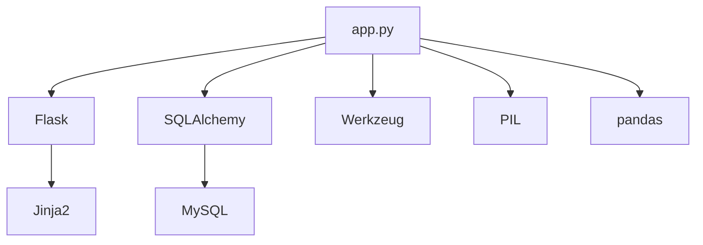

# API接口参考

<cite>
**本文档引用的文件**  
- [app.py](file://src/app.py)
- [login.html](file://templates/login.html)
- [upload.html](file://templates/upload.html)
- [admin_review.html](file://templates/admin_review.html)
- [settings.html](file://templates/settings.html)
</cite>

## 目录
1. [简介](#简介)
2. [项目结构](#项目结构)
3. [核心组件](#核心组件)
4. [架构概述](#架构概述)
5. [详细组件分析](#详细组件分析)
6. [依赖分析](#依赖分析)
7. [性能考虑](#性能考虑)
8. [故障排除指南](#故障排除指南)
9. [结论](#结论)
10. [附录](#附录)（如有必要）

## 简介
本文档为glzx-xmt项目中由`app.py`定义的所有HTTP API端点提供详尽的接口文档。该系统采用传统的服务端渲染（SSR）架构，所有接口均以HTML页面跳转和表单提交为核心交互方式，而非现代RESTful API。文档将详细说明每个路由的HTTP方法、URL路径、请求参数、认证机制、响应格式、错误状态码及权限控制策略。特别关注管理员专属接口的访问限制，并提供实际请求示例以帮助开发者理解前后端交互逻辑。

## 项目结构
glzx-xmt项目是一个基于Flask的Web应用，其结构清晰地分离了业务逻辑、静态资源和模板文件。核心应用逻辑位于`src/app.py`，定义了所有HTTP路由和业务处理。静态资源（如JavaScript、CSS、图片）存放在`static/`目录下，而HTML模板则位于`templates/`目录中，通过Jinja2模板引擎进行渲染。项目使用MySQL作为后端数据库，通过SQLAlchemy进行ORM操作。



**Diagram sources**
- [app.py](file://src/app.py)

**Section sources**
- [app.py](file://src/app.py)

## 核心组件
`app.py`是整个应用的核心，它定义了Flask应用实例、数据库模型、权限装饰器以及所有HTTP路由。关键组件包括：
- **数据库模型**：`User`, `Photo`, `Vote`, `Settings`等，定义了应用的数据结构。
- **权限装饰器**：`login_required`, `admin_required`, `super_admin_required`，用于实现不同级别的访问控制。
- **业务逻辑函数**：如`add_watermark_to_image`, `is_voting_time`, `check_ip_ban`等，封装了核心功能。
- **HTTP路由**：通过`@app.route`装饰器定义，处理所有客户端请求。

**Section sources**
- [app.py](file://src/app.py#L1-L100)

## 架构概述
该应用采用经典的MVC（Model-View-Controller）模式，其中`app.py`扮演Controller的角色，协调Model（数据库模型）和View（HTML模板）之间的交互。用户请求首先到达Flask应用，经过路由匹配后，由相应的视图函数处理。视图函数执行业务逻辑（可能涉及数据库操作），然后选择合适的模板并传入数据，最终渲染成HTML页面返回给客户端。



**Diagram sources**
- [app.py](file://src/app.py#L1-L50)

## 详细组件分析
本节将对`app.py`中定义的关键HTTP端点进行逐一分析，明确其接口规范和行为。

### 登录接口分析
`/login`端点处理用户的登录请求，是系统的主要入口之一。

**Section sources**
- [app.py](file://src/app.py#L200-L250)
- [login.html](file://templates/login.html)

#### 接口定义
| 属性 | 说明 |
| :--- | :--- |
| **HTTP方法** | POST |
| **URL路径** | `/login` |
| **认证机制** | 基于Session的认证 |
| **请求参数** | `real_name` (真实姓名), `password` (密码) |
| **响应格式** | 成功时重定向到`/`，失败时渲染`login.html`并显示错误信息 |
| **错误状态码** | 401 (未授权，通过Flash消息体现) |

#### 请求示例
```bash
curl -X POST http://localhost:5000/login \
     -H "Content-Type: application/x-www-form-urlencoded" \
     -d "real_name=冯怀智&password=admin123"
```

#### 行为说明
1. 用户提交包含真实姓名和密码的表单。
2. 服务器验证凭据，检查用户账户状态和IP封禁情况。
3. 验证成功后，将用户ID存入Session，并重定向到首页。
4. 验证失败时，通过Flash消息提示错误原因（如“用户不存在”、“密码错误”），并重新渲染登录页面。

### 上传接口分析
`/upload`端点允许已登录用户上传参赛照片。

**Section sources**
- [app.py](file://src/app.py#L300-L350)
- [upload.html](file://templates/upload.html)

#### 接口定义
| 属性 | 说明 |
| :--- | :--- |
| **HTTP方法** | POST |
| **URL路径** | `/upload` |
| **认证机制** | `@login_required` 装饰器 |
| **请求参数** | `photos` (多文件上传), `titles` (作品名称列表) |
| **响应格式** | 上传成功后重定向到`/my_photos`，失败时重定向到`/`并显示Flash消息 |
| **错误状态码** | 403 (禁止访问，未登录或上传功能关闭) |

#### 请求示例
```bash
curl -X POST http://localhost:5000/upload \
     -F "photos=@photo1.jpg" \
     -F "photos=@photo2.jpg" \
     -F "titles=作品一" \
     -F "titles=作品二" \
     --cookie "session=your_session_cookie"
```

#### 行为说明
1. 用户在`upload.html`页面选择一个或多个图片文件，并可为每张图片输入作品名称。
2. 提交表单后，服务器将文件保存到`static/uploads`目录，生成缩略图，并将记录插入数据库，状态为“待审核”。
3. 上传成功后，用户被重定向到个人照片页面。

### 投票接口分析
`/vote`端点处理用户的投票请求，是一个典型的AJAX接口。

**Section sources**
- [app.py](file://src/app.py#L250-L300)

#### 接口定义
| 属性 | 说明 |
| :--- | :--- |
| **HTTP方法** | POST |
| **URL路径** | `/vote` |
| **认证机制** | `@login_required` 装饰器 |
| **请求参数** | JSON格式的`photo_id` |
| **响应格式** | JSON格式的响应，包含`vote_count`或`error`信息 |
| **错误状态码** | 403 (禁止访问), 400 (请求错误), 404 (未找到) |

#### 请求示例
```bash
curl -X POST http://localhost:5000/vote \
     -H "Content-Type: application/json" \
     -d '{"photo_id": 123}' \
     --cookie "session=your_session_cookie"
```

#### 行为说明
1. 前端JavaScript发送包含`photo_id`的JSON POST请求。
2. 服务器检查投票时间、用户权限、IP封禁状态和投票频率。
3. 若一切正常，增加票数并返回新的票数；否则返回错误信息。

### 管理员审核接口分析
`/admin/review`端点是管理员专用的审核页面，用于处理待审核的照片。

**Section sources**
- [app.py](file://src/app.py#L400-L420)
- [admin_review.html](file://templates/admin_review.html)

#### 接口定义
| 属性 | 说明 |
| :--- | :--- |
| **HTTP方法** | GET |
| **URL路径** | `/admin/review` |
| **认证机制** | `@admin_required` 装饰器 |
| **请求参数** | 无 |
| **响应格式** | 渲染`admin_review.html`模板，展示所有待审核照片 |
| **错误状态码** | 403 (禁止访问) |

#### 权限控制
此接口要求用户角色至少为2（普通管理员）。普通用户或未登录用户尝试访问时，将被重定向到首页并收到“需要管理员权限”的提示。

#### 行为说明
1. 管理员点击“照片审核”链接，触发对`/admin/review`的GET请求。
2. 服务器验证管理员权限，查询所有状态为“待审核”的照片。
3. 将照片数据传入`admin_review.html`模板进行渲染，页面上会显示“通过”、“拒绝”和“删除”按钮。

### 系统设置接口分析
`/settings`端点允许系统管理员配置全局参数。

**Section sources**
- [app.py](file://src/app.py#L500-L550)
- [settings.html](file://templates/settings.html)

#### 接口定义
| 属性 | 说明 |
| :--- | :--- |
| **HTTP方法** | POST |
| **URL路径** | `/settings` |
| **认证机制** | `@super_admin_required` 装饰器 |
| **请求参数** | `contest_title`, `allow_upload`, `allow_vote`, `vote_start_time`, `vote_end_time`等 |
| **响应格式** | 处理成功后重定向到`/settings`，并显示“设置保存成功” |
| **错误状态码** | 403 (禁止访问) |

#### 权限控制
此接口要求用户角色为3（系统管理员），权限级别最高。即使是普通管理员也无法访问。

#### 行为说明
1. 系统管理员在`settings.html`页面修改各项配置。
2. 提交表单后，服务器验证输入（如时间格式、数值范围），并将新设置保存到数据库。
3. 该接口控制着上传、投票、排行榜等核心功能的开关。

## 依赖分析
应用的依赖关系清晰，主要依赖于Flask框架及其扩展。



**Diagram sources**
- [app.py](file://src/app.py#L1-L10)

**Section sources**
- [app.py](file://src/app.py#L1-L50)

## 性能考虑
- **水印生成**：`add_watermark_to_image`函数在每次请求原图时动态生成带水印的图片，这会消耗CPU资源。建议在高并发场景下考虑缓存机制。
- **数据库查询**：`/admin`和`/rankings`等页面会加载所有照片数据，当数据量大时可能影响性能。应考虑分页或懒加载。
- **文件操作**：上传和下载涉及大量文件I/O，应确保服务器有足够的磁盘I/O性能。

## 故障排除指南
- **无法登录**：检查用户名和密码是否正确，账户是否被禁用，以及IP是否被封禁。
- **上传失败**：确认上传功能是否开启，文件格式是否为JPG/PNG，以及服务器磁盘空间是否充足。
- **投票无反应**：检查是否在投票时间内，是否已投过票，以及IP是否因频繁投票被自动封禁。
- **管理员无法访问**：确认用户角色是否正确设置为2或3，Session是否有效。

**Section sources**
- [app.py](file://src/app.py#L100-L200)

## 结论
glzx-xmt项目通过`app.py`中的路由定义，构建了一个功能完整的摄影比赛管理系统。其采用服务端渲染的方式，通过表单提交和页面跳转实现了用户注册、登录、上传、投票和管理等核心功能。权限体系通过装饰器实现，清晰地划分了普通用户、管理员和系统管理员的权限边界。开发者在使用或维护此系统时，应重点关注其基于Session的认证机制和以HTML模板为核心的响应模式。