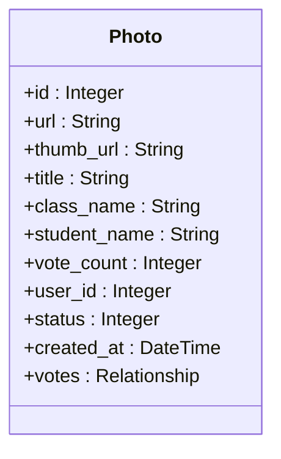
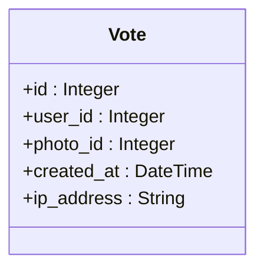
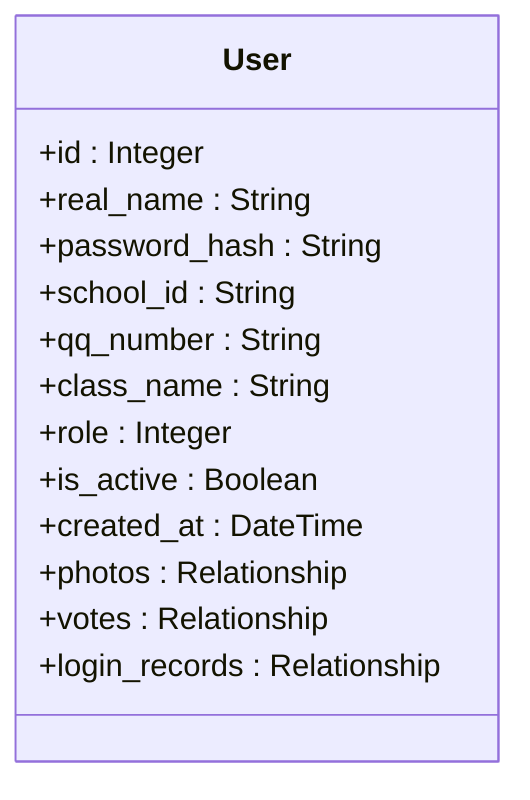
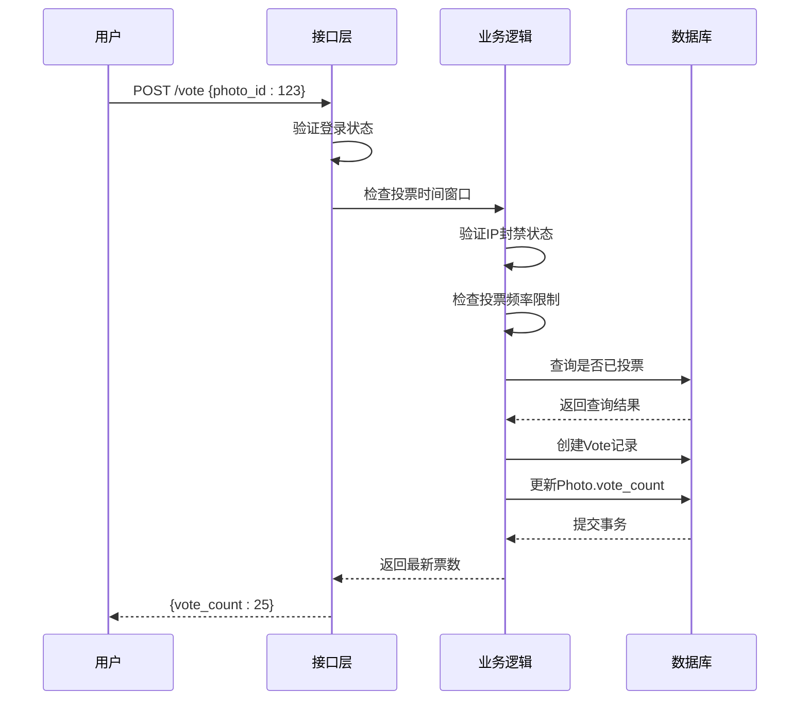
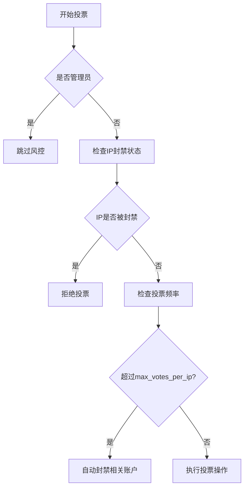
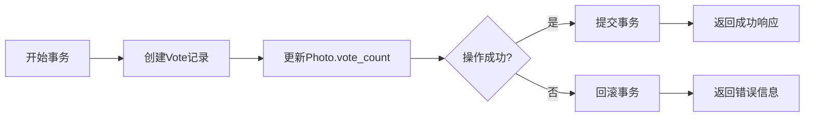

# 投票系统接口

<cite>
**本文档引用的文件**   
- [app.py](file://src/app.py#L653-L758)
- [app.py](file://src/app.py#L709-L728)
- [app.py](file://src/app.py#L61-L74)
- [app.py](file://src/app.py#L76-L81)
- [app.py](file://src/app.py#L45-L59)
</cite>

## 目录
1. [投票系统接口](#投票系统接口)
2. [核心接口说明](#核心接口说明)
3. [数据模型设计](#数据模型设计)
4. [投票流程与权限控制](#投票流程与权限控制)
5. [防刷票机制](#防刷票机制)
6. [数据库事务处理](#数据库事务处理)
7. [请求示例](#请求示例)
8. [高并发场景分析](#高并发场景分析)

## 核心接口说明

### 投票接口 (/vote - POST)
该接口用于用户对指定作品进行投票操作。请求必须为POST方法，并通过JSON格式提交参数。

**参数结构**：
- `photo_id`：目标作品的唯一标识符（整数类型）

**认证要求**：
- 必须登录：该接口使用`@login_required`装饰器，未登录用户无法访问
- 会话验证：系统通过session['user_id']识别当前用户身份

**权限控制**：
- 仅允许对已审核通过（status=1）的作品投票
- 用户不能为自己上传的作品投票（系统通过photo.user_id与当前用户ID比对实现）

**响应结果**：
- 成功：返回JSON格式的当前票数 `{"vote_count": 15}`
- 失败：返回错误信息及对应HTTP状态码（如403、400、404）

### 取消投票接口 (/cancel_vote - POST)
该接口允许用户取消对某作品的投票。

**行为逻辑**：
- 验证用户是否已对指定作品投票
- 若存在投票记录，则删除Vote实体并减少Photo.vote_count计数
- 操作完成后返回更新后的票数

**对计数的影响**：
- 成功取消投票后，对应作品的vote_count字段值减1
- 系统保证计数的实时性和一致性

**Section sources**
- [app.py](file://src/app.py#L653-L758)
- [app.py](file://src/app.py#L709-L728)

## 数据模型设计

### Photo（作品）模型


### Vote（投票）模型


### User（用户）模型


**模型关系说明**：
- 一个用户可以上传多张照片（1:N）
- 一张照片只能由一个用户上传（N:1）
- 一个用户可以对多张照片投票（1:N）
- 一张照片可以被多个用户投票（N:1）
- 使用user_id和photo_id的唯一约束确保单用户对单照片仅能投一票

**Diagram sources**
- [app.py](file://src/app.py#L61-L74)
- [app.py](file://src/app.py#L76-L81)
- [app.py](file://src/app.py#L45-L59)

## 投票流程与权限控制



**权限控制流程**：
1. 登录验证：通过`@login_required`装饰器确保用户已登录
2. 时间验证：调用`is_voting_time()`检查当前是否在允许投票的时间范围内
3. IP验证：检查客户端IP是否被封禁
4. 频率控制：非管理员用户受投票频率限制
5. 唯一性检查：确保用户未对同一作品重复投票
6. 全局限制：若启用one_vote_per_user设置，限制用户只能投一次票

**Section sources**
- [app.py](file://src/app.py#L653-L758)

## 防刷票机制

系统采用多层次的防刷票机制来保障投票公平性：

### 基础防刷机制
- **唯一约束**：通过Vote表中user_id和photo_id的组合唯一性约束，确保单用户对单照片只能投一票
- **IP记录**：在Vote实体中记录投票IP地址，便于后续分析和审计

### 风控策略


**风控参数**（通过Settings模型配置）：
- `risk_control_enabled`：是否启用风控
- `max_votes_per_ip`：单IP最大投票次数
- `vote_time_window`：投票时间窗口（分钟）
- `max_accounts_per_ip`：单IP最大登录账号数

**特殊处理**：
- 白名单机制：IP白名单和用户白名单可豁免风控检查
- 自动封禁：检测到异常行为时，自动封禁相关IP和用户账号

**Section sources**
- [app.py](file://src/app.py#L653-L758)
- [app.py](file://src/app.py#L100-L149)

## 数据库事务处理



**原子性保障**：
- 使用Flask-SQLAlchemy的db.session进行事务管理
- 投票操作包含两个关键步骤：创建Vote记录和更新vote_count
- 两个操作在同一个事务中完成，确保原子性
- 调用db.session.commit()提交事务，任何一步失败都会导致整个事务回滚

**代码实现**：
```python
# 创建投票记录
vote = Vote(user_id=user_id, photo_id=photo_id, ip_address=client_ip)
db.session.add(vote)

# 更新票数
photo.vote_count += 1

# 事务提交
db.session.commit()
```

**Section sources**
- [app.py](file://src/app.py#L745-L755)

## 请求示例

### 投票请求
```html
<!-- 表单提交示例 -->
<form id="voteForm">
    <input type="hidden" name="photo_id" value="123">
    <button type="submit">投票</button>
</form>

<script>
document.getElementById('voteForm').addEventListener('submit', function(e) {
    e.preventDefault();
    const photoId = this.photo_id.value;
    
    fetch('/vote', {
        method: 'POST',
        headers: {'Content-Type': 'application/json'},
        body: JSON.stringify({photo_id: photoId})
    })
    .then(response => response.json())
    .then(data => {
        if (data.error) {
            alert(data.error);
        } else {
            // 更新页面显示的票数
            document.getElementById('voteCount').textContent = data.vote_count;
            // 重定向至排行榜
            window.location.href = '/rankings';
        }
    });
});
</script>
```

### 响应处理
- **成功响应**：返回JSON格式的票数，前端更新UI并可选择重定向至排行榜或原页面
- **失败响应**：根据错误类型显示相应提示信息

**重定向逻辑**：
- 投票成功后通常重定向至排行榜页面（/rankings）
- 或返回原页面继续浏览其他作品

**Section sources**
- [app.py](file://src/app.py#L653-L758)

## 高并发场景分析

### 潜在竞争条件
在高并发场景下，可能出现以下竞争条件：
- **计数不一致**：多个用户同时对同一作品投票，可能导致vote_count更新不准确
- **重复投票**：极端情况下可能绕过唯一性检查

### 现有保护机制
- **数据库约束**：利用数据库层面的唯一索引防止重复投票
- **事务隔离**：SQLAlchemy默认的事务隔离级别提供一定程度的并发保护
- **应用层检查**：在创建投票前先查询是否存在记录

### 性能优化建议
1. **数据库索引优化**：
   - 为Vote表的(user_id, photo_id)字段创建复合索引
   - 为Photo.vote_count字段创建索引以加速排行榜查询

2. **缓存策略**：
   ```mermaid
flowchart LR
A[用户投票] --> B[更新数据库]
B --> C[更新Redis缓存]
D[查询票数] --> E{缓存中存在?}
E --> |是| F[返回缓存数据]
E --> |否| G[查询数据库]
G --> H[写入缓存]
```

3. **异步处理**：
   - 将非核心操作（如日志记录、通知发送）放入消息队列异步处理
   - 减少主事务的执行时间

4. **读写分离**：
   - 投票操作走主库（写）
   - 排行榜查询走从库（读）

5. **连接池优化**：
   - 配置合理的数据库连接池大小
   - 使用连接池复用数据库连接

**Section sources**
- [app.py](file://src/app.py#L653-L758)