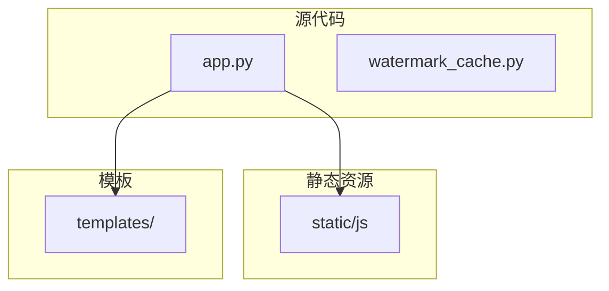
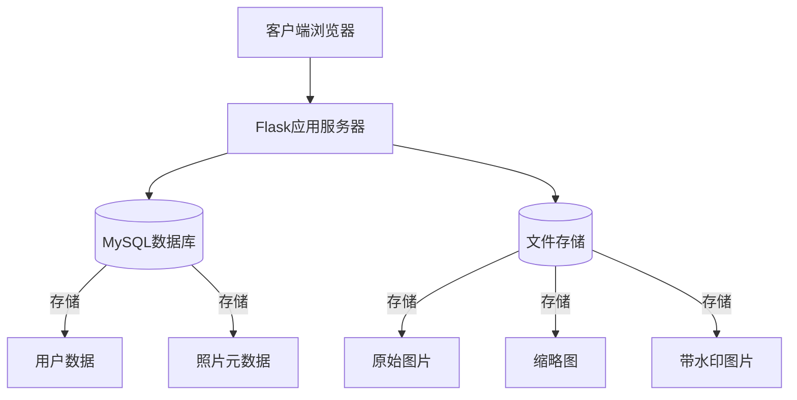
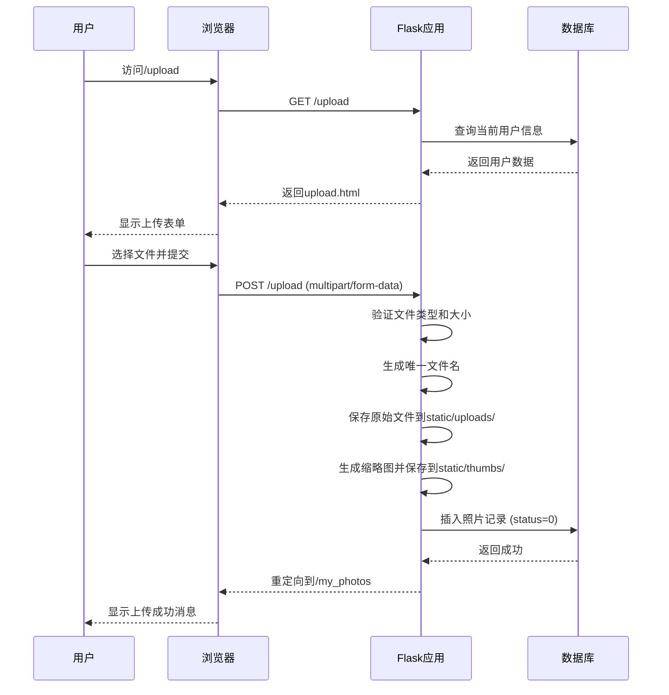
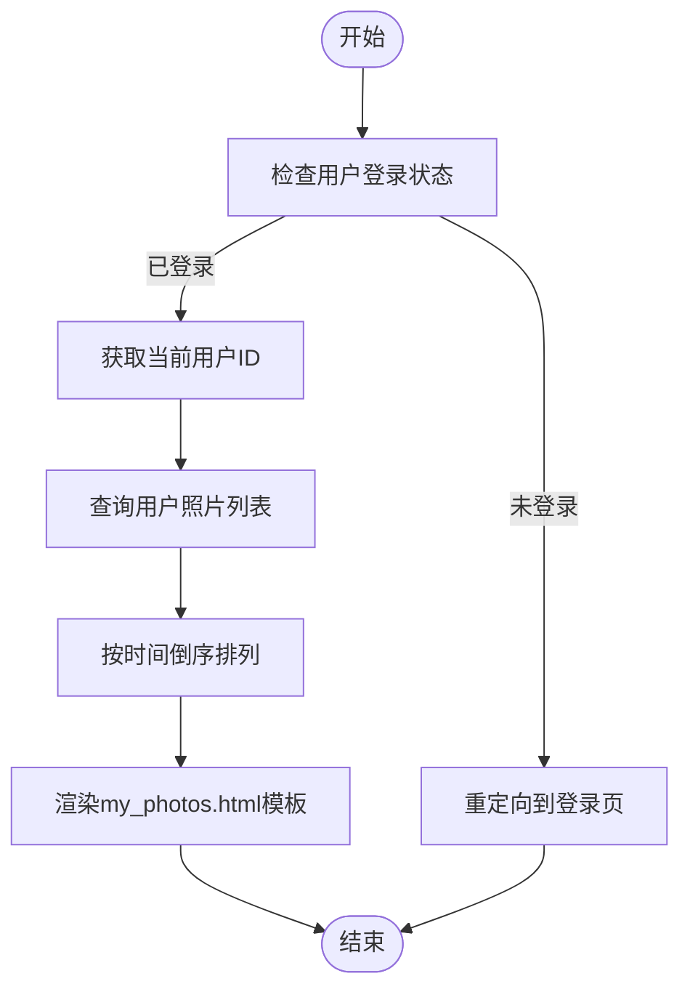
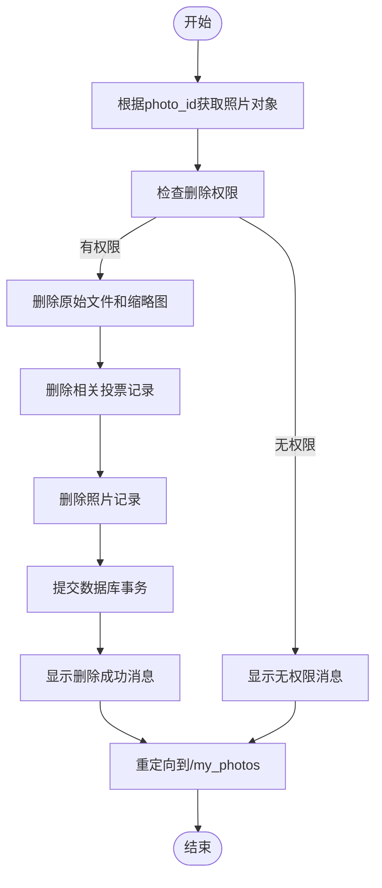
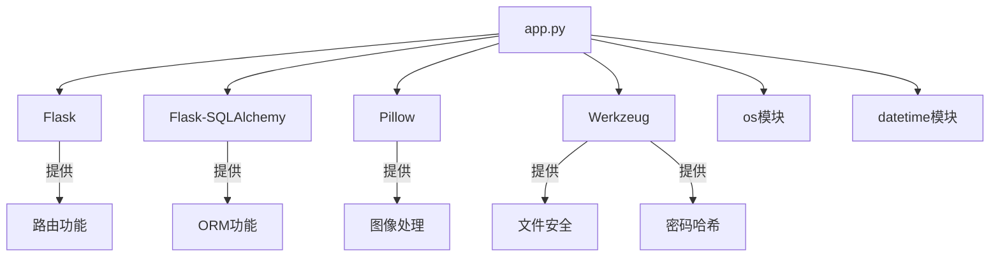

# 照片管理接口

<cite>
**本文档引用的文件**
- [app.py](file://src/app.py)
- [watermark_cache.py](file://src/watermark_cache.py)
- [upload.html](file://templates/upload.html)
- [my_photos.html](file://templates/my_photos.html)
</cite>

## 目录
1. [简介](#简介)
2. [项目结构](#项目结构)
3. [核心组件](#核心组件)
4. [架构概述](#架构概述)
5. [详细组件分析](#详细组件分析)
6. [依赖分析](#依赖分析)
7. [性能考虑](#性能考虑)
8. [故障排除指南](#故障排除指南)
9. [结论](#结论)
10. [附录](#附录)（如有必要）

## 简介
本文档详细记录了照片上传、查看和删除相关的API接口，包括`/upload`（GET/POST）、`/my_photos`（GET）、`/delete_photo/<int:photo_id>`（GET）等端点。说明了上传接口支持的文件类型（JPEG/PNG）、大小限制、服务器端存储路径（static/uploads/）以及水印添加逻辑（调用watermark_cache.py）。描述了上传成功后的审核状态机制（pending状态）和用户可见性规则。解释了`/my_photos`页面如何根据当前用户查询其上传的照片列表，并关联Photo模型中的user_id外键。对于删除接口，说明了权限校验逻辑（仅允许上传者或管理员删除）和数据库级联操作。提供了完整的HTML表单示例和后端处理逻辑对应关系，帮助开发者理解文件上传的全流程。指出了可能的问题如上传失败、图片格式错误、权限不足等，并给出了调试建议。

## 项目结构
本项目采用典型的Flask Web应用结构，主要分为源代码、静态资源和模板三大部分。源代码位于`src/`目录下，包含核心应用逻辑`app.py`和水印处理模块`watermark_cache.py`。静态资源（如JavaScript文件）存放在`static/`目录中，而HTML模板则位于`templates/`目录下。这种分层结构清晰地分离了业务逻辑、用户界面和静态资源，便于维护和扩展。

**图示来源**
- [app.py](file://src/app.py#L1-L50)
- [upload.html](file://templates/upload.html#L1-L20)
- [my_photos.html](file://templates/my_photos.html#L1-L20)

**章节来源**
- [app.py](file://src/app.py#L1-L100)
- [project_structure](file://#L1-L20)

## 核心组件
系统的核心组件包括照片上传、用户管理、权限控制和水印处理。照片上传功能通过`/upload`端点实现，支持多文件上传和作品名称输入。用户管理基于`User`模型，包含真实姓名、班级、QQ号等信息，并通过角色字段区分普通用户和管理员。权限控制通过`@login_required`、`@admin_required`等装饰器实现，确保只有授权用户才能访问特定功能。水印处理由`watermark_cache.py`模块负责，支持自定义水印文本、位置和透明度。

**章节来源**
- [app.py](file://src/app.py#L100-L300)
- [watermark_cache.py](file://src/watermark_cache.py#L1-L50)

## 架构概述
系统采用MVC（模型-视图-控制器）架构模式，其中`app.py`作为控制器处理HTTP请求，`templates/`目录下的HTML文件作为视图呈现用户界面，而数据库模型（如`User`、`Photo`）则构成模型层。系统通过Flask-SQLAlchemy与MySQL数据库交互，实现了数据的持久化存储。前端使用原生JavaScript和CSS实现交互功能，如拖拽上传、视图切换和大图预览。

**图示来源**
- [app.py](file://src/app.py#L1-L50)
- [User](file://src/app.py#L50-L100)
- [Photo](file://src/app.py#L100-L150)

## 详细组件分析
### 上传接口分析
`/upload`端点支持GET和POST两种HTTP方法。GET请求返回上传页面，POST请求处理文件上传。系统支持JPEG和PNG格式的图片文件，上传后会生成缩略图并保存到`static/thumbs/`目录。原始文件保存在`static/uploads/`目录，文件名经过唯一化处理以避免冲突。上传成功后，照片状态为“待审核”（pending），只有通过管理员审核后才会对公众可见。

**图示来源**
- [app.py](file://src/app.py#L800-L900)
- [upload.html](file://templates/upload.html#L1-L100)

**章节来源**
- [app.py](file://src/app.py#L800-L950)
- [upload.html](file://templates/upload.html#L1-L200)

### 我的照片页面分析
`/my_photos`端点仅允许登录用户访问，通过`@login_required`装饰器实现权限控制。该页面查询当前用户上传的所有照片，并按创建时间倒序排列。前端提供了网格视图和列表视图两种展示方式，支持按时间、票数和状态排序。普通用户只能查看和下载自己的照片，而管理员可以查看所有用户的照片。

**图示来源**
- [app.py](file://src/app.py#L1500-L1550)
- [my_photos.html](file://templates/my_photos.html#L1-L100)

**章节来源**
- [app.py](file://src/app.py#L1500-L1550)
- [my_photos.html](file://templates/my_photos.html#L1-L300)

### 删除接口分析
`/delete_photo/<int:photo_id>`端点用于删除指定ID的照片。权限校验逻辑确保只有照片上传者或管理员才能执行删除操作。删除过程包括：从文件系统删除原始图片和缩略图、从数据库删除投票记录、最后删除照片记录本身。这一系列操作保证了数据的一致性和完整性。

**图示来源**
- [app.py](file://src/app.py#L1550-L1600)
- [my_photos.html](file://templates/my_photos.html#L200-L250)

**章节来源**
- [app.py](file://src/app.py#L1550-L1600)
- [my_photos.html](file://templates/my_photos.html#L200-L300)

## 依赖分析
系统的主要外部依赖包括Flask、Flask-SQLAlchemy、Pillow（PIL）和Werkzeug。Flask作为Web框架处理HTTP请求和路由；Flask-SQLAlchemy提供ORM功能，简化数据库操作；Pillow用于图像处理，如生成缩略图和添加水印；Werkzeug提供文件安全处理和密码哈希功能。这些依赖通过`pyproject.toml`文件进行管理，确保了开发环境的一致性。

**图示来源**
- [app.py](file://src/app.py#L1-L20)
- [pyproject.toml](file://pyproject.toml#L1-L10)

**章节来源**
- [app.py](file://src/app.py#L1-L50)
- [pyproject.toml](file://pyproject.toml#L1-L20)

## 性能考虑
系统在性能方面进行了多项优化。首先，使用`secure_filename`函数防止文件名注入攻击，同时确保文件名的合法性。其次，生成缩略图减少了前端加载时间，提升了用户体验。水印添加采用缓存机制，避免重复处理同一图片。数据库查询使用`order_by(Photo.created_at.desc())`确保结果按时间倒序排列，符合用户期望。此外，系统通过`os.makedirs`预创建上传目录，避免运行时创建目录的开销。

## 故障排除指南
常见问题及解决方案：
1. **上传失败**：检查`UPLOAD_FOLDER`目录是否存在且可写，确认文件类型是否为JPEG/PNG，验证文件大小是否超过服务器限制。
2. **图片格式错误**：确保上传的文件确实是有效的JPEG或PNG格式，可通过`file`命令或图像编辑软件验证。
3. **权限不足**：确认用户已登录且具有相应权限，管理员操作需要角色等级≥2。
4. **水印不显示**：检查`Settings`表中的`watermark_enabled`字段是否为True，验证字体文件是否存在。
5. **数据库连接失败**：检查`DATABASE_URL`环境变量配置是否正确，确认MySQL服务是否正常运行。

**章节来源**
- [app.py](file://src/app.py#L800-L1600)
- [watermark_cache.py](file://src/watermark_cache.py#L1-L100)

## 结论
本文档全面记录了照片管理系统的API接口和核心功能。系统通过清晰的MVC架构实现了照片的上传、查看和删除功能，结合权限控制和水印处理，满足了摄影比赛的基本需求。代码结构合理，注释充分，便于后续维护和扩展。建议未来增加文件大小限制、更复杂的水印样式和批量操作功能，以进一步提升系统实用性。

## 附录
### API端点汇总
| 端点 | 方法 | 描述 | 权限要求 |
|------|------|------|----------|
| `/upload` | GET/POST | 上传照片 | 登录用户 |
| `/my_photos` | GET | 查看我的照片 | 登录用户 |
| `/delete_photo/<int:photo_id>` | GET | 删除指定照片 | 上传者或管理员 |
| `/approve_photo/<int:photo_id>` | GET | 审核通过照片 | 管理员 |
| `/reject_photo/<int:photo_id>` | GET | 审核拒绝照片 | 管理员 |

### 数据库模型摘要
| 模型 | 字段 | 类型 | 说明 |
|------|------|------|------|
| User | id, real_name, class_name, qq_number, role | Integer, String | 用户信息 |
| Photo | id, url, thumb_url, title, class_name, student_name, vote_count, user_id, status | String, Integer | 照片信息 |
| Settings | contest_title, allow_upload, watermark_enabled | String, Boolean | 系统设置 |