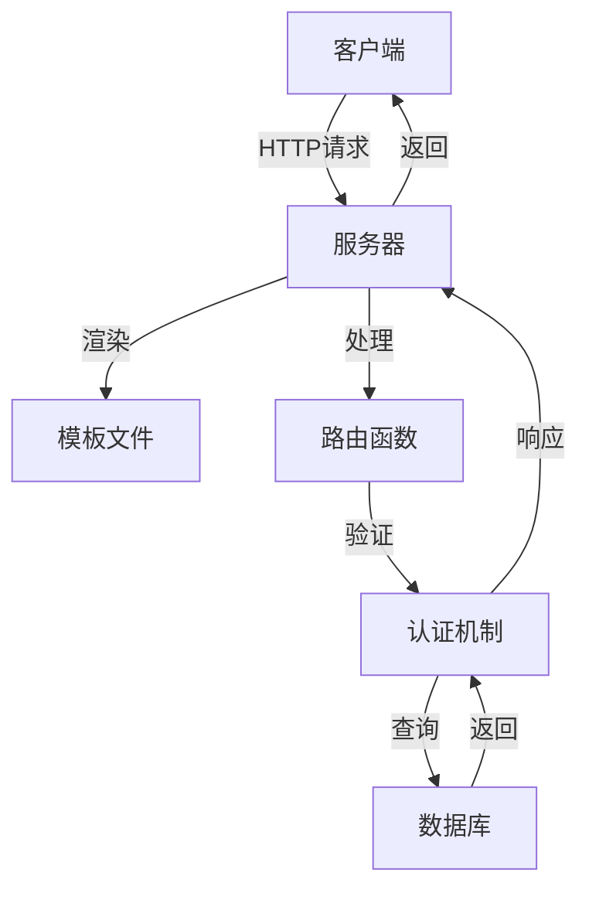
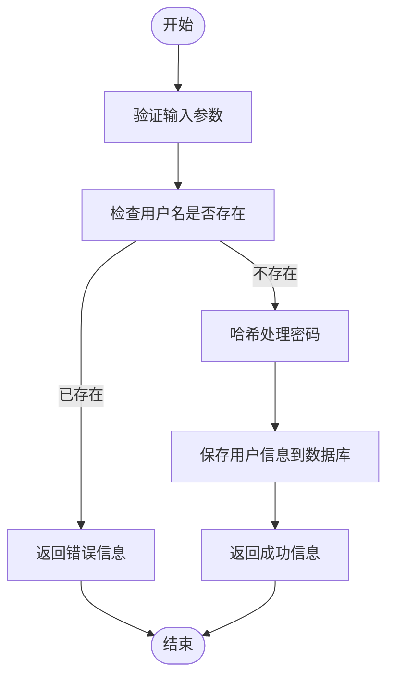
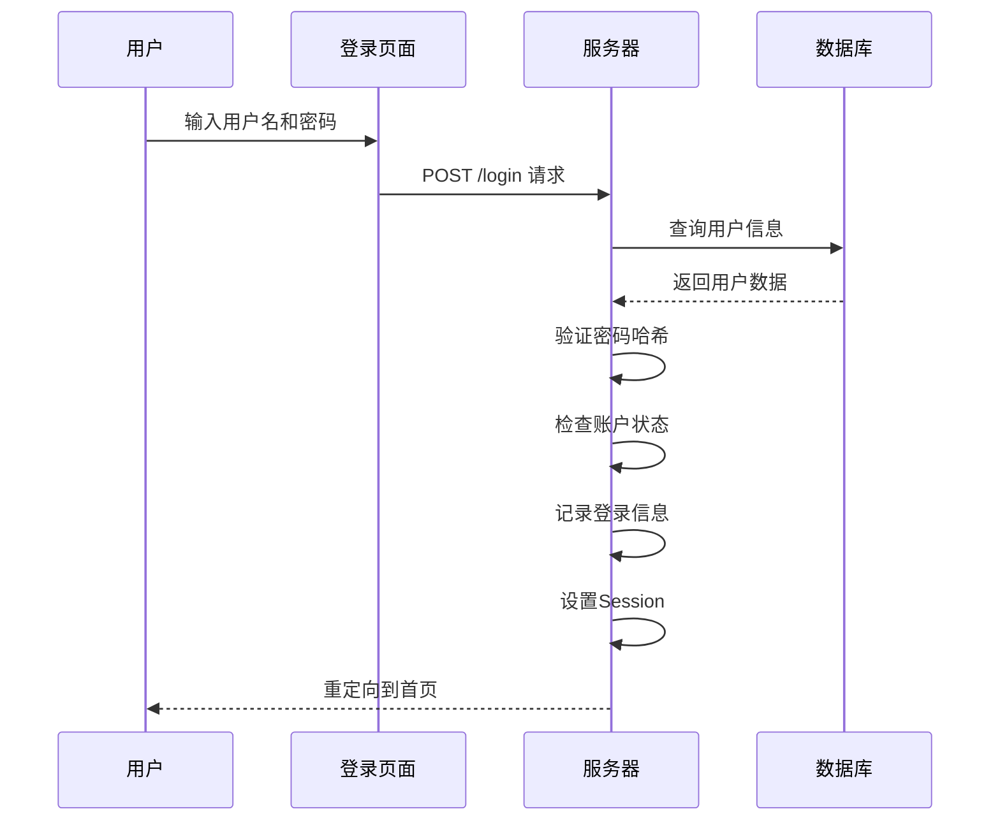
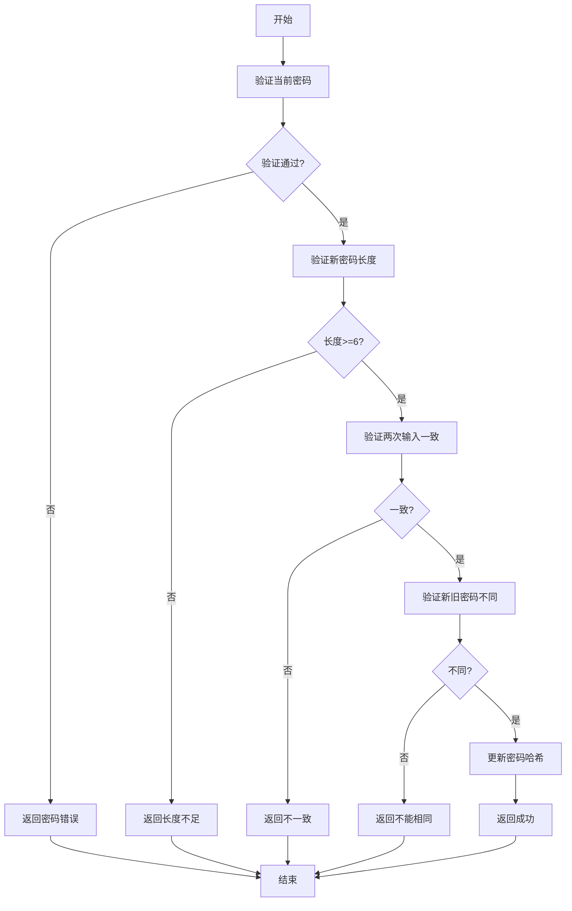
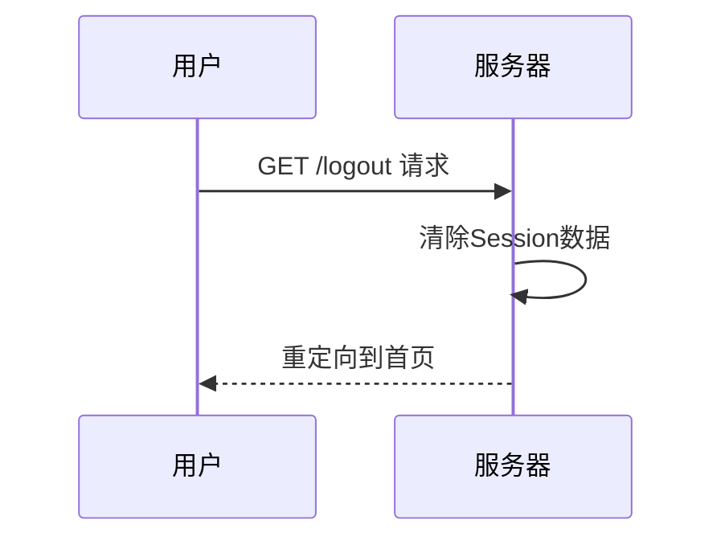
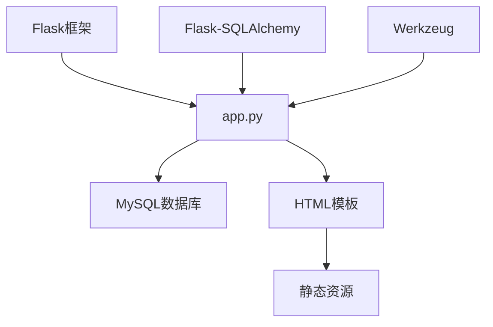

# 用户相关接口

<cite>
**本文档引用的文件**
- [app.py](file://src/app.py)
- [register.html](file://templates/register.html)
- [login.html](file://templates/login.html)
- [change_password.html](file://templates/change_password.html)
</cite>

## 目录
1. [简介](#简介)
2. [项目结构](#项目结构)
3. [核心组件](#核心组件)
4. [架构概述](#架构概述)
5. [详细组件分析](#详细组件分析)
6. [依赖分析](#依赖分析)
7. [性能考虑](#性能考虑)
8. [故障排除指南](#故障排除指南)
9. [结论](#结论)

## 简介
本文档详细描述了glzx-xmt项目中与用户管理相关的API端点，包括注册、登录、登出和修改密码等功能。文档涵盖了各接口的HTTP方法、请求参数、认证机制、响应行为以及安全处理流程。特别说明了密码哈希处理、会话管理、权限控制等关键实现细节，并提供了常见问题的解决方案。

## 项目结构
本项目采用Flask框架构建，主要分为以下几个部分：
- `src/`：核心源代码目录，包含`app.py`主应用文件
- `templates/`：前端模板文件，包含用户交互界面
- `static/`：静态资源文件，如CSS、JavaScript等
- 根目录包含配置文件和依赖声明

用户管理功能主要集中在`app.py`中实现，通过Flask路由处理HTTP请求，结合SQLAlchemy进行数据库操作，使用Session机制管理用户登录状态。

**文档来源**
- [app.py](file://src/app.py#L1-L50)
- [register.html](file://templates/register.html#L1-L20)
- [login.html](file://templates/login.html#L1-L20)

## 核心组件
系统的核心组件包括用户认证相关的路由处理函数、用户模型定义、登录状态验证装饰器以及密码安全处理机制。这些组件共同实现了完整的用户生命周期管理功能，从注册、登录到密码修改和会话控制。

**文档来源**
- [app.py](file://src/app.py#L45-L177)
- [User模型](file://src/app.py#L45-L59)
- [login_required装饰器](file://src/app.py#L163-L177)

## 架构概述
系统采用典型的Web应用三层架构：
- 表现层：HTML模板文件，提供用户界面
- 业务逻辑层：Flask路由函数，处理用户请求
- 数据访问层：SQLAlchemy ORM，操作数据库

用户认证流程通过Session机制实现，服务器端存储用户ID等关键信息，客户端通过Cookie维持会话状态。密码存储采用Werkzeug提供的安全哈希算法，确保用户密码的安全性。

**图表来源**
- [app.py](file://src/app.py#L1-L200)
- [register.html](file://templates/register.html#L1-L20)
- [login.html](file://templates/login.html#L1-L20)

## 详细组件分析

### 用户注册功能分析
用户注册功能通过POST请求处理，接收真实姓名、班级、校学号、QQ号和密码等参数。系统会对输入数据进行验证，确保校学号为纯数字，QQ号为5-15位数字，并检查用户名是否已存在。注册成功后，密码会通过Werkzeug的generate_password_hash函数进行哈希处理后存储。

**图表来源**
- [app.py](file://src/app.py#L300-L330)
- [register.html](file://templates/register.html#L1-L20)

### 用户登录功能分析
用户登录功能验证用户身份，通过比对用户名和密码哈希值来确认用户合法性。登录成功后，系统会将用户ID、角色等信息存入Session，并记录登录IP和时间。系统还实现了IP封禁检查和登录频率控制等安全机制。

**图表来源**
- [app.py](file://src/app.py#L250-L299)
- [login.html](file://templates/login.html#L1-L20)

### 密码修改功能分析
密码修改功能要求用户先通过当前密码验证，然后设置新密码。系统会验证新密码长度（至少6位）、两次输入是否一致，并确保新密码与当前密码不同。修改成功后更新数据库中的密码哈希值。

**图表来源**
- [app.py](file://src/app.py#L350-L399)
- [change_password.html](file://templates/change_password.html#L1-L20)

### 登出功能分析
登出功能通过清除Session数据来终止用户会话。系统调用session.clear()方法删除所有Session信息，然后重定向到首页，确保用户完全退出登录状态。

**图表来源**
- [app.py](file://src/app.py#L340-L349)

## 依赖分析
系统依赖关系清晰，主要依赖包括：
- Flask框架：提供Web服务基础
- Flask-SQLAlchemy：数据库ORM操作
- Werkzeug：密码哈希和安全工具
- MySQL数据库：数据持久化存储

各组件之间通过明确的接口进行交互，用户模型与认证逻辑解耦，便于维护和扩展。

**图表来源**
- [app.py](file://src/app.py#L1-L50)
- [pyproject.toml](file://pyproject.toml#L1-L20)

## 性能考虑
系统在用户认证方面进行了多项性能优化：
- 使用数据库索引加速用户查询
- Session数据存储在服务器内存中，读写速度快
- 密码哈希算法经过优化，在安全性和性能间取得平衡
- 数据库连接使用连接池管理，提高并发处理能力

## 故障排除指南
### 常见问题及解决方案

**重复注册问题**
- **现象**：用户尝试使用已存在的用户名注册
- **解决方案**：系统会检查用户名唯一性，若已存在则返回"真实姓名已存在"的提示信息

**错误密码提示**
- **现象**：用户输入错误密码无法登录
- **解决方案**：系统返回"密码错误"提示，不会暴露账户是否存在，提高安全性

**会话超时问题**
- **现象**：用户长时间未操作后会话失效
- **解决方案**：系统未设置显式会话超时，但用户可手动登出或关闭浏览器清除Session

**IP被封禁问题**
- **现象**：用户无法登录，提示IP被封禁
- **解决方案**：检查是否因频繁登录尝试触发风控机制，联系管理员解封

**图表来源**
- [app.py](file://src/app.py#L250-L399)

## 结论
glzx-xmt项目的用户管理API设计合理，功能完整，安全机制完善。通过Session-based认证方式有效管理用户状态，密码哈希处理确保了用户信息安全。系统提供了清晰的错误反馈和用户友好的交互界面，同时实现了必要的安全防护措施。建议未来可以增加密码强度验证、双因素认证等高级安全功能。