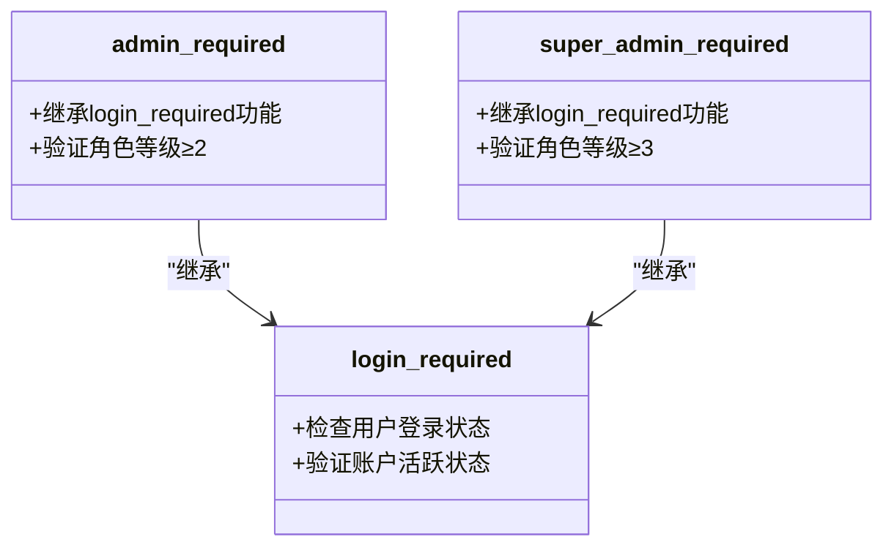
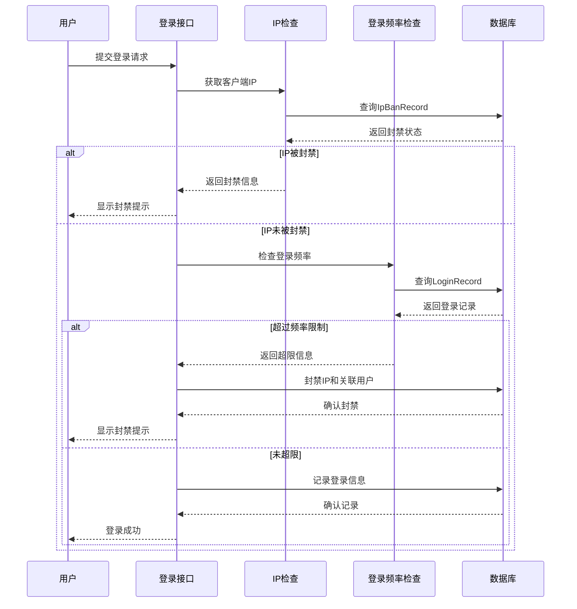
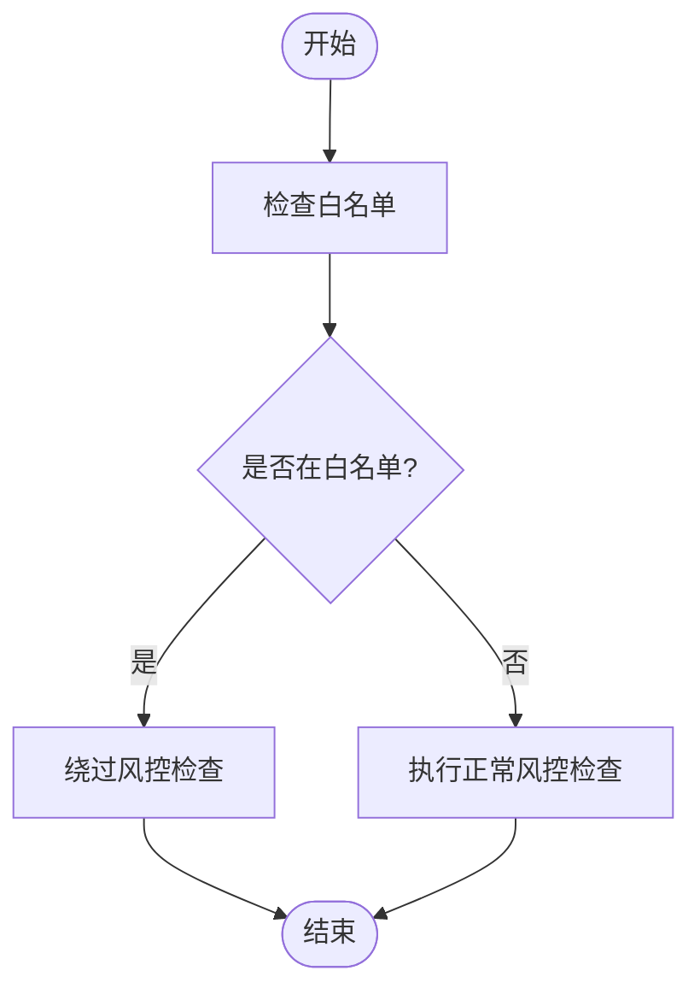
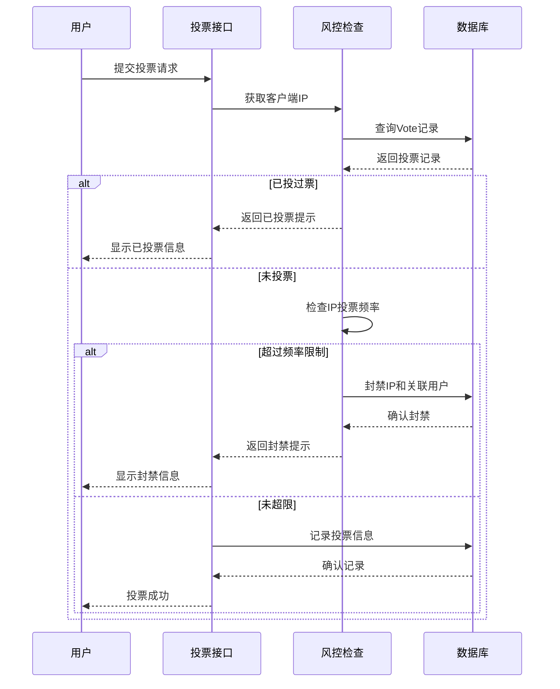
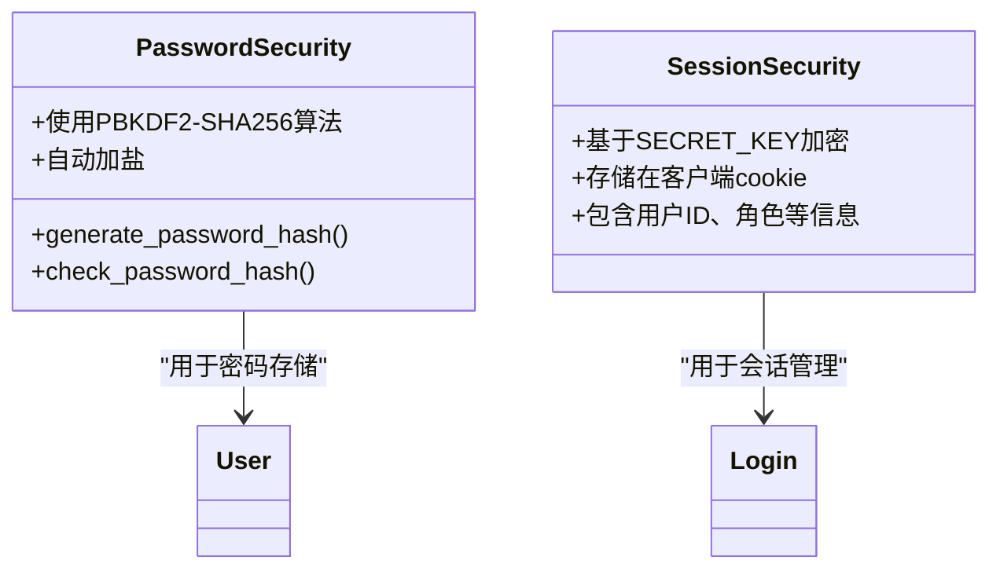
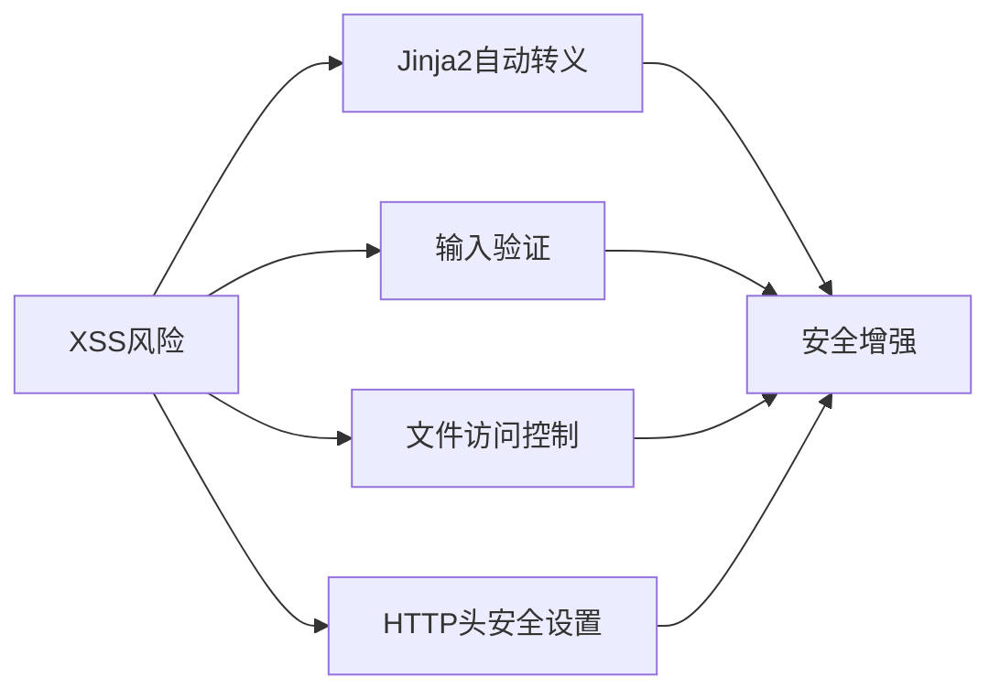

# 安全机制与风控策略

<cite>
**本文档引用的文件**
- [app.py](file://src/app.py)
- [ip_management.html](file://templates/ip_management.html)
- [whitelist_management.html](file://templates/whitelist_management.html)
</cite>

## 目录
1. [引言](#引言)
2. [身份验证与权限分级控制](#身份验证与权限分级控制)
3. [登录频率限制与IP封禁机制](#登录频率限制与ip封禁机制)
4. [白名单机制](#白名单机制)
5. [防刷票逻辑](#防刷票逻辑)
6. [密码存储与会话安全](#密码存储与会话安全)
7. [潜在风险与缓解措施](#潜在风险与缓解措施)
8. [安全配置建议](#安全配置建议)

## 引言
本项目实现了一套完整的安全防护体系，涵盖身份认证、权限控制、风控策略、数据安全等多个层面。系统通过装饰器模式实现多级权限控制，结合IP封禁、白名单、频率限制等手段有效防止恶意行为。同时，系统在密码存储、会话管理、文件访问等方面采取了多项安全措施，确保系统稳定可靠运行。

## 身份验证与权限分级控制
系统采用基于装饰器的权限控制机制，实现了三级权限体系：普通用户、管理员、系统管理员。通过`login_required`、`admin_required`和`super_admin_required`三个装饰器实现不同级别的访问控制。

**图示来源**
- [app.py](file://src/app.py#L100-L140)

**本节来源**
- [app.py](file://src/app.py#L100-L140)

## 登录频率限制与IP封禁机制
系统实现了完善的登录频率限制和IP封禁机制，通过`IpBanRecord`模型记录封禁信息，并在关键入口进行IP检查。

**图示来源**
- [app.py](file://src/app.py#L150-L250)
- [ip_management.html](file://templates/ip_management.html)

**本节来源**
- [app.py](file://src/app.py#L150-L250)
- [ip_management.html](file://templates/ip_management.html)

## 白名单机制
系统提供了IP白名单和用户白名单两种机制，允许受信任的IP或用户免受风控限制。通过`IpWhitelist`和`UserWhitelist`模型实现，并在风控检查时优先判断白名单状态。

**图示来源**
- [app.py](file://src/app.py#L250-L300)
- [whitelist_management.html](file://templates/whitelist_management.html)

**本节来源**
- [app.py](file://src/app.py#L250-L300)
- [whitelist_management.html](file://templates/whitelist_management.html)

## 防刷票逻辑
系统实现了多层次的防刷票机制，包括单用户单票限制、IP投票频率限制和自动封禁机制。通过`Settings`模型的配置参数控制防刷策略。

**图示来源**
- [app.py](file://src/app.py#L300-L350)

**本节来源**
- [app.py](file://src/app.py#L300-L350)

## 密码存储与会话安全
系统采用Werkzeug的安全函数进行密码哈希处理，使用`generate_password_hash`和`check_password_hash`确保密码存储安全。会话管理通过Flask的session机制实现，结合SECRET_KEY进行加密。

**图示来源**
- [app.py](file://src/app.py#L39-L40)

**本节来源**
- [app.py](file://src/app.py#L39-L40)

## 潜在风险与缓解措施
系统可能存在服务器端渲染导致的XSS风险，但通过以下措施进行缓解：使用Jinja2模板引擎的自动转义功能、对用户输入进行验证、限制文件访问权限等。

**本节来源**
- [app.py](file://src/app.py)
- [ip_management.html](file://templates/ip_management.html)
- [whitelist_management.html](file://templates/whitelist_management.html)

## 安全配置建议
为确保系统安全，建议采取以下配置措施：设置强密码的SECRET_KEY、使用HTTPS、定期更新依赖、限制数据库权限、启用防火墙等。

**本节来源**
- [app.py](file://src/app.py#L39)
- [app_test.py](file://src/app_test.py#L19)