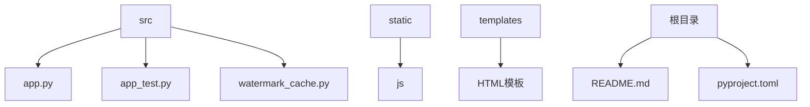
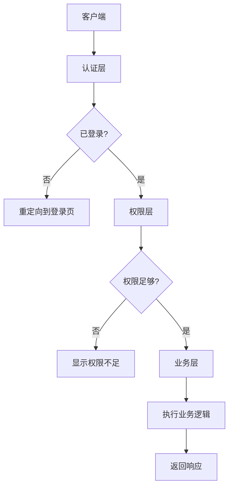
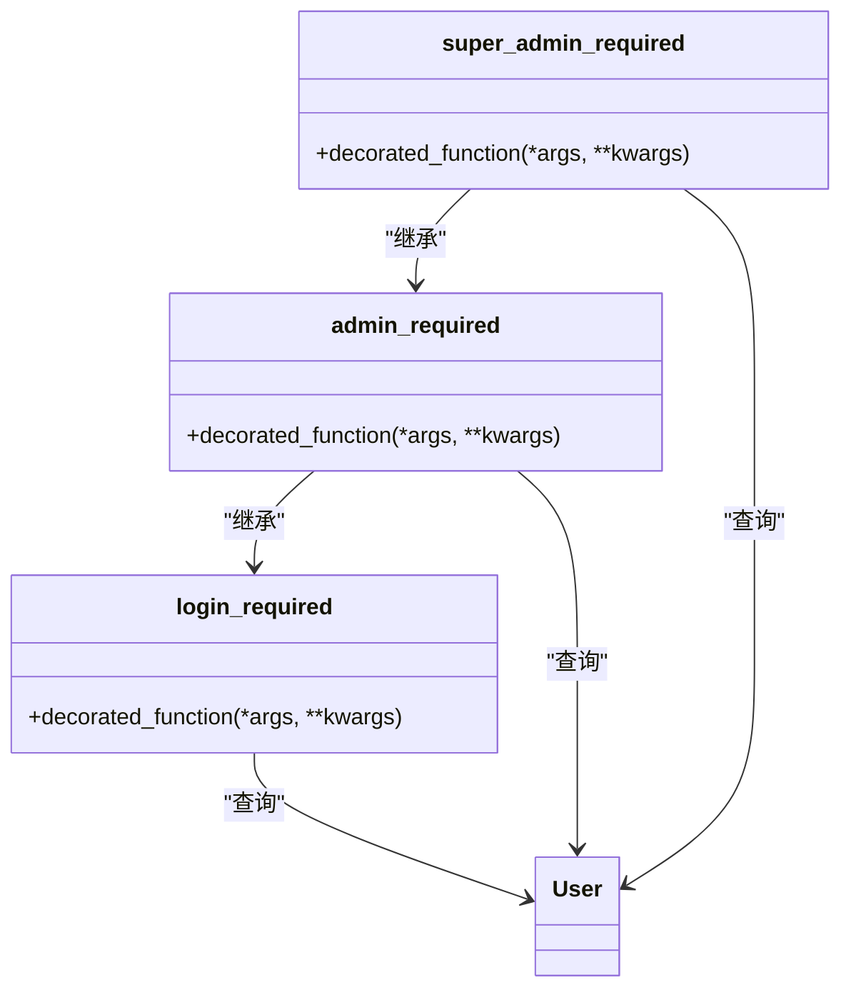
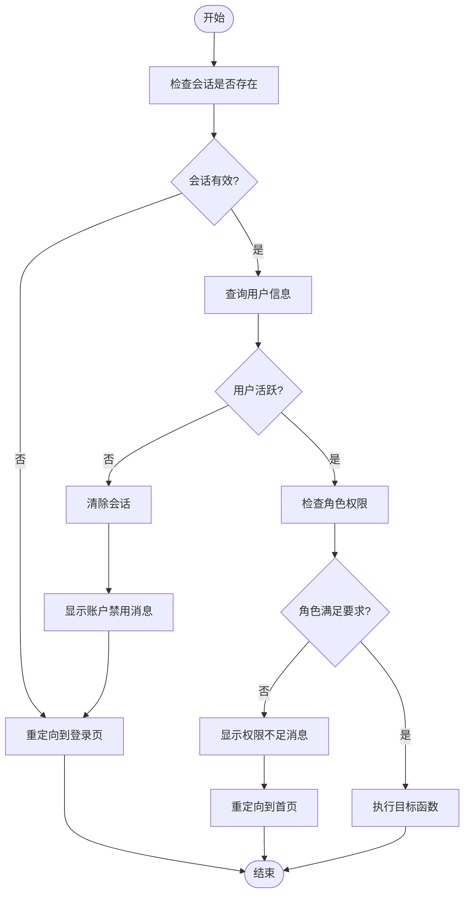
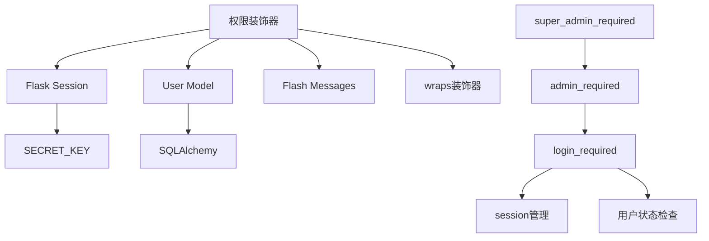

# 身份认证与权限控制

<cite>
**本文档引用的文件**
- [app.py](file://src/app.py)
- [app_test.py](file://src/app_test.py)
- [watermark_cache.py](file://src/watermark_cache.py)
</cite>

## 目录
1. [简介](#简介)
2. [项目结构](#项目结构)
3. [核心组件](#核心组件)
4. [架构概述](#架构概述)
5. [详细组件分析](#详细组件分析)
6. [依赖分析](#依赖分析)
7. [性能考虑](#性能考虑)
8. [故障排除指南](#故障排除指南)
9. [结论](#结论)
10. [附录](#附录)（如有必要）

## 简介
本文档详细描述了glzx-xmt项目中的身份认证机制和多级权限控制系统。重点分析了基于装饰器的权限分级实现（@login_required, @admin_required, @super_admin_required），解释其在路由保护中的应用方式。文档涵盖了用户登录流程、会话（session）管理机制及安全性保障措施，以及用户角色定义（普通用户、管理员、系统管理员）及其对应操作权限的代码实现逻辑。

## 项目结构
本项目采用Flask框架构建，主要包含以下结构：

- `src/`：核心源代码目录
  - `app.py`：主应用程序文件，包含所有路由、模型定义和业务逻辑
  - `app_test.py`：测试版本的应用程序文件，与app.py功能相同但使用SQLite数据库
  - `watermark_cache.py`：水印功能的缓存优化模块
- `static/`：静态资源文件
  - `js/`：JavaScript文件
- `templates/`：HTML模板文件，用于渲染前端页面
- 根目录包含配置文件和依赖说明

项目采用模块化设计，将用户认证、权限控制、数据模型和业务逻辑集中管理，通过装饰器模式实现权限分级控制。



**图示来源**
- [app.py](file://src/app.py)
- [app_test.py](file://src/app_test.py)
- [watermark_cache.py](file://src/watermark_cache.py)

**章节来源**
- [app.py](file://src/app.py)
- [app_test.py](file://src/app_test.py)

## 核心组件
身份认证与权限控制系统的核心组件包括：

1. **用户模型（User）**：定义用户基本信息、角色和状态
2. **权限装饰器**：@login_required、@admin_required、@super_admin_required
3. **会话管理**：基于Flask session的用户状态保持
4. **角色系统**：通过role字段实现三级权限分级
5. **登录记录**：跟踪用户登录行为

这些组件协同工作，确保系统的安全性和权限控制的精确性。

**章节来源**
- [app.py](file://src/app.py#L100-L150)
- [app.py](file://src/app.py#L250-L350)

## 架构概述
系统采用基于装饰器的权限控制架构，通过Flask的路由装饰器机制实现访问控制。整体架构分为三层：

1. **认证层**：处理用户登录、登出和会话管理
2. **权限层**：通过装饰器实现多级权限控制
3. **业务层**：具体的功能路由和业务逻辑



**图示来源**
- [app.py](file://src/app.py#L250-L350)

## 详细组件分析

### 权限装饰器分析
权限系统通过三个装饰器实现分级控制，形成递进式的权限管理体系。

#### 权限装饰器类图


**图示来源**
- [app.py](file://src/app.py#L250-L350)

**章节来源**
- [app.py](file://src/app.py#L250-L350)

### 用户角色与权限
系统定义了三种用户角色，通过User模型的role字段实现：

| 角色 | role值 | 权限描述 |
|------|--------|----------|
| 普通用户 | 1 | 基本操作权限 |
| 普通管理员 | 2 | 管理员权限 |
| 系统管理员 | 3 | 最高管理权限 |

#### 权限控制流程图


**图示来源**
- [app.py](file://src/app.py#L250-L350)

**章节来源**
- [app.py](file://src/app.py#L100-L150)
- [app.py](file://src/app.py#L250-L350)

## 依赖分析
权限控制系统依赖于多个组件和模块：



**图示来源**
- [app.py](file://src/app.py)
- [app_test.py](file://src/app_test.py)

**章节来源**
- [app.py](file://src/app.py)
- [app_test.py](file://src/app_test.py)

## 性能考虑
权限控制系统在设计时考虑了性能因素：

1. **会话检查**：每次请求都检查会话状态，但数据库查询仅在必要时进行
2. **装饰器开销**：使用functools.wraps保持函数元数据，减少性能影响
3. **缓存机制**：虽然当前权限系统未直接使用缓存，但watermark_cache.py展示了项目中的缓存实践
4. **数据库查询优化**：权限检查中使用了直接的数据库查询，避免了不必要的关联查询

对于高并发场景，可以考虑引入Redis等缓存机制来存储用户会话和权限信息，减少数据库压力。

## 故障排除指南
### 常见问题及解决方案

1. **用户无法登录**
   - 检查用户名和密码是否正确
   - 确认账户是否被禁用（is_active=False）
   - 检查IP是否被封禁

2. **权限不足错误**
   - 确认用户角色是否满足要求
   - 检查装饰器是否正确应用
   - 验证会话是否正常

3. **会话丢失问题**
   - 检查SECRET_KEY配置是否一致
   - 确认浏览器是否禁用了cookie
   - 检查服务器时间是否同步

4. **装饰器不生效**
   - 确保装饰器顺序正确
   - 检查是否与其他装饰器冲突
   - 验证函数是否正确返回

**章节来源**
- [app.py](file://src/app.py#L250-L350)
- [app.py](file://src/app.py#L1000-L1100)

## 结论
glzx-xmt项目的身份认证与权限控制系统设计合理，通过装饰器模式实现了清晰的权限分级。系统采用三级权限模型（普通用户、管理员、系统管理员），通过role字段和相应的装饰器实现访问控制。会话管理基于Flask内置机制，结合用户状态检查，确保了系统的安全性。权限装饰器的设计遵循了DRY原则，代码复用性高，易于维护和扩展。

## 附录
### 权限装饰器代码片段路径
- `@login_required`：[app.py](file://src/app.py#L250-L270)
- `@admin_required`：[app.py](file://src/app.py#L272-L292)
- `@super_admin_required`：[app.py](file://src/app.py#L294-L314)
- User模型定义：[app.py](file://src/app.py#L50-L100)

### 扩展新权限层级的方法
要扩展新的权限层级，可以按照以下步骤：
1. 在User模型的role字段注释中添加新的角色定义
2. 创建新的装饰器函数，参考现有装饰器的实现
3. 在需要保护的路由上应用新的装饰器

示例：添加"高级管理员"角色（role=2.5）
```python
def senior_admin_required(f):
    @wraps(f)
    def decorated_function(*args, **kwargs):
        if 'user_id' not in session:
            return redirect(url_for('login'))
        
        user = User.query.get(session['user_id'])
        if not user or not user.is_active:
            session.clear()
            flash('账户已被禁用，请联系管理员')
            return redirect(url_for('login'))
        elif user.role < 2.5:  # 新的权限阈值
            flash('需要高级管理员权限')
            return redirect(url_for('index'))
        return f(*args, **kwargs)
    return decorated_function
```