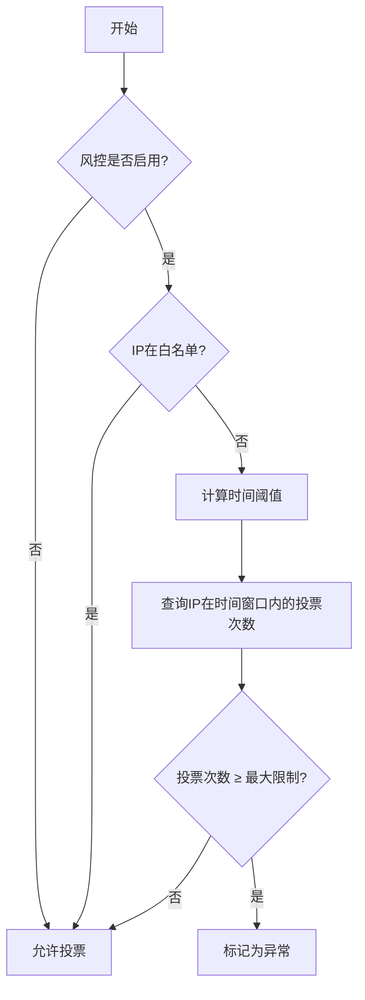
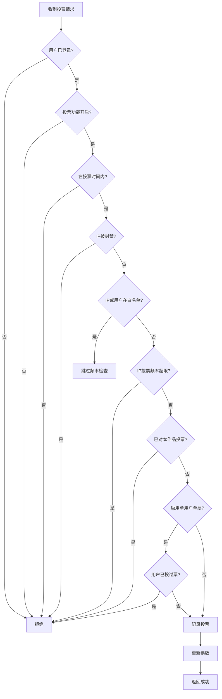
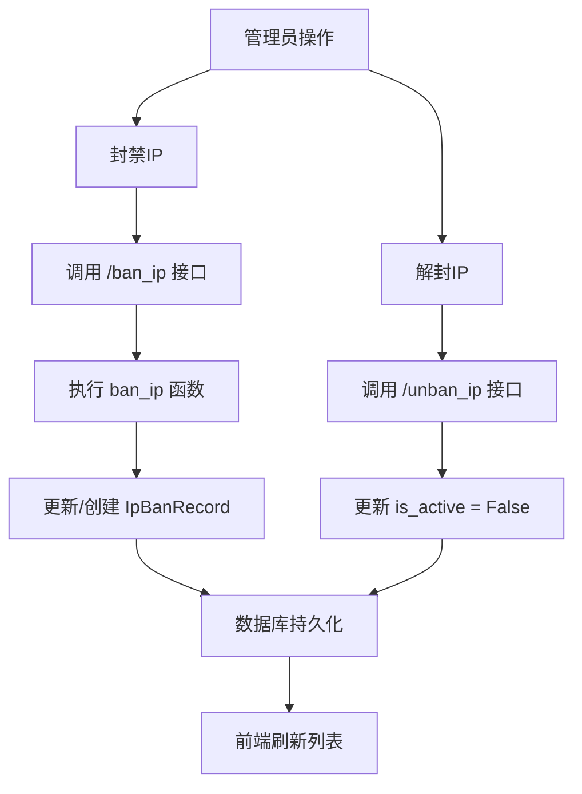
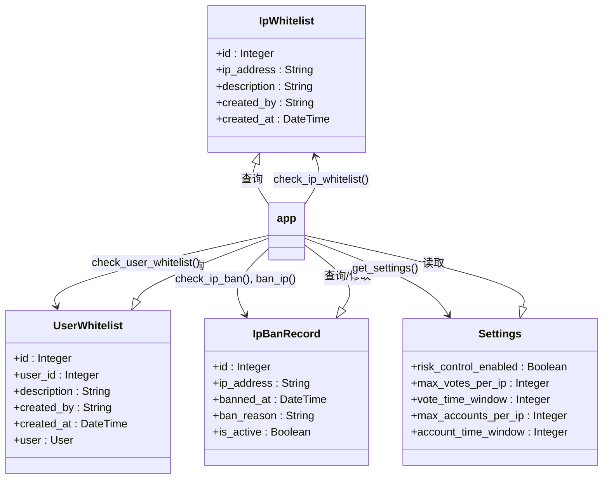

# 风控与防刷机制

<cite>
**本文档引用文件**  
- [app.py](file://src/app.py)
- [ip_management.html](file://templates/ip_management.html)
- [whitelist_management.html](file://templates/whitelist_management.html)
</cite>

## 目录
1. [引言](#引言)
2. [防刷票机制](#防刷票机制)
3. [IP封禁功能](#ip封禁功能)
4. [白名单机制](#白名单机制)
5. [系统性能影响分析](#系统性能影响分析)
6. [配置建议](#配置建议)
7. [关键函数调用流程](#关键函数调用流程)
8. [结论](#结论)

## 引言
本系统为摄影比赛投票平台，为防止恶意刷票、账号滥用等行为，设计并实现了一套完整的风控体系。该体系包含防刷票机制、IP封禁与白名单管理、用户白名单等功能，通过数据库记录、时间窗口控制和频率限制等技术手段，保障投票的公平性和系统的安全性。本文档将系统性地描述这些机制的技术实现细节。

## 防刷票机制

### 投票频率限制
系统通过 `check_vote_frequency` 函数实现基于IP的投票频率限制。该函数首先检查风控功能是否启用，若未启用则直接放行。随后，检查请求IP是否在IP白名单中，若在则跳过所有限制。

当IP不在白名单时，系统根据配置的 `vote_time_window`（投票时间窗口，单位：分钟）计算出一个时间阈值。然后查询 `Vote` 表，统计该IP在时间窗口内的投票记录数量。若投票次数超过 `max_votes_per_ip`（单IP最大投票次数）的设定值，则判定为超限。

**Diagram sources**
- [app.py](file://src/app.py#L396-L418)

**Section sources**
- [app.py](file://src/app.py#L396-L418)

### 重复投票检测逻辑
系统实现了两种级别的重复投票检测：

1.  **作品级检测**：在同一会话中，用户不能对同一作品重复投票。系统在 `vote` 路由中，通过查询 `Vote` 表检查用户是否已对目标作品投过票。
2.  **用户级检测**：当系统设置 `one_vote_per_user` 为 `True` 时，启用“每人每轮限投一次”功能。此时，系统会检查该用户是否已对任何作品投过票，若已投票则拒绝新的投票请求。

**Diagram sources**
- [app.py](file://src/app.py#L540-L575)

**Section sources**
- [app.py](file://src/app.py#L540-L575)

### 时间窗口控制
时间窗口是风控机制的核心。系统使用 `datetime.now() - timedelta(minutes=settings.xxx_time_window)` 的方式动态计算时间阈值。所有频率检查（如投票、登录）都基于此时间窗口进行数据库查询，确保只统计最近一段时间内的行为，防止历史数据影响当前判断。

## IP封禁功能

### 黑名单匹配逻辑
IP黑名单由 `IpBanRecord` 数据库表维护，包含 `ip_address`、`banned_at`、`ban_reason` 和 `is_active` 字段。匹配逻辑在 `check_ip_ban` 函数中实现：系统查询 `IpBanRecord` 表，查找与请求IP地址完全匹配且 `is_active` 为 `True` 的记录。若存在，则判定该IP被封禁。

### 请求拦截流程
请求拦截流程贯穿于关键操作（如登录、投票）中：
1.  获取客户端真实IP地址（支持反向代理）。
2.  调用 `check_ip_ban` 函数进行黑名单匹配。
3.  若匹配成功，立即终止操作，返回封禁提示信息。

### 管理员操作接口
管理员可通过 `ip_management.html` 界面进行IP封禁管理：
- **封禁IP**：通过 `/ban_ip` 路由，管理员可手动输入IP地址和原因进行封禁。后端调用 `ban_ip` 函数，若IP已存在记录则更新其状态，否则创建新记录。
- **解封IP**：通过 `/unban_ip/<ip_id>` 路由，将对应 `IpBanRecord` 的 `is_active` 字段设为 `False`。
- **自动封禁**：当检测到异常行为（如投票或登录频率超限）时，`auto_ban_users_by_ip` 函数会被触发，自动封禁相关IP及关联的非管理员用户。

**Diagram sources**
- [app.py](file://src/app.py#L384-L394)
- [app.py](file://src/app.py#L878-L890)
- [ip_management.html](file://templates/ip_management.html)

**Section sources**
- [app.py](file://src/app.py#L384-L394)
- [app.py](file://src/app.py#L878-L890)
- [ip_management.html](file://templates/ip_management.html)

## 白名单机制

### 设计目的
白名单机制旨在为受信任的IP或用户豁免风控限制。例如，学校内部网络的IP或特定工作人员的账号，不应受到投票频率或登录数量的限制。这提高了合法用户的使用体验，同时不影响对恶意行为的管控。

### 实现路径
系统实现了两种白名单：
- **IP白名单**：由 `IpWhitelist` 表存储，通过 `check_ip_whitelist` 函数查询IP地址是否存在。
- **用户白名单**：由 `UserWhitelist` 表存储，通过 `check_user_whitelist` 函数查询用户ID是否存在。

在进行风控检查（如 `check_vote_frequency`、`check_login_frequency`）时，系统会优先调用这两个检查函数。若任一检查通过，则直接返回“未超限”，跳过后续的频率统计。

### 与黑名单的优先级关系
白名单的优先级高于黑名单和所有频率限制。具体流程如下：
1.  检查IP是否在白名单中。
2.  若在，则完全豁免，不进行任何风控检查。
3.  若不在，则继续检查IP是否被封禁或是否超频。

这意味着，即使一个白名单IP被手动封禁或触发了频率限制，它依然可以正常访问系统。

**Diagram sources**
- [app.py](file://src/app.py#L369-L377)
- [app.py](file://src/app.py#L379-L394)
- [whitelist_management.html](file://templates/whitelist_management.html)

**Section sources**
- [app.py](file://src/app.py#L369-L377)
- [whitelist_management.html](file://templates/whitelist_management.html)

## 系统性能影响分析
风控机制的主要性能开销在于数据库查询：
- **频率检查**：每次投票或登录都需要执行一次或多次数据库聚合查询（COUNT, DISTINCT），在高并发场景下可能成为瓶颈。
- **白名单/黑名单检查**：为简单的主键或唯一索引查询，性能开销较小。
- **自动封禁**：涉及多表JOIN查询和批量更新，但仅在异常情况下触发，对日常性能影响有限。

总体而言，系统设计合理，核心风控逻辑通过索引优化（如 `Vote.ip_address`、`LoginRecord.ip_address`）可保证查询效率。在投票高峰期，应重点关注数据库性能。

## 配置建议
- **封禁规则持久化**：所有封禁和白名单规则均存储在数据库中，重启服务后依然有效，无需额外配置。
- **参数设置**：建议根据实际流量调整 `max_votes_per_ip` 和 `vote_time_window`。例如，可设置为“10分钟内最多投5票”。`account_time_window` 建议设置为24小时（1440分钟）。
- **监控**：利用 `ip_management.html` 页面的统计和分析功能，定期审查IP行为，及时发现潜在风险。

## 关键函数调用流程
以用户投票为例，关键函数调用流程如下：
1.  `vote()` 路由函数被调用。
2.  调用 `is_voting_time()` 检查投票时间。
3.  调用 `get_client_ip()` 获取IP。
4.  调用 `check_ip_ban()` 检查IP是否被封禁。
5.  调用 `check_vote_frequency()` 检查投票频率。
6.  在 `check_vote_frequency()` 内部，会调用 `check_ip_whitelist()` 进行豁免检查。
7.  若通过所有检查，则创建 `Vote` 记录并更新票数。

**Section sources**
- [app.py](file://src/app.py#L540-L575)

## 结论
本系统的风控体系设计全面，通过防刷票、IP封禁和白名单三大机制，有效抵御了常见的恶意行为。技术实现上，利用Flask框架和SQLAlchemy ORM，代码逻辑清晰，数据库设计合理。建议在实际运行中根据日志和监控数据，持续优化风控参数，以达到安全与用户体验的最佳平衡。