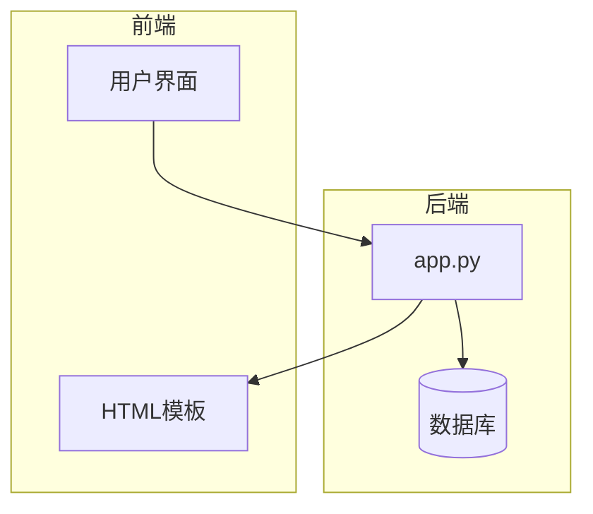
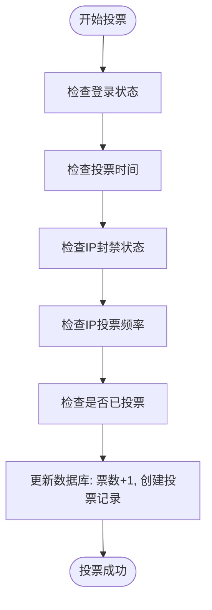
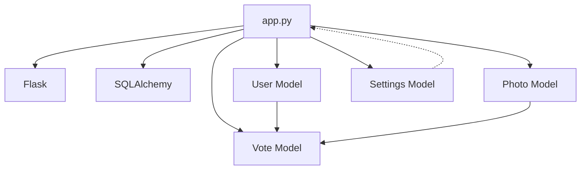

# 业务逻辑扩展

<cite>
**本文档中引用的文件**  
- [app.py](file://src/app.py)
</cite>

## 目录
1. [引言](#引言)
2. [项目结构](#项目结构)
3. [核心组件](#核心组件)
4. [架构概述](#架构概述)
5. [详细组件分析](#详细组件分析)
6. [依赖分析](#依赖分析)
7. [性能考虑](#性能考虑)
8. [故障排除指南](#故障排除指南)
9. [结论](#结论)

## 引言
本文档旨在深入解析 `app.py` 中可扩展的业务逻辑点，包括投票规则、用户权限层级、照片审核流程等。重点说明如何在不破坏现有权限装饰器的前提下，安全地添加新角色和权限判断，并提供代码示例。同时涵盖用户注册流程扩展、密码策略调整、排行榜算法优化等内容，强调遵循MVC模式，避免业务逻辑混入前端代码，并提供常见陷阱的规避方案。

## 项目结构
项目采用典型的Flask应用结构，主要分为源码、静态资源和模板三大部分。核心业务逻辑集中在 `src/app.py` 文件中，数据库模型与路由处理一体化实现。静态资源（JS、图片）和HTML模板分别存放于 `static` 和 `templates` 目录，符合前后端分离的基本原则。

**Section sources**
- [app.py](file://src/app.py#L1-L50)

## 核心组件
`app.py` 文件定义了系统的核心数据模型（User, Photo, Vote等）和业务逻辑函数。通过SQLAlchemy实现ORM映射，使用Flask-Login的替代方案（session管理）处理用户认证。权限控制通过自定义装饰器（@login_required, @admin_required）实现，业务规则（如投票限制、审核状态）直接嵌入视图函数中。

**Section sources**
- [app.py](file://src/app.py#L51-L200)

## 架构概述
系统采用轻量级MVC模式，`app.py` 兼具Model和Controller角色，模板文件作为View层。业务逻辑与数据访问紧密耦合，但通过函数封装（如 `get_settings`, `check_ip_ban`）实现了部分逻辑复用。整体架构简洁，适合中小型应用，但在业务复杂度增加时，需注意解耦以避免代码臃肿。



**Diagram sources**
- [app.py](file://src/app.py#L1-L1903)

## 详细组件分析

### 投票规则扩展
当前系统已实现基础的投票控制，如全局开关、时间窗口、单IP频率限制（`check_vote_frequency`）。扩展每日投票数限制或同作品投票间隔，可在 `vote` 路由中增加数据库查询。例如，通过 `Vote` 模型查询用户当日投票记录，或记录上次投票时间。



**Diagram sources**
- [app.py](file://src/app.py#L600-L650)

**Section sources**
- [app.py](file://src/app.py#L550-L700)

### 用户权限层级扩展
现有角色（普通用户、管理员、系统管理员）通过 `User.role` 字段（1,2,3）区分。新增“评审员”角色，可将 `role` 字段值设为4，并创建新的装饰器 `@reviewer_required`。关键是在不修改现有装饰器的前提下，通过角色数值比较实现权限升级。

```python
def reviewer_required(f):
    @wraps(f)
    def decorated_function(*args, **kwargs):
        if 'user_id' not in session:
            return redirect(url_for('login'))
        user = User.query.get(session['user_id'])
        if not user or not user.is_active or user.role < 4: # 4代表评审员
            flash('需要评审员权限')
            return redirect(url_for('index'))
        return f(*args, **kwargs)
    return decorated_function
```

此方法安全地扩展了权限体系，且与现有 `@admin_required` (role>=2) 不冲突。

**Section sources**
- [app.py](file://src/app.py#L250-L300)

### 照片审核流程
审核流程由 `admin_review`、`approve_photo` 和 `reject_photo` 三个路由构成。`Photo.status` 字段（0待审核, 1已通过, 2已拒绝）驱动状态流转。扩展审核流程（如多级审核）可引入状态机或增加中间状态（如“初审中”、“终审中”），并通过工作流引擎或状态表进行管理。

**Section sources**
- [app.py](file://src/app.py#L450-L500)

### 用户注册流程扩展
注册流程在 `register` 路由中实现。扩展字段验证（如邮箱格式、手机号）只需在表单处理时增加正则表达式校验。例如，添加 `email` 字段并使用 `re.match(r'^[^@]+@[^@]+\.[^@]+$', email)` 进行验证。新字段需同步更新 `User` 模型。

**Section sources**
- [app.py](file://src/app.py#L350-L400)

### 密码策略调整
密码策略在 `change_password` 路由中硬编码（长度>=6）。可将其抽象为配置项，存储在 `Settings` 模型中（如 `min_password_length`），并在验证时动态读取。这允许管理员在不修改代码的情况下调整策略。

**Section sources**
- [app.py](file://src/app.py#L320-L350)

### 排行榜计算算法
排行榜在 `rankings` 路由中计算，当前算法为简单票数降序排列，并处理并列排名。扩展算法（如加权投票、时间衰减）可在 `ranked_photos` 列表生成前，对 `photos` 查询结果进行预处理。例如，引入 `vote_weight` 字段或根据 `created_at` 计算时间衰减因子。

**Section sources**
- [app.py](file://src/app.py#L750-L800)

## 依赖分析
系统依赖关系清晰，`app.py` 是核心，依赖Flask、SQLAlchemy等外部库。内部组件通过函数调用和数据库模型关联。`Settings` 模型是全局配置中心，被多个业务函数（`is_voting_time`, `check_vote_frequency`）依赖。`User` 模型是权限和数据关联的枢纽。



**Diagram sources**
- [app.py](file://src/app.py#L51-L200)

**Section sources**
- [app.py](file://src/app.py#L1-L1903)

## 性能考虑
- **数据库查询**：部分查询（如排行榜）未分页，大数据量下可能性能下降。建议添加分页参数。
- **文件操作**：水印生成和文件下载在请求处理中同步执行，可能阻塞主线程。建议使用异步任务队列（如Celery）。
- **缓存**：未使用缓存机制，`get_settings` 等高频读取操作可引入Redis缓存。

## 故障排除指南
- **事务未提交**：在数据库操作后忘记 `db.session.commit()` 是常见错误。确保所有 `add`, `delete`, `update` 操作后调用 `commit()`。
- **缓存未更新**：若引入缓存，修改数据后需手动清除或更新缓存，否则用户看到旧数据。
- **文件路径错误**：`secure_uploaded_file` 等路由使用硬编码路径，迁移时需注意路径分隔符（Windows vs Linux）。
- **权限装饰器失效**：确保新装饰器正确使用 `@wraps(f)`，否则会导致路由元数据丢失。

**Section sources**
- [app.py](file://src/app.py#L1000-L1903)

## 结论
`app.py` 构建了一个功能完整的摄影比赛系统，其业务逻辑具备良好的可扩展性。通过遵循MVC模式，将新业务逻辑封装在独立函数或模型方法中，并利用现有的装饰器和配置体系，可以安全、高效地添加新功能。未来应关注代码解耦、引入缓存和异步处理，以应对更复杂的业务场景。