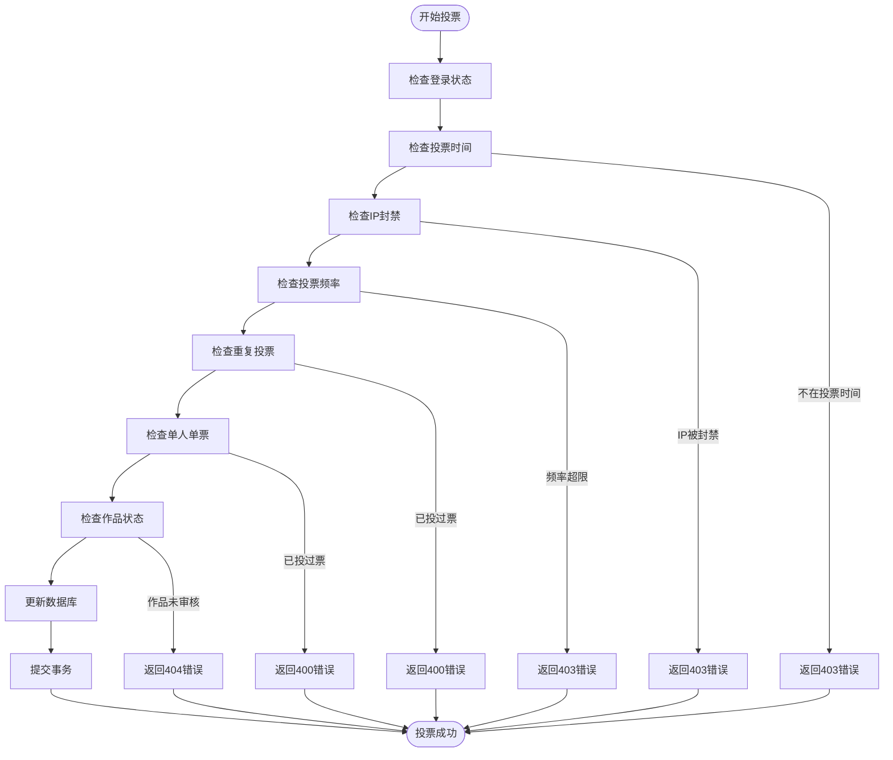
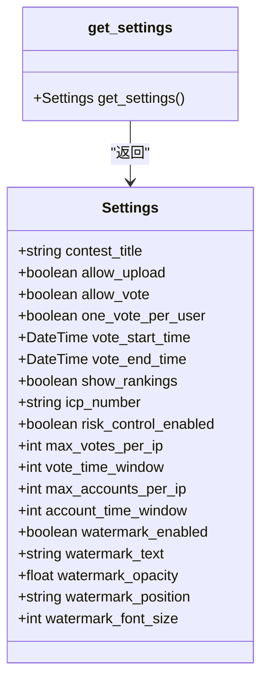

# 投票规则扩展

<cite>
**本文档引用的文件**   
- [app.py](file://src/app.py)
</cite>

## 目录
1. [引言](#引言)
2. [项目结构](#项目结构)
3. [核心组件](#核心组件)
4. [架构概述](#架构概述)
5. [详细组件分析](#详细组件分析)
6. [依赖分析](#依赖分析)
7. [性能考虑](#性能考虑)
8. [故障排除指南](#故障排除指南)
9. [结论](#结论)

## 引言
本文档深入解析 `app.py` 中与投票相关的业务逻辑实现，重点分析现有投票限制规则（如每日投票数限制、同作品投票间隔控制）的代码结构。详细说明如何在不破坏现有装饰器机制的前提下，安全地扩展新的投票限制策略（如基于IP的投票频次控制、时间段内投票权重调整）。提供具体的代码示例，展示如何新增配置项、修改数据库模型以支持新规则，并确保事务一致性。结合实际路由处理函数（如 `/vote` 接口），说明数据验证、状态更新和异常处理的最佳实践。指出常见问题如缓存未同步导致重复投票、数据库事务未提交等，并提供解决方案。

## 项目结构
本项目采用典型的Flask Web应用结构，主要分为以下几个部分：
- `src/`：核心源码目录，包含主应用文件 `app.py` 和测试文件 `app_test.py`
- `static/`：静态资源目录，包含JavaScript、CSS和上传文件
- `templates/`：HTML模板目录，包含各种页面模板
- 根目录：包含项目配置文件和文档

投票相关的核心逻辑集中在 `src/app.py` 文件中，通过Flask路由和数据库模型实现完整的投票功能。

**Section sources**
- [app.py](file://src/app.py#L1-L50)

## 核心组件

投票功能的核心组件包括：
- `Vote` 模型：记录用户投票信息，包含用户ID、作品ID、创建时间和IP地址
- `Settings` 模型：存储系统设置，包括投票开关、时间限制、风控参数等
- `vote()` 路由函数：处理投票请求的核心逻辑
- `check_vote_frequency()` 函数：检查IP投票频率是否超限
- `is_voting_time()` 函数：检查当前时间是否在允许投票的时间范围内

这些组件协同工作，实现了完整的投票限制和风控机制。

**Section sources**
- [app.py](file://src/app.py#L150-L200)
- [app.py](file://src/app.py#L396-L418)
- [app.py](file://src/app.py#L655-L700)

## 架构概述

```mermaid
graph TB
subgraph "前端"
UI[用户界面]
AJAX[异步请求]
end
subgraph "后端"
Route[/vote] --> Auth[登录验证]
Auth --> TimeCheck[投票时间检查]
TimeCheck --> IPCheck[IP封禁检查]
IPCheck --> FrequencyCheck[投票频率检查]
FrequencyCheck --> VoteLogic[投票逻辑]
VoteLogic --> DB[数据库操作]
DB --> Response[响应返回]
end
UI --> AJAX
AJAX --> Route
Response --> UI
```

**Diagram sources**
- [app.py](file://src/app.py#L655-L700)

## 详细组件分析

### 投票逻辑分析

投票功能的实现遵循严格的验证流程，确保投票的合法性和安全性。

#### 投票流程序列图
```mermaid
sequenceDiagram
participant Client as "客户端"
participant Server as "服务器"
participant DB as "数据库"
Client->>Server : POST /vote
Server->>Server : login_required装饰器
Server->>Server : is_voting_time()
alt 投票时间外
Server-->>Client : 403 错误
return
end
Server->>Server : get_client_ip()
Server->>Server : check_ip_ban()
alt IP被封禁
Server-->>Client : 403 错误
return
end
Server->>DB : 查询用户信息
Server->>Server : check_vote_frequency()
alt 投票频率超限
Server->>Server : auto_ban_users_by_ip()
Server->>Server : ban_ip()
Server-->>Client : 403 错误
return
end
Server->>DB : 查询投票记录
alt 已投过票
Server-->>Client : 400 错误
return
end
Server->>DB : 更新票数
Server->>DB : 提交事务
Server-->>Client : 成功响应
```

**Diagram sources**
- [app.py](file://src/app.py#L655-L700)
- [app.py](file://src/app.py#L396-L418)

#### 投票限制规则


**Diagram sources**
- [app.py](file://src/app.py#L655-L700)

**Section sources**
- [app.py](file://src/app.py#L655-L700)

### 配置管理分析

系统通过 `Settings` 模型集中管理各种配置参数，支持动态调整投票规则。

#### 配置项类图


**Diagram sources**
- [app.py](file://src/app.py#L150-L200)

**Section sources**
- [app.py](file://src/app.py#L150-L200)

## 依赖分析

```mermaid
graph TD
VoteRoute[/vote] --> LoginRequired[login_required]
VoteRoute --> IsVotingTime[is_voting_time]
VoteRoute --> GetClientIp[get_client_ip]
VoteRoute --> CheckIpBan[check_ip_ban]
VoteRoute --> CheckVoteFrequency[check_vote_frequency]
VoteRoute --> AutoBanUsers[auto_ban_users_by_ip]
VoteRoute --> BanIp[ban_ip]
VoteRoute --> GetSettings[get_settings]
CheckVoteFrequency --> GetSettings
CheckVoteFrequency --> CheckIpWhitelist[check_ip_whitelist]
CheckVoteFrequency --> VoteModel[Vote]
AutoBanUsers --> GetSettings
AutoBanUsers --> LoginRecord[LoginRecord]
AutoBanUsers --> User[User]
IsVotingTime --> GetSettings
VoteRoute --> User[User]
VoteRoute --> Photo[Photo]
VoteRoute --> VoteModel[Vote]
```

**Diagram sources**
- [app.py](file://src/app.py#L655-L700)
- [app.py](file://src/app.py#L396-L418)

**Section sources**
- [app.py](file://src/app.py#L655-L700)

## 性能考虑

投票功能在设计时考虑了性能优化，主要体现在以下几个方面：
- 数据库查询优化：使用索引加速查询，特别是在 `Vote` 表的 `ip_address` 和 `created_at` 字段上
- 事务管理：将相关操作放在同一个事务中，确保数据一致性
- 缓存策略：虽然当前实现中没有显式使用缓存，但可以通过添加缓存层来进一步提升性能
- 批量操作：在管理员功能中实现了批量下载和导出，优化了大量数据处理的性能

对于高并发场景，建议增加Redis等缓存机制，将频繁查询的数据（如排行榜）缓存起来，减少数据库压力。

## 故障排除指南

### 常见问题及解决方案

| 问题现象 | 可能原因 | 解决方案 |
|---------|---------|---------|
| 用户无法投票 | 1. 不在投票时间范围内<br>2. IP被封禁<br>3. 投票频率超限<br>4. 已投过票 | 1. 检查系统设置中的投票时间<br>2. 检查IP封禁列表<br>3. 调整风控参数或添加白名单<br>4. 确认投票规则 |
| 投票数不更新 | 1. 事务未提交<br>2. 数据库连接问题<br>3. 异常未捕获 | 1. 确保db.session.commit()执行<br>2. 检查数据库连接状态<br>3. 添加异常处理和日志记录 |
| 重复投票 | 1. 缓存未同步<br>2. 并发请求处理不当 | 1. 实现分布式锁<br>2. 使用数据库唯一约束 |
| IP封禁无效 | 1. 白名单优先级问题<br>2. 封禁逻辑执行顺序 | 1. 确保白名单检查在封禁检查之前<br>2. 检查函数调用顺序 |

### 扩展新投票规则的建议

要在不破坏现有装饰器机制的前提下扩展新的投票限制策略，可以遵循以下步骤：

1. **新增配置项**：在 `Settings` 模型中添加新的配置字段
```python
# 示例：添加基于IP的投票权重配置
class Settings(db.Model):
    # ... existing fields
    ip_vote_weight_enabled = db.Column(db.Boolean, default=False)
    ip_vote_weights = db.Column(db.Text, default='{"192.168.1.*": 2, "10.*.*.*": 1.5}')
```

2. **实现新的检查函数**：创建独立的检查函数，保持单一职责
```python
def check_ip_vote_weight(ip_address):
    """检查IP投票权重"""
    settings = get_settings()
    if not settings.ip_vote_weight_enabled:
        return 1.0  # 默认权重
    
    # 解析权重配置并返回对应权重
    # ...
    return weight
```

3. **集成到现有流程**：在不影响主流程的情况下集成新规则
```python
@app.route('/vote', methods=['POST'])
@login_required
def vote():
    # ... existing checks
    
    # 在投票成功后应用权重
    base_votes = 1
    weight = check_ip_vote_weight(client_ip)
    final_votes = base_votes * weight
    
    photo.vote_count += final_votes
    db.session.commit()
```

4. **确保事务一致性**：所有数据库操作应在同一个事务中完成
```python
try:
    # 所有数据库操作
    db.session.add(vote)
    photo.vote_count += final_votes
    db.session.commit()
except Exception as e:
    db.session.rollback()
    # 记录日志并返回错误
```

**Section sources**
- [app.py](file://src/app.py#L655-L700)
- [app.py](file://src/app.py#L150-L200)

## 结论

本文档详细分析了 `app.py` 中投票功能的实现机制，重点解析了现有投票限制规则的代码结构。通过深入理解现有的装饰器机制、配置管理和数据库操作，我们可以安全地扩展新的投票限制策略。

关键要点包括：
- 现有的投票限制机制已经较为完善，包含了时间控制、IP频率限制和重复投票检查
- 配置集中管理在 `Settings` 模型中，便于动态调整规则
- 使用装饰器模式实现了关注点分离，便于扩展新功能
- 数据库事务确保了操作的原子性和一致性

在扩展新规则时，应遵循开闭原则，通过添加新函数而非修改现有代码来实现新功能，确保系统的稳定性和可维护性。