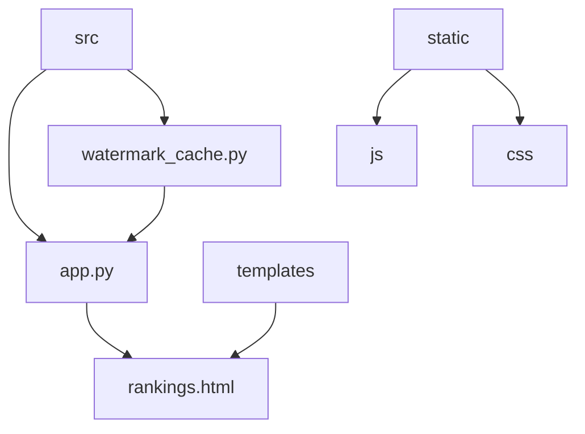
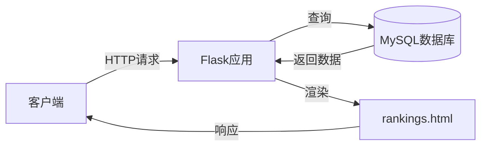
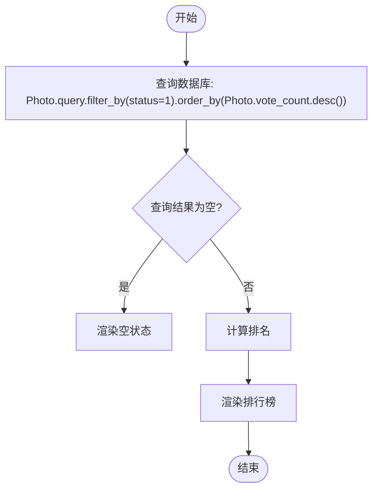
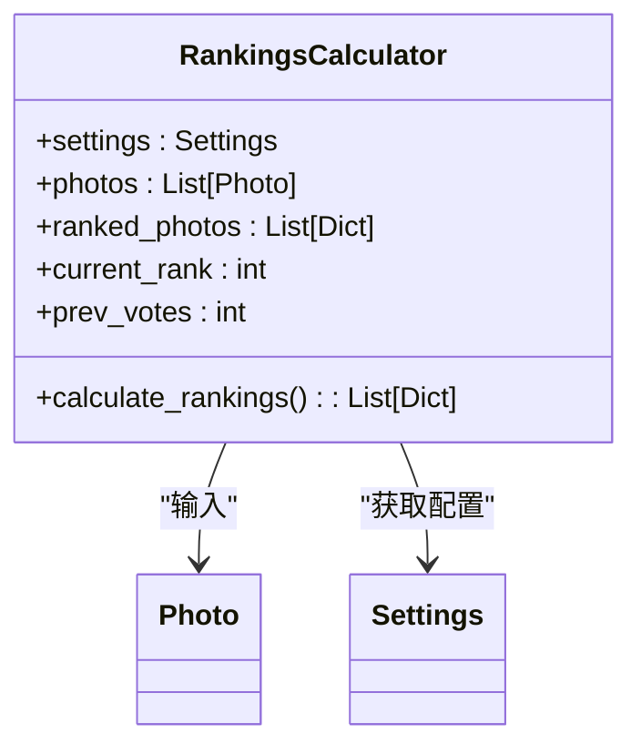
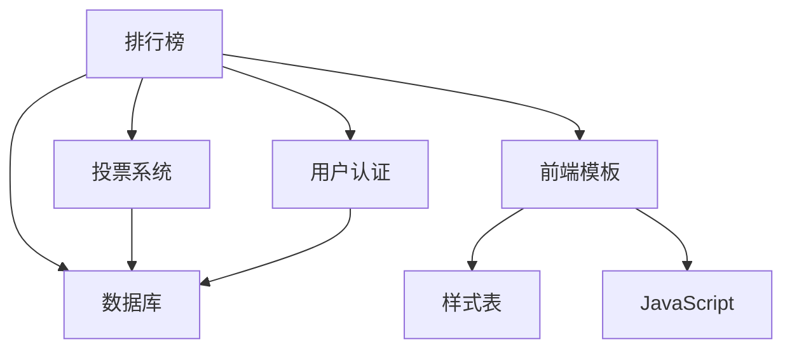

# 排行榜算法扩展

<cite>
**本文档引用的文件**  
- [app.py](file://src/app.py)
- [rankings.html](file://templates/rankings.html)
- [watermark_cache.py](file://src/watermark_cache.py)
</cite>

## 目录
1. [简介](#简介)
2. [项目结构](#项目结构)
3. [核心组件](#核心组件)
4. [架构概述](#架构概述)
5. [详细组件分析](#详细组件分析)
6. [依赖分析](#依赖分析)
7. [性能考虑](#性能考虑)
8. [故障排除指南](#故障排除指南)
9. [结论](#结论)

## 简介
本文档详细解析 `app.py` 中排行榜计算逻辑的实现方式，涵盖数据查询、排序规则、分页处理及缓存策略。同时说明如何扩展自定义排序算法（如加权评分、时间衰减因子、地域权重）或支持多维度榜单（周榜、月榜、总榜）。提供性能优化建议，包括数据库索引使用、异步计算任务（结合 Celery 或 APScheduler）和 Redis 缓存更新机制。强调算法变更时的数据一致性保障，避免因频繁计算导致数据库压力过大。最后给出测试新算法的影子模式（Shadow Mode）实施方案，确保线上平稳过渡。

## 项目结构
本项目采用典型的 Flask Web 应用结构，主要分为 `src` 源码目录、`templates` 模板目录和 `static` 静态资源目录。排行榜功能的核心逻辑位于 `src/app.py`，前端展示由 `templates/rankings.html` 负责。`src/watermark_cache.py` 提供了可选的水印缓存优化模块。



**图示来源**  
- [app.py](file://src/app.py)
- [rankings.html](file://templates/rankings.html)
- [watermark_cache.py](file://src/watermark_cache.py)

**本节来源**  
- [app.py](file://src/app.py)
- [rankings.html](file://templates/rankings.html)

## 核心组件
排行榜功能的核心组件包括：
- **数据模型**：`Photo` 模型中的 `vote_count` 字段用于存储票数。
- **排序逻辑**：在 `app.py` 的 `/rankings` 路由中实现，按 `vote_count` 降序排列。
- **排名计算**：处理并列情况，相同票数的作品共享同一排名。
- **前端展示**：`rankings.html` 模板负责渲染排行榜页面，包含样式和交互逻辑。

**本节来源**  
- [app.py](file://src/app.py#L800-L850)
- [rankings.html](file://templates/rankings.html)

## 架构概述
系统采用 MVC 架构模式，Flask 作为 Web 框架处理 HTTP 请求，SQLAlchemy 作为 ORM 层与 MySQL 数据库交互。排行榜功能通过 `/rankings` 路由触发，后端查询数据库获取数据并计算排名，最终将结果传递给前端模板进行渲染。



**图示来源**  
- [app.py](file://src/app.py)
- [rankings.html](file://templates/rankings.html)

## 详细组件分析

### 排行榜计算逻辑分析
排行榜计算逻辑在 `app.py` 的 `/rankings` 路由中实现，主要包括数据查询、排序、排名计算和前端渲染。

#### 数据查询与排序
系统通过 SQLAlchemy 查询所有状态为“已通过”的照片，并按票数降序排列。



**图示来源**  
- [app.py](file://src/app.py#L805-L820)

#### 排名计算算法
排名计算采用并列处理机制，相同票数的作品共享同一排名，后续排名跳过相应数量。



**图示来源**  
- [app.py](file://src/app.py#L822-L840)

### 自定义排序算法扩展
为支持更复杂的排序需求，可扩展以下算法：

#### 加权评分算法
可引入作品质量评分、用户活跃度等因子，构建加权评分公式。

```python
# 示例：加权评分 = 票数 * 0.6 + 质量评分 * 0.3 + 活跃度 * 0.1
weighted_score = vote_count * 0.6 + quality_score * 0.3 + activity_score * 0.1
```

#### 时间衰减因子
为防止早期作品长期占据榜首，可引入时间衰减函数。

```python
# 示例：指数衰减
import datetime
def decay_factor(created_at, half_life_days=7):
    age_days = (datetime.datetime.now() - created_at).days
    return 0.5 ** (age_days / half_life_days)
```

#### 地域权重
可根据用户地域分布调整权重，促进区域均衡。

```python
# 示例：地域权重表
region_weights = {"华北": 1.0, "华东": 1.0, "华南": 0.9, "西部": 1.2}
final_score = base_score * region_weights[user_region]
```

**本节来源**  
- [app.py](file://src/app.py#L800-L850)

### 多维度榜单支持
可通过添加时间维度字段和查询参数支持周榜、月榜、总榜。

```mermaid
erDiagram
PHOTO {
int id PK
string title
int vote_count
datetime created_at
}
VOTE {
int id PK
int photo_id FK
datetime created_at
}
PHOTO ||--o{ VOTE : "包含"
class VOTE {
<<Fact Table>>
}
class PHOTO {
<<Dimension Table>>
}
```

**图示来源**  
- [app.py](file://src/app.py)

## 依赖分析
排行榜功能依赖于多个核心模块，包括用户认证、投票系统、数据库访问和前端模板。



**图示来源**  
- [app.py](file://src/app.py)
- [rankings.html](file://templates/rankings.html)

**本节来源**  
- [app.py](file://src/app.py)
- [rankings.html](file://templates/rankings.html)

## 性能考虑
### 数据库优化
- **索引优化**：为 `Photo.vote_count` 和 `Photo.status` 字段创建复合索引。
- **查询优化**：使用 `LIMIT` 和 `OFFSET` 实现分页，避免一次性加载大量数据。

### 缓存策略
- **Redis 缓存**：将排行榜结果缓存至 Redis，设置合理过期时间。
- **缓存更新**：在投票操作后通过消息队列异步更新缓存。

### 异步计算
- **Celery 任务**：将复杂的排名计算任务放入 Celery 队列，避免阻塞主线程。
- **APScheduler**：定时任务重新计算排行榜，降低实时计算压力。

### 数据一致性保障
- **双写一致性**：在更新数据库后，通过事务或消息队列确保缓存同步。
- **影子模式**：新算法上线前，同时运行新旧两套算法，对比结果一致性。

**本节来源**  
- [app.py](file://src/app.py)
- [watermark_cache.py](file://src/watermark_cache.py)

## 故障排除指南
### 常见问题
- **排行榜不更新**：检查缓存是否过期，确认投票事件是否触发缓存更新。
- **排名错误**：验证并列处理逻辑，检查数据库查询排序是否正确。
- **性能下降**：监控数据库查询性能，检查是否缺少必要索引。

### 调试方法
- **日志分析**：查看应用日志，定位排行榜计算过程中的异常。
- **性能分析**：使用 Flask-Profiler 等工具分析请求耗时。
- **缓存检查**：直接查询 Redis 缓存内容，验证数据正确性。

**本节来源**  
- [app.py](file://src/app.py)
- [watermark_cache.py](file://src/watermark_cache.py)

## 结论
当前排行榜实现基于简单票数排序，具备良好的可扩展性。通过引入加权评分、时间衰减等算法，可提升榜单的公平性和动态性。结合 Redis 缓存和异步任务，能有效降低数据库压力，提高系统性能。建议采用影子模式逐步上线新算法，确保线上服务稳定可靠。