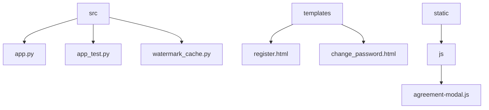
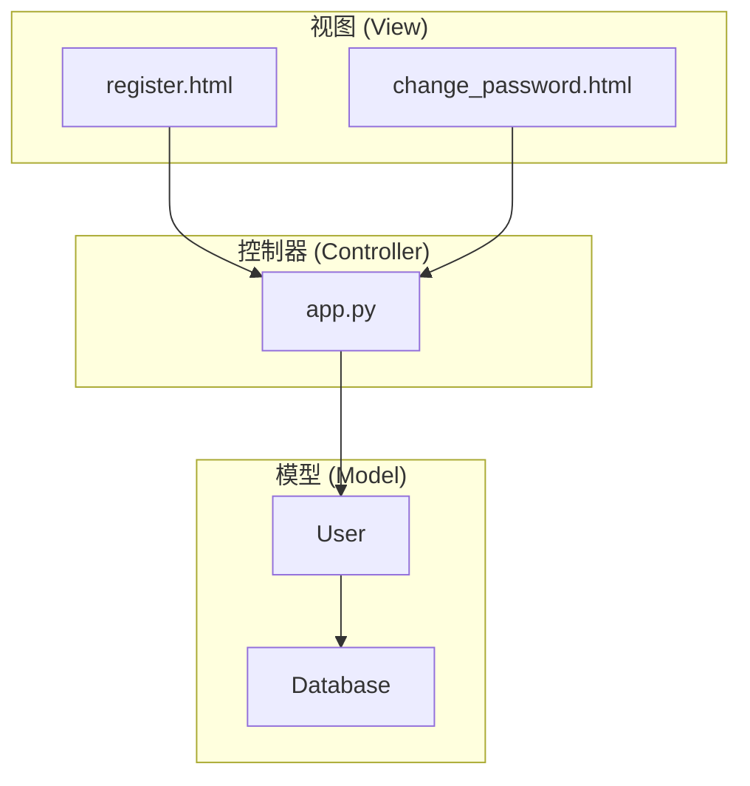
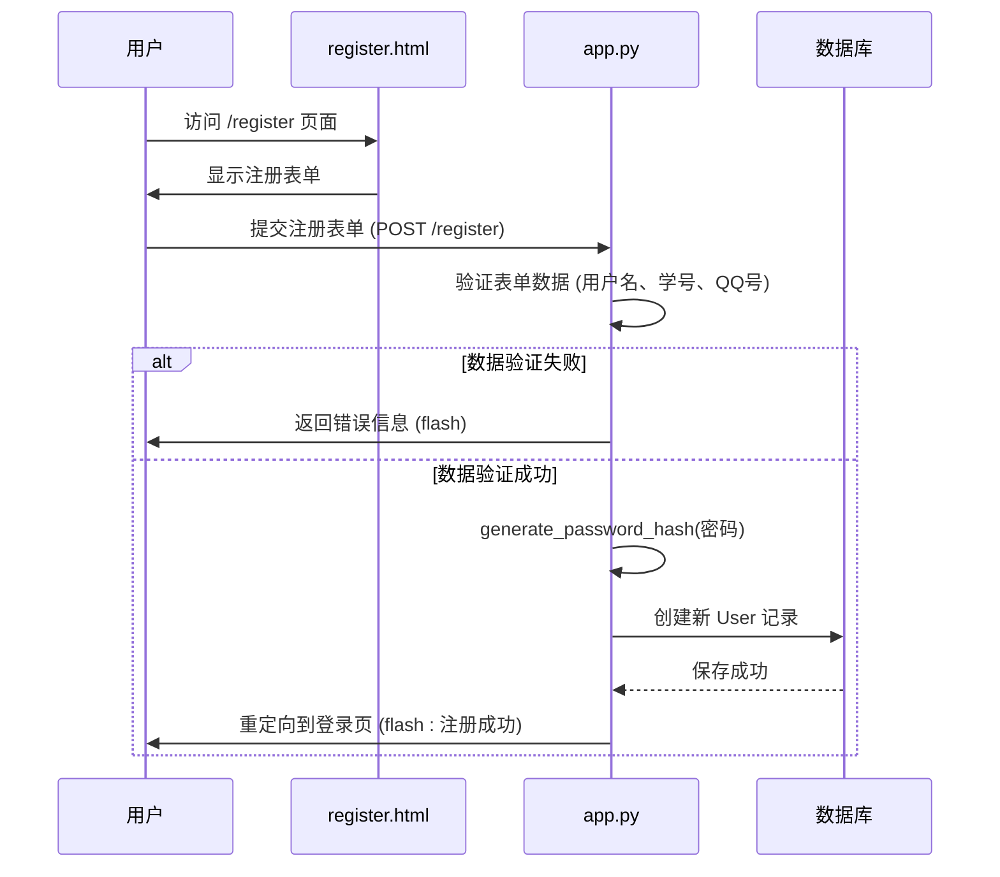
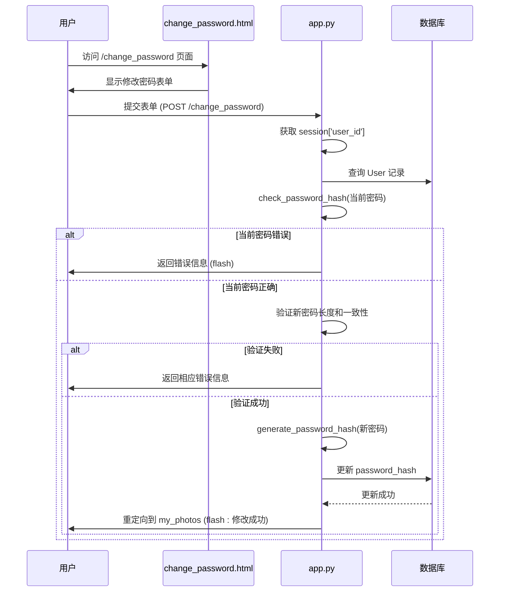
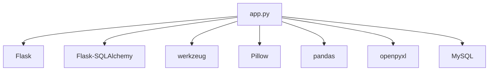

# 注册流程与密码策略扩展

<cite>
**本文档引用文件**  
- [app.py](file://src/app.py)
- [register.html](file://templates/register.html)
- [change_password.html](file://templates/change_password.html)
</cite>

## 目录
1. [简介](#简介)
2. [项目结构](#项目结构)
3. [核心组件](#核心组件)
4. [架构概述](#架构概述)
5. [详细组件分析](#详细组件分析)
6. [依赖分析](#依赖分析)
7. [性能考虑](#性能考虑)
8. [故障排除指南](#故障排除指南)
9. [结论](#结论)
10. [附录](#附录)（如有必要）

## 简介
本文档深入分析了基于 Flask 框架的用户注册与密码修改功能实现机制。重点解析了表单验证、密码哈希存储、敏感操作日志审计、CSRF 防护等安全实践。同时，探讨了如何在不破坏现有登录流程的前提下，安全地扩展注册字段、集成第三方认证及强化密码策略。文档提供了符合 Flask-Werkzeug 安全规范的扩展建议，并指出了常见安全漏洞及其防御手段。

## 项目结构
本项目采用典型的 Flask 应用结构，核心逻辑集中在 `src/app.py` 文件中。用户界面模板位于 `templates` 目录下，静态资源（如 JavaScript）位于 `static` 目录。应用通过 SQLAlchemy 与 MySQL 数据库交互，实现了用户管理、照片上传、投票和后台管理等功能。



**图源**  
- [app.py](file://src/app.py#L1-L1903)
- [register.html](file://templates/register.html#L1-L284)
- [change_password.html](file://templates/change_password.html#L1-L407)

**节源**
- [app.py](file://src/app.py#L1-L1903)
- [templates](file://templates)

## 核心组件
系统的核心是 `User` 模型，它定义了用户的身份信息和权限。注册与密码修改功能围绕该模型展开，通过 `register` 和 `change_password` 路由处理用户请求。密码安全通过 `werkzeug.security` 模块的 `generate_password_hash` 和 `check_password_hash` 函数保障。前端模板实现了用户交互界面，并包含客户端验证和安全防护脚本。

**节源**
- [app.py](file://src/app.py#L45-L59)
- [app.py](file://src/app.py#L200-L240)
- [app.py](file://src/app.py#L242-L280)

## 架构概述
系统采用 MVC（模型-视图-控制器）模式。`User` 模型负责数据持久化；`app.py` 中的路由函数作为控制器，处理业务逻辑；`templates` 目录下的 HTML 文件作为视图，负责呈现用户界面。用户注册和密码修改流程严格遵循安全最佳实践，包括服务端验证、密码哈希和会话管理。



**图源**  
- [app.py](file://src/app.py#L45-L59)
- [register.html](file://templates/register.html#L1-L284)
- [change_password.html](file://templates/change_password.html#L1-L407)

## 详细组件分析

### 用户注册功能分析
用户注册功能通过 `/register` 路由实现。用户提交表单后，后端会进行一系列验证，包括检查用户名（真实姓名）是否唯一、校学号是否为纯数字且不重复、QQ号是否为5-15位数字等。所有密码在存储前都会使用 `generate_password_hash` 进行哈希处理，确保即使数据库泄露，原始密码也无法被轻易还原。

#### 注册流程序列图


**图源**  
- [app.py](file://src/app.py#L200-L240)
- [register.html](file://templates/register.html#L1-L284)

**节源**
- [app.py](file://src/app.py#L200-L240)
- [register.html](file://templates/register.html#L1-L284)

### 密码修改功能分析
密码修改功能通过 `/change_password` 路由实现，受 `@login_required` 装饰器保护，确保只有登录用户才能访问。流程包括：验证当前密码、检查新密码长度（至少6位）、确认新密码与确认密码一致、检查新密码是否与当前密码不同。所有验证通过后，使用新的哈希值更新 `password_hash` 字段。

#### 密码修改流程序列图


**图源**  
- [app.py](file://src/app.py#L242-L280)
- [change_password.html](file://templates/change_password.html#L1-L407)

**节源**
- [app.py](file://src/app.py#L242-L280)
- [change_password.html](file://templates/change_password.html#L1-L407)

### 安全特性分析
系统实现了多层安全防护。后端通过 `@login_required` 等装饰器实现权限控制。密码存储使用安全的哈希算法。前端模板包含 JavaScript 脚本，用于禁用右键菜单、开发者工具快捷键和文本选择，以防止信息泄露。此外，系统还记录了登录日志 (`LoginRecord`)，可用于审计。

```mermaid
flowchart TD
A[安全特性] --> B[后端安全]
A --> C[前端安全]
A --> D[数据安全]
B --> B1[路由装饰器 (login_required)]
B --> B2[服务端表单验证]
B --> B3[密码哈希 (generate_password_hash)]
B --> B4[会话管理 (session)]
C --> C1[禁用右键菜单]
C --> C2[禁用F12/DevTools快捷键]
C --> C3[禁用文本选择]
C --> C4[检测开发者工具]
D --> D1[SQLAlchemy ORM]
D --> D2[登录记录 (LoginRecord)]
D --> D3[用户状态 (is_active)]
```

**图源**  
- [app.py](file://src/app.py#L70-L100)
- [app.py](file://src/app.py#L45-L59)
- [register.html](file://templates/register.html#L200-L280)
- [change_password.html](file://templates/change_password.html#L300-L400)

**节源**
- [app.py](file://src/app.py#L70-L100)
- [app.py](file://src/app.py#L45-L59)
- [register.html](file://templates/register.html#L200-L280)
- [change_password.html](file://templates/change_password.html#L300-L400)

## 依赖分析
应用的核心依赖是 Flask 和 Flask-SQLAlchemy，用于构建 Web 服务和数据库操作。`werkzeug.security` 提供了密码哈希功能。Pillow (PIL) 用于图片处理和水印添加。`pandas` 和 `openpyxl` 用于导出 Excel 功能。这些依赖通过 `pyproject.toml` 文件管理。



**图源**  
- [app.py](file://src/app.py#L1-L50)
- [pyproject.toml](file://pyproject.toml#L1-L20)

**节源**
- [app.py](file://src/app.py#L1-L50)
- [pyproject.toml](file://pyproject.toml#L1-L20)

## 性能考虑
对于注册和密码修改这类低频操作，性能通常不是瓶颈。主要开销在于数据库的读写操作。使用 SQLAlchemy ORM 可以有效管理数据库连接。密码哈希（如 pbkdf2:sha256）本身是计算密集型的，这有助于抵御暴力破解，但应避免在高并发场景下成为性能瓶颈。建议在生产环境中监控相关路由的响应时间。

## 故障排除指南
- **问题：注册时提示“真实姓名已存在”**  
  **原因**：`real_name` 字段在 `User` 表中具有唯一性约束。  
  **解决**：提示用户使用不同的真实姓名。

- **问题：修改密码时提示“当前密码错误”**  
  **原因**：输入的当前密码与数据库中存储的哈希值不匹配。  
  **解决**：确保用户输入正确的当前密码。

- **问题：无法访问修改密码页面**  
  **原因**：`@login_required` 装饰器拦截了未登录用户的请求。  
  **解决**：确保用户已登录，或检查会话是否过期。

- **问题：前端防护脚本导致正常用户操作受限**  
  **原因**：JavaScript 脚本禁用了部分浏览器功能。  
  **解决**：评估安全需求与用户体验的平衡，可考虑为管理员用户放宽限制。

**节源**
- [app.py](file://src/app.py#L200-L240)
- [app.py](file://src/app.py#L242-L280)
- [register.html](file://templates/register.html#L200-L280)
- [change_password.html](file://templates/change_password.html#L300-L400)

## 结论
该应用的用户注册与密码修改功能实现了基本的安全保障，包括服务端验证、密码哈希和权限控制。通过分析其代码结构，可以安全地进行功能扩展。未来可考虑引入更复杂的密码策略、第三方认证和更完善的日志审计系统，以进一步提升应用的安全性。