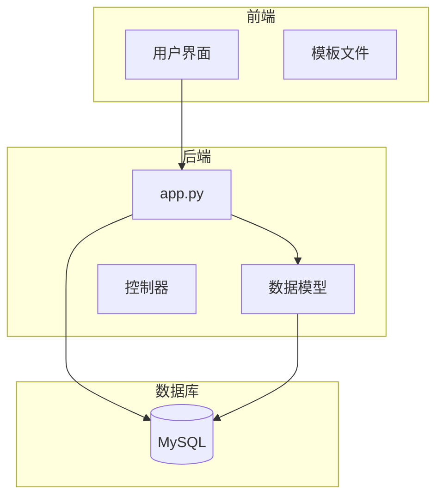
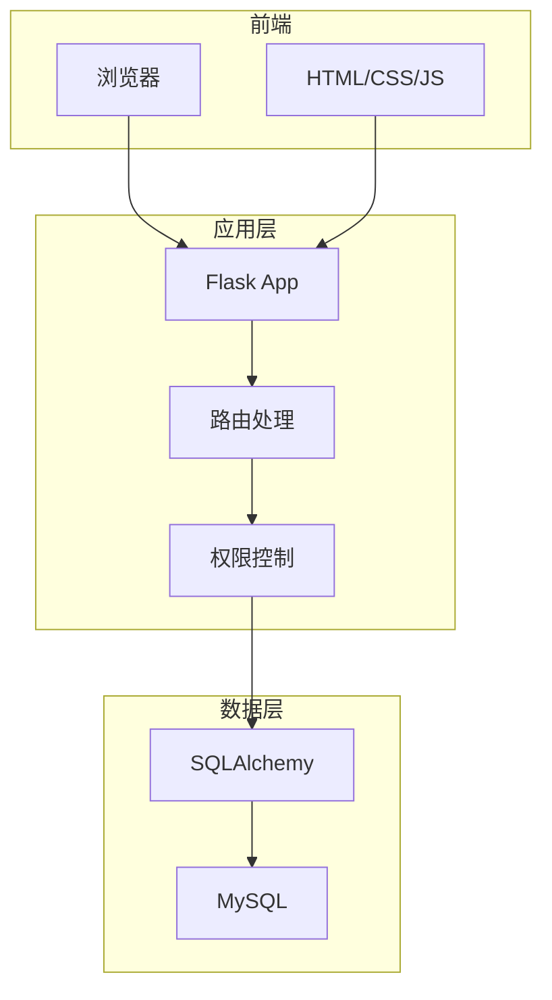
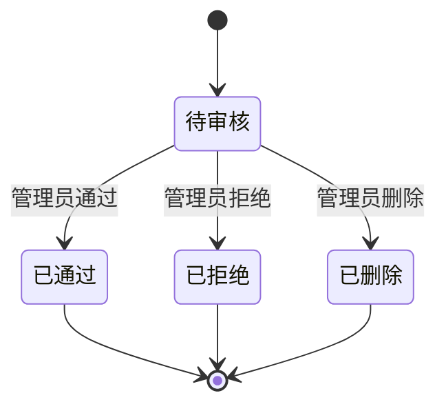
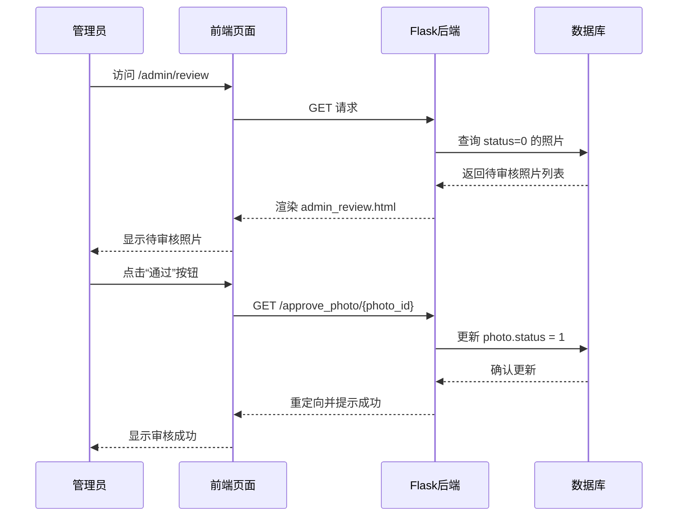
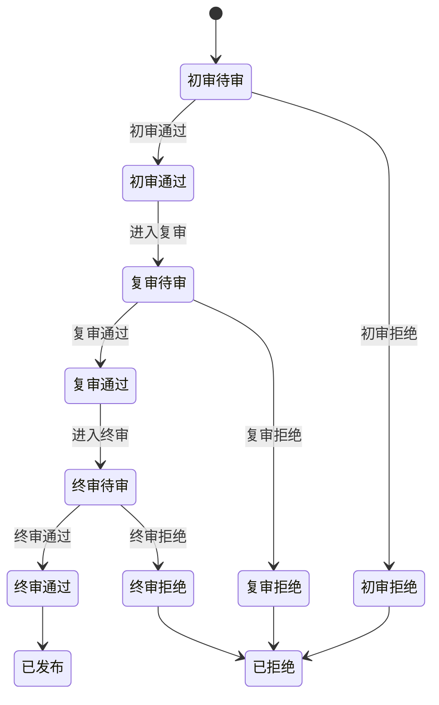
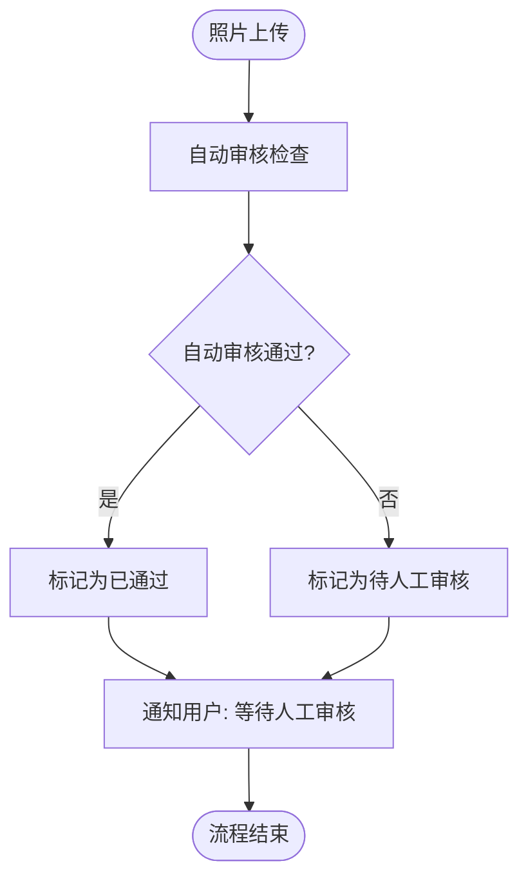
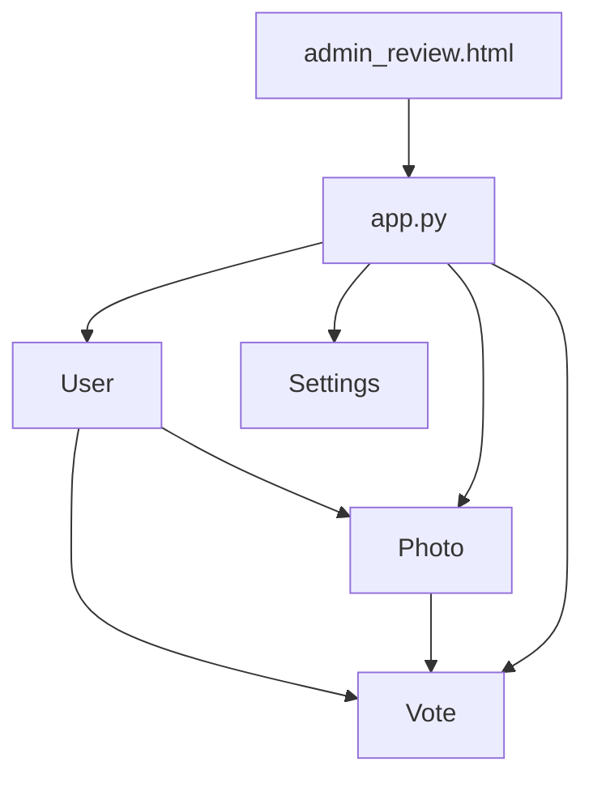

# 照片审核流程扩展

<cite>
**本文档引用的文件**  
- [app.py](file://src/app.py)
- [admin_review.html](file://templates/admin_review.html)
</cite>

## 目录
1. [引言](#引言)
2. [项目结构](#项目结构)
3. [核心组件](#核心组件)
4. [架构概述](#架构概述)
5. [详细组件分析](#详细组件分析)
6. [依赖分析](#依赖分析)
7. [性能考虑](#性能考虑)
8. [故障排除指南](#故障排除指南)
9. [结论](#结论)
10. [附录](#附录)（如有必要）

## 引言
本文档全面解析基于Flask的摄影比赛系统中照片上传与审核流程的实现逻辑。重点分析管理员审核接口、状态变更机制及通知反馈路径，探讨如何在现有MVC架构下安全扩展多级审核流程或引入自动审核规则。文档提供数据库Schema变更建议、审核日志记录规范以及与用户通知系统的集成方式，并指出流程扩展时可能出现的状态不一致、审核遗漏等问题及其防范措施。

## 项目结构
本项目采用典型的Flask MVC架构，核心逻辑集中在`src/app.py`中，模板文件位于`templates/`目录，静态资源存放在`static/`目录。系统实现了用户管理、照片上传、投票、审核、协议管理、IP风控等完整功能模块。



**图示来源**
- [app.py](file://src/app.py#L1-L1902)
- [admin_review.html](file://templates/admin_review.html#L1-L294)

**本节来源**
- [app.py](file://src/app.py#L1-L1902)
- [admin_review.html](file://templates/admin_review.html#L1-L294)

## 核心组件
系统的核心组件包括用户（User）、照片（Photo）、投票（Vote）和设置（Settings）等数据模型。其中，照片审核流程的核心是`Photo`模型的状态字段（status），其值为0（待审核）、1（已通过）、2（已拒绝）。审核逻辑由管理员通过`/admin/review`页面触发，调用`/approve_photo/<int:photo_id>`和`/reject_photo/<int:photo_id>`接口完成状态变更。

**本节来源**
- [app.py](file://src/app.py#L61-L74)
- [app.py](file://src/app.py#L1080-L1110)

## 架构概述
系统采用分层架构，前端通过Jinja2模板渲染，后端使用Flask框架处理HTTP请求，通过SQLAlchemy与MySQL数据库交互。业务逻辑集中在`app.py`的路由函数中，权限控制通过装饰器（如`@admin_required`）实现。照片上传后进入待审核状态，管理员通过专用页面进行审核操作，审核通过后照片才对公众可见。



**图示来源**
- [app.py](file://src/app.py#L1-L1902)

## 详细组件分析

### 照片审核流程分析
照片审核流程从用户上传开始，经由管理员审核，最终决定是否公开。该流程确保了内容的质量和合规性。

#### 状态机与审核逻辑


**图示来源**
- [app.py](file://src/app.py#L61-L74)
- [app.py](file://src/app.py#L1080-L1110)

#### 审核接口与控制流


**图示来源**
- [app.py](file://src/app.py#L1080-L1110)
- [admin_review.html](file://templates/admin_review.html#L1-L294)

**本节来源**
- [app.py](file://src/app.py#L1080-L1110)
- [admin_review.html](file://templates/admin_review.html#L1-L294)

### 扩展多级审核流程
为支持初审、复审、终审等多级审核流程，需对现有状态机进行扩展。

#### 数据库Schema变更建议
建议将`Photo`模型的`status`字段从整数扩展为更丰富的状态码，或引入新的`review_stage`字段来表示当前审核阶段。

```sql
-- 建议的Schema变更
ALTER TABLE photo 
ADD COLUMN review_stage INT DEFAULT 1, -- 1=初审, 2=复审, 3=终审
ADD COLUMN current_reviewer_id INT,    -- 当前审核人
ADD COLUMN review_history TEXT;        -- 审核历史记录
```

#### 状态机转换逻辑修改


**图示来源**
- [app.py](file://src/app.py#L61-L74)

#### 安全添加审核节点
在现有MVC架构下，应通过以下方式安全添加审核节点：
1. **后端控制器集中业务逻辑**：所有审核状态变更必须通过后端API接口，避免前端直接暴露敏感状态。
2. **权限分级**：利用现有的`role`字段（1=普通用户, 2=普通管理员, 3=系统管理员），为不同级别的审核员分配不同角色。
3. **引入审核工作流服务**：创建新的服务类（如`ReviewService`）来封装复杂的审核逻辑，保持控制器的简洁。

**本节来源**
- [app.py](file://src/app.py#L61-L74)
- [app.py](file://src/app.py#L1080-L1110)

### 引入自动审核规则
系统可扩展以支持基于图像特征或元数据的自动审核规则。

#### 自动审核实现路径
1. **图像特征分析**：集成图像识别API（如Google Vision、阿里云内容安全），在上传时自动分析图片内容。
2. **元数据检查**：检查EXIF信息，如拍摄时间、设备型号等，作为审核依据。
3. **触发时机**：在`/upload`接口中，照片保存后立即触发自动审核流程。

#### 与用户通知系统集成
审核结果（无论是人工还是自动）应通过以下方式通知用户：
1. **站内消息**：在用户登录后显示审核结果通知。
2. **邮件通知**：若系统集成邮件服务，可发送邮件通知。
3. **审核日志记录**：在数据库中记录每次审核操作，包括操作人、时间、结果和备注。



**图示来源**
- [app.py](file://src/app.py#L850-L899)
- [app.py](file://src/app.py#L1080-L1110)

**本节来源**
- [app.py](file://src/app.py#L850-L899)
- [app.py](file://src/app.py#L1080-L1110)

## 依赖分析
系统各组件间存在明确的依赖关系。`Photo`模型依赖于`User`模型（外键关联），审核流程依赖于管理员角色（`role >= 2`）。前端模板`admin_review.html`直接依赖后端提供的`pending_photos`数据。



**图示来源**
- [app.py](file://src/app.py#L61-L74)
- [app.py](file://src/app.py#L1080-L1110)

**本节来源**
- [app.py](file://src/app.py#L61-L74)
- [app.py](file://src/app.py#L1080-L1110)

## 性能考虑
- **数据库查询**：`/admin/review`页面查询所有待审核照片，数据量大时应考虑分页。
- **文件操作**：审核通过的照片在`/image/<int:photo_id>`路由中动态添加水印，可能成为性能瓶颈，建议预生成带水印图片。
- **并发控制**：多个管理员同时审核同一照片时，需考虑数据库事务的隔离性，防止状态不一致。

## 故障排除指南
### 常见问题及解决方案
1. **问题**：照片审核后前端未更新。
   **原因**：浏览器缓存或状态未正确刷新。
   **解决方案**：强制刷新页面，检查后端返回的重定向是否正确。

2. **问题**：管理员无法访问审核页面。
   **原因**：权限不足或会话过期。
   **解决方案**：检查用户`role`值是否>=2，重新登录。

3. **问题**：状态不一致或审核遗漏。
   **原因**：多级审核流程中状态转换逻辑不完整。
   **防范措施**：引入审核历史表，记录每一步操作；使用数据库事务确保状态变更的原子性。

**本节来源**
- [app.py](file://src/app.py#L1080-L1110)
- [app.py](file://src/app.py#L1-L1902)

## 结论
当前照片审核流程设计简洁有效，通过扩展状态机、引入审核阶段字段和审核历史记录，可轻松支持多级审核流程。业务逻辑已集中在后端控制器，符合安全要求。建议在扩展时，重点关注状态转换的完整性和审核日志的可追溯性，以防范状态不一致和审核遗漏等风险。