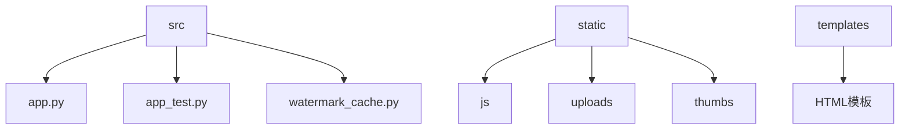
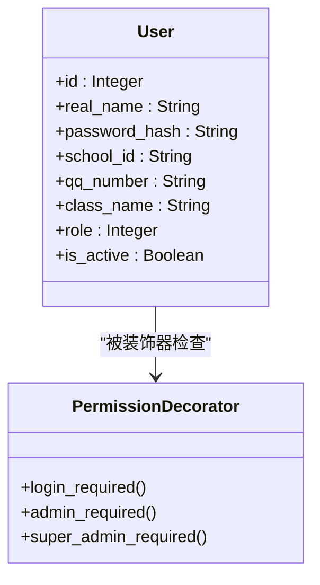
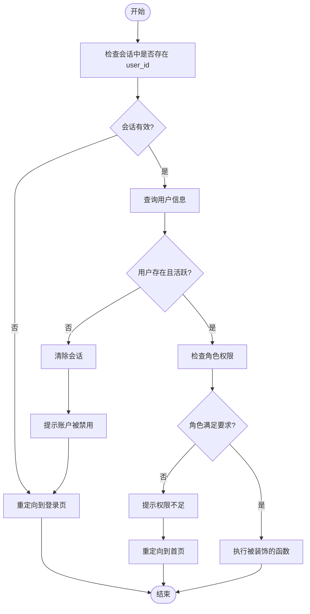

# 用户角色与权限扩展

<cite>
**本文档引用的文件**  
- [app.py](file://src/app.py#L0-L1903)
</cite>

## 目录
1. [引言](#引言)
2. [项目结构](#项目结构)
3. [核心组件](#核心组件)
4. [权限体系架构概述](#权限体系架构概述)
5. [详细组件分析](#详细组件分析)
6. [依赖关系分析](#依赖关系分析)
7. [性能考虑](#性能考虑)
8. [故障排除指南](#故障排除指南)
9. [结论](#结论)

## 引言
本项目是一个基于 Flask 的摄影比赛管理系统，支持用户注册、登录、上传作品、投票、管理员审核等功能。系统具备完整的用户角色权限控制机制，当前包含普通用户、管理员和系统管理员三类角色。本文档重点解析现有权限体系的实现机制，并提出可扩展的角色权限设计方案，以支持新增如评审员、内容审核员等自定义角色，同时遵循最小权限原则，提升系统的安全性和可维护性。

## 项目结构
项目采用典型的 Flask 应用结构，核心逻辑集中在 `src/app.py` 文件中。静态资源（JS、图片）存放在 `static` 目录，前端模板存放在 `templates` 目录。数据库模型、业务逻辑、权限控制、路由处理均在单一的 `app.py` 文件中实现，属于单文件应用架构。



**Diagram sources**
- [app.py](file://src/app.py#L0-L1903)

**Section sources**
- [app.py](file://src/app.py#L0-L1903)

## 核心组件
系统的核心组件包括用户（User）、照片（Photo）、投票（Vote）、登录记录（LoginRecord）、协议（Agreement）等数据库模型，以及 `login_required`、`admin_required`、`super_admin_required` 三个权限装饰器。这些装饰器是权限控制的核心，通过检查用户会话中的角色信息来决定是否允许访问特定路由。

**Section sources**
- [app.py](file://src/app.py#L100-L200)
- [app.py](file://src/app.py#L250-L350)

## 权限体系架构概述
当前权限体系基于用户模型中的 `role` 字段（整数类型）实现，1 代表普通用户，2 代表普通管理员，3 代表系统管理员。权限控制通过装饰器模式实现，`@login_required` 确保用户已登录，`@admin_required` 和 `@super_admin_required` 在登录基础上检查角色等级。该设计简单直接，但存在硬编码角色判断、角色扩展性差、权限粒度粗等问题。



**Diagram sources**
- [app.py](file://src/app.py#L100-L150)
- [app.py](file://src/app.py#L250-L350)

## 详细组件分析

### 权限装饰器分析
现有权限装饰器通过硬编码的整数比较来判断角色权限，例如 `user.role < 2`。这种方式虽然简单，但严重违反了开闭原则，新增角色需要修改所有相关装饰器代码，极易出错且难以维护。

#### 权限装饰器实现逻辑


**Diagram sources**
- [app.py](file://src/app.py#L250-L350)

**Section sources**
- [app.py](file://src/app.py#L250-L350)

### 可扩展权限设计模式
为解决现有设计的缺陷，建议重构权限体系，引入基于配置的细粒度权限管理。

#### 重构建议：引入权限常量和配置
应避免在代码中直接使用数字 1、2、3 表示角色。建议在 `app.py` 顶部定义清晰的常量：

```python
# 角色常量定义
ROLE_USER = 1
ROLE_ADMIN = 2
ROLE_SUPER_ADMIN = 3

# 新增角色
ROLE_REVIEWER = 4      # 评审员
ROLE_MODERATOR = 5     # 内容审核员

# 权限常量定义
PERMISSION_VIEW_ADMIN_PANEL = 'view_admin_panel'
PERMISSION_APPROVE_PHOTO = 'approve_photo'
PERMISSION_MANAGE_USERS = 'manage_users'
PERMISSION_MANAGE_SETTINGS = 'manage_settings'
```

#### 重构建议：基于权限的装饰器
创建新的装饰器 `@permission_required(permission)`，不再依赖角色等级，而是检查用户是否拥有特定权限。

```python
def permission_required(required_permission):
    def decorator(f):
        @wraps(f)
        def decorated_function(*args, **kwargs):
            if 'user_id' not in session:
                return redirect(url_for('login'))
            
            user = User.query.get(session['user_id'])
            if not user or not user.is_active:
                session.clear()
                flash('账户已被禁用，请联系管理员')
                return redirect(url_for('login'))
            
            # 检查用户是否拥有所需权限
            if not has_permission(user, required_permission):
                flash('权限不足')
                return redirect(url_for('index'))
            
            return f(*args, **kwargs)
        return decorated_function
    return decorator
```

#### 重构建议：配置化角色权限映射
将角色与权限的映射关系从代码中剥离，通过配置文件或数据库表进行管理，极大提升可维护性。

```python
# 角色权限映射表（可存储在数据库或配置文件中）
ROLE_PERMISSIONS = {
    ROLE_USER: [
        # 普通用户权限
    ],
    ROLE_ADMIN: [
        PERMISSION_VIEW_ADMIN_PANEL,
        PERMISSION_APPROVE_PHOTO,
        PERMISSION_MANAGE_USERS,
    ],
    ROLE_SUPER_ADMIN: [
        PERMISSION_VIEW_ADMIN_PANEL,
        PERMISSION_APPROVE_PHOTO,
        PERMISSION_MANAGE_USERS,
        PERMISSION_MANAGE_SETTINGS,
    ],
    ROLE_REVIEWER: [
        PERMISSION_VIEW_ADMIN_PANEL,
        PERMISSION_APPROVE_PHOTO,
    ],
    ROLE_MODERATOR: [
        PERMISSION_VIEW_ADMIN_PANEL,
        # 可添加内容审核相关权限
    ],
}

def has_permission(user, permission):
    """检查用户是否拥有指定权限"""
    user_role = user.role
    return permission in ROLE_PERMISSIONS.get(user_role, [])
```

**Section sources**
- [app.py](file://src/app.py#L250-L350)

## 依赖关系分析
权限系统的核心依赖是 `User` 模型和 Flask 的 `session`。`login_required` 装饰器是基础，`admin_required` 和 `super_admin_required` 依赖于前者并增加了角色检查。所有需要权限控制的路由（如 `/admin`、`/settings`）都直接依赖这些装饰器。数据库的 `role` 字段是权限判断的唯一数据来源。

```mermaid
graph TD
User[User Model] --> |提供 role 字段| PermissionDecorator
Session[Flask Session] --> |存储 user_id| PermissionDecorator
PermissionDecorator --> AdminRoute[/admin]
PermissionDecorator --> SettingsRoute[/settings]
PermissionDecorator --> ManageUsersRoute[/manage_users]
LoginRequired[login_required] --> AdminRequired[admin_required]
AdminRequired --> SuperAdminRequired[super_admin_required]
```

**Diagram sources**
- [app.py](file://src/app.py#L100-L150)
- [app.py](file://src/app.py#L250-L350)

**Section sources**
- [app.py](file://src/app.py#L250-L350)

## 性能考虑
当前权限检查的性能开销主要在于每次请求都需要查询数据库以获取用户信息。对于高并发场景，这可能成为瓶颈。建议引入缓存机制，例如使用 Redis 缓存用户角色信息，将每次请求的数据库查询减少为一次缓存查询。

## 故障排除指南
- **问题：用户登录后仍被重定向到登录页**
  - **原因**：`User` 模型的 `is_active` 字段为 `False`，或用户记录被删除。
  - **解决方案**：检查数据库中该用户的 `is_active` 状态，或确认用户是否存在。

- **问题：管理员无法访问管理页面**
  - **原因**：用户的 `role` 字段值不为 2 或 3。
  - **解决方案**：检查数据库中该用户的 `role` 值是否正确。

- **问题：新增角色后权限不生效**
  - **原因**：在硬编码的装饰器中未添加对该角色的支持。
  - **解决方案**：避免硬编码，采用基于配置的权限检查模型。

**Section sources**
- [app.py](file://src/app.py#L250-L350)
- [app.py](file://src/app.py#L100-L150)

## 结论
当前的用户权限体系实现了基本的访问控制，但存在硬编码、扩展性差等严重问题。为了安全地新增自定义角色（如评审员、内容审核员），必须对权限系统进行重构。核心建议是：1) 定义清晰的角色和权限常量；2) 将角色权限映射关系配置化；3) 实现基于权限而非角色等级的装饰器。这样既能遵循最小权限原则，又能通过修改配置而非代码来管理权限，显著提升系统的安全性和可维护性。同时，应处理好权限变更后的会话刷新问题，例如强制用户重新登录或在会话中更新权限缓存。