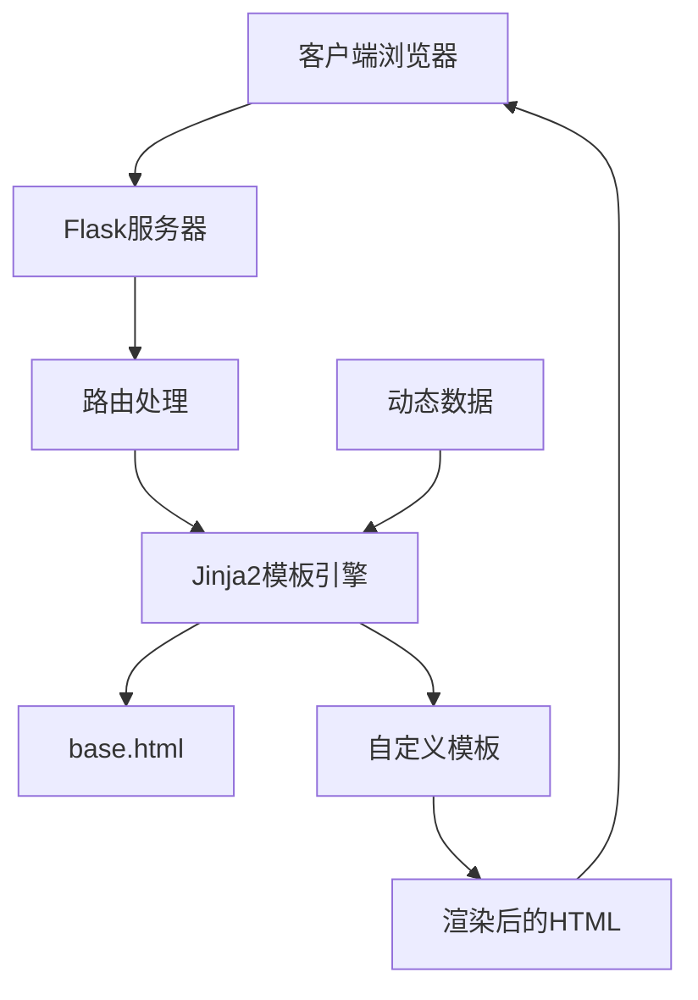
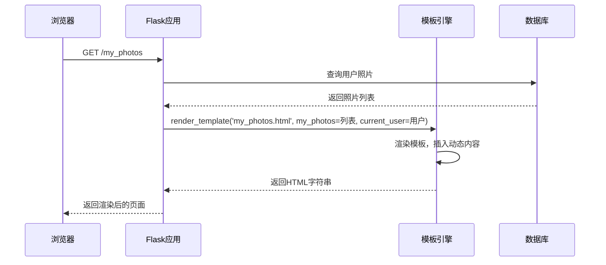
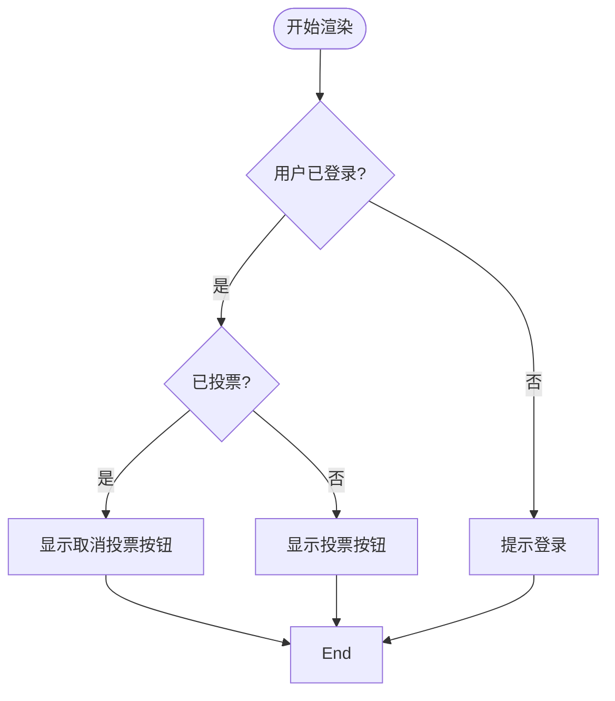

# 前端模板扩展

<cite>
**本文档引用的文件**  
- [app.py](file://src/app.py)
- [index.html](file://templates/index.html)
- [base.html](file://templates/base.html)
- [作品详情页.html](file://templates/作品详情页.html)
- [用户主页.html](file://templates/用户主页.html)
</cite>

## 目录
1. [简介](#简介)
2. [项目结构](#项目结构)
3. [核心组件](#核心组件)
4. [架构概览](#架构概览)
5. [详细组件分析](#详细组件分析)
6. [依赖分析](#依赖分析)
7. [性能考虑](#性能考虑)
8. [故障排除指南](#故障排除指南)
9. [结论](#结论)

## 简介
本文档旨在指导开发者如何基于现有的Jinja2模板系统扩展新的HTML页面。内容涵盖创建新模板文件（如作品详情页、用户主页），利用Jinja2的模板继承机制（如继承base.html）确保视觉风格统一，将新模板与Flask后端路由绑定以确保URL访问正常渲染，以及在现有模板中安全插入动态内容（如用户信息、投票状态）的方法。同时强调模板中的安全性实践，如自动转义防止XSS攻击，并结合项目中已有的templates目录结构，建议新模板的命名规范与目录组织方式。

## 项目结构

```mermaid
graph TD
A[templates] --> B[add_user.html]
A --> C[admin.html]
A --> D[admin_review.html]
A --> E[agreement_management.html]
A --> F[change_password.html]
A --> G[edit_agreement.html]
A --> H[index.html]
A --> I[ip_management.html]
A --> J[login.html]
A --> K[manage_users.html]
A --> L[my_photos.html]
A --> M[rankings.html]
A --> N[register.html]
A --> O[settings.html]
A --> P[upload.html]
A --> Q[view_agreement.html]
A --> R[whitelist_management.html]
```



**图示来源**  
- [templates](file://templates)

**本节来源**  
- [templates](file://templates)

## 核心组件

在本项目中，前端模板系统基于Flask与Jinja2构建，所有HTML页面均位于`templates`目录下。开发者可通过创建新的HTML模板文件并将其与Flask路由绑定来扩展前端页面。Jinja2支持模板继承（通过``）、变量插入（通过`{{ }}`）和控制结构（通过``），是实现页面复用和动态内容渲染的核心机制。

**本节来源**  
- [app.py](file://src/app.py#L0-L1903)
- [index.html](file://templates/index.html#L0-L1)

## 架构概览



**图示来源**  
- [app.py](file://src/app.py#L0-L1903)
- [base.html](file://templates/base.html)

## 详细组件分析

### 模板继承机制分析

Jinja2的模板继承机制允许开发者通过``继承基础模板，从而确保所有页面风格统一。基础模板通常包含HTML结构、CSS样式链接、导航栏、页脚等公共元素，并通过``定义可被子模板覆盖的内容区域。

```mermaid
classDiagram
class base_html {
+<!DOCTYPE html>
+<html lang="zh-cn">
+<head>...</head>
+<body>
+
+</body>
}
class 作品详情页_html {
+
+
+ <h1>作品详情</h1>
+ {{ photo.title }}
+
}
class 用户主页_html {
+
+
+ <h1>我的主页</h1>
+ {{ current_user.real_name }}
+
}
作品详情页_html --> base_html : "extends"
用户主页_html --> base_html : "extends"
```

**图示来源**  
- [base.html](file://templates/base.html)
- [作品详情页.html](file://templates/作品详情页.html)
- [用户主页.html](file://templates/用户主页.html)

**本节来源**  
- [base.html](file://templates/base.html)
- [作品详情页.html](file://templates/作品详情页.html)
- [用户主页.html](file://templates/用户主页.html)

### 动态内容插入示例

在模板中，可通过`{{ variable }}`插入动态数据，如用户信息、投票状态等。Flask视图函数通过`render_template()`传递上下文数据，Jinja2自动进行HTML转义以防止XSS攻击。



**图示来源**  
- [app.py](file://src/app.py#L1200-L1220)
- [my_photos.html](file://templates/my_photos.html)

**本节来源**  
- [app.py](file://src/app.py#L1200-L1220)
- [my_photos.html](file://templates/my_photos.html)

### 控制结构使用示例

Jinja2支持``、``等控制结构，用于条件渲染和循环输出。例如，在`index.html`中遍历照片列表并根据投票状态显示不同按钮。



**图示来源**  
- [index.html](file://templates/index.html)
- [app.py](file://src/app.py#L300-L350)

**本节来源**  
- [index.html](file://templates/index.html)
- [app.py](file://src/app.py#L300-L350)

## 依赖分析

```mermaid
graph LR
app.py --> Flask
app.py --> Jinja2
templates --> base.html
templates --> 子模板
子模板 --> base.html : 继承
app.py --> render_template : 渲染模板
```

**图示来源**  
- [app.py](file://src/app.py)
- [templates](file://templates)

**本节来源**  
- [app.py](file://src/app.py)
- [templates](file://templates)

## 性能考虑
Jinja2模板在首次加载时会被编译并缓存，后续请求直接使用缓存版本，因此对性能影响较小。建议避免在模板中执行复杂逻辑，尽量在视图函数中完成数据处理，仅在模板中进行展示逻辑。

## 故障排除指南

- **模板未找到**：检查文件是否位于`templates`目录下，路径是否正确。
- **变量未渲染**：确认视图函数中通过`render_template()`传递了对应变量。
- **继承无效**：检查``语法是否正确，基础模板是否存在。
- **XSS风险**：确保使用`{{ }}`而非`|safe`过滤器输出用户输入内容，除非明确信任。

**本节来源**  
- [app.py](file://src/app.py)
- [templates](file://templates)

## 结论
通过遵循Jinja2模板继承机制，开发者可高效扩展新页面并保持视觉一致性。结合Flask路由绑定与安全的动态内容插入，能够快速构建功能完整、安全可靠的前端界面。建议新模板命名清晰（如`作品详情页.html`），并合理组织目录结构以提升可维护性。