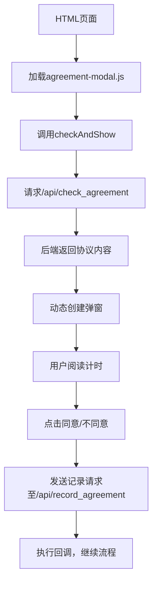
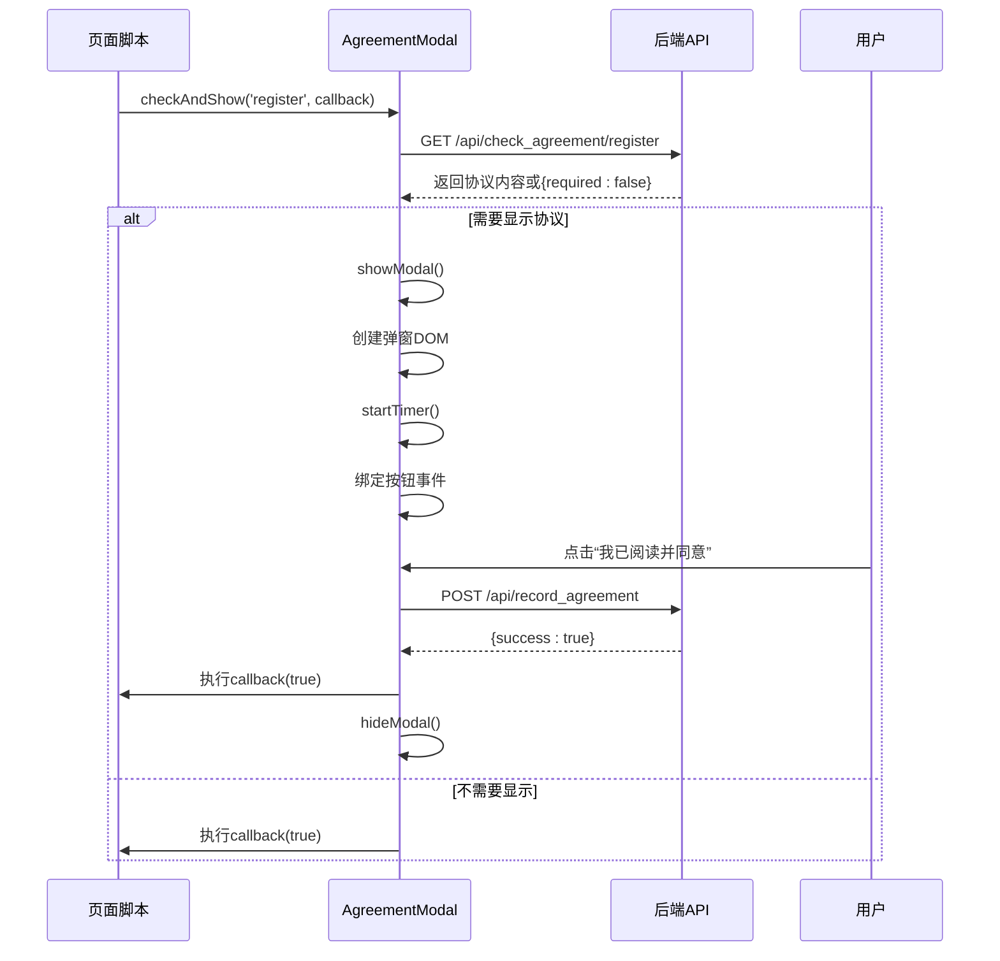
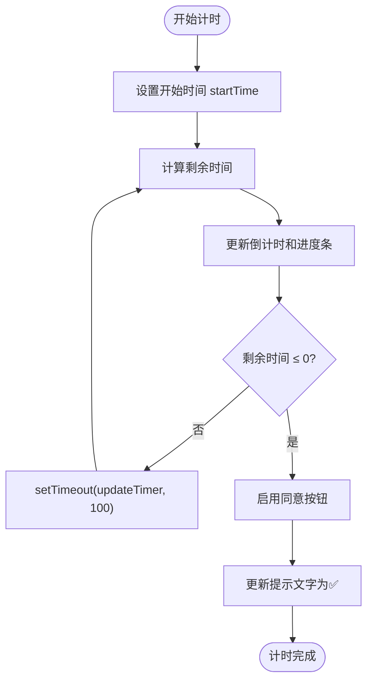

# 前端脚本扩展

<cite>
**本文档引用文件**  
- [agreement-modal.js](file://static/js/agreement-modal.js)
- [register.html](file://templates/register.html)
- [upload.html](file://templates/upload.html)
- [app.py](file://src/app.py)
</cite>

## 目录
1. [简介](#简介)
2. [项目结构](#项目结构)
3. [核心组件](#核心组件)
4. [架构概述](#架构概述)
5. [详细组件分析](#详细组件分析)
6. [依赖分析](#依赖分析)
7. [性能考虑](#性能考虑)
8. [故障排除指南](#故障排除指南)
9. [结论](#结论)

## 简介
本文档详细说明如何通过JavaScript扩展前端交互功能，以`agreement-modal.js`为例，讲解如何实现协议弹窗确认、动态加载内容、用户行为计时等交互逻辑。同时指导如何在HTML模板中正确引入JS文件，确保与后端Flask路由通信，并强调前端安全性与响应式设计适配。

## 项目结构
本项目采用典型的前后端分离结构，前端资源集中于`static`和`templates`目录，后端逻辑由`src/app.py`驱动。JavaScript脚本位于`static/js`目录，HTML模板使用Jinja2语法，便于动态内容注入。

**Section sources**
- [agreement-modal.js](file://static/js/agreement-modal.js#L1-L351)
- [app.py](file://src/app.py#L1-L50)

## 核心组件
`agreement-modal.js`是前端交互的核心模块，封装了协议弹窗的显示、计时、用户确认及与后端API通信的完整流程。该模块通过类`AgreementModal`实现，支持注册和上传场景下的协议展示。

**Section sources**
- [agreement-modal.js](file://static/js/agreement-modal.js#L4-L351)

## 架构概述
系统采用模块化前端架构，JavaScript通过`fetch`与Flask后端API交互，实现动态协议内容获取与用户操作记录。弹窗通过DOM动态注入，样式内联注入，确保无外部依赖。



**Diagram sources**
- [agreement-modal.js](file://static/js/agreement-modal.js#L40-L351)
- [app.py](file://src/app.py#L100-L150)

## 详细组件分析

### 协议弹窗类分析
`AgreementModal`类封装了完整的协议交互逻辑，包括协议检查、弹窗显示、计时控制、用户响应处理和后端通信。

#### 类结构与方法关系
```mermaid
classDiagram
class AgreementModal {
+modal : HTMLElement
+agreement : Object
+startTime : Number
+isAgreed : Boolean
+callback : Function
+checkAndShow(type, callback) : Promise
+showModal() : void
+bindEvents() : void
+startTimer() : void
+handleAgree() : Promise
+handleDisagree() : void
+hideModal() : void
}
AgreementModal --> "fetch" : 调用
AgreementModal --> "DOM操作" : 创建与绑定
AgreementModal --> "定时器" : setInterval/timeout
```

**Diagram sources**
- [agreement-modal.js](file://static/js/agreement-modal.js#L4-L351)

#### 协议检查与显示流程


**Diagram sources**
- [agreement-modal.js](file://static/js/agreement-modal.js#L40-L100)
- [app.py](file://src/app.py#L100-L130)

#### 计时逻辑流程图


**Diagram sources**
- [agreement-modal.js](file://static/js/agreement-modal.js#L200-L250)

## 依赖分析
前端脚本依赖于现代浏览器的`fetch` API、DOM操作能力和CSS支持。后端通过Flask提供两个关键API端点：`/api/check_agreement/<type>`和`/api/record_agreement`，实现协议内容获取与用户确认记录。

```mermaid
graph LR
JS[agreement-modal.js] -- fetch --> API1[/api/check_agreement]
JS -- fetch --> API2[/api/record_agreement]
JS -- DOM操作 --> HTML[HTML页面]
JS -- 样式注入 --> CSS[内联样式]
HTML -- 引入 --> JS
```

**Diagram sources**
- [agreement-modal.js](file://static/js/agreement-modal.js#L40-L90)
- [app.py](file://src/app.py#L100-L140)

**Section sources**
- [agreement-modal.js](file://static/js/agreement-modal.js#L40-L90)
- [app.py](file://src/app.py#L100-L140)

## 性能考虑
- 弹窗HTML和CSS在运行时动态生成，避免额外资源请求，提升加载速度。
- 计时器使用`setTimeout`递归调用，精度适中且不影响主线程。
- 错误处理机制确保网络异常时仍可继续操作，提升用户体验。

## 故障排除指南
- **弹窗未显示**：检查浏览器控制台是否有网络错误，确认`/api/check_agreement`接口返回正常。
- **同意按钮无法点击**：确认`min_read_time`是否正确返回，计时器是否正常运行。
- **样式错乱**：检查内联样式是否被CSP策略阻止，或浏览器是否禁用JavaScript。
- **回调未执行**：确认调用`checkAndShow`时传入了正确的回调函数。

**Section sources**
- [agreement-modal.js](file://static/js/agreement-modal.js#L120-L130)
- [agreement-modal.js](file://static/js/agreement-modal.js#L280-L300)

## 结论
`agreement-modal.js`展示了如何通过纯JavaScript实现复杂的前端交互功能，包括动态内容加载、用户行为监控和API通信。其模块化设计便于复用，内联样式和DOM操作确保兼容性，同时通过合理的错误处理和响应式设计保障用户体验。开发者可基于此模式扩展其他交互功能，如表单验证、动态投票结果加载等。