# 扩展点与二次开发

<cite>
**本文档引用的文件**
- [watermark_cache.py](file://src/watermark_cache.py)
- [app.py](file://src/app.py)
- [agreement-modal.js](file://static/js/agreement-modal.js)
- [add_user.html](file://templates/add_user.html)
- [admin.html](file://templates/admin.html)
- [admin_review.html](file://templates/admin_review.html)
- [agreement_management.html](file://templates/agreement_management.html)
- [change_password.html](file://templates/change_password.html)
- [edit_agreement.html](file://templates/edit_agreement.html)
- [index.html](file://templates/index.html)
- [ip_management.html](file://templates/ip_management.html)
- [login.html](file://templates/login.html)
- [manage_users.html](file://templates/manage_users.html)
- [my_photos.html](file://templates/my_photos.html)
- [rankings.html](file://templates/rankings.html)
- [register.html](file://templates/register.html)
- [settings.html](file://templates/settings.html)
- [upload.html](file://templates/upload.html)
- [view_agreement.html](file://templates/view_agreement.html)
- [whitelist_management.html](file://templates/whitelist_management.html)
</cite>

## 目录
1. [引言](#引言)
2. [项目结构](#项目结构)
3. [核心扩展点分析](#核心扩展点分析)
4. [水印功能扩展](#水印功能扩展)
5. [业务逻辑扩展](#业务逻辑扩展)
6. [数据库模型扩展](#数据库模型扩展)
7. [前端模板与交互扩展](#前端模板与交互扩展)
8. [插件化开发建议](#插件化开发建议)
9. [风险区域警告](#风险区域警告)
10. [结论](#结论)

## 引言
本文档旨在为glzx-xmt项目提供详细的二次开发指导，重点识别和文档化系统中的主要扩展点。通过分析现有代码结构和设计模式，为开发者提供安全、可维护的扩展路径，确保在不破坏系统稳定性的前提下实现功能定制。

## 项目结构
本项目采用典型的Flask Web应用结构，主要分为后端逻辑、静态资源和前端模板三大部分。

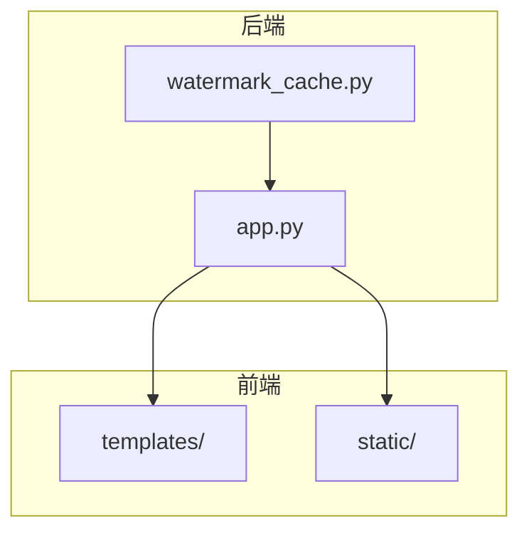

**图示来源**
- [app.py](file://src/app.py#L1-L50)
- [watermark_cache.py](file://src/watermark_cache.py#L1-L20)

**本节来源**
- [app.py](file://src/app.py#L1-L100)
- [project_structure](file://./#L1-L20)

## 核心扩展点分析
glzx-xmt项目提供了多个层次的扩展点，涵盖了配置、功能、界面和数据模型等方面。

### 扩展点分类
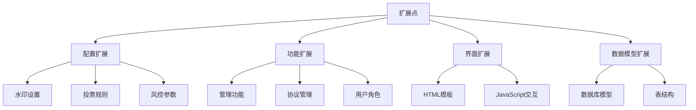

**图示来源**
- [app.py](file://src/app.py#L100-L200)
- [watermark_cache.py](file://src/watermark_cache.py#L10-L30)

**本节来源**
- [app.py](file://src/app.py#L1-L500)
- [watermark_cache.py](file://src/watermark_cache.py#L1-L100)

## 水印功能扩展
`watermark_cache.py`模块提供了可配置的水印功能，支持通过参数自定义水印样式。

### 水印参数配置
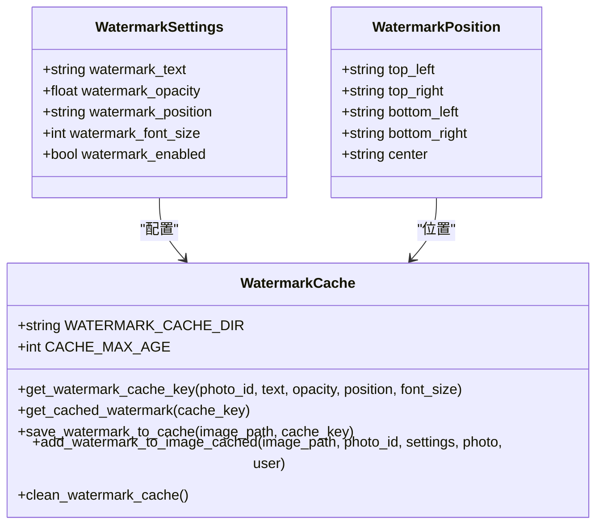

**图示来源**
- [watermark_cache.py](file://src/watermark_cache.py#L10-L50)

### 水印样式自定义
通过修改`Settings`模型中的水印相关字段，可以自定义水印的文本、透明度、位置和字体大小。

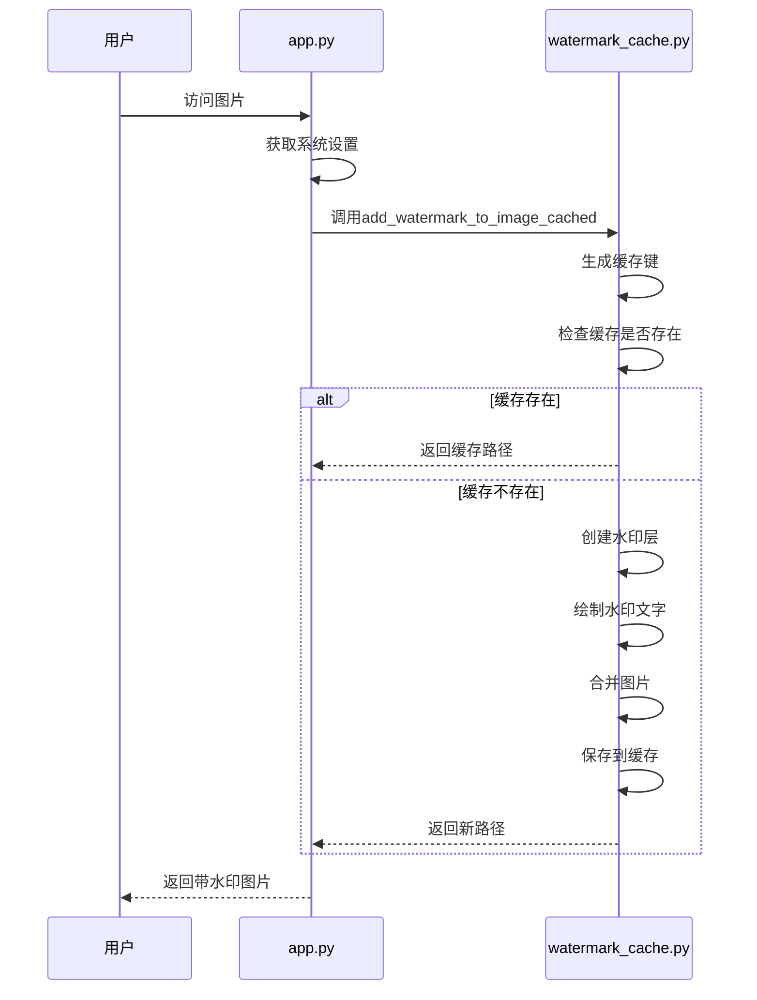

**图示来源**
- [app.py](file://src/app.py#L1500-L1600)
- [watermark_cache.py](file://src/watermark_cache.py#L100-L150)

**本节来源**
- [watermark_cache.py](file://src/watermark_cache.py#L1-L183)
- [app.py](file://src/app.py#L1500-L1600)

## 业务逻辑扩展
`app.py`文件是系统业务逻辑的核心，提供了多个可扩展的功能点。

### 管理功能扩展
通过分析`app.py`中的路由定义，可以识别出多个管理功能的扩展点。

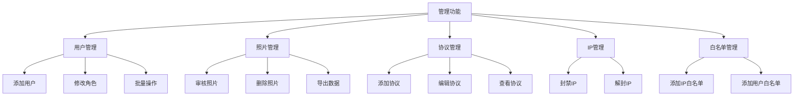

**图示来源**
- [app.py](file://src/app.py#L500-L1000)

### 投票规则修改
投票逻辑主要在`vote()`和`is_voting_time()`函数中实现，可以通过修改这些函数来调整投票规则。

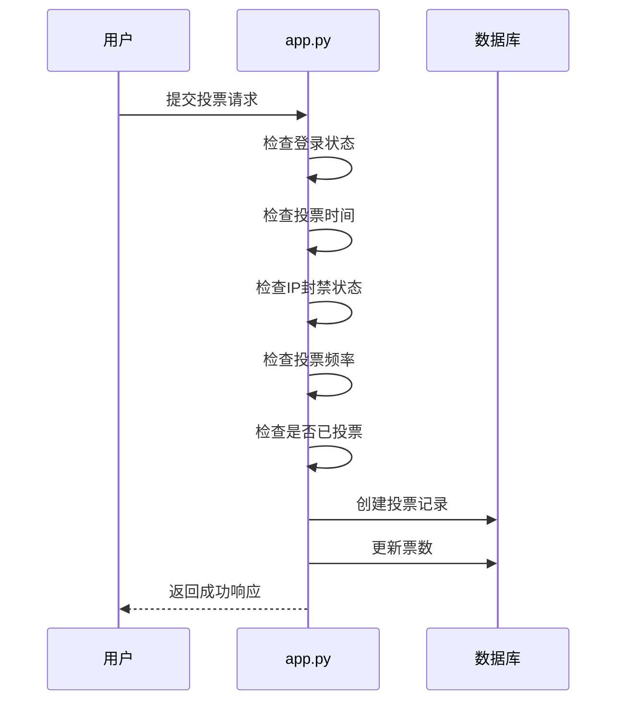

**图示来源**
- [app.py](file://src/app.py#L400-L500)

### 用户角色扩展
系统定义了三种用户角色，可以通过修改`User`模型和权限装饰器来扩展角色体系。

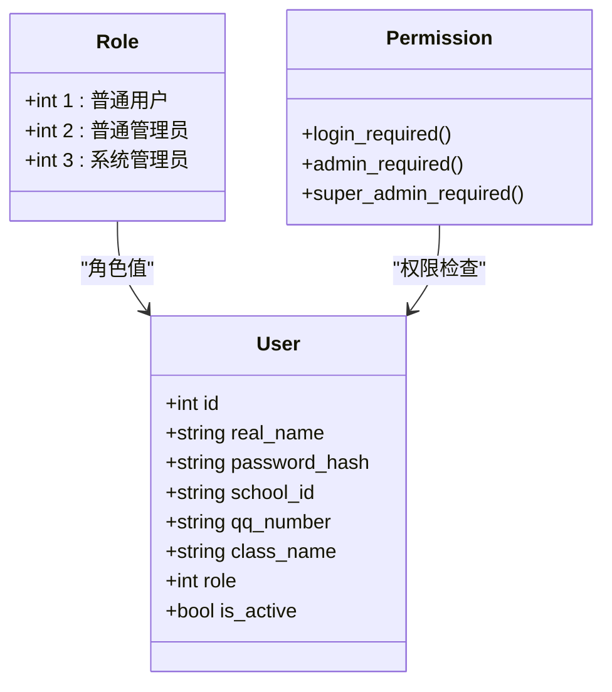

**图示来源**
- [app.py](file://src/app.py#L50-L100)

**本节来源**
- [app.py](file://src/app.py#L1-L1000)

## 数据库模型扩展
系统使用SQLAlchemy定义了多个数据模型，为数据库扩展提供了基础。

### 核心数据模型
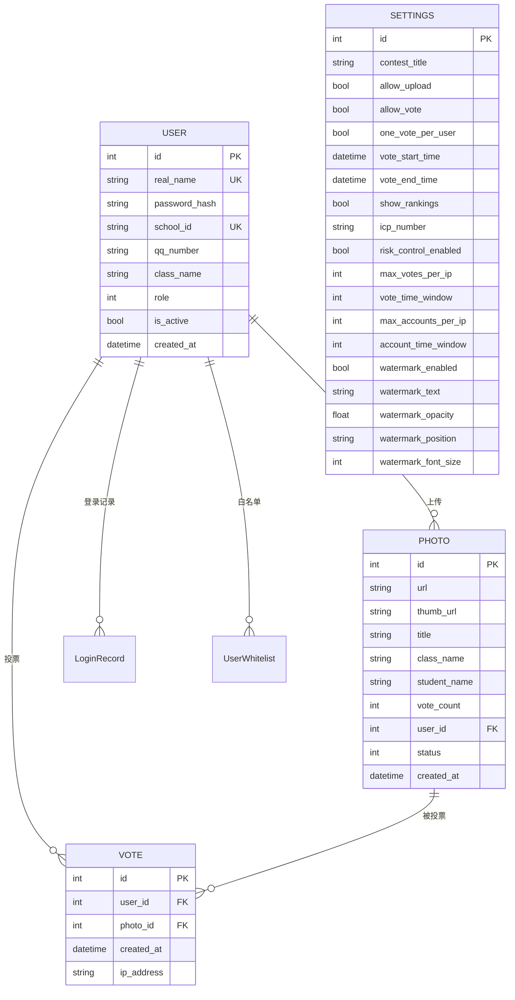

**图示来源**
- [app.py](file://src/app.py#L50-L150)

### 安全扩展数据库模型
要安全地扩展数据库模型，应遵循以下步骤：

1. 在`app.py`中定义新的模型类
2. 使用Flask-Migrate进行数据库迁移
3. 在需要的地方导入新模型
4. 更新相关业务逻辑以使用新模型

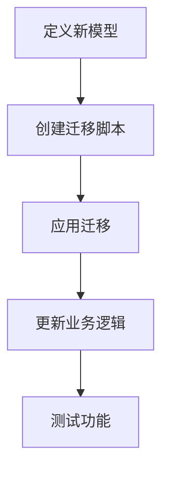

**本节来源**
- [app.py](file://src/app.py#L50-L200)

## 前端模板与交互扩展
系统提供了完整的HTML模板和JavaScript文件，支持前端功能的扩展。

### 模板文件结构
```mermaid
flowchart TD
templates[templates/] --> add_user[add_user.html]
templates --> admin[admin.html]
templates --> admin_review[admin_review.html]
templates --> agreement_management[agreement_management.html]
templates --> change_password[change_password.html]
templates --> edit_agreement[edit_agreement.html]
templates --> index[index.html]
templates --> ip_management[ip_management.html]
templates --> login[login.html]
templates --> manage_users[manage_users.html]
templates --> my_photos[my_photos.html]
templates --> rankings[rankings.html]
templates --> register[register.html]
templates --> settings[settings.html]
templates --> upload[upload.html]
templates --> view_agreement[view_agreement.html]
templates --> whitelist_management[whitelist_management.html]
```

**图示来源**
- [project_structure](file://./#L1-L20)

### JavaScript交互扩展
`agreement-modal.js`文件提供了协议弹窗的交互逻辑，可以作为扩展JavaScript功能的参考。

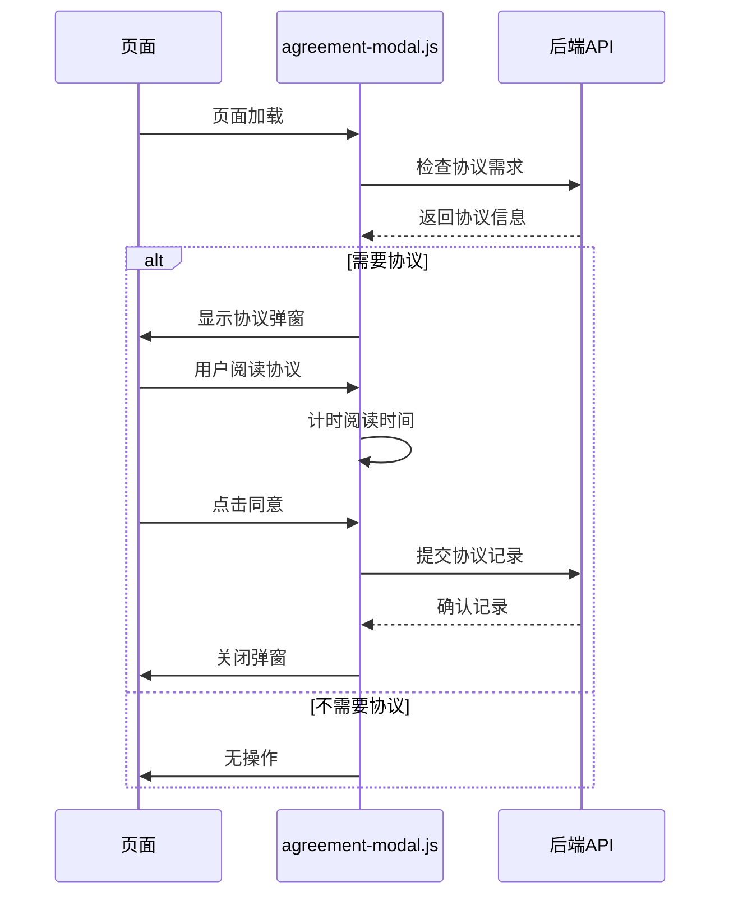

**图示来源**
- [agreement-modal.js](file://static/js/agreement-modal.js#L1-L100)
- [app.py](file://src/app.py#L1200-L1300)

**本节来源**
- [templates](file://templates/#L1-L20)
- [static/js](file://static/js/#L1-L20)

## 插件化开发建议
为了实现更好的可维护性和扩展性，建议采用插件化开发模式。

### 插件化架构设计
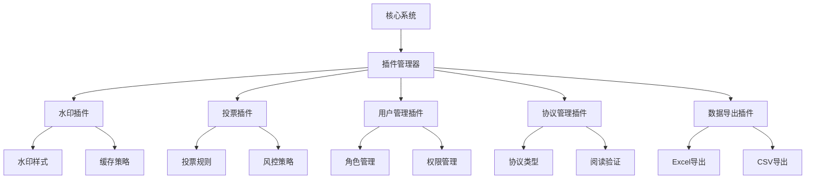

### 推荐的插件开发路径
1. 创建`plugins/`目录
2. 为每个功能模块创建独立的插件文件
3. 定义统一的插件接口
4. 在`app.py`中注册插件
5. 使用配置文件控制插件启用状态

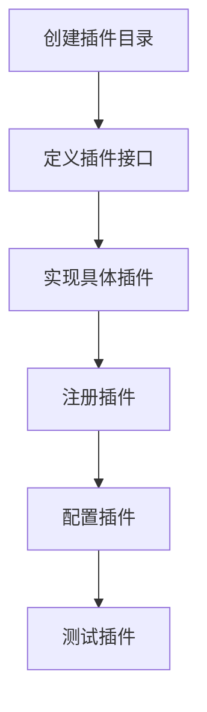

**本节来源**
- [app.py](file://src/app.py#L1-L1903)
- [watermark_cache.py](file://src/watermark_cache.py#L1-L183)

## 风险区域警告
在进行二次开发时，某些区域的修改可能会影响系统稳定性，需要特别注意。

### 高风险修改区域
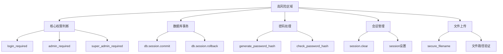

### 核心权限判断逻辑
`login_required`、`admin_required`和`super_admin_required`装饰器是系统安全的核心，不应随意修改。

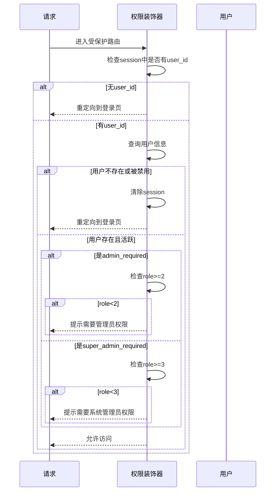

**图示来源**
- [app.py](file://src/app.py#L200-L300)

**本节来源**
- [app.py](file://src/app.py#L200-L500)

## 结论
glzx-xmt项目提供了丰富的扩展点，支持从配置、功能到界面的全方位二次开发。通过遵循现有代码风格和架构模式，开发者可以安全地扩展系统功能。建议优先使用配置化方式实现扩展，对于复杂功能考虑插件化开发。在修改核心逻辑时务必谨慎，特别是权限判断、数据库事务和安全相关代码。