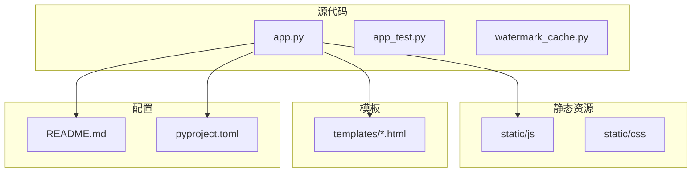
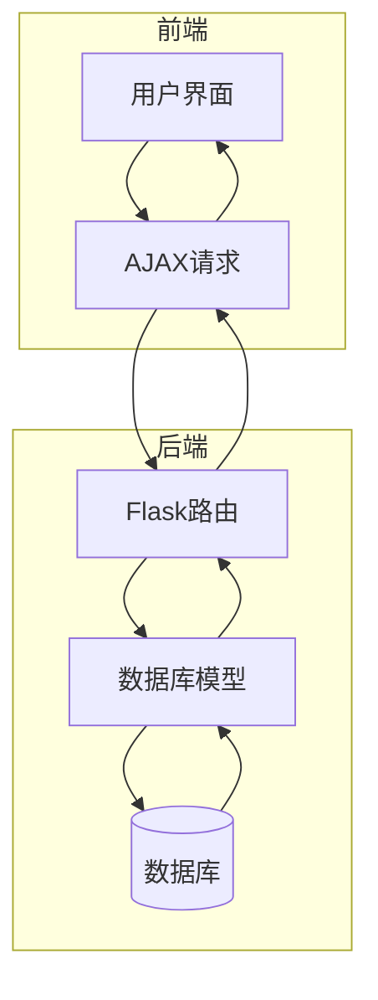
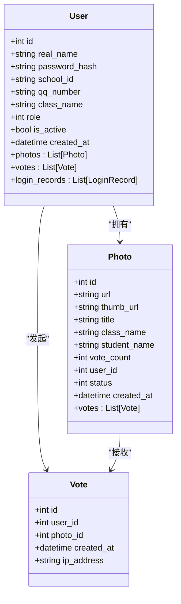
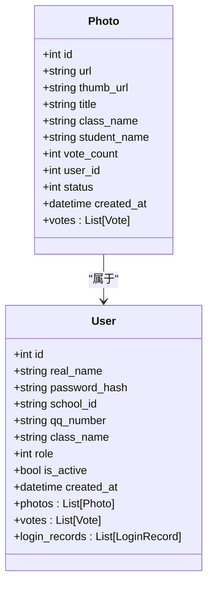
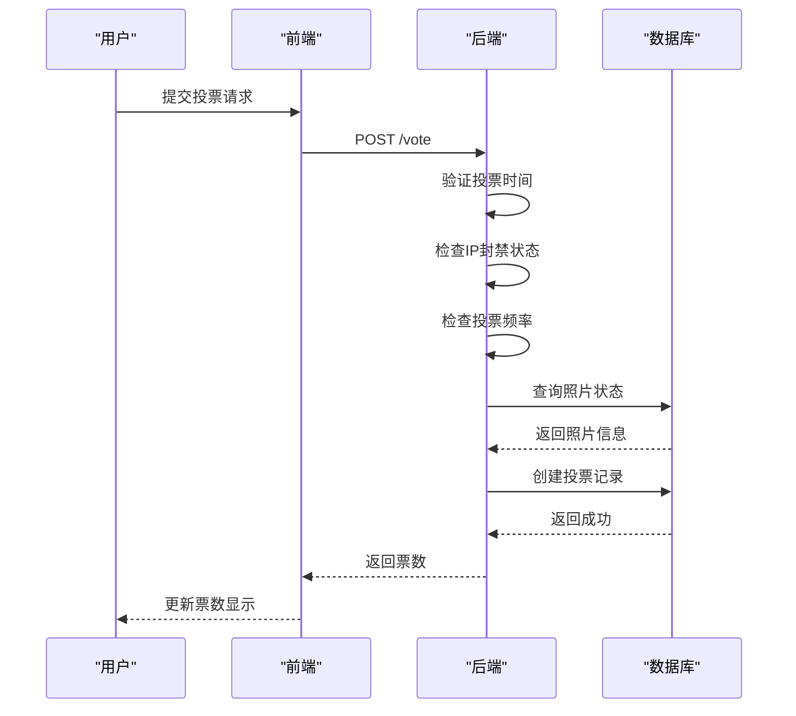
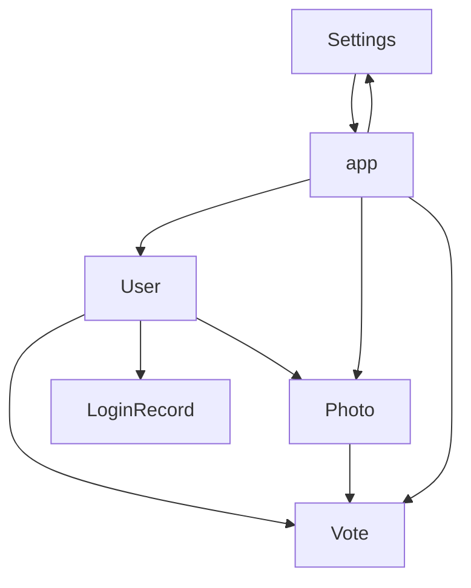

# 数据库模型修改

<cite>
**本文档引用的文件**
- [app.py](file://src/app.py)
</cite>

## 目录
1. [简介](#简介)
2. [项目结构](#项目结构)
3. [核心组件](#核心组件)
4. [架构概述](#架构概述)
5. [详细组件分析](#详细组件分析)
6. [依赖分析](#依赖分析)
7. [性能考虑](#性能考虑)
8. [故障排除指南](#故障排除指南)
9. [结论](#结论)
10. [附录](#附录)（如有必要）

## 简介
本文档旨在为基于 `app.py` 中定义的 SQLAlchemy 模型（如 User、Photo、Vote 等）提供详细的数据库模型修改指南。重点说明如何安全地为现有模型添加新字段，例如在 User 模型中添加用户简介字段（bio），在 Photo 模型中添加标签字段（tags），并确保使用正确的数据类型和约束（如 nullable、unique）。同时，文档将解释如何更新相关业务逻辑以处理新字段，包括表单验证、前端渲染和 API 响应。通过实际代码示例，展示字段添加语法、迁移前后的模型对比以及对相关路由函数的影响。特别强调在修改过程中必须避免直接修改生产数据库，应始终通过迁移脚本进行变更。

## 项目结构
本项目采用典型的 Flask 应用结构，主要组件包括源代码、静态资源、模板和配置文件。源代码位于 `src` 目录下，其中 `app.py` 是核心应用文件，定义了所有数据库模型和路由。静态资源（如 JavaScript 文件）位于 `static` 目录，而 HTML 模板则存放在 `templates` 目录中。项目根目录包含 `README.md` 和 `pyproject.toml` 等配置文件，用于项目说明和依赖管理。



**图表来源**
- [app.py](file://src/app.py#L1-L50)
- [README.md](file://README.md#L1-L10)

**本节来源**
- [app.py](file://src/app.py#L1-L100)
- [README.md](file://README.md#L1-L20)

## 核心组件
本项目的核心组件包括用户管理、照片上传与审核、投票系统以及系统设置。`User` 模型负责存储用户信息，如真实姓名、学号、QQ 号等，并通过外键与 `Photo` 和 `Vote` 模型关联。`Photo` 模型用于管理用户上传的照片，包含照片的 URL、缩略图、标题、班级、学生姓名、票数等属性。`Vote` 模型记录用户的投票行为，包括投票的用户 ID、照片 ID 和投票时间。此外，`Settings` 模型用于存储系统级别的配置，如比赛标题、上传和投票开关、投票时间窗口等。

**本节来源**
- [app.py](file://src/app.py#L45-L81)
- [app.py](file://src/app.py#L100-L120)

## 架构概述
系统采用典型的 MVC（模型-视图-控制器）架构，其中 `app.py` 文件既是模型定义也是控制器逻辑的集中地。数据库模型（如 User、Photo、Vote）作为模型层，负责数据的持久化和关系管理。Flask 路由函数作为控制器，处理 HTTP 请求并调用相应的业务逻辑。HTML 模板作为视图层，负责渲染页面并展示数据。前端通过 AJAX 请求与后端 API 交互，实现动态更新和数据提交。



**图表来源**
- [app.py](file://src/app.py#L1-L50)
- [app.py](file://src/app.py#L500-L600)

## 详细组件分析
### 用户模型分析
`User` 模型是系统的核心，负责管理用户的身份信息和权限。该模型包含多个字段，如 `real_name`（真实姓名，用作登录账号）、`school_id`（校学号）、`qq_number`（QQ号）、`class_name`（班级）、`role`（角色，1=普通用户, 2=普通管理员, 3=系统管理员）等。通过 `photos`、`votes` 和 `login_records` 关系，`User` 模型与 `Photo`、`Vote` 和 `LoginRecord` 模型建立了关联。

#### 用户模型类图


**图表来源**
- [app.py](file://src/app.py#L45-L59)

**本节来源**
- [app.py](file://src/app.py#L45-L81)

### 照片模型分析
`Photo` 模型用于管理用户上传的照片，包含照片的元数据和状态信息。关键字段包括 `url`（照片的存储路径）、`thumb_url`（缩略图路径）、`title`（作品名称）、`vote_count`（票数）、`status`（状态，0=待审核, 1=已通过, 2=已拒绝）等。通过 `user_id` 外键，`Photo` 模型与 `User` 模型关联，确保每张照片都有明确的上传者。

#### 照片模型类图


**图表来源**
- [app.py](file://src/app.py#L61-L74)

**本节来源**
- [app.py](file://src/app.py#L61-L81)

### 投票模型分析
`Vote` 模型记录用户的投票行为，确保投票的可追溯性和防刷票机制。该模型包含 `user_id`（投票用户）、`photo_id`（被投票照片）、`created_at`（投票时间）和 `ip_address`（投票IP）等字段。通过 `ip_address` 字段，系统可以实现基于IP的投票频率限制，防止恶意刷票。

#### 投票流程序列图


**图表来源**
- [app.py](file://src/app.py#L76-L81)
- [app.py](file://src/app.py#L700-L750)

**本节来源**
- [app.py](file://src/app.py#L76-L81)
- [app.py](file://src/app.py#L700-L750)

## 依赖分析
系统各组件之间存在紧密的依赖关系。`User` 模型是其他模型的基础，`Photo` 和 `Vote` 模型都依赖于 `User` 模型的 `id` 字段作为外键。`Settings` 模型被多个路由函数依赖，用于获取系统配置。此外，`app.py` 文件中的路由函数依赖于数据库模型和业务逻辑函数，如 `get_settings`、`add_watermark_to_image` 等。



**图表来源**
- [app.py](file://src/app.py#L1-L100)
- [app.py](file://src/app.py#L500-L600)

**本节来源**
- [app.py](file://src/app.py#L1-L100)
- [app.py](file://src/app.py#L500-L600)

## 性能考虑
在添加新字段时，需要考虑对系统性能的影响。例如，为 `User` 模型添加 `bio` 字段时，应评估该字段的使用频率和数据大小，避免在频繁查询的场景中加载不必要的大文本数据。对于 `Photo` 模型的 `tags` 字段，可以考虑使用 JSON 类型存储，以提高查询灵活性。此外，应确保新字段的索引策略合理，避免在高并发场景下出现性能瓶颈。

## 故障排除指南
在修改数据库模型时，可能会遇到各种问题。例如，迁移脚本执行失败、新字段未正确同步到数据库、业务逻辑未更新导致错误等。建议在开发环境中充分测试迁移脚本，确保其在生产环境中的可靠性。同时，应定期备份数据库，以防意外情况发生。

**本节来源**
- [app.py](file://src/app.py#L1-L100)
- [app.py](file://src/app.py#L500-L600)

## 结论
本文档详细介绍了如何安全地为现有数据库模型添加新字段，并强调了通过迁移脚本进行变更的重要性。通过遵循本文档的指导，开发人员可以确保数据库结构的演进不会影响系统的稳定性和数据的完整性。未来，建议引入更完善的迁移管理工具，如 Alembic，以进一步提高数据库变更的可靠性和可追溯性。

## 附录
### 数据库模型修改示例
以下是一个为 `User` 模型添加 `bio` 字段的示例：

```python
# 在 app.py 中修改 User 模型
class User(db.Model):
    # ... 其他字段
    bio = db.Column(db.Text, nullable=True)  # 用户简介
```

然后，使用迁移工具生成并执行迁移脚本，确保变更安全地应用到生产数据库。