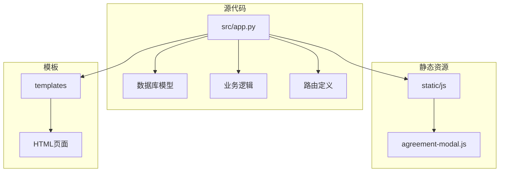
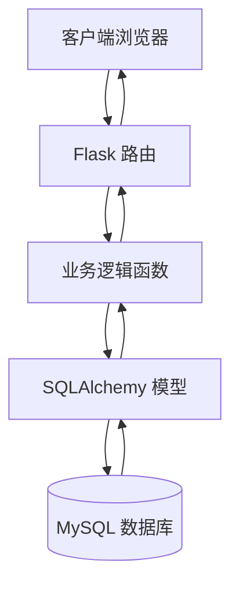
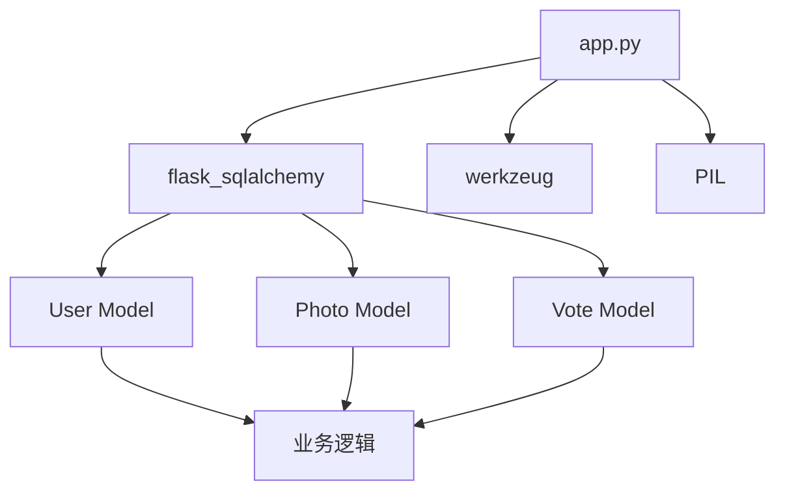
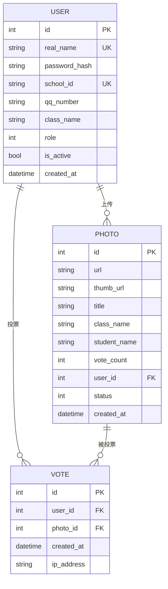

# 数据库模型扩展

<cite>
**本文档中引用的文件**   
- [app.py](file://src/app.py)
</cite>

## 目录
1. [简介](#简介)
2. [项目结构](#项目结构)
3. [核心组件](#核心组件)
4. [架构概述](#架构概述)
5. [详细组件分析](#详细组件分析)
6. [依赖分析](#依赖分析)
7. [性能考虑](#性能考虑)
8. [故障排除指南](#故障排除指南)
9. [结论](#结论)
10. [附录](#附录)（如有必要）

## 简介
本文档旨在为基于 `app.py` 中定义的 SQLAlchemy 模型（如 User、Photo、Vote 等）的数据库模型扩展提供全面指导。重点涵盖如何安全地添加新字段（如用户简介、照片标签）、创建新实体（如评论表、收藏表）并配置外键关系。同时，指导如何编写 Alembic 迁移脚本以实现数据库版本升级，避免手动修改数据库结构。此外，还解释了如何在模型层添加验证逻辑（如唯一性约束、非空检查），提供索引优化建议以提升查询性能，并强调数据一致性维护和级联删除策略的配置。

## 项目结构
本项目采用典型的 Flask 应用结构，主要代码位于 `src` 目录下。核心应用逻辑和数据库模型定义在 `app.py` 文件中。静态资源（如 JavaScript 文件）存放在 `static` 目录，而 HTML 模板则位于 `templates` 目录。项目使用 `pyproject.toml` 进行依赖管理。



**Diagram sources**
- [app.py](file://src/app.py#L1-L50)

**Section sources**
- [app.py](file://src/app.py#L1-L50)

## 核心组件
核心组件包括定义在 `app.py` 中的多个 SQLAlchemy 模型，如 `User`、`Photo`、`Vote`、`Settings` 等。这些模型构成了应用的数据层，通过 `db.Model` 基类与数据库进行交互。每个模型类映射到数据库中的一个表，其属性对应表中的列。模型之间通过 `db.relationship` 和 `db.ForeignKey` 建立关联，形成完整的数据关系网络。

**Section sources**
- [app.py](file://src/app.py#L45-L81)

## 架构概述
该应用采用经典的三层架构：表示层（Flask 路由和模板）、业务逻辑层（Python 函数）和数据访问层（SQLAlchemy 模型）。`app.py` 文件是整个应用的入口点，它初始化 Flask 应用和 SQLAlchemy 数据库实例。数据模型直接在 `app.py` 中定义，与业务逻辑紧密耦合。外部请求通过 Flask 路由进入，经过业务逻辑处理后，通过 SQLAlchemy 模型与数据库进行交互。



**Diagram sources**
- [app.py](file://src/app.py#L1-L50)

## 详细组件分析
### 模型扩展分析
#### 添加新字段
要为现有模型安全地添加新字段，例如为 `User` 模型添加 `bio`（用户简介）字段或为 `Photo` 模型添加 `tags`（照片标签）字段，应遵循以下步骤：
1.  **修改模型定义**：在 `app.py` 中对应的模型类里添加新的 `db.Column`。
2.  **生成迁移脚本**：使用 Alembic 生成一个新版本的迁移脚本。
3.  **应用迁移**：将生成的脚本应用到数据库，以更新表结构。

例如，为 `User` 模型添加 `bio` 字段：
```python
class User(db.Model):
    # ... 其他字段
    bio = db.Column(db.Text, nullable=True)  # 用户简介
```

**Diagram sources**
- [app.py](file://src/app.py#L45-L59)

#### 创建新实体
要创建新的数据库实体，例如 `Comment`（评论）表或 `Favorite`（收藏）表，需要：
1.  **定义新模型**：在 `app.py` 中创建一个新的类，继承 `db.Model`。
2.  **配置外键关系**：使用 `db.ForeignKey` 将新表与现有表（如 `User` 或 `Photo`）关联。
3.  **建立双向关系**：在相关模型中使用 `db.relationship` 建立反向引用。
4.  **生成并应用迁移**。

例如，创建 `Comment` 模型：
```python
class Comment(db.Model):
    id = db.Column(db.Integer, primary_key=True)
    content = db.Column(db.Text, nullable=False)
    user_id = db.Column(db.Integer, db.ForeignKey('user.id'), nullable=False)
    photo_id = db.Column(db.Integer, db.ForeignKey('photo.id'), nullable=False)
    created_at = db.Column(db.DateTime, default=db.func.current_timestamp())
    
    # 反向关系
    author = db.relationship('User', backref='comments')
    photo = db.relationship('Photo', backref='comments')
```

**Diagram sources**
- [app.py](file://src/app.py#L45-L74)

#### 模型层验证逻辑
在 SQLAlchemy 模型中，可以通过多种方式添加验证逻辑：
-   **`nullable=False`**：确保字段不为空。
-   **`unique=True`**：确保字段值在表中唯一。
-   **`default=value`**：为字段设置默认值。
-   **自定义验证方法**：可以在模型类中定义方法，并在数据提交前调用。

例如，`User.real_name` 字段使用了 `unique=True` 和 `nullable=False` 来保证登录账号的唯一性和非空性。

**Section sources**
- [app.py](file://src/app.py#L45-L59)

## 依赖分析
应用的核心依赖关系集中在 `app.py` 文件中。所有数据库模型都依赖于 `flask_sqlalchemy` 提供的 `db` 实例。业务逻辑函数（如 `vote`、`upload`）依赖于这些模型来查询和操作数据。此外，应用还依赖于 `werkzeug` 进行密码哈希和文件处理，以及 `PIL`（Pillow）进行图像处理。



**Diagram sources**
- [app.py](file://src/app.py#L1-L10)

**Section sources**
- [app.py](file://src/app.py#L1-L10)

## 性能考虑
为了提升数据库查询性能，建议在经常用于查询条件的字段上创建索引。例如，在 `votes` 表的 `photo_id` 字段上创建索引，可以显著加快按照片统计票数的查询速度。在 SQLAlchemy 中，可以通过在 `db.Column` 的定义中添加 `index=True` 参数来实现。

```python
class Vote(db.Model):
    # ... 其他字段
    photo_id = db.Column(db.Integer, db.ForeignKey('photo.id'), nullable=False, index=True)
```

此外，应避免在循环中进行数据库查询，并合理使用 `lazy='joined'` 或 `lazy='subquery'` 来优化关系加载。

## 故障排除指南
当进行数据库模型扩展时，常见的问题包括迁移脚本生成失败、外键约束冲突和数据一致性问题。确保在修改模型后及时生成迁移脚本，而不是直接修改数据库。如果遇到外键错误，检查关联的主键记录是否已存在。对于数据一致性，应利用数据库的约束（如 `NOT NULL`、`UNIQUE`）和应用层的验证逻辑双重保障。

**Section sources**
- [app.py](file://src/app.py#L45-L81)

## 结论
通过对 `app.py` 中 SQLAlchemy 模型的分析，我们明确了数据库模型扩展的完整流程。关键在于使用 Alembic 进行版本化迁移，避免直接操作数据库。通过在模型定义中添加字段、创建新实体、配置外键和关系，并利用索引优化查询，可以安全、高效地演进数据库结构。始终遵循数据一致性和完整性原则，是维护应用稳定性的基础。

## 附录
### 数据库模型图


**Diagram sources**
- [app.py](file://src/app.py#L45-L81)