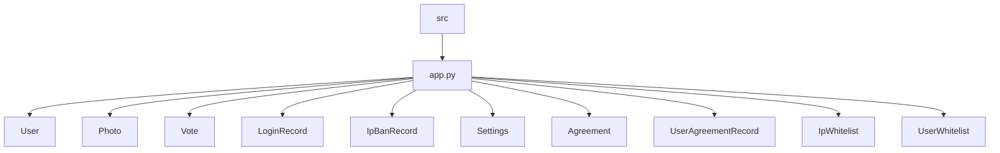
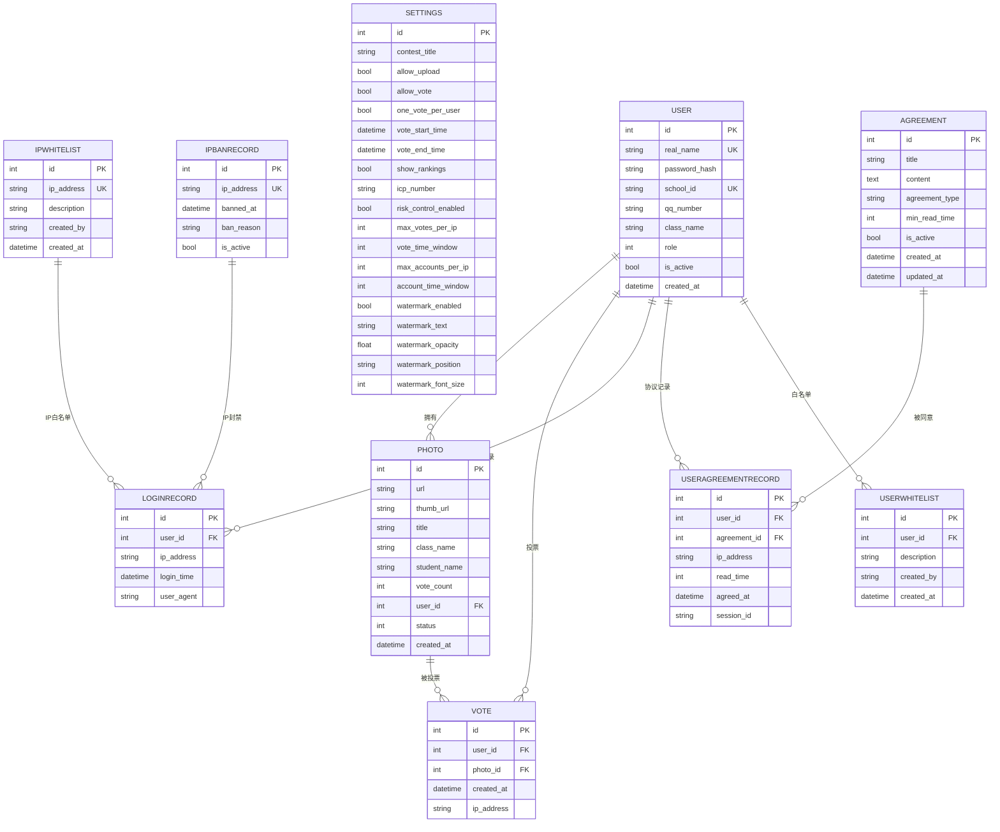

# 数据库迁移管理

<cite>
**本文档中引用的文件**  
- [app.py](file://src/app.py)
</cite>

## 目录
1. [引言](#引言)
2. [项目结构](#项目结构)
3. [核心模型分析](#核心模型分析)
4. [Alembic 初始化配置](#alembic-初始化配置)
5. [生成迁移脚本](#生成迁移脚本)
6. [审查自动生成的迁移脚本](#审查自动生成的迁移脚本)
7. [应用数据库迁移](#应用数据库迁移)
8. [处理复杂变更示例](#处理复杂变更示例)
9. [索引优化策略](#索引优化策略)
10. [生产环境迁移策略](#生产环境迁移策略)
11. [回滚机制](#回滚机制)

## 引言
本指南旨在为开发者提供基于 `app.py` 中定义的 Flask-SQLAlchemy 模型结构，使用 Alembic 工具进行数据库版本控制的完整操作流程。涵盖从环境初始化、迁移脚本生成、审查与应用，到复杂变更处理和生产环境安全策略的全过程。

## 项目结构
项目采用典型的 Flask 应用结构，数据库模型集中定义于 `src/app.py` 文件中。该文件包含所有数据表的 ORM 映射类，是进行数据库迁移的核心依据。



**Diagram sources**
- [app.py](file://src/app.py#L45-L152)

**Section sources**
- [app.py](file://src/app.py#L1-L1903)

## 核心模型分析
`app.py` 中定义了多个 SQLAlchemy 模型类，构成了系统的数据基础。这些模型通过 `db.Model` 继承实现，并通过 `db.Column` 定义字段。



**Diagram sources**
- [app.py](file://src/app.py#L45-L152)

**Section sources**
- [app.py](file://src/app.py#L45-L152)

## Alembic 初始化配置
首次使用 Alembic 需要初始化环境。在项目根目录执行以下命令：

```bash
alembic init alembic
```

此命令将创建 `alembic/` 目录及 `alembic.ini` 配置文件。需修改 `alembic.ini` 中的 `sqlalchemy.url` 以匹配 `app.py` 中的数据库连接配置。

同时，需编辑 `alembic/env.py` 文件，导入应用的 `db` 实例并配置 `target_metadata`：

```python
from src.app import db
target_metadata = db.metadata
```

## 生成迁移脚本
当修改 `app.py` 中的模型定义后（如添加新字段或新表），可使用以下命令自动生成迁移脚本：

```bash
alembic revision --autogenerate -m "描述本次变更"
```

Alembic 会对比当前模型元数据与数据库实际结构，自动生成包含 `upgrade()` 和 `downgrade()` 方法的 Python 脚本。例如，若新增 `Comment` 表，脚本将包含 `op.create_table()` 指令。

## 审查自动生成的迁移脚本
**必须**在应用迁移前仔细审查自动生成的脚本。重点关注：

- 外键约束是否正确生成（`db.ForeignKey`）
- 级联删除规则是否符合预期（`ondelete='CASCADE'`）
- 字段类型、长度、可空性是否与模型定义一致
- 唯一约束（`unique=True`）和索引是否正确添加

例如，`User` 表的 `real_name` 和 `school_id` 字段均设置了唯一约束，迁移脚本应包含相应的 `unique=True` 或 `op.create_index()` 指令。

## 应用数据库迁移
确认迁移脚本无误后，可将其应用到数据库：

```bash
alembic upgrade head
```

此命令将执行所有待应用的迁移脚本，使数据库结构与最新模型定义保持同步。执行后可通过数据库客户端验证表结构变更。

## 处理复杂变更示例
### 创建新实体：评论表（Comment）
在 `app.py` 中添加新模型：

```python
class Comment(db.Model):
    id = db.Column(db.Integer, primary_key=True)
    content = db.Column(db.Text, nullable=False)
    user_id = db.Column(db.Integer, db.ForeignKey('user.id'), nullable=False)
    photo_id = db.Column(db.Integer, db.ForeignKey('photo.id'), nullable=False)
    created_at = db.Column(db.DateTime, default=db.func.current_timestamp())
```

生成并审查迁移脚本后应用，Alembic 将自动创建带有外键约束的 `comment` 表。

### 配置外键与级联删除
在模型中明确指定级联行为：

```python
photos = db.relationship('Photo', backref='user', lazy=True, cascade='all, delete-orphan')
```

或在外键定义中添加 `ondelete` 参数：

```python
user_id = db.Column(db.Integer, db.ForeignKey('user.id', ondelete='CASCADE'), nullable=False)
```

确保迁移脚本中生成的 `CREATE TABLE` 语句包含 `ON DELETE CASCADE` 子句。

## 索引优化策略
为高频查询字段添加索引以提升性能。例如，在 `Vote` 表的 `photo_id` 字段上创建索引：

```python
class Vote(db.Model):
    # ...
    photo_id = db.Column(db.Integer, db.ForeignKey('photo.id'), nullable=False, index=True)
```

或通过迁移脚本手动添加：

```python
op.create_index('ix_vote_photo_id', 'vote', ['photo_id'])
```

这将显著提升按作品统计票数的查询效率。

## 生产环境迁移策略
**严禁**在生产环境直接应用未经验证的迁移。标准流程如下：

1. 在本地或测试环境执行 `alembic upgrade head`
2. 使用测试数据验证应用功能是否正常
3. 检查数据库性能指标，确认无性能退化
4. 在预发布环境重复验证
5. 选择业务低峰期，在生产环境执行迁移
6. 迁移后立即验证核心功能

## 回滚机制
若迁移后发现问题，可使用以下命令回滚至上一版本：

```bash
alembic downgrade -1
```

或回滚至特定版本：

```bash
alembic downgrade <目标版本号>
```

确保 `downgrade()` 方法正确实现了结构还原逻辑。定期备份数据库是最后的安全保障。

**Section sources**
- [app.py](file://src/app.py#L45-L152)