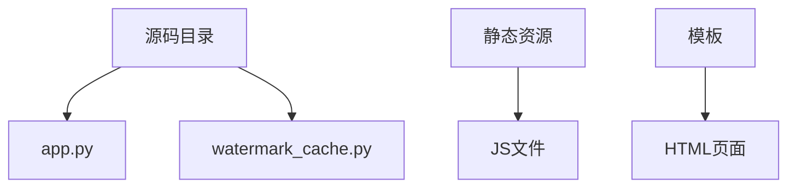
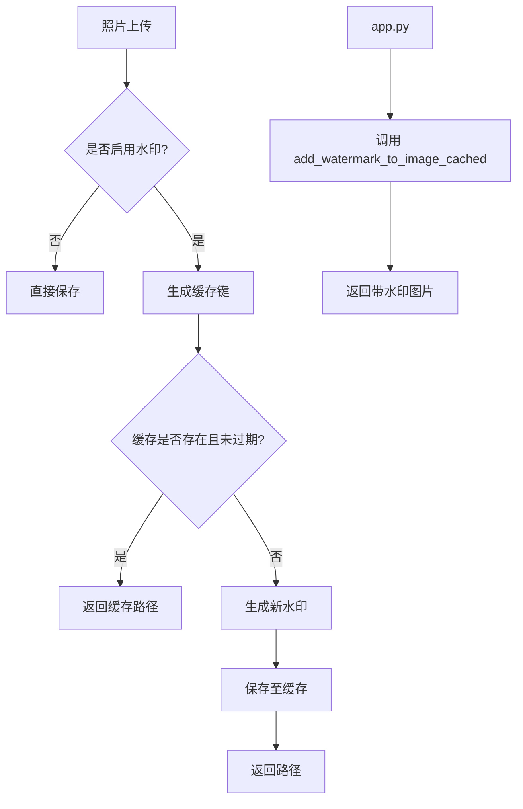
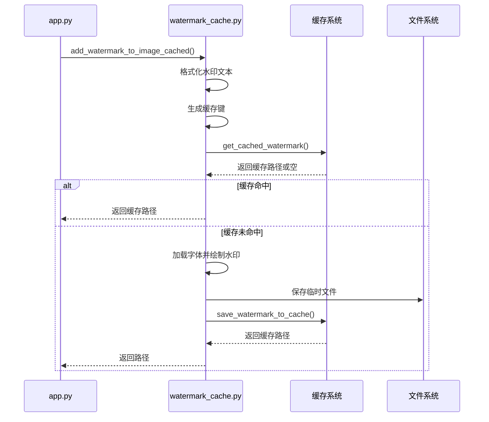
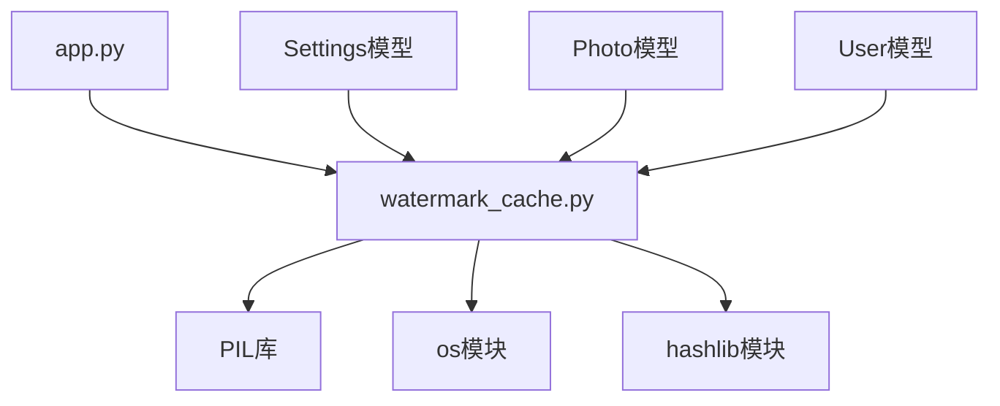

# 水印功能扩展

<cite>
**本文档引用文件**  
- [watermark_cache.py](file://src/watermark_cache.py)
- [app.py](file://src/app.py)
</cite>

## 目录
1. [简介](#简介)
2. [项目结构](#项目结构)
3. [核心组件](#核心组件)
4. [架构概述](#架构概述)
5. [详细组件分析](#详细组件分析)
6. [依赖分析](#依赖分析)
7. [性能考虑](#性能考虑)
8. [故障排除指南](#故障排除指南)
9. [结论](#结论)

## 简介
本文档详细说明 `watermark_cache.py` 模块的架构设计与扩展机制，涵盖水印生成流程、缓存策略、性能优化手段以及与 `app.py` 的集成方式。旨在为开发者提供自定义水印文本、字体、颜色、透明度、旋转角度和布局位置的完整指导，并支持动态水印（如用户ID、时间戳）的实现。

## 项目结构



**图示来源**  
- [app.py](file://src/app.py)
- [watermark_cache.py](file://src/watermark_cache.py)

**本节来源**  
- [app.py](file://src/app.py)
- [watermark_cache.py](file://src/watermark_cache.py)

## 核心组件

`watermark_cache.py` 提供了带缓存机制的水印添加功能，通过 `add_watermark_to_image_cached` 函数实现。该模块支持动态水印文本、多字体回退机制、位置布局控制和缓存管理，显著提升重复水印生成的性能。

**本节来源**  
- [watermark_cache.py](file://src/watermark_cache.py#L57-L183)

## 架构概述



**图示来源**  
- [app.py](file://src/app.py#L1730-L1750)
- [watermark_cache.py](file://src/watermark_cache.py#L57-L183)

## 详细组件分析

### 水印生成流程分析

#### 水印生成与缓存逻辑


**图示来源**  
- [watermark_cache.py](file://src/watermark_cache.py#L57-L183)

#### 自定义水印配置
开发者可通过数据库 `Settings` 表配置以下参数：

| 配置项 | 说明 | 示例值 |
|--------|------|--------|
| `watermark_enabled` | 是否启用水印 | `True` |
| `watermark_text` | 水印文本模板 | `{contest_title}-{student_name}-{qq_number}` |
| `watermark_opacity` | 透明度 (0.1-1.0) | `0.3` |
| `watermark_position` | 位置布局 | `bottom_right` |
| `watermark_font_size` | 字体大小 | `20` |

支持的布局位置包括：`top_left`、`top_right`、`bottom_left`、`center`、`bottom_right`（默认）。

**本节来源**  
- [app.py](file://src/app.py#L100-L110)
- [watermark_cache.py](file://src/watermark_cache.py#L10-L15)

### 动态水印实现示例

要添加包含用户ID或时间戳的动态水印，可修改 `Settings.watermark_text` 为：

```python
# 包含时间戳
"{contest_title}-{student_name}-上传于{title}-{%Y-%m-%d %H:%M}"

# 包含用户ID
"{contest_title}-用户ID:{qq_number}-作品:{title}"
```

在 `add_watermark_to_image_cached` 函数中，`watermark_text` 通过 `.format()` 方法动态填充上下文变量。

**本节来源**  
- [watermark_cache.py](file://src/watermark_cache.py#L70-L75)

### 字体集成与编码兼容性

模块支持多平台字体自动探测：

- **Windows**: 优先尝试鸿蒙字体、微软雅黑、宋体、黑体
- **Linux/macOS**: 尝试 Noto Sans CJK、DejaVu、Liberation、苹方等

若系统字体缺失，将自动回退至默认字体，确保功能可用性。开发者可将新字体文件放入系统字体目录，并在 `font_candidates` 列表中添加路径。

**本节来源**  
- [app.py](file://src/app.py#L240-L270)

## 依赖分析



**图示来源**  
- [app.py](file://src/app.py#L1739)
- [watermark_cache.py](file://src/watermark_cache.py#L57)

**本节来源**  
- [app.py](file://src/app.py)
- [watermark_cache.py](file://src/watermark_cache.py)

## 性能考虑

- **缓存策略**: 使用 MD5 哈希生成缓存键，缓存有效期为 1 小时（`CACHE_MAX_AGE`）
- **临时文件管理**: 使用 `tempfile.mkdtemp()` 创建临时目录，处理完成后自动清理
- **字体加载优化**: 按优先级顺序尝试加载字体，避免重复探测
- **内存使用**: 使用 `Image.alpha_composite` 合并图层，减少内存占用

建议定期调用 `clean_watermark_cache()` 清理过期缓存文件。

**本节来源**  
- [watermark_cache.py](file://src/watermark_cache.py#L10-L15)
- [watermark_cache.py](file://src/watermark_cache.py#L150-L183)

## 故障排除指南

### 常见问题与解决方案

| 问题 | 可能原因 | 解决方案 |
|------|----------|----------|
| 水印未显示 | `watermark_enabled=False` | 检查数据库设置 |
| 字体加载失败 | 字体路径错误或缺失 | 确认系统字体存在或使用默认字体 |
| 缓存未生效 | 缓存目录不可写 | 确保 `cache/watermarks` 目录有写权限 |
| 水印位置偏移 | 图片尺寸计算错误 | 检查 `textbbox` 计算逻辑 |
| 性能下降 | 缓存频繁失效 | 调整 `CACHE_MAX_AGE` 或优化缓存键生成 |

### 调试技巧
- 启用 `print()` 日志输出，查看字体加载状态
- 检查 `cache/watermarks` 目录文件生成情况
- 使用 `get_watermark_cache_key()` 手动验证缓存键一致性
- 在开发环境设置 `WATERMARK_CACHE_DIR` 为绝对路径便于调试

**本节来源**  
- [watermark_cache.py](file://src/watermark_cache.py#L40-L55)
- [watermark_cache.py](file://src/watermark_cache.py#L150-L183)

## 结论
`watermark_cache.py` 模块通过缓存机制显著提升了水印生成性能，支持灵活的自定义配置和动态内容生成。其与 `app.py` 的松耦合设计确保了核心功能的稳定性，开发者可安全扩展水印样式而不影响照片上传逻辑。建议生产环境启用缓存并定期清理，以获得最佳性能表现。