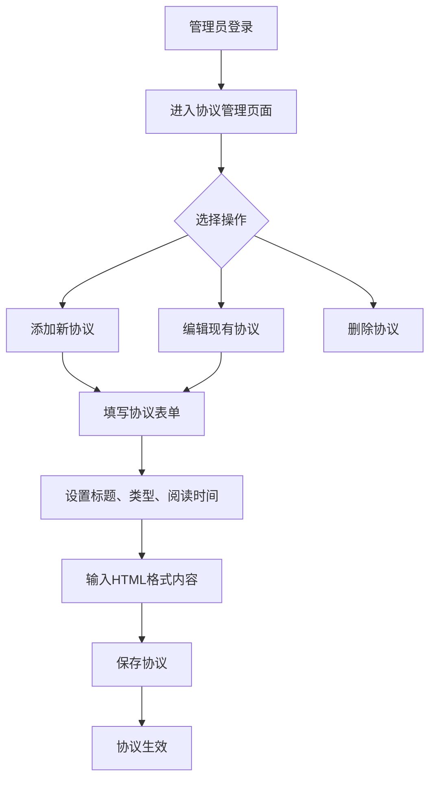
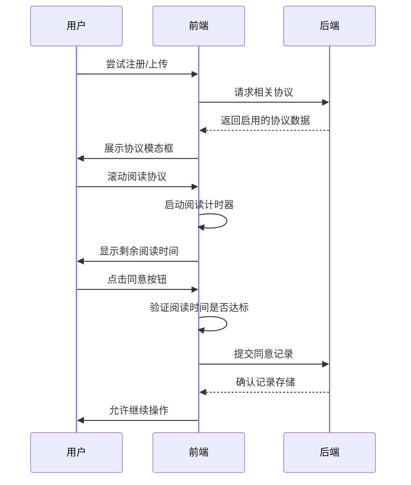
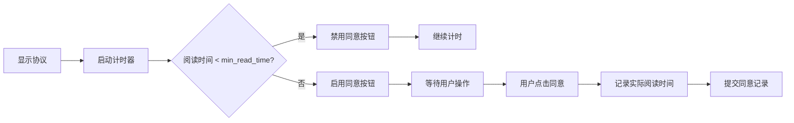
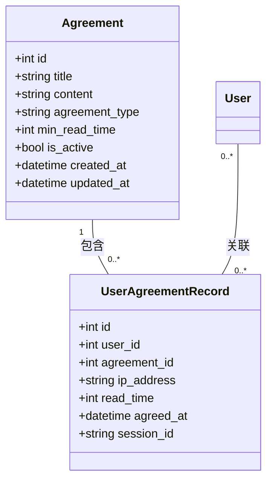

# 协议模型 (Agreement)

<cite>
**本文档中引用的文件**
- [app.py](file://src/app.py#L1-L1903)
- [agreement_management.html](file://templates/agreement_management.html#L1-L459)
- [edit_agreement.html](file://templates/edit_agreement.html#L1-L374)
</cite>

## 目录
1. [简介](#简介)
2. [协议模型设计](#协议模型设计)
3. [用户协议记录模型设计](#用户协议记录模型设计)
4. [动态协议管理功能](#动态协议管理功能)
5. [协议展示与同意流程](#协议展示与同意流程)
6. [阅读时间验证机制](#阅读时间验证机制)
7. [同意记录存储逻辑](#同意记录存储逻辑)
8. [合规性保障机制](#合规性保障机制)
9. [结论](#结论)

## 简介
本系统通过`Agreement`和`UserAgreementRecord`两个核心模型实现了完整的协议合规管理体系。该体系支持管理员在后台动态管理注册和上传协议，并确保用户在关键操作前必须阅读并同意相关协议。系统通过最小阅读时间控制、IP地址记录、会话跟踪等机制，确保协议同意过程的合规性和可追溯性。

## 协议模型设计

`Agreement`模型用于存储系统中的各类协议，支持动态创建和更新。该模型包含协议的基本信息、类型标识、阅读要求和状态控制。

**模型字段说明**：
- `title`: 协议标题，用于在前端展示
- `content`: 协议内容，支持HTML格式，可包含富文本和链接
- `agreement_type`: 协议类型，区分"register"（注册协议）和"upload"（上传协议）
- `min_read_time`: 最小阅读时间（秒），用户必须达到此时间才能同意协议
- `is_active`: 启用状态，控制协议是否对用户可见
- `created_at` 和 `updated_at`: 时间戳，记录协议的创建和更新时间

该模型设计支持灵活的协议管理策略，管理员可以根据业务需求随时调整协议内容和阅读要求。

**Section sources**
- [app.py](file://src/app.py#L1-L1903)

## 用户协议记录模型设计

`UserAgreementRecord`模型用于记录用户的协议同意行为，提供完整的审计追踪能力。

**模型字段说明**：
- `user_id`: 用户ID，外键关联到User模型，在注册场景下可能为空
- `agreement_id`: 协议ID，外键关联到Agreement模型
- `ip_address`: 用户同意协议时的IP地址，用于安全审计
- `read_time`: 用户实际阅读时间（秒），用于验证是否满足最小阅读要求
- `agreed_at`: 同意时间戳，记录用户同意协议的具体时间
- `session_id`: 会话ID，特别用于注册前的协议记录场景

该模型的关键设计在于支持两种不同的使用场景：已登录用户的协议同意和注册过程中的协议同意。通过`session_id`字段，系统能够在用户尚未创建账户时就记录其协议同意行为。

**Section sources**
- [app.py](file://src/app.py#L1-L1903)

## 动态协议管理功能

系统提供了完整的协议管理后台界面，允许管理员在`agreement_management.html`页面对协议进行全生命周期管理。

**管理功能特性**：
- **协议列表展示**：以表格形式展示所有协议，包含标题、类型、状态等关键信息
- **协议类型标识**：通过不同颜色的标签区分注册协议和上传协议
- **状态可视化**：启用/禁用状态通过绿色/红色标签直观显示
- **内容预览**：支持协议内容的截断预览，鼠标悬停可查看完整内容
- **增删改查操作**：提供添加、查看、编辑、删除协议的完整操作集

管理员可以通过`edit_agreement.html`页面创建或修改协议，设置协议标题、类型、最小阅读时间和HTML格式的内容。系统支持实时预览功能，确保协议格式正确。

**Diagram sources**
- [agreement_management.html](file://templates/agreement_management.html#L1-L459)
- [edit_agreement.html](file://templates/edit_agreement.html#L1-L374)

**Section sources**
- [agreement_management.html](file://templates/agreement_management.html#L1-L459)
- [edit_agreement.html](file://templates/edit_agreement.html#L1-L374)

## 协议展示与同意流程

当用户进行注册或上传操作时，系统会自动检测并展示相应的协议。协议展示流程确保用户在继续关键操作前必须完成协议阅读和同意。

**流程特点**：
- **类型匹配**：根据操作类型（注册或上传）自动选择对应的协议
- **状态检查**：仅展示处于启用状态的协议
- **强制展示**：协议以模态框形式强制展示，用户无法绕过
- **交互设计**：提供清晰的"我已阅读并同意"按钮和"暂不同意"选项

系统通过JavaScript控制协议展示的用户体验，确保协议内容可滚动阅读，同时监控用户的阅读行为。

**Diagram sources**
- [app.py](file://src/app.py#L1-L1903)
- [agreement_management.html](file://templates/agreement_management.html#L1-L459)

## 阅读时间验证机制

系统实现了严格的阅读时间验证机制，确保用户真正阅读了协议内容而非简单点击同意。

**验证流程**：
1. 当协议模态框显示时，前端启动计时器
2. 计时器持续监控用户阅读时间，直到达到协议规定的`min_read_time`
3. 在达到最小阅读时间前，"同意"按钮处于禁用状态
4. 用户达到最小阅读时间后，"同意"按钮变为可用
5. 用户点击同意时，前端记录实际阅读时间并提交到后端

这种机制有效防止了用户快速跳过协议阅读，确保了协议合规性的实质要求。

**Diagram sources**
- [app.py](file://src/app.py#L1-L1903)

## 同意记录存储逻辑

当用户同意协议后，系统会将同意行为记录到`UserAgreementRecord`表中，确保所有协议同意都有据可查。

**存储逻辑**：
- 对于已登录用户：记录`user_id`、`agreement_id`、`ip_address`、`read_time`和`agreed_at`
- 对于注册用户：在用户账户创建前，使用`session_id`临时记录同意行为，账户创建后关联到`user_id`
- 所有记录都包含IP地址，用于安全审计和异常行为检测
- 实际阅读时间被精确记录，可用于后续的合规性分析

这种设计确保了即使在用户注册的复杂场景下，协议同意记录也能完整保存，满足法律合规要求。

**Section sources**
- [app.py](file://src/app.py#L1-L1903)

## 合规性保障机制

`Agreement`和`UserAgreementRecord`模型共同构成了系统的合规性保障体系，确保关键操作的法律合规性。

**合规性特点**：
- **双重验证**：既要求最小阅读时间，又要求明确的同意操作
- **完整审计**：所有协议同意行为都被持久化存储，包含时间、IP等关键信息
- **状态管理**：通过`is_active`字段控制协议的生效状态，支持协议的平滑更新
- **类型分离**：区分注册协议和上传协议，针对不同场景实施不同的合规策略
- **会话跟踪**：通过`session_id`确保注册流程中的协议同意可追溯

该机制不仅满足了基本的法律合规要求，还提供了灵活的管理能力，使管理员能够根据业务发展调整协议策略。

**Diagram sources**
- [app.py](file://src/app.py#L1-L1903)

## 结论

`Agreement`和`UserAgreementRecord`模型的设计体现了对用户协议合规性的深入思考。通过将协议内容管理与用户同意行为记录分离，系统实现了灵活性和安全性的平衡。动态协议管理功能使管理员能够快速响应法律和业务变化，而严格的阅读时间验证和完整的审计追踪则确保了协议同意过程的实质合规性。这一设计模式可为其他需要用户协议同意的系统提供有价值的参考。