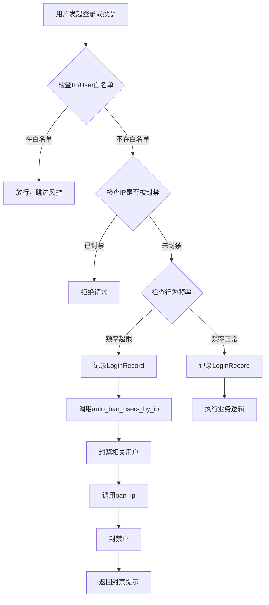

# 安全与风控模型

<cite>
**本文档中引用的文件**  
- [app.py](file://src/app.py)
</cite>

## 目录
1. [引言](#引言)
2. [核心数据模型概述](#核心数据模型概述)
3. [IpBanRecord 模型详解](#ipbanrecord-模型详解)
4. [白名单机制：IpWhitelist 与 UserWhitelist](#白名单机制ipwhitelist-与-userwhitelist)
5. [LoginRecord 模型与行为分析](#loginrecord-模型与行为分析)
6. [风控协同工作流程](#风控协同工作流程)
7. [实际应用案例](#实际应用案例)
8. [性能优化建议](#性能优化建议)

## 引言
本系统通过一系列数据模型实现全面的安全与风控机制，旨在防御暴力破解、刷票攻击等恶意行为。核心模型包括 `IpBanRecord`、`IpWhitelist`、`UserWhitelist` 和 `LoginRecord`，它们共同构建了一个动态、可配置的防护体系。该体系在用户登录、投票等关键操作中实时检测异常行为，并自动执行封禁或放行策略。

## 核心数据模型概述
系统中的安全与风控功能依赖于四个核心数据模型：

- **IpBanRecord**：记录被封禁的IP地址及其封禁信息。
- **IpWhitelist**：记录可绕过风控检查的IP白名单。
- **UserWhitelist**：记录可绕过风控检查的用户白名单。
- **LoginRecord**：记录用户的登录行为，用于频率控制和异常检测。

这些模型通过业务逻辑函数协同工作，形成闭环的风控流程。

**Section sources**
- [app.py](file://src/app.py#L100-L150)

## IpBanRecord 模型详解
`IpBanRecord` 模型用于实现IP封禁机制，其字段定义如下：

- **ip_address**：被封禁的IP地址（字符串，非空，唯一）。
- **banned_at**：封禁时间，默认为当前时间戳。
- **ban_reason**：封禁原因（字符串，非空）。
- **is_active**：封禁状态（布尔值，默认为True）。

该模型在系统中起到“黑名单”作用。当检测到异常行为（如高频投票或登录）时，系统会调用 `ban_ip()` 函数将相关IP加入此表，并标记为激活状态。后续请求在进入业务逻辑前会通过 `check_ip_ban()` 函数查询此表，若发现匹配且激活的记录，则直接拒绝服务。

**Section sources**
- [app.py](file://src/app.py#L130-L135)
- [app.py](file://src/app.py#L250-L260)

## 白名单机制：IpWhitelist 与 UserWhitelist
为避免误封或为特定可信实体提供例外，系统提供了两种白名单机制：

- **IpWhitelist**：存储可信IP地址，包含 `ip_address`（唯一）、`description`（描述）、`created_by`（添加人）和 `created_at`（创建时间）字段。
- **UserWhitelist**：存储可信用户，通过外键关联 `User` 表，包含 `user_id`（唯一）、`description`、`created_by` 和 `created_at` 字段。

这两个白名单通过 `check_ip_whitelist()` 和 `check_user_whitelist()` 函数进行检查。在风控逻辑（如 `check_vote_frequency` 和 `check_login_frequency`）中，若请求来源的IP或用户存在于任一白名单中，则直接跳过频率限制检查，实现例外放行。

**Section sources**
- [app.py](file://src/app.py#L140-L150)
- [app.py](file://src/app.py#L240-L245)

## LoginRecord 模型与行为分析
`LoginRecord` 模型用于记录用户的登录行为，其字段包括：

- **user_id**：登录用户ID（外键关联User）。
- **ip_address**：登录IP地址（非空）。
- **login_time**：登录时间，默认为当前时间戳。
- **user_agent**：用户代理字符串（可选）。

该模型为风控系统提供关键数据支持：

- **登录频率控制**：`check_login_frequency()` 函数利用此表统计指定时间窗口内同一IP登录的不同账号数量，防止一个IP注册或登录过多账号。
- **异常行为检测**：`auto_ban_users_by_ip()` 函数基于此表关联IP与用户，当某IP触发封禁时，可自动封禁该IP近期登录过的所有非管理员账户，实现联动防御。

**Section sources**
- [app.py](file://src/app.py#L120-L125)
- [app.py](file://src/app.py#L270-L290)

## 风控协同工作流程
当系统检测到异常行为时，各模型与函数协同工作的流程如下：

**Diagram sources**
- [app.py](file://src/app.py#L300-L350)
- [app.py](file://src/app.py#L450-L470)

**Section sources**
- [app.py](file://src/app.py#L300-L500)

## 实际应用案例
### 防御暴力破解
当攻击者使用同一IP尝试登录多个账号时，`check_login_frequency()` 检测到该IP在设定时间窗口内登录账号数超限，触发 `auto_ban_users_by_ip()` 和 `ban_ip()`，自动封禁该IP及已创建的恶意账号，阻止进一步攻击。

### 防御刷票攻击
当某IP在短时间内为多个作品投票，`check_vote_frequency()` 检测到投票次数超限，立即触发自动封禁流程，将该IP加入 `IpBanRecord`，并封禁其关联的投票账号，有效遏制刷票行为。

**Section sources**
- [app.py](file://src/app.py#L360-L380)
- [app.py](file://src/app.py#L520-L540)

## 性能优化建议
为确保风控查询的高效性，建议对以下字段建立数据库索引：

- `IpBanRecord.ip_address`：加速封禁IP的查询。
- `IpWhitelist.ip_address`：加速白名单IP的查询。
- `LoginRecord.ip_address` 和 `login_time`：加速基于IP和时间窗口的登录频率统计。
- `Vote.ip_address` 和 `created_at`：加速投票频率统计。

这些索引将显著提升风控检查的响应速度，特别是在高并发场景下。

**Section sources**
- [app.py](file://src/app.py#L270-L290)
- [app.py](file://src/app.py#L360-L380)