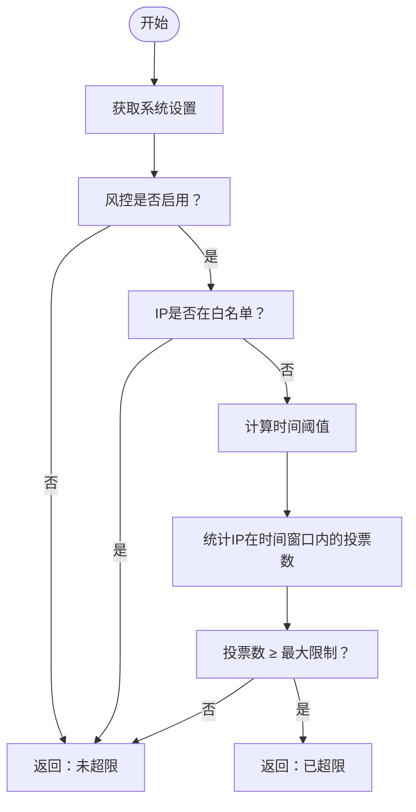
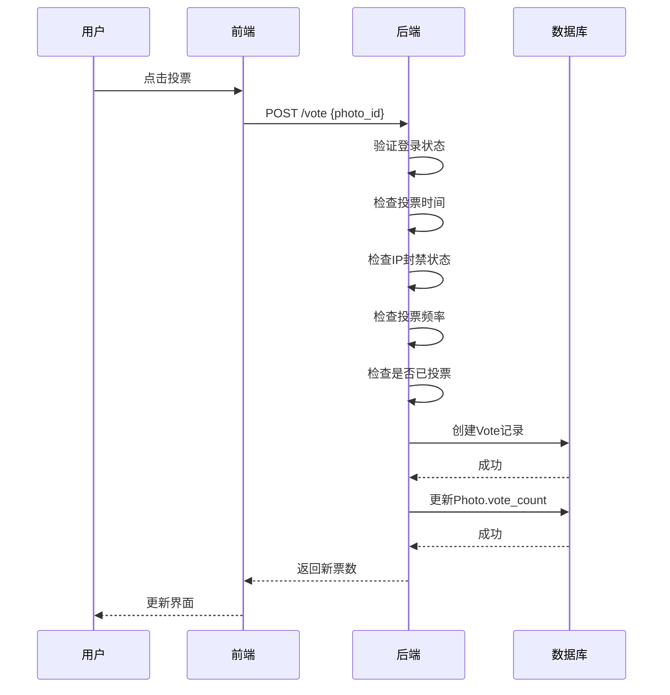

# 投票模型 (Vote)

<cite>
**本文档中引用的文件**   
- [app.py](file://src/app.py)
- [app_test.py](file://src/app_test.py)
</cite>

## 目录
1. [投票模型设计概述](#投票模型设计概述)
2. [核心字段解析](#核心字段解析)
3. [外键约束与数据完整性](#外键约束与数据完整性)
4. [时间窗口与频率控制](#时间窗口与频率控制)
5. [IP地址在风控中的作用](#ip地址在风控中的作用)
6. [业务规则实现机制](#业务规则实现机制)
7. [投票与取消投票逻辑](#投票与取消投票逻辑)
8. [票数同步与数据库事务](#票数同步与数据库事务)
9. [索引优化建议](#索引优化建议)
10. [常见问题与调试方法](#常见问题与调试方法)

## 投票模型设计概述

投票模型（Vote）是摄影比赛系统中的核心数据结构，用于记录用户对参赛作品的投票行为。该模型通过外键关联用户（User）和作品（Photo），确保投票行为的合法性与可追溯性。模型设计充分考虑了防刷票、频率控制、IP追踪等风控需求，支持“每人一票”、“单IP限投”等业务规则的实现。

**Section sources**
- [app.py](file://src/app.py#L76-L81)
- [app_test.py](file://src/app_test.py#L55-L60)

## 核心字段解析

投票模型包含以下核心字段：

- **id**: 主键，唯一标识每一条投票记录。
- **user_id**: 外键，关联用户表（User），标识投票用户。
- **photo_id**: 外键，关联作品表（Photo），标识被投票的作品。
- **created_at**: 时间戳，记录投票发生的时间，用于时间窗口内的频率控制。
- **ip_address**: 字符串，记录发起投票请求的客户端IP地址，用于风控策略。

这些字段共同构成了投票行为的完整上下文，为后续的统计分析、反作弊机制提供了数据基础。

**Section sources**
- [app.py](file://src/app.py#L76-L81)
- [app_test.py](file://src/app_test.py#L55-L60)

## 外键约束与数据完整性

投票模型通过外键约束确保数据的引用完整性：

- `user_id` 字段引用 `user.id`，确保每一条投票记录都对应一个真实存在的用户。
- `photo_id` 字段引用 `photo.id`，确保投票对象是系统中存在的作品。

这种设计防止了无效或孤立的投票记录，保证了数据的一致性和可靠性。当用户或作品被删除时，数据库的级联规则将决定投票记录的处理方式（本系统中未显式定义级联，需根据实际数据库配置确定）。

**Section sources**
- [app.py](file://src/app.py#L76-L81)

## 时间窗口与频率控制

`created_at` 字段在风控策略中扮演关键角色，主要用于实现时间窗口内的频率控制。系统通过 `check_vote_frequency` 函数检查IP地址在指定时间窗口内的投票次数：

**Diagram sources**
- [app.py](file://src/app.py#L396-L418)
- [app_test.py](file://src/app_test.py#L375-L397)

## IP地址在风控中的作用

`ip_address` 字段是实现风控策略的核心：

- **IP封禁**: 系统可手动或自动将异常IP加入封禁列表（IpBanRecord），阻止其后续投票。
- **投票频率限制**: 结合 `created_at` 字段，统计单个IP在时间窗口内的投票次数，防止刷票。
- **自动封禁机制**: 当检测到某个IP存在异常行为（如投票频率超限），系统可自动封禁该IP及其关联的用户账户。

该字段的引入显著增强了系统的安全性和公平性。

**Section sources**
- [app.py](file://src/app.py#L76-L81)
- [app.py](file://src/app.py#L396-L418)

## 业务规则实现机制

投票模型支持多种业务规则的实现：

- **每人一票 (one_vote_per_user)**: 当系统设置 `one_vote_per_user` 为 `True` 时，通过查询 `Vote` 表中该用户是否存在任何投票记录来判断是否允许投票。
- **单IP限投**: 通过 `check_vote_frequency` 函数结合 `ip_address` 和 `created_at` 字段实现。

这些规则在 `vote` 接口处理逻辑中被严格执行，确保了投票活动的公平性。

**Section sources**
- [app.py](file://src/app.py#L709-L711)
- [app.py](file://src/app.py#L638-L670)

## 投票与取消投票逻辑

投票和取消投票操作通过REST API实现：

取消投票逻辑类似，通过 `/cancel_vote` 接口删除投票记录并减少票数。

**Diagram sources**
- [app.py](file://src/app.py#L709-L711)
- [app.py](file://src/app.py#L638-L670)

## 票数同步与数据库事务

投票操作涉及两个数据变更：创建 `Vote` 记录和更新 `Photo.vote_count`。系统通过数据库事务确保这两个操作的原子性：

1. 开始事务
2. 创建 `Vote` 记录
3. 增加 `Photo.vote_count`
4. 提交事务

若任一操作失败，事务将回滚，避免数据不一致。这种设计保证了票数统计的准确性。

**Section sources**
- [app.py](file://src/app.py#L638-L670)

## 索引优化建议

为提升查询性能，建议在以下字段上建立索引：

- **(user_id, photo_id)**: 加速检查用户是否已对某作品投票的查询。
- **(ip_address, created_at)**: 加速 `check_vote_frequency` 函数中的时间窗口内投票统计。
- **photo_id**: 加速按作品统计票数的查询。

这些索引能显著降低数据库查询的复杂度，提高系统响应速度。

**Section sources**
- [app.py](file://src/app.py#L76-L81)
- [app.py](file://src/app.py#L396-L418)

## 常见问题与调试方法

### 重复投票问题
- **现象**: 用户可重复对同一作品投票。
- **排查**: 检查 `vote` 接口逻辑中 `Vote.query.filter_by(user_id=user_id, photo_id=photo_id).first()` 的执行结果。

### IP记录缺失
- **现象**: `ip_address` 字段为空。
- **排查**: 检查 `get_client_ip()` 函数的实现，确保正确处理 `HTTP_X_FORWARDED_FOR`、`HTTP_X_REAL_IP` 等请求头。

### 票数不同步
- **现象**: `Photo.vote_count` 与 `Vote` 表统计数不符。
- **排查**: 检查投票和取消投票逻辑中的事务处理，确保原子性。

**Section sources**
- [app.py](file://src/app.py#L638-L670)
- [app.py](file://src/app.py#L709-L711)
- [app.py](file://src/app.py#L278-L287)