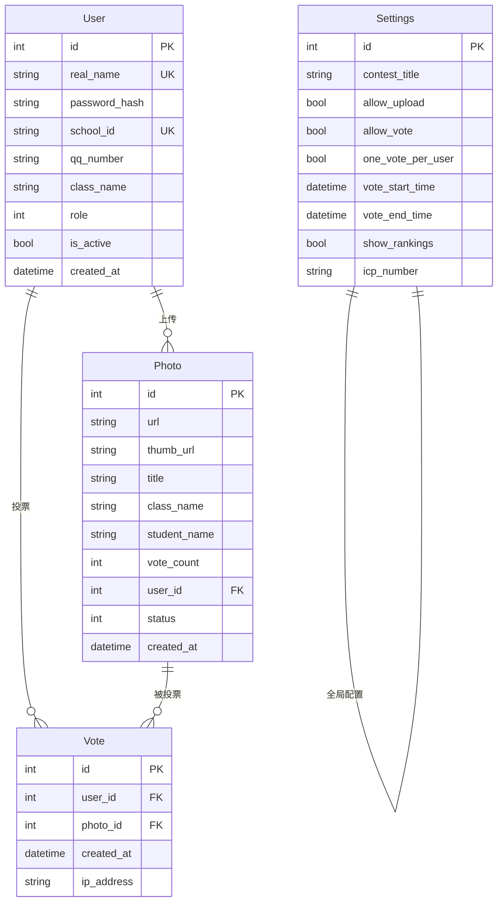
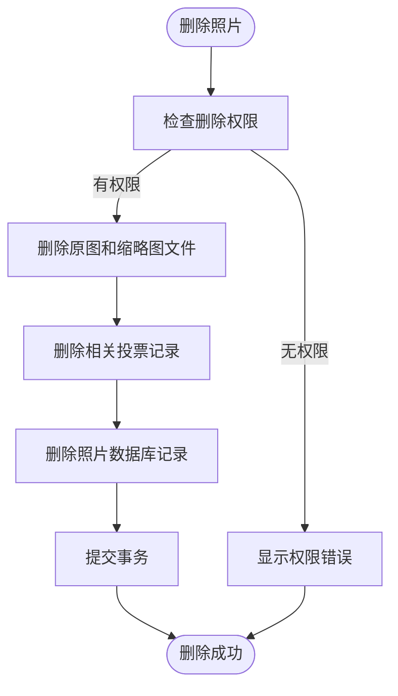
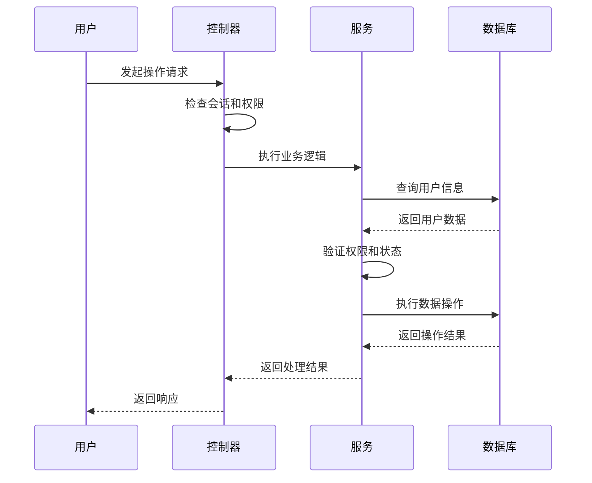

# 数据模型与数据库设计

<cite>
**本文档引用的文件**
- [app.py](file://src/app.py)
</cite>

## 目录
1. [引言](#引言)
2. [核心数据模型](#核心数据模型)
3. [模型关系分析](#模型关系分析)
4. [数据生命周期管理](#数据生命周期管理)
5. [业务功能支撑](#业务功能支撑)

## 引言
glzx-xmt项目是一个基于Flask框架的摄影比赛管理系统，其数据模型通过SQLAlchemy ORM定义，支撑用户管理、作品上传、投票评选等核心业务功能。本文档全面记录了系统中的核心数据模型，包括User、Photo、Vote、Settings等实体，详细描述其字段定义、约束条件、索引设置及业务逻辑。

## 核心数据模型

### 用户模型 (User)
用户模型是系统的核心实体，用于管理所有用户信息和权限。

**字段定义：**
- `id`: 整数类型，主键，自增
- `real_name`: 字符串(50)，唯一约束，不可为空，用作登录账号
- `password_hash`: 字符串(120)，不可为空，存储密码哈希值
- `school_id`: 字符串(20)，唯一约束，可为空，存储校学号
- `qq_number`: 字符串(15)，不可为空，存储QQ号码
- `class_name`: 字符串(50)，不可为空，存储班级信息
- `role`: 整数类型，默认值1，表示用户角色（1=普通用户, 2=普通管理员, 3=系统管理员）
- `is_active`: 布尔类型，默认值True，表示账户是否激活
- `created_at`: 日期时间类型，默认值为当前时间戳

**业务逻辑：**
- `real_name`作为登录账号，必须唯一
- `school_id`为可选字段，但若填写则必须唯一
- `role`字段实现三级权限控制
- `is_active`用于软删除和账户禁用功能

**Section sources**
- [app.py](file://src/app.py#L45-L59)

### 照片模型 (Photo)
照片模型用于管理用户上传的摄影作品。

**字段定义：**
- `id`: 整数类型，主键，自增
- `url`: 字符串(128)，存储原图文件路径
- `thumb_url`: 字符串(128)，存储缩略图文件路径
- `title`: 字符串(100)，可为空，存储作品名称
- `class_name`: 字符串(32)，存储班级信息
- `student_name`: 字符串(32)，存储学生姓名
- `vote_count`: 整数类型，默认值0，存储投票计数
- `user_id`: 整数类型，外键关联User.id，不可为空
- `status`: 整数类型，默认值0，表示审核状态（0=待审核, 1=已通过, 2=已拒绝）
- `created_at`: 日期时间类型，默认值为当前时间戳

**业务逻辑：**
- `vote_count`字段用于排行榜排序
- `status`字段实现作品审核流程
- 与用户模型建立一对多关系

**Section sources**
- [app.py](file://src/app.py#L61-L75)

### 投票模型 (Vote)
投票模型用于记录用户的投票行为。

**字段定义：**
- `id`: 整数类型，主键，自增
- `user_id`: 整数类型，外键关联User.id，不可为空
- `photo_id`: 整数类型，外键关联Photo.id，不可为空
- `created_at`: 日期时间类型，默认值为当前时间戳
- `ip_address`: 字符串(45)，可为空，记录投票IP地址

**业务逻辑：**
- 通过`user_id`和`photo_id`的组合确保用户对同一作品只能投一次票
- `ip_address`用于风控和反作弊机制
- 与用户和照片模型建立双向关系

**Section sources**
- [app.py](file://src/app.py#L76-L82)

### 设置模型 (Settings)
设置模型用于管理系统级配置。

**字段定义：**
- `id`: 整数类型，主键，自增
- `contest_title`: 字符串(100)，默认值"2025年摄影比赛"
- `allow_upload`: 布尔类型，默认值True，控制上传功能开关
- `allow_vote`: 布尔类型，默认值True，控制投票功能开关
- `one_vote_per_user`: 布尔类型，默认值False，限制每个用户只能投一次票
- `vote_start_time`: 日期时间类型，可为空，投票开始时间
- `vote_end_time`: 日期时间类型，可为空，投票结束时间
- `show_rankings`: 布尔类型，默认值True，控制排行榜显示
- `icp_number`: 字符串(100)，可为空，ICP备案号
- `risk_control_enabled`: 布尔类型，默认值True，是否启用风控
- `max_votes_per_ip`: 整数类型，默认值10，单IP最大投票次数
- `vote_time_window`: 整数类型，默认值60，投票时间窗口（分钟）
- `max_accounts_per_ip`: 整数类型，默认值5，单IP最大登录账号数
- `account_time_window`: 整数类型，默认值1440，账号登录时间窗口（分钟）
- `watermark_enabled`: 布尔类型，默认值True，是否启用水印
- `watermark_text`: 字符串(200)，默认值"{contest_title}-{student_name}-{qq_number}"，水印文本格式
- `watermark_opacity`: 浮点类型，默认值0.3，水印透明度
- `watermark_position`: 字符串(20)，默认值"bottom_right"，水印位置
- `watermark_font_size`: 整数类型，默认值20，水印字体大小

**业务逻辑：**
- 集中管理所有系统配置
- 支持动态修改并立即生效
- 包含风控、水印等高级功能配置

**Section sources**
- [app.py](file://src/app.py#L97-L125)

## 模型关系分析

**Diagram sources**
- [app.py](file://src/app.py#L45-L125)

### 用户与照片关系
用户与照片之间存在一对多关系，一个用户可以上传多张照片。通过`Photo.user_id`外键关联`User.id`实现。当用户删除时，其上传的所有照片也会被级联删除。

### 照片与投票关系
照片与投票之间存在一对多关系，一张照片可以被多个用户投票。通过`Vote.photo_id`外键关联`Photo.id`实现。投票记录包含用户和IP信息，用于防作弊。

### 用户与投票关系
用户与投票之间存在一对多关系，一个用户可以对多张照片进行投票。通过`Vote.user_id`外键关联`User.id`实现。结合`Settings.one_vote_per_user`配置，可实现"每人只能投一次票"的业务需求。

**Section sources**
- [app.py](file://src/app.py#L45-L125)

## 数据生命周期管理

### 照片删除策略
当删除照片时，系统执行级联删除操作：
1. 删除服务器上的原图和缩略图文件
2. 删除数据库中的投票记录
3. 删除数据库中的照片记录

此策略确保数据一致性，避免产生孤立文件和记录。

**Diagram sources**
- [app.py](file://src/app.py#L270-L288)

### 投票记录保留策略
投票记录采用永久保留策略，不进行自动清理。这种设计确保了：
- 投票历史可追溯
- 防作弊分析有数据支持
- 系统审计功能完整

只有在删除照片时，相关的投票记录才会被级联删除。

### 用户删除策略
删除用户时，系统执行完整的级联删除：
1. 删除用户上传的所有照片及其文件
2. 删除用户相关的投票记录
3. 删除用户本身

此策略确保用户数据的彻底清理，同时保护系统管理员账户不被删除。

**Section sources**
- [app.py](file://src/app.py#L270-L288)

## 业务功能支撑

### 用户管理功能
数据模型通过以下方式支撑用户管理：
- `role`字段实现三级权限控制
- `is_active`字段支持账户激活/禁用
- `school_id`和`qq_number`提供用户身份验证
- `created_at`记录用户注册时间

### 投票计数功能
投票计数功能通过以下机制实现：
- `Photo.vote_count`字段存储实时票数
- 每次投票时原子性地增加计数
- 支持按票数排序的排行榜
- `Vote.created_at`支持投票时间分析

### 权限判断功能
权限判断通过以下方式实现：
- 装饰器模式封装权限检查逻辑
- `role`字段值比较实现权限分级
- `is_active`状态检查确保账户有效性
- 结合会话管理实现安全控制

**Diagram sources**
- [app.py](file://src/app.py#L140-L158)

**Section sources**
- [app.py](file://src/app.py#L140-L158)