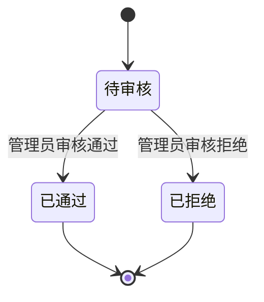
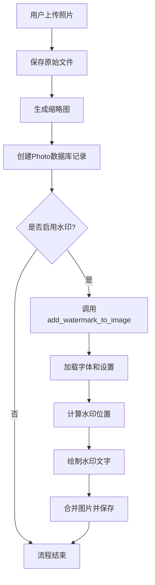

# 照片模型 (Photo)

<cite>
**本文档中引用的文件**   
- [app.py](file://src/app.py)
- [app_test.py](file://src/app_test.py)
</cite>

## 目录
1. [简介](#简介)
2. [核心字段与数据结构](#核心字段与数据结构)
3. [状态机设计与审核流程](#状态机设计与审核流程)
4. [投票计数机制](#投票计数机制)
5. [关系模型](#关系模型)
6. [上传与图像处理流程](#上传与图像处理流程)
7. [功能支撑分析](#功能支撑分析)
8. [性能优化策略](#性能优化策略)
9. [常见问题排查指南](#常见问题排查指南)
10. [结论](#结论)

## 简介
`Photo` 模型是本系统中用于管理用户上传摄影作品的核心数据结构。该模型不仅存储照片的基本信息，还通过状态机控制审核流程、支持投票机制，并与用户系统深度集成。本文档全面描述其结构、行为及在系统中的关键作用。

## 核心字段与数据结构

`Photo` 模型包含以下核心字段，定义了每张照片的元数据和状态：

- **id**: 主键，唯一标识每张照片。
- **url**: 存储照片原始文件的路径（相对路径），用于前端展示高清图。
- **thumb_url**: 存储缩略图文件的路径（相对路径），用于列表页快速加载。
- **title**: 作品名称，可为空，允许用户自定义标题。
- **class_name**: 学生所在班级名称，从上传用户信息中自动填充。
- **student_name**: 学生姓名，即上传用户的 `real_name`，用于标识作者。
- **vote_count**: 投票计数，冗余设计以提升排行榜查询性能，默认值为0。
- **user_id**: 外键，关联 `User` 模型，标识照片的上传者。
- **status**: 审核状态字段，实现状态机逻辑（0=待审核, 1=已通过, 2=已拒绝），默认为0。
- **created_at**: 创建时间戳，记录照片上传时间。

**Section sources**
- [app.py](file://src/app.py#L61-L74)

## 状态机设计与审核流程

`status` 字段是照片审核工作流的核心，采用整数枚举实现状态机：

- **0 = 待审核 (Pending)**: 照片刚上传时的初始状态，仅上传者本人可见。
- **1 = 已通过 (Approved)**: 管理员审核通过后设置，照片对所有用户可见，可参与投票。
- **2 = 已拒绝 (Rejected)**: 管理员审核拒绝后设置，照片对普通用户不可见。

### 审核流程实现

1. **上传**: 用户上传照片后，`status` 被设为 `0`。
2. **待审列表**: 管理员通过 `/admin/review` 路由查看所有 `status=0` 的照片。
3. **审核操作**:
   - **通过**: 调用 `/approve_photo/<photo_id>` 路由，将 `status` 更新为 `1`。
   - **拒绝**: 调用 `/reject_photo/<photo_id>` 路由，将 `status` 更新为 `2`。

此状态机确保了内容的可控性，只有通过审核的照片才能进入公开展示和投票环节。



**Diagram sources**
- [app.py](file://src/app.py#L61-L74)
- [app.py](file://src/app.py#L1175-L1184)
- [app.py](file://src/app.py#L1187-L1196)

**Section sources**
- [app.py](file://src/app.py#L61-L74)
- [app.py](file://src/app.py#L1175-L1196)

## 投票计数机制

`vote_count` 字段采用**冗余计数**的设计，而非实时计算 `votes` 关系的数量。

### 计数逻辑

- **增加**: 当用户成功投票时，系统在创建 `Vote` 记录的同时，直接对对应 `Photo` 的 `vote_count` 字段执行 `+= 1` 操作。
- **减少**: 当用户取消投票时，系统在删除 `Vote` 记录的同时，对 `vote_count` 执行 `-= 1` 操作。

这种设计避免了在生成排行榜时进行昂贵的 `COUNT(*)` 聚合查询，极大地提升了读取性能，尤其是在照片和投票数量庞大的情况下。

**Section sources**
- [app.py](file://src/app.py#L61-L74)
- [app.py](file://src/app.py#L970-L986)

## 关系模型

`Photo` 模型通过外键和关系属性与其他模型建立关联：

### 与 `User` 模型的一对多关系

- **外键**: `user_id` 字段是 `User` 模型的外键 (`db.ForeignKey('user.id')`)，表明一张照片属于一个用户。
- **关系定义**: 在 `User` 模型中，`photos = db.relationship('Photo', backref='user', lazy=True)` 定义了反向关系。这使得可以通过 `user.photos` 访问该用户上传的所有照片。

### 与 `Vote` 模型的一对多关系

- **关系定义**: `votes = db.relationship('Vote', backref='photo', lazy=True)` 在 `Photo` 模型中定义。这表明一张照片可以有多个投票记录。
- **外键**: 在 `Vote` 模型中，`photo_id` 字段是 `Photo` 模型的外键。
- **访问方式**: 可以通过 `photo.votes` 获取该照片的所有投票记录，用于分析投票详情或实现取消投票功能。

```mermaid
erDiagram
USER {
id PK
real_name
qq_number
class_name
}
PHOTO {
id PK
title
vote_count
user_id FK
status
}
VOTE {
id PK
user_id FK
photo_id FK
}
USER ||--o{ PHOTO : "上传"
USER ||--o{ VOTE : "投票"
PHOTO ||--o{ VOTE : "拥有"
```

**Diagram sources**
- [app.py](file://src/app.py#L61-L74)
- [app.py](file://src/app.py#L31-L40)
- [app.py](file://src/app.py#L75-L82)

**Section sources**
- [app.py](file://src/app.py#L61-L74)
- [app.py](file://src/app.py#L31-L40)
- [app.py](file://src/app.py#L75-L82)

## 上传与图像处理流程

照片的上传和处理是一个完整的流程，涉及文件操作和图像处理：

1.  **文件上传**: 用户通过 `POST /upload` 提交文件。
2.  **文件保存**: 原始文件被保存到 `UPLOAD_FOLDER` (如 `static/uploads`)，并生成唯一的文件名。
3.  **缩略图生成**: 使用 `PIL.Image.thumbnail()` 方法生成尺寸为 180x120 的缩略图，并保存到 `THUMB_FOLDER` (如 `static/thumbs`)。
4.  **数据库记录**: 创建 `Photo` 记录，`url` 和 `thumb_url` 存储文件的相对路径（以 `/` 开头），`status` 设为 `0`。
5.  **水印添加 (可选)**: `add_watermark_to_image` 函数在需要时被调用，为图片添加动态水印。

### 水印添加函数 (`add_watermark_to_image`)

该函数为图片添加可配置的水印：

- **水印文本**: 通过 `Settings.watermark_text` 格式化，可包含 `{contest_title}`, `{student_name}`, `{qq_number}` 等变量。
- **字体加载**: 优先尝试加载系统中文字体（如鸿蒙、微软雅黑），若失败则使用默认字体。
- **位置与透明度**: 水印位置和透明度由 `Settings` 模型控制。
- **实现方式**: 创建一个透明图层，绘制水印文字，然后与原图合并，最后保存为新的 JPEG 文件。



**Diagram sources**
- [app.py](file://src/app.py#L800-L1599)
- [app.py](file://src/app.py#L221-L339)

**Section sources**
- [app.py](file://src/app.py#L800-L1599)
- [app.py](file://src/app.py#L221-L339)

## 功能支撑分析

`Photo` 模型是多个核心功能的基础：

- **照片展示**: 在首页 (`/`) 通过 `Photo.query.filter_by(status=1)` 查询所有已通过的照片进行展示。
- **排行榜计算**: 在 `/rankings` 路由中，通过 `Photo.query.filter_by(status=1).order_by(Photo.vote_count.desc())` 获取数据，并计算排名，支持并列处理。
- **审核工作流**: 如前所述，`status` 字段驱动了从上传到审核的完整工作流。

## 性能优化策略

模型设计中包含了多项性能优化：

- **冗余计数 (`vote_count`)**: 避免实时聚合，使排行榜查询成为简单的排序操作，性能为 O(n log n) 而非 O(n)。
- **路径存储策略**: `url` 和 `thumb_url` 仅存储文件的相对路径，而非二进制数据，减轻了数据库负担，文件由 Web 服务器直接提供。
- **懒加载 (`lazy=True`)**: 与 `User` 和 `Vote` 的关系采用懒加载，只有在访问时才查询相关数据，减少了不必要的 JOIN 操作。

## 常见问题排查指南

### 状态更新失败

- **现象**: 管理员点击“通过”或“拒绝”后，状态未改变。
- **排查**:
  1. 检查路由 `/approve_photo/<photo_id>` 或 `/reject_photo/<photo_id>` 是否被正确调用。
  2. 确认 `photo_id` 是否存在且有效。
  3. 检查数据库事务是否成功提交 (`db.session.commit()`)。
  4. 查看日志是否有异常抛出。

### 计数不一致

- **现象**: `vote_count` 显示的票数与实际投票记录数量不符。
- **排查**:
  1. 检查投票和取消投票的逻辑是否都正确地更新了 `vote_count`。
  2. 确保在创建/删除 `Vote` 记录和更新 `vote_count` 时，操作在同一个数据库事务中完成，避免因异常导致数据不一致。
  3. 检查是否有直接操作数据库（绕过应用逻辑）导致计数未同步。

## 结论

`Photo` 模型是系统的核心，其设计兼顾了功能性、性能和可维护性。通过清晰的状态机、冗余计数和合理的关联关系，它有效地支撑了照片上传、审核、展示和投票等关键业务流程。对 `add_watermark_to_image` 等辅助函数的集成，也体现了系统在细节处理上的完整性。