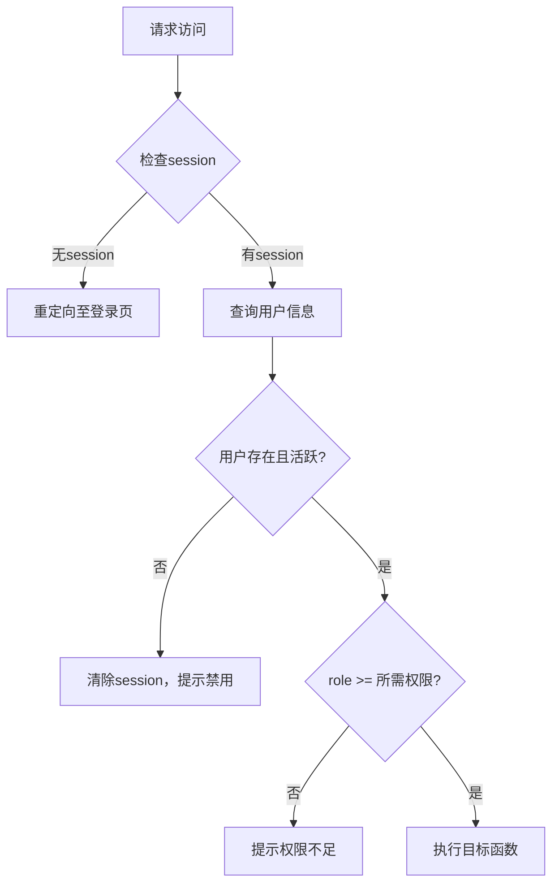

# 用户模型 (User)

<cite>
**本文档中引用的文件**  
- [app.py](file://src/app.py)
- [app_test.py](file://src/app_test.py)
</cite>

## 目录
1. [用户模型 (User)](#用户模型-user)
2. [字段定义与业务含义](#字段定义与业务含义)
3. [角色权限分级](#角色权限分级)
4. [账户状态管理](#账户状态管理)
5. [与其他模型的关系](#与其他模型的关系)
6. [核心功能实现](#核心功能实现)
7. [常见问题与解决方案](#常见问题与解决方案)
8. [结论](#结论)

## 字段定义与业务含义

用户模型 `User` 定义了系统中用户的核心信息，其字段设计兼顾了身份识别、安全性和业务扩展性。以下是各字段的详细说明：

- **id**：整数类型，主键，自增。唯一标识每个用户。
- **real_name**：字符串（50字符），唯一且非空。作为用户的登录账号使用，取代传统用户名，增强真实性和可追溯性。
- **password_hash**：字符串（120字符），非空。存储使用 `Werkzeug` 的 `generate_password_hash` 生成的密码哈希值，确保密码安全。
- **school_id**：字符串（20字符），唯一且可为空。用于存储学生的校内学号，可选字段，便于学校内部管理。
- **qq_number**：字符串（15字符），非空。用户的QQ号码，用于联系和身份验证。
- **class_name**：字符串（50字符），非空。用户所属班级名称，用于分类和展示。
- **role**：整数类型，默认值为1。表示用户的角色权限等级。
- **is_active**：布尔类型，默认值为 `True`。表示账户是否处于激活状态。
- **created_at**：日期时间类型，默认值为当前时间戳。记录用户注册时间。

**Section sources**
- [app.py](file://src/app.py#L45-L59)
- [app_test.py](file://src/app_test.py#L24-L38)

## 角色权限分级

`role` 字段实现了系统的权限控制体系，通过整数值区分不同级别的用户权限：

- **1 = 普通用户**：拥有基本功能权限，如登录、上传作品、投票、修改个人密码等。
- **2 = 普通管理员**：在普通用户基础上，拥有审核作品、管理用户等权限。
- **3 = 系统管理员**：最高权限，可进行系统设置、封禁IP、管理协议等全局操作。

权限控制通过装饰器函数实现，确保只有具备相应权限的用户才能访问特定路由：



**Diagram sources**
- [app.py](file://src/app.py#L100-L140)

**Section sources**
- [app.py](file://src/app.py#L55)
- [app.py](file://src/app.py#L100-L140)

## 账户状态管理

`is_active` 字段是实现账户封禁机制的核心。当用户因违规行为被管理员禁用时，其 `is_active` 值将被设为 `False`。

- **登录时检查**：`login_required` 装饰器在每次请求时都会检查用户的 `is_active` 状态。若为 `False`，则清除其会话并提示“账户已被禁用”。
- **自动封禁机制**：系统通过风控逻辑（如 `check_login_frequency`）检测异常行为（如单IP登录过多账号）。一旦触发阈值，`auto_ban_users_by_ip` 函数会自动将相关非管理员用户的 `is_active` 设为 `False`，实现自动封禁。

此设计实现了软删除效果，保留了用户的历史数据（如上传的作品、投票记录），同时阻止其继续使用系统。

**Section sources**
- [app.py](file://src/app.py#L56)
- [app.py](file://src/app.py#L100-L110)
- [app.py](file://src/app.py#L380-L390)

## 与其他模型的关系

用户模型通过外键和关系映射，与其他核心模型建立了清晰的数据关联。

### 一对多关系

- **与 Photo 的关系**：
  - **关联方式**：`User` 通过 `user_id` 外键与 `Photo` 关联。
  - **业务含义**：一个用户可以上传多张照片。
  - **代码实现**：在 `User` 模型中定义 `photos = db.relationship('Photo', backref='user', lazy=True)`，可通过 `user.photos` 直接访问其所有作品。

- **与 Vote 的关系**：
  - **关联方式**：`User` 通过 `user_id` 外键与 `Vote` 关联。
  - **业务含义**：一个用户可以进行多次投票（受业务规则限制）。
  - **代码实现**：在 `User` 模型中定义 `votes = db.relationship('Vote', backref='user', lazy=True)`，可通过 `user.votes` 访问其投票记录。

- **与 LoginRecord 的关系**：
  - **关联方式**：`User` 通过 `user_id` 外键与 `LoginRecord` 关联。
  - **业务含义**：记录用户的每次登录行为，用于安全审计和风控。
  - **代码实现**：在 `User` 模型中定义 `login_records = db.relationship('LoginRecord', backref='user', lazy=True)`。


**Diagram sources**
- [app.py](file://src/app.py#L45-L59)
- [app.py](file://src/app.py#L61-L74)
- [app.py](file://src/app.py#L90-L98)
- [app.py](file://src/app.py#L152-L160)

### 一对一关系

- **与 UserWhitelist 的关系**：
  - **关联方式**：`UserWhitelist` 表的 `user_id` 是外键且唯一，与 `User` 的 `id` 形成一对一关系。
  - **业务含义**：用于标记特殊用户（如管理员、VIP），使其不受某些风控规则（如IP登录数量限制）的约束。
  - **代码实现**：在 `UserWhitelist` 模型中定义 `user = db.relationship('User', backref='whitelist_record')`，可通过 `user.whitelist_record` 判断其是否在白名单中。

## 核心功能实现

用户模型支撑了系统的三大核心功能：注册、登录和权限控制。

### 用户注册
```python
# 伪代码示例
def register():
    # 1. 获取表单数据
    real_name = form['real_name']
    password = form['password']
    
    # 2. 验证唯一性约束
    if User.query.filter_by(real_name=real_name).first():
        return "真实姓名已存在"
    
    # 3. 创建用户对象
    user = User(
        real_name=real_name,
        password_hash=generate_password_hash(password),
        role=1, # 默认普通用户
        is_active=True
    )
    
    # 4. 保存到数据库
    db.session.add(user)
    db.session.commit()
```

### 用户登录与密码验证
```python
# 伪代码示例
def login():
    real_name = form['real_name']
    password = form['password']
    
    # 1. 查询用户
    user = User.query.filter_by(real_name=real_name).first()
    
    # 2. 验证用户存在且活跃
    if not user or not user.is_active:
        return "账户不存在或已被禁用"
    
    # 3. 验证密码（使用哈希比对）
    if check_password_hash(user.password_hash, password):
        # 4. 创建会话
        session['user_id'] = user.id
        return "登录成功"
    else:
        return "密码错误"
```

### 账户状态管理
```python
# 伪代码示例：管理员禁用账户
def disable_user(user_id):
    user = User.query.get(user_id)
    user.is_active = False
    db.session.commit()
```

**Section sources**
- [app.py](file://src/app.py#L47)
- [app.py](file://src/app.py#L48)
- [app.py](file://src/app.py#L54)
- [app.py](file://src/app.py#L56)
- [app.py](file://src/app.py#L450-L470)
- [app.py](file://src/app.py#L200-L230)

## 常见问题与解决方案

### 1. 唯一性冲突处理
- **问题**：注册时，`real_name` 或 `school_id` 可能已存在，导致数据库唯一性约束冲突。
- **解决方案**：在注册逻辑中，提前进行 `SELECT` 查询检查。如 `app.py` 中所示，使用 `User.query.filter_by(real_name=real_name).first()` 判断是否存在，若存在则返回用户友好的提示信息，避免直接抛出数据库异常。

### 2. 密码哈希存储
- **问题**：明文存储密码存在巨大安全风险。
- **解决方案**：使用 `werkzeug.security.generate_password_hash()` 函数对原始密码进行哈希处理后再存储。验证时，使用 `check_password_hash()` 函数比对哈希值，确保密码永不以明文形式出现在系统中。

### 3. 角色权限升级
- **问题**：如何安全地将普通用户提升为管理员？
- **解决方案**：此操作必须由更高权限的管理员（如系统管理员）在后台管理界面完成。通过直接修改数据库中 `User` 表的 `role` 字段值来实现。代码中应有严格的权限检查（`super_admin_required`），确保只有系统管理员才能执行此操作。

## 结论

用户模型 `User` 是本系统的核心数据实体，其设计充分考虑了功能性、安全性和可扩展性。通过 `real_name` 作为登录名的设计，增强了用户身份的真实性；`role` 字段和权限装饰器构成了灵活的权限体系；`is_active` 字段配合风控逻辑，实现了有效的账户管理。该模型通过清晰的关系映射，与 `Photo`、`Vote` 等模型协同工作，共同支撑了用户注册、登录、作品上传、投票等核心业务流程，为整个系统的稳定运行奠定了坚实的基础。