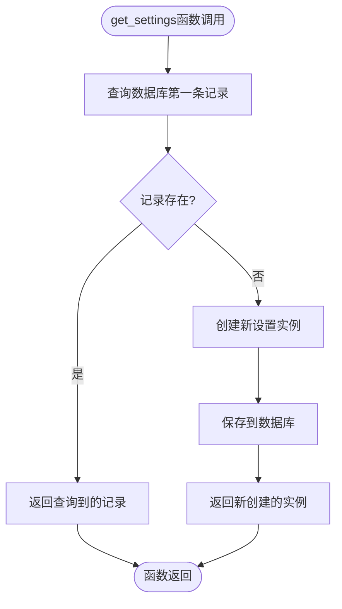
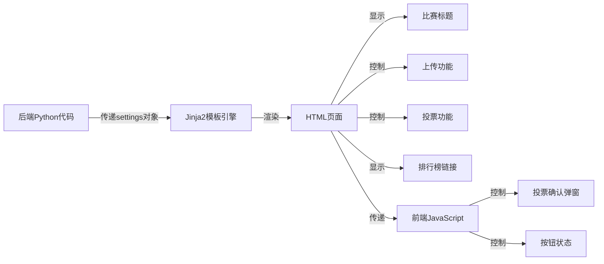
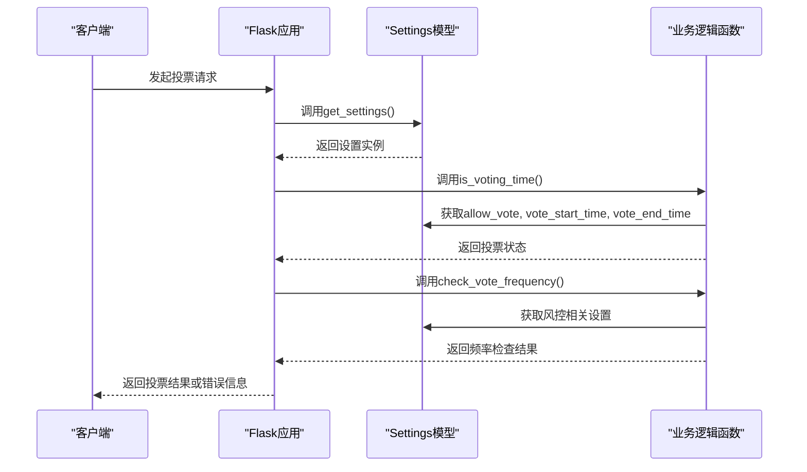

# 系统设置模型 (Settings)

<cite>
**本文档引用的文件**
- [app.py](file://src/app.py)
- [index.html](file://templates/index.html)
</cite>

## 目录
1. [简介](#简介)
2. [模型字段详解](#模型字段详解)
3. [单例模式设计原理](#单例模式设计原理)
4. [前端渲染机制](#前端渲染机制)
5. [后端逻辑引用](#后端逻辑引用)
6. [初始化与更新机制](#初始化与更新机制)
7. [安全考虑](#安全考虑)

## 简介
系统设置模型（Settings）是本应用的核心配置组件，负责存储和管理影响整个系统行为的全局配置。该模型采用单例模式设计，确保系统中仅存在一条设置记录，从而保证配置的一致性和统一性。通过该模型，管理员可以灵活调整比赛标题、功能开关、投票规则、时间窗口、排行榜可见性、备案信息、风控参数以及水印配置等关键设置，实现对系统行为的全面定制化控制。

## 模型字段详解
系统设置模型包含以下字段，分为多个功能类别：

### 基础设置
- **contest_title**：比赛标题，用于在前端页面显示当前活动的名称，默认值为"2025年摄影比赛"。
- **allow_upload**：上传功能开关，布尔值，控制用户是否可以上传照片，默认启用。
- **allow_vote**：投票功能开关，布尔值，控制用户是否可以进行投票操作，默认启用。

### 投票规则
- **one_vote_per_user**：单用户投票限制，布尔值，若启用则每个用户只能投一次票，默认关闭。
- **vote_start_time**：投票开始时间，DateTime类型，可为空，定义投票功能的开启时间。
- **vote_end_time**：投票结束时间，DateTime类型，可为空，定义投票功能的关闭时间。

### 显示设置
- **show_rankings**：排行榜可见性，布尔值，控制是否显示票数排行榜，默认启用。
- **icp_number**：ICP备案号，字符串类型，可为空，用于在页面底部显示网站备案信息。

### 风控参数
- **risk_control_enabled**：风控功能开关，布尔值，控制是否启用IP相关的风控机制，默认启用。
- **max_votes_per_ip**：单IP最大投票次数，整数类型，默认值为10次。
- **vote_time_window**：投票时间窗口，整数类型，单位为分钟，默认值为60分钟。
- **max_accounts_per_ip**：单IP最大登录账号数，整数类型，默认值为5个。
- **account_time_window**：账号登录时间窗口，整数类型，单位为分钟，默认值为1440分钟（24小时）。

### 水印配置
- **watermark_enabled**：水印功能开关，布尔值，控制是否为上传的图片添加水印，默认启用。
- **watermark_text**：水印文本格式，字符串类型，支持模板变量如{contest_title}、{student_name}、{qq_number}等，默认格式为"{contest_title}-{student_name}-{qq_number}"。
- **watermark_opacity**：水印透明度，浮点数类型，范围0.1-1.0，默认值为0.3。
- **watermark_position**：水印位置，字符串类型，可选值包括"top_left"、"top_right"、"bottom_left"、"bottom_right"、"center"，默认为"bottom_right"。
- **watermark_font_size**：水印字体大小，整数类型，单位为像素，默认值为20。

**Section sources**
- [app.py](file://src/app.py#L97-L124)

## 单例模式设计原理
系统设置模型采用单例模式设计，通过`get_settings()`函数确保系统中仅存在一条设置记录。这种设计原理基于以下考虑：

1. **全局一致性**：系统配置应当是全局唯一的，避免不同部分读取到不同的配置值导致行为不一致。
2. **简化管理**：管理员只需维护一条记录，降低了配置管理的复杂性。
3. **性能优化**：避免了多次查询和加载配置的开销，提高系统性能。

`get_settings()`函数的实现逻辑如下：首先尝试从数据库查询第一条设置记录，如果不存在则创建一个新的默认设置实例并保存到数据库，最后返回该实例。这种"查询-创建-返回"的模式确保了无论何时调用该函数，都能获得一个有效的设置对象。

**Diagram sources**
- [app.py](file://src/app.py#L213-L219)

**Section sources**
- [app.py](file://src/app.py#L213-L219)

## 前端渲染机制
系统设置的各项配置在前端页面中被广泛引用，主要通过模板引擎将后端传递的设置值渲染到HTML中。

在`index.html`模板中，系统设置模型的各个字段被直接引用，实现动态内容渲染：
- `contest_title`用于显示比赛标题
- `allow_vote`和投票时间设置共同决定投票功能的可用性
- `one_vote_per_user`影响投票按钮的显示逻辑
- `show_rankings`控制排行榜链接的显示与否
- `vote_start_time`和`vote_end_time`用于显示投票时间信息

前端还通过隐藏的`user-data`元素将关键设置传递给JavaScript，实现客户端的动态交互控制，如投票确认弹窗的显示逻辑和用户投票状态的判断。

**Diagram sources**
- [app.py](file://src/app.py#L341-L358)
- [index.html](file://templates/index.html#L1-L832)

**Section sources**
- [index.html](file://templates/index.html#L1-L832)

## 后端逻辑引用
系统设置模型在后端逻辑中被多个关键函数引用，影响系统的核心业务流程。

### 投票时间检查
`is_voting_time()`函数引用设置模型来判断当前是否处于可投票时间窗口内。该函数首先检查`allow_vote`开关，然后根据`vote_start_time`和`vote_end_time`与当前时间进行比较，返回相应的状态和提示信息。

### 投票频率检查
`check_vote_frequency()`函数引用风控相关设置来限制IP地址的投票频率。该函数检查`risk_control_enabled`开关，然后根据`max_votes_per_ip`和`vote_time_window`设置，统计指定时间窗口内某IP的投票次数，防止刷票行为。

### 登录频率检查
`check_login_frequency()`函数引用风控设置来限制单IP的登录账号数量。该函数根据`max_accounts_per_ip`和`account_time_window`设置，统计指定时间窗口内某IP登录的不同账号数量，防止账号滥用。

**Diagram sources**
- [app.py](file://src/app.py#L341-L358)
- [app.py](file://src/app.py#L396-L418)

**Section sources**
- [app.py](file://src/app.py#L341-L358)
- [app.py](file://src/app.py#L396-L418)

## 初始化与更新机制
系统设置模型的初始化和更新机制确保了配置的持久化和动态调整能力。

### 初始化策略
当系统首次运行或数据库中没有设置记录时，`get_settings()`函数会自动创建一条包含默认值的记录。这些默认值在模型定义时通过`default`参数指定，确保系统始终有可用的配置。

### 运行时更新
虽然当前代码未显示更新接口，但基于模型设计，可以通过标准的数据库操作来更新设置。管理员可以通过管理界面修改设置值，系统会将更改保存到数据库中，后续的`get_settings()`调用将返回更新后的配置。

更新机制的关键在于所有引用设置的地方都通过`get_settings()`函数获取最新配置，确保系统行为能及时响应配置变更。

## 安全考虑
系统在安全设计方面做出了重要考量，将敏感配置与常规设置分离管理。

### 敏感配置分离
如`SECRET_KEY`等敏感配置未存储在Settings模型中，而是通过环境变量管理。在`app.py`中，`SECRET_KEY`从环境变量`SECRET_KEY`中读取，如果未设置则使用默认值。这种设计避免了敏感信息硬编码在代码或数据库中，降低了安全风险。

### 风控机制
通过IP投票频率限制、单IP登录账号数限制等风控参数，系统能够有效防止恶意刷票和账号滥用行为。这些机制与IP白名单功能结合，既保证了系统的安全性，又为特殊需求提供了灵活性。

### 数据验证
所有设置值在使用前都经过适当的验证和处理，如时间比较、数值范围检查等，防止因配置错误导致系统异常。

**Section sources**
- [app.py](file://src/app.py#L39)
- [app.py](file://src/app.py#L97-L124)