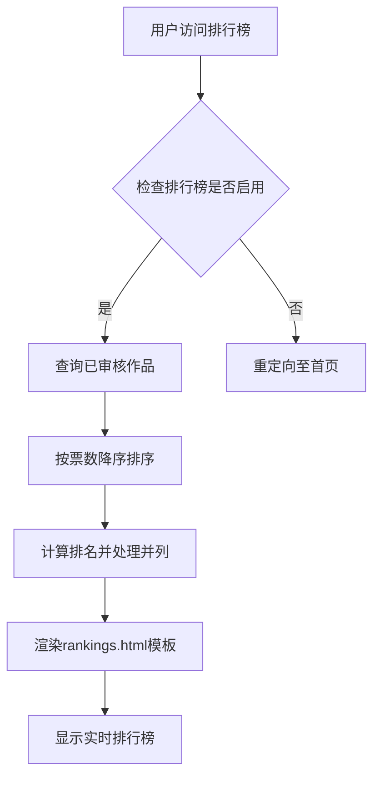

# 投票机制

<cite>
**本文档引用的文件**
- [app.py](file://src/app.py)
- [rankings.html](file://templates/rankings.html)
</cite>

## 目录
1. [投票接口事务处理逻辑](#投票接口事务处理逻辑)
2. [反刷票策略实现](#反刷票策略实现)
3. [实时排行榜更新机制](#实时排行榜更新机制)
4. [用户体验优化策略](#用户体验优化策略)
5. [异常场景容错处理](#异常场景容错处理)

## 投票接口事务处理逻辑

投票接口 `/vote` 通过数据库唯一约束和事务处理确保投票操作的原子性和一致性。当用户提交投票请求时，系统首先验证投票时间窗口、用户登录状态和IP封禁状态。在事务中，系统通过 `Vote` 模型的复合外键约束（`user_id` 和 `photo_id`）防止同一用户对同一作品重复投票。若检测到重复投票，数据库将抛出唯一性约束异常，系统返回相应错误信息。投票成功后，系统在同一个事务中同步更新 `Photo` 模型的 `vote_count` 字段并提交事务，确保数据一致性。

**Section sources**
- [app.py](file://src/app.py#L653-L699)

## 反刷票策略实现

系统通过多层风控机制防止刷票行为。首先，通过 `Vote` 表的 `user_id` 和 `photo_id` 唯一约束实现数据库层面的防重。其次，系统记录每次投票的IP地址，并通过 `Settings` 模型中的 `max_votes_per_ip` 和 `vote_time_window` 配置项实现IP频率限制。`check_vote_frequency` 函数在投票前检查指定时间窗口内同一IP的投票次数，超限则触发自动封禁机制。此外，系统还通过 `one_vote_per_user` 配置项支持全局单票制，防止用户多投。IP白名单机制允许管理员将特定IP加入白名单以豁免风控检查。

**Section sources**
- [app.py](file://src/app.py#L653-L699)
- [app.py](file://src/app.py#L285-L300)

## 实时排行榜更新机制

排行榜页面 `/rankings` 通过SQLAlchemy聚合查询生成实时排名。系统执行 `Photo.query.filter_by(status=1).order_by(Photo.vote_count.desc()).all()` 查询，获取所有已审核通过的作品并按票数降序排列。在应用层，系统遍历查询结果，通过比较相邻作品的票数来处理并列排名情况。前端模板 `rankings.html` 使用Jinja2渲染排名数据，包括作品缩略图、作者信息、票数和排名图标。排行榜数据在页面加载时实时生成，确保显示最新排名。

**Diagram sources**
- [app.py](file://src/app.py#L701-L735)
- [rankings.html](file://templates/rankings.html#L1-L501)

**Section sources**
- [app.py](file://src/app.py#L701-L735)
- [rankings.html](file://templates/rankings.html#L1-L501)

## 用户体验优化策略

为优化用户体验，系统采用页面刷新而非前端轮询来更新排名。这种设计减少了服务器压力和网络流量，同时避免了频繁请求导致的性能问题。排行榜页面通过服务端渲染确保SEO友好性，并在移动端适配良好的响应式布局。对于已登录用户，系统在首页显示其投票状态，提升交互体验。前端通过JavaScript禁用右键菜单和开发者工具快捷键，保护作品版权。排行榜前三名使用特殊样式和奖牌图标突出显示，增强视觉吸引力。

**Section sources**
- [rankings.html](file://templates/rankings.html#L1-L501)
- [app.py](file://src/app.py#L701-L735)

## 异常场景容错处理

针对网络中断等异常场景，系统采用多层容错机制。在投票接口中，所有数据库操作均在事务中执行，确保部分失败时自动回滚。若网络中断导致投票状态不一致，用户再次投票时系统会检测到重复记录并返回相应提示。对于IP封禁等风控操作，系统记录操作日志便于追溯。前端通过HTTP状态码和JSON错误信息向用户反馈具体错误原因。管理员可通过IP管理页面手动解封误封IP，或通过批量操作恢复用户权限。系统还提供投票记录分析功能，帮助识别异常投票模式。

**Section sources**
- [app.py](file://src/app.py#L653-L699)
- [app.py](file://src/app.py#L77-L90)