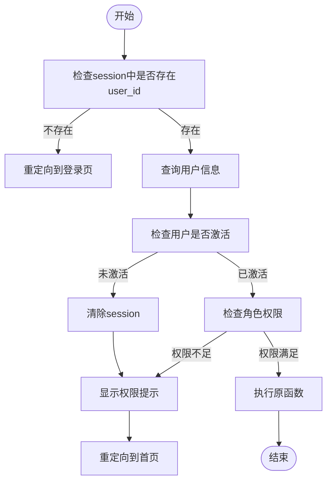
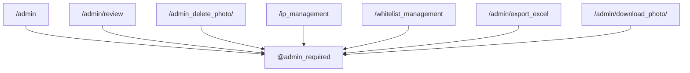
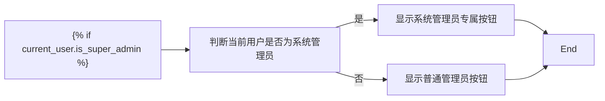
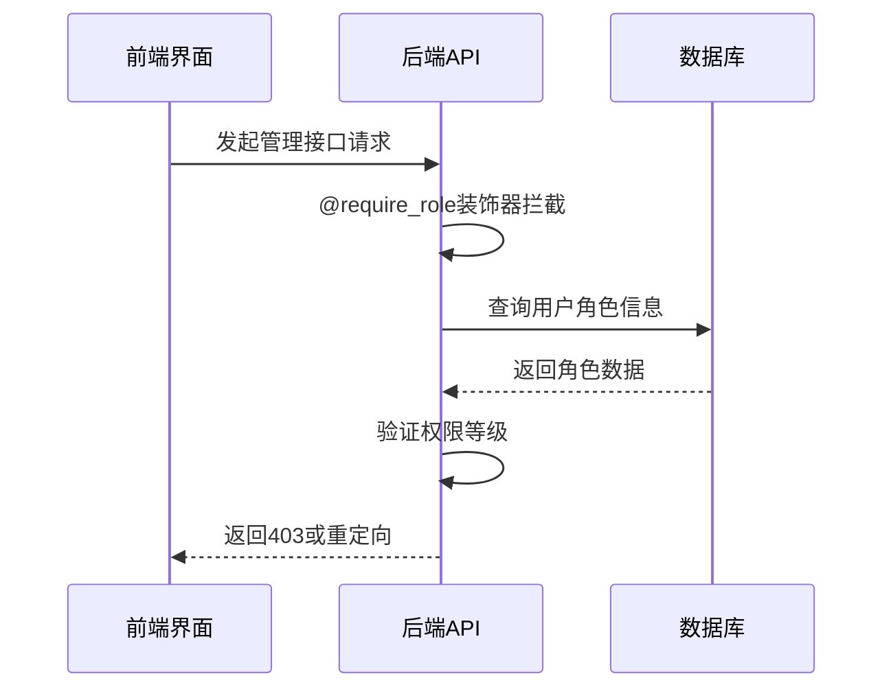

# 权限控制

<cite>
**本文档引用文件**   
- [app.py](file://src/app.py)
- [ip_management.html](file://templates/ip_management.html)
- [manage_users.html](file://templates/manage_users.html)
- [admin.html](file://templates/admin.html)
</cite>

## 目录
1. [三级权限体系概述](#三级权限体系概述)
2. [权限装饰器实现机制](#权限装饰器实现机制)
3. [管理接口路由边界](#管理接口路由边界)
4. [前后端权限双重保障](#前后端权限双重保障)
5. [权限提升与安全审计](#权限提升与安全审计)

## 三级权限体系概述

系统采用基于角色的访问控制（RBAC）模型，定义了三个层级的用户权限：

- **普通用户**（role=1）：可进行登录、上传作品、投票等基本操作
- **管理员**（role=2）：在普通用户基础上，可审核作品、管理IP等
- **系统管理员**（role=3）：拥有最高权限，可管理用户角色、系统设置等

用户角色信息存储在数据库的`User`表中，通过`role`字段（整型）表示不同权限等级。该设计采用数值比较方式实现权限继承，即高权限角色自动具备低权限角色的所有能力。

**Section sources**
- [app.py](file://src/app.py#L20-L37)

## 权限装饰器实现机制

系统通过Flask的装饰器模式实现权限控制，核心为三个装饰器函数：`login_required`、`admin_required`和`super_admin_required`。

### 装饰器工作流程

**Diagram sources**
- [app.py](file://src/app.py#L150-L230)

### 会话与数据库联动

权限校验过程结合了会话层和数据层双重验证：

1. 从`session`中提取`user_id`
2. 根据`user_id`查询数据库中的`User`对象
3. 验证`is_active`状态和`role`角色等级
4. 拦截未授权访问并返回相应提示

这种设计确保了即使会话信息被窃取，攻击者也无法绕过数据库层面的权限验证。

**Section sources**
- [app.py](file://src/app.py#L150-L230)

## 管理接口路由边界

不同权限角色可访问的管理接口有明确边界，通过装饰器精确控制。

### 管理员可访问接口

**Diagram sources**
- [app.py](file://src/app.py#L400-L420)

### 系统管理员可访问接口

```mermaid
graph TB
Settings["/settings"] --> SuperAdminRequired["@super_admin_required"]
ManageUsers["/manage_users"] --> SuperAdminRequired
AddUser["/add_user"] --> SuperAdminRequired
ChangeRole["/change_user_role/<int:user_id>/<int:new_role>"] --> SuperAdminRequired
ToggleStatus["/toggle_user_status/<int:user_id>"] --> SuperAdminRequired
DeleteUser["/delete_user/<int:user_id>"] --> SuperAdminRequired
BatchAction["/batch_user_action"] --> SuperAdminRequired
Agreement["/agreement_management"] --> SuperAdminRequired
AddAgreement["/add_agreement"] --> SuperAdminRequired
EditAgreement["/edit_agreement/<int:agreement_id>"] --> SuperAdminRequired
DeleteAgreement["/delete_agreement/<int:agreement_id>"] --> SuperAdminRequired
```

**Diagram sources**
- [app.py](file://src/app.py#L425-L475)

## 前后端权限双重保障

系统采用前后端协同的权限控制策略，形成双重保障机制。

### 前端显示逻辑

以`ip_management.html`为例，通过Jinja2模板引擎实现基于角色的UI元素显示控制：

**Diagram sources**
- [ip_management.html](file://templates/ip_management.html#L280-L290)

### 后端API校验

前端显示控制仅作为用户体验优化，真正的权限校验在后端完成。即使通过开发者工具修改前端代码，尝试访问受限接口，后端装饰器仍会拦截请求：

**Diagram sources**
- [app.py](file://src/app.py#L150-L230)

## 权限提升与安全审计

### 权限提升流程

系统管理员可通过`/manage_users`界面提升用户权限，具体流程如下：

1. 系统管理员访问用户管理页面
2. 在用户列表中选择目标用户
3. 点击"设为管理员"或"设为系统管理员"按钮
4. 系统更新数据库中该用户的`role`字段

此操作直接修改数据库的`role`字段值，无需用户重新注册或修改密码。

**Section sources**
- [app.py](file://src/app.py#L570-L580)
- [manage_users.html](file://templates/manage_users.html#L180-L190)

### 安全审计需求

当前权限系统存在以下安全审计需求：

- **权限变更日志**：系统未记录角色变更的历史信息，建议增加`UserRoleLog`表记录每次权限变更的`user_id`、`old_role`、`new_role`、`changed_by`和`changed_at`
- **敏感操作二次验证**：提升至系统管理员权限的操作应增加二次密码验证
- **会话失效机制**：用户角色变更后，应使该用户所有活跃会话失效，强制重新登录
- **最小权限原则**：当前系统管理员可删除自身账户，存在系统失控风险，应禁止此类操作

这些审计需求对于构建安全可靠的权限控制系统至关重要。

**Section sources**
- [app.py](file://src/app.py#L585-L600)
- [manage_users.html](file://templates/manage_users.html#L195-L205)