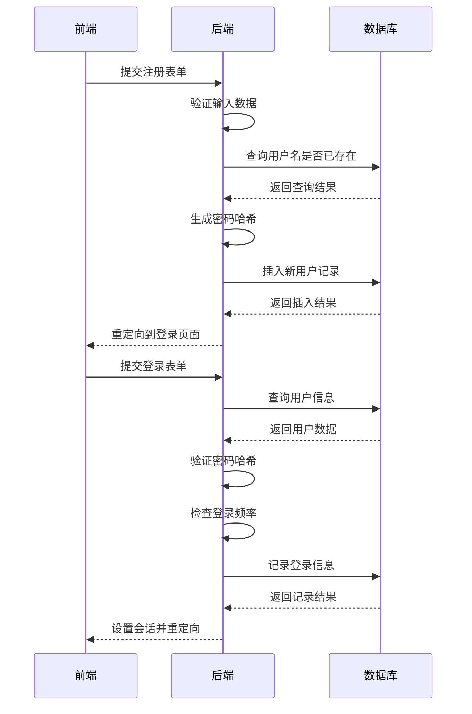
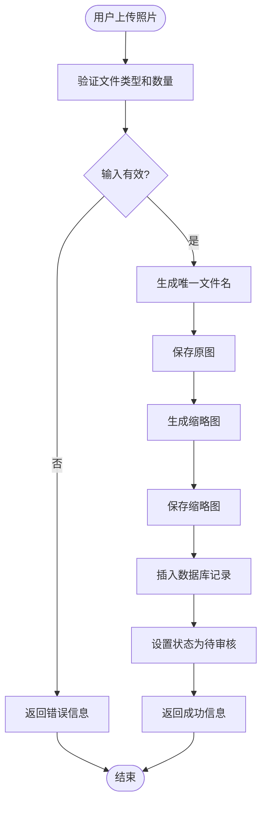
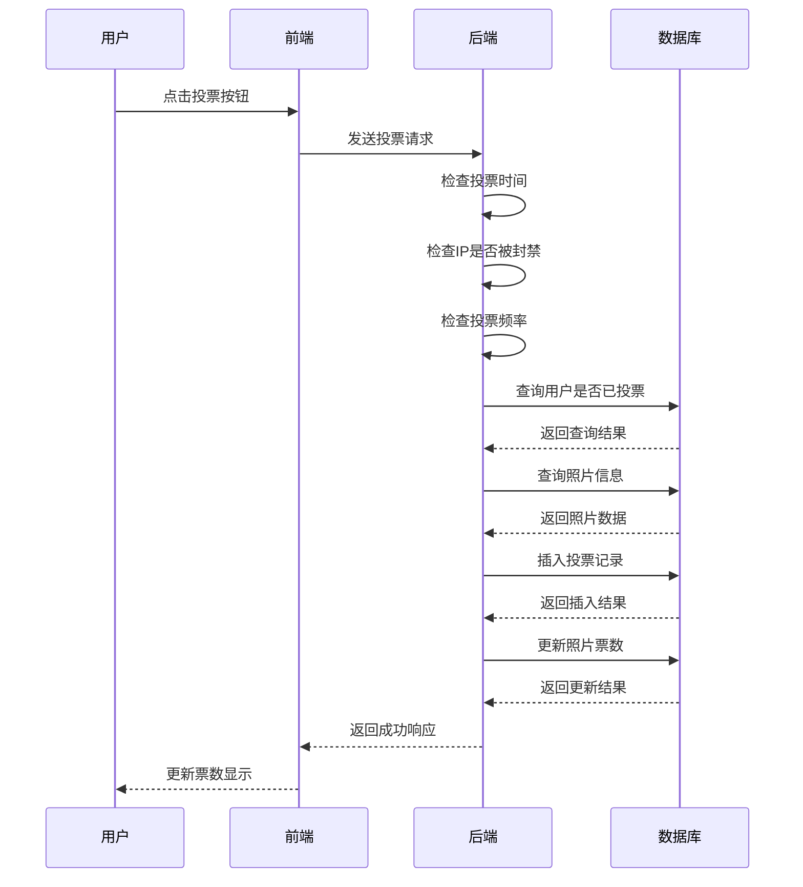
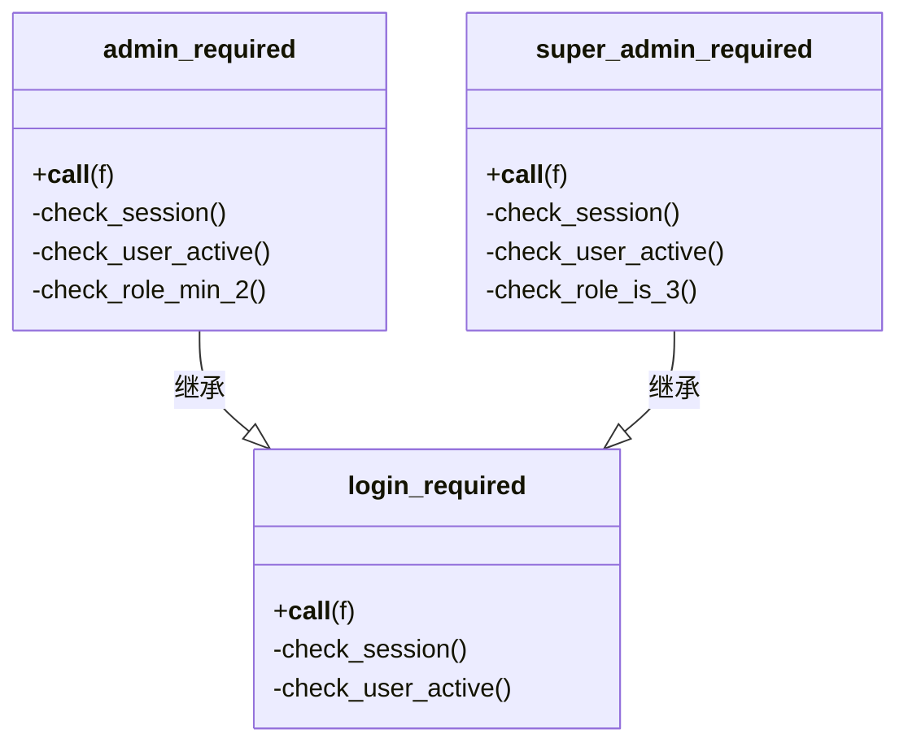
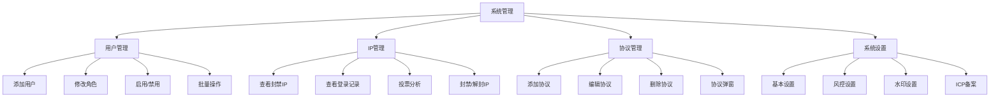

# 核心功能详解

<cite>
**本文档引用的文件**
- [app.py](file://src/app.py)
- [agreement-modal.js](file://static/js/agreement-modal.js)
- [upload.html](file://templates/upload.html)
- [admin.html](file://templates/admin.html)
- [ip_management.html](file://templates/ip_management.html)
- [admin_review.html](file://templates/admin_review.html)
</cite>

## 目录
1. [用户系统](#用户系统)
2. [照片管理](#照片管理)
3. [投票机制](#投票机制)
4. [权限控制](#权限控制)
5. [系统管理](#系统管理)

## 用户系统

用户系统是glzx-xmt项目的基础模块，负责用户注册、登录、密码修改和账户状态管理。系统使用Flask-Login进行会话管理，通过`session`存储用户ID、角色和学号等信息。

注册流程中，用户需提供真实姓名（作为登录账号）、QQ号、班级和可选的校学号。系统会对输入进行验证，包括校学号必须为纯数字、QQ号为5-15位数字等。注册成功后，用户默认为普通用户角色（role=1）。

登录流程中，系统会验证用户名和密码，并记录登录IP和User-Agent信息。为防止异常登录行为，系统实现了风控机制：检查单IP在指定时间窗口内登录的不同账号数量，若超过限制则自动封禁相关用户和IP地址。

用户密码使用`werkzeug.security.generate_password_hash`进行哈希存储，确保安全性。用户可以修改密码，系统会验证当前密码、新密码长度和一致性。

**本节来源**
- [app.py](file://src/app.py#L300-L399)

## 照片管理

照片管理模块实现了照片上传、审核、下载和删除功能。用户上传照片后，系统会生成缩略图并存储在数据库中，等待管理员审核。

上传功能通过`/upload`路由实现，前端使用`upload.html`模板。用户可以选择多张照片并为每张照片设置作品名称。系统会为每张照片生成唯一文件名，保存原图和180x120的缩略图。

管理员通过`/admin/review`路由进入审核页面，查看`admin_review.html`模板中列出的所有待审核照片。管理员可以点击"通过"、"拒绝"或"删除"按钮对照片进行处理。审核通过的照片状态变为1，可以在主页和排行榜中显示。

系统还提供了多种下载功能：普通用户可以下载自己的照片，管理员可以下载单张照片、全部已通过审核的照片或批量选择的照片。下载时，系统会根据作品名称、学生姓名和照片ID生成安全的文件名。

**本节来源**
- [app.py](file://src/app.py#L400-L499)
- [upload.html](file://templates/upload.html)

## 投票机制

投票机制是项目的核心功能之一，实现了安全的投票流程和防刷票机制。普通用户登录后可以在主页为已通过审核的照片投票，每人每票限制可由系统设置控制。

投票流程中，系统会检查当前时间是否在投票时间段内，以及用户是否已经投过票。为防止刷票行为，系统实现了多层风控：检查单IP在指定时间窗口内的投票次数，若超过限制则自动封禁相关用户和IP地址。

投票数据存储在`Vote`表中，包含用户ID、照片ID、IP地址和投票时间。系统还提供了取消投票功能，允许用户撤销自己的投票。排行榜页面按票数降序显示所有已通过审核的照片，并处理并列排名的情况。

**本节来源**
- [app.py](file://src/app.py#L200-L299)

## 权限控制

权限控制模块通过装饰器实现多层次的访问控制。系统定义了三种角色：普通用户（1）、普通管理员（2）和系统管理员（3），不同角色具有不同的权限。

核心装饰器包括：
- `@login_required`：确保用户已登录
- `@admin_required`：要求用户角色至少为2（普通管理员）
- `@super_admin_required`：要求用户角色为3（系统管理员）

这些装饰器在每次请求时检查用户会话中的角色信息，并验证用户账户是否处于激活状态。如果权限不足或账户被禁用，系统会重定向到登录页面并显示相应提示。

例如，`admin.html`页面使用`@admin_required`装饰器，只有普通管理员及以上角色才能访问。而`settings.html`页面使用`@super_admin_required`装饰器，仅系统管理员可以修改系统设置。

**本节来源**
- [app.py](file://src/app.py#L100-L199)
- [admin.html](file://templates/admin.html)
- [ip_management.html](file://templates/ip_management.html)

## 系统管理

系统管理模块提供了全面的管理功能，包括用户管理、IP管理、协议管理和系统设置。系统管理员可以通过`manage_users.html`页面管理所有用户，包括添加新用户、修改角色、启用/禁用账户和批量操作。

IP管理功能在`ip_management.html`页面中实现，管理员可以查看封禁IP列表、登录记录和投票分析数据。系统会统计单IP的投票次数和关联用户数，帮助管理员识别异常行为。管理员可以手动封禁或解封IP地址。

协议管理允许系统管理员添加、编辑和删除注册协议和投稿协议。当用户注册或上传照片时，系统会检查是否需要显示协议弹窗。协议弹窗由`agreement-modal.js`实现，要求用户阅读足够时间后才能同意。

系统设置页面允许管理员配置比赛标题、上传和投票开关、投票时间范围、风控参数和水印设置等。

**本节来源**
- [app.py](file://src/app.py#L500-L999)
- [agreement-modal.js](file://static/js/agreement-modal.js)
- [admin.html](file://templates/admin.html)
- [ip_management.html](file://templates/ip_management.html)
- [admin_review.html](file://templates/admin_review.html)