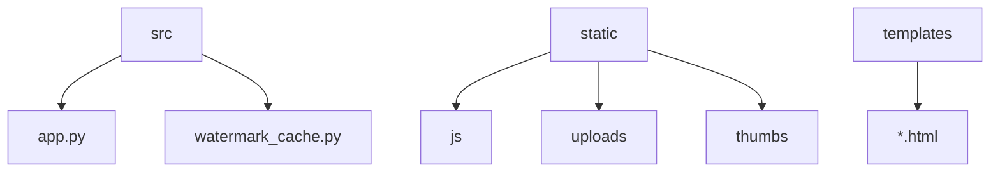
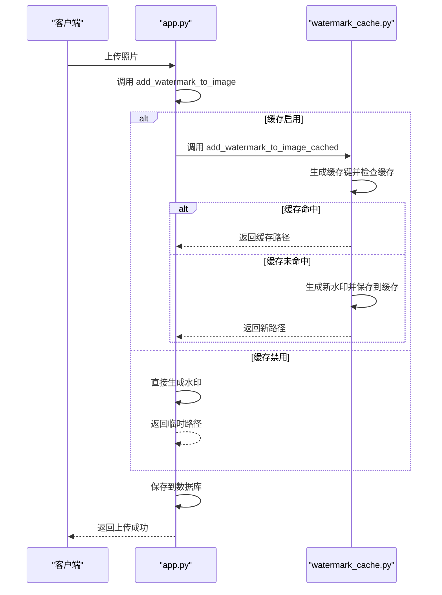
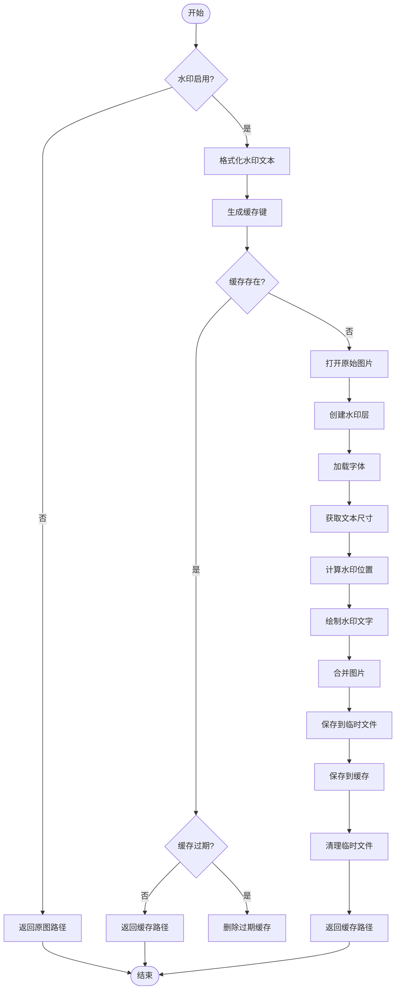
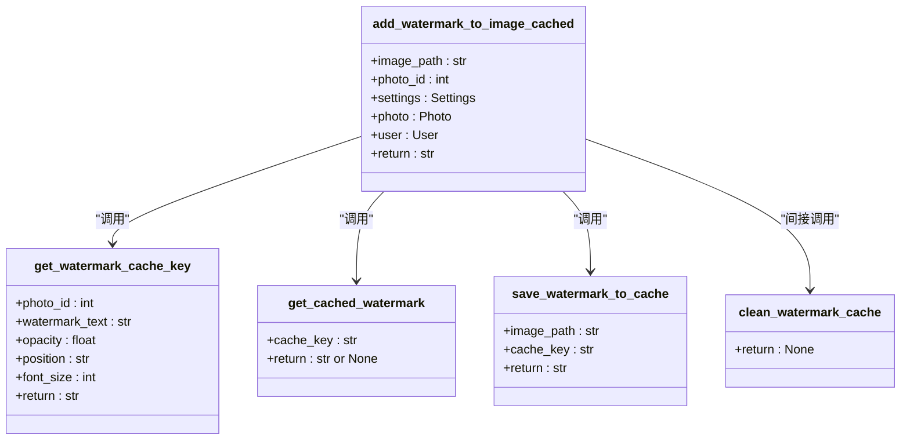
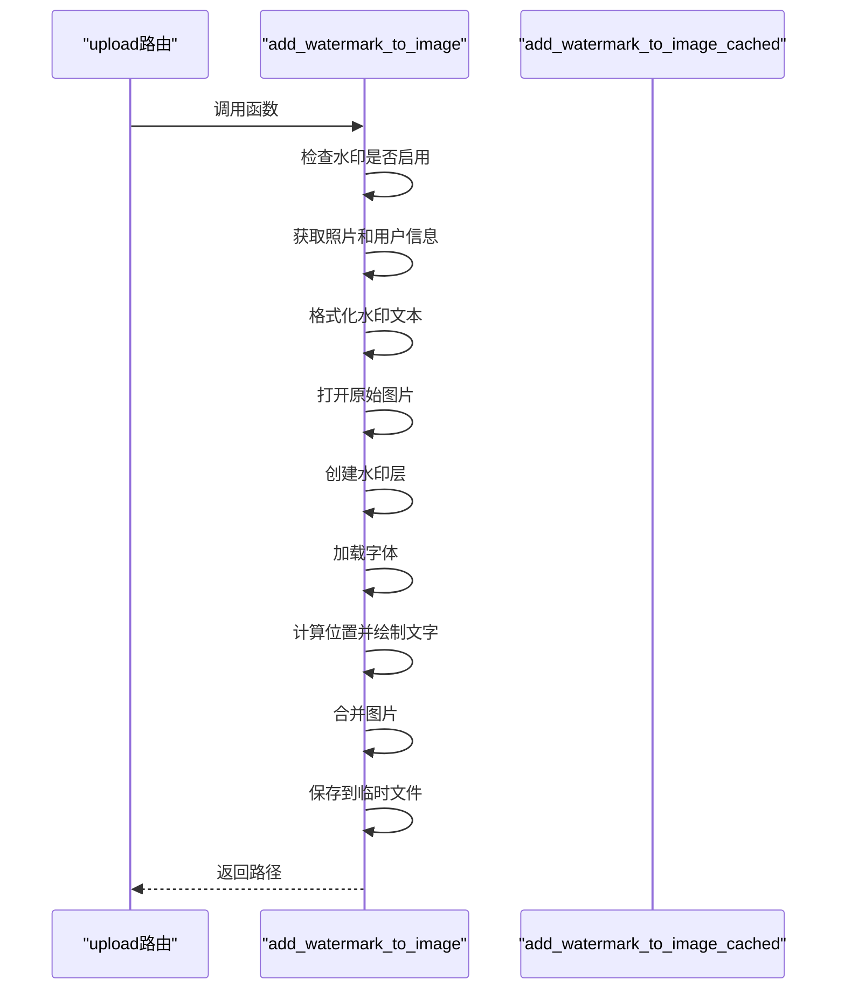
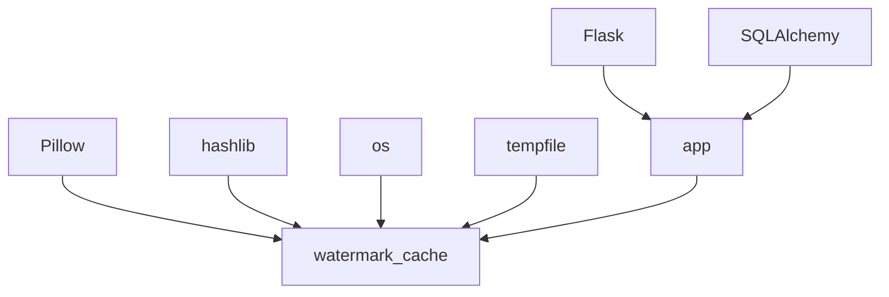

# 水印生成机制

<cite>
**本文档中引用的文件**
- [watermark_cache.py](file://src/watermark_cache.py)
- [app.py](file://src/app.py)
</cite>

## 目录
1. [简介](#简介)
2. [项目结构](#项目结构)
3. [核心组件](#核心组件)
4. [架构概述](#架构概述)
5. [详细组件分析](#详细组件分析)
6. [依赖分析](#依赖分析)
7. [性能考虑](#性能考虑)
8. [故障排除指南](#故障排除指南)
9. [结论](#结论)

## 简介
本文档深入讲解 `watermark_cache.py` 模块实现的水印生成与缓存策略。说明如何使用 Pillow 库在图像上叠加文字水印，包括字体加载（支持中文）、透明度设置、位置布局算法（如右下角偏移）和抗锯齿处理。重点分析水印缓存机制的设计：通过哈希参数（字体、颜色、透明度）复用已生成的水印层，减少重复渲染开销。描述 `app.py` 如何调用该模块接口，在照片保存前动态添加水印，并讨论性能优化点（如内存缓存有效期、字体资源管理）。结合实际调用场景，展示水印生成的调用链路，并提供扩展建议（如支持图片水印、多语言水印）。

## 项目结构
项目结构清晰，主要功能集中在 `src` 目录下。`app.py` 是主应用入口，负责处理 Web 请求、用户认证和业务逻辑。`watermark_cache.py` 是独立的水印处理模块，实现了带缓存的水印添加功能。静态资源和模板分别存放在 `static` 和 `templates` 目录中。

**Diagram sources**
- [src](file://src)
- [static](file://static)
- [templates](file://templates)

**Section sources**
- [app.py](file://src/app.py)
- [watermark_cache.py](file://src/watermark_cache.py)

## 核心组件
核心组件包括 `app.py` 中的 `add_watermark_to_image` 函数和 `watermark_cache.py` 中的 `add_watermark_to_image_cached` 函数。前者是水印功能的直接调用接口，后者是经过优化的缓存版本，通过复用已生成的水印图像来提升性能。两个函数都依赖于 `Settings` 模型中的配置参数，如水印文本格式、透明度、位置和字体大小。

**Section sources**
- [app.py](file://src/app.py#L221-L339)
- [watermark_cache.py](file://src/watermark_cache.py#L57-L155)

## 架构概述
系统采用模块化设计，`app.py` 作为主控制器，处理所有 Web 请求。当用户上传照片时，`upload` 路由会调用 `add_watermark_to_image` 函数为图片添加水印。该函数内部会根据配置决定是否启用缓存。如果启用了缓存，则会调用 `watermark_cache.py` 模块中的 `add_watermark_to_image_cached` 函数。该模块独立管理水印的生成、缓存和清理，与主应用逻辑解耦。

**Diagram sources**
- [app.py](file://src/app.py#L221)
- [watermark_cache.py](file://src/watermark_cache.py#L57)

## 详细组件分析

### 水印生成与缓存分析
`watermark_cache.py` 模块的核心是 `add_watermark_to_image_cached` 函数。该函数首先检查水印功能是否启用，然后根据照片ID、水印文本、透明度、位置和字体大小生成一个唯一的缓存键。通过 `get_cached_watermark` 函数检查该键对应的缓存文件是否存在且未过期。如果缓存命中，则直接返回缓存路径；否则，创建一个新的水印图像。

#### 水印生成流程

**Diagram sources**
- [watermark_cache.py](file://src/watermark_cache.py#L57-L155)

#### 字体加载与抗锯齿处理
水印生成过程中，字体加载是关键步骤。`add_watermark_to_image_cached` 函数首先尝试加载 Arial 字体，失败后尝试加载 Windows 系统的微软雅黑字体，最后回退到默认字体。这种多级备选方案确保了在不同环境下都能成功加载字体，特别是对中文的支持。Pillow 库在绘制文字时自动应用了抗锯齿处理，使得生成的水印文字边缘平滑，视觉效果更佳。

**Diagram sources**
- [watermark_cache.py](file://src/watermark_cache.py#L1-L183)

**Section sources**
- [watermark_cache.py](file://src/watermark_cache.py#L57-L155)

### app.py 调用分析
`app.py` 中的 `upload` 路由在处理用户上传的照片时，会调用 `add_watermark_to_image` 函数。该函数是水印功能的入口点，它会根据全局设置决定是否添加水印。如果启用了水印功能，它会获取照片和用户信息，格式化水印文本，并调用底层的水印生成函数。

**Diagram sources**
- [app.py](file://src/app.py#L221-L339)

**Section sources**
- [app.py](file://src/app.py#L1739)

## 依赖分析
`watermark_cache.py` 模块依赖于 `Pillow` 库进行图像处理，依赖于 `os` 和 `hashlib` 进行文件系统操作和哈希计算。`app.py` 依赖于 `Flask` 框架和 `SQLAlchemy` 进行 Web 开发和数据库操作。两个文件之间存在直接的函数调用依赖，`app.py` 调用 `watermark_cache.py` 中的函数来实现水印功能。

**Diagram sources**
- [watermark_cache.py](file://src/watermark_cache.py)
- [app.py](file://src/app.py)

**Section sources**
- [watermark_cache.py](file://src/watermark_cache.py)
- [app.py](file://src/app.py)

## 性能考虑
水印缓存机制是主要的性能优化点。通过将生成的水印图像缓存到文件系统，避免了对相同参数的重复渲染，显著降低了 CPU 开销。缓存文件默认保存1小时（`CACHE_MAX_AGE = 3600`），并在应用启动时自动清理过期文件。此外，使用临时目录存储中间文件，确保了系统的整洁性。字体加载的多级备选方案也提高了系统的健壮性，避免了因字体缺失导致的性能下降或功能失效。

## 故障排除指南
常见问题包括水印不显示、字体显示异常和缓存文件过多。如果水印不显示，请检查 `Settings` 模型中的 `watermark_enabled` 是否为 `True`。如果字体显示异常（如方框），请确认系统中存在代码中指定的字体文件，或确保 `Pillow` 能够加载默认字体。如果缓存文件过多，可以手动运行 `watermark_cache.py` 的主程序来清理过期文件，或检查 `clean_watermark_cache` 函数的执行情况。

**Section sources**
- [watermark_cache.py](file://src/watermark_cache.py#L157-L183)
- [app.py](file://src/app.py#L120)

## 结论
`watermark_cache.py` 模块实现了一个高效且健壮的水印生成与缓存系统。通过合理的缓存策略，它在保证功能完整性的同时，显著提升了系统性能。`app.py` 通过简单的函数调用即可集成该功能，体现了良好的模块化设计。未来可扩展支持图片水印、多语言水印和更复杂的布局算法，以满足更多样化的需求。