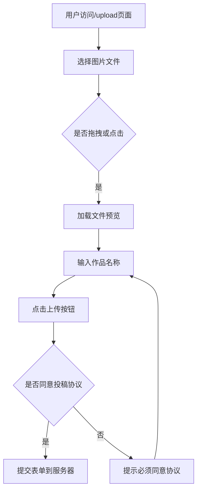
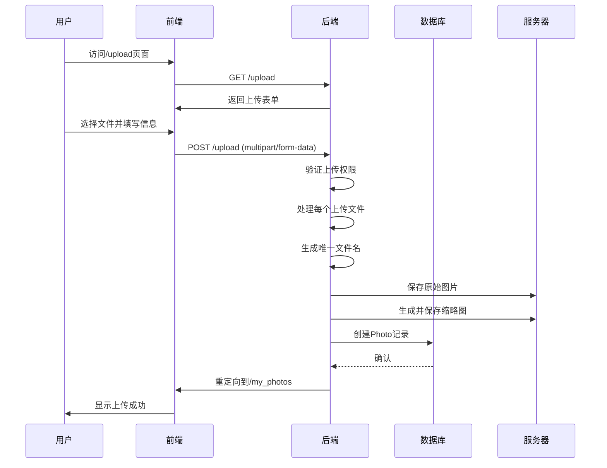
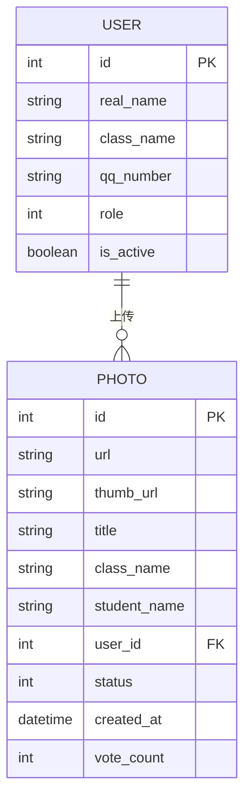

# 照片上传处理

<cite>
**本文档引用的文件**
- [app.py](file://src/app.py)
- [upload.html](file://templates/upload.html)
</cite>

## 目录
1. [上传流程概述](#上传流程概述)
2. [前端表单结构](#前端表单结构)
3. [/upload路由实现机制](#upload路由实现机制)
4. [文件处理与安全校验](#文件处理与安全校验)
5. [数据库记录创建](#数据库记录创建)
6. [异常处理与用户体验](#异常处理与用户体验)

## 上传流程概述

照片上传处理流程从用户访问`/upload`页面开始，通过前端HTML表单收集用户选择的图片文件和作品信息，经由Flask后端处理，最终将图片保存至服务器并创建相应的数据库记录。整个流程涉及前端交互、文件上传、图像处理、安全校验和数据持久化等多个环节。

该系统实现了完整的照片上传功能，包括多文件上传支持、作品名称自定义、自动缩略图生成以及待审核状态管理。上传后的照片需要经过管理员审核才能在主页面展示，确保了内容的质量控制。

**Section sources**
- [app.py](file://src/app.py#L61-L74)
- [app.py](file://src/app.py#L45-L59)

## 前端表单结构

前端`upload.html`文件定义了照片上传的用户界面，采用现代化的响应式设计，支持桌面和移动设备。表单使用`multipart/form-data`编码类型，这是文件上传所必需的编码方式。

表单包含一个隐藏的文件输入元素，用户可以通过点击或拖拽方式选择图片文件。支持同时选择多张照片，系统会为每张照片提供独立的作品名称输入框。当用户选择文件后，JavaScript会动态生成预览界面，显示每张照片的缩略图、原始文件名和作品名称输入框。

在提交前，前端会通过协议弹窗脚本检查用户是否同意投稿协议，这是防止滥用的重要安全措施。只有用户同意协议后，表单才会被提交到服务器。

**Diagram sources**
- [upload.html](file://templates/upload.html#L1-L404)

**Section sources**
- [upload.html](file://templates/upload.html#L1-L404)

## /upload路由实现机制

`/upload`路由是照片上传功能的核心，由Flask框架处理HTTP请求。该路由同时支持GET和POST方法，分别用于显示上传页面和处理上传请求。

当用户提交表单时，后端通过`request.files.getlist('photos')`获取所有上传的文件对象，同时通过`request.form.getlist('titles')`获取对应的作品名称列表。系统首先检查上传功能是否已启用，这是通过查询数据库中的设置项实现的全局开关控制。

对于每个上传的文件，系统会执行一系列处理步骤：生成安全的文件名、保存原始图片、创建缩略图、写入数据库记录。整个过程在一个数据库事务中执行，确保了数据的一致性。上传成功后，用户会被重定向到个人照片页面，并显示成功提示消息。

**Diagram sources**
- [app.py](file://src/app.py#L600-L650)

**Section sources**
- [app.py](file://src/app.py#L600-L650)

## 文件处理与安全校验

系统在处理上传文件时实施了多项安全措施和处理策略。首先，使用`secure_filename`函数处理文件名，防止路径遍历等安全漏洞。然后，为每个文件生成唯一的文件名，包含时间戳和上传计数，有效避免了文件名冲突问题。

文件存储策略采用分离式设计，原始图片保存在`static/uploads`目录，而缩略图则保存在`static/thumbs`目录。这种分离有助于提高性能，因为展示页面可以优先加载较小的缩略图。缩略图通过Pillow库的`thumbnail`方法生成，保持了原始图片的宽高比，同时限制在180x120像素以内。

虽然当前代码中没有显式的文件类型和大小限制校验，但系统通过仅接受`image/*`类型的文件输入（在HTML中定义）和使用Pillow库打开图片（会自动验证图片格式）间接实现了基本的安全校验。上传的图片会被转换为标准格式，确保了系统内图片格式的一致性。

**Section sources**
- [app.py](file://src/app.py#L620-L640)
- [upload.html](file://templates/upload.html#L120)

## 数据库记录创建

上传成功后，系统会为每张照片创建`Photo`数据库记录。记录包含多个重要字段：`url`存储图片的访问路径，`thumb_url`存储缩略图路径，`title`存储作品名称，`class_name`和`student_name`存储上传者的班级和姓名，`user_id`关联到上传用户的ID，`status`初始化为0表示待审核状态。

这些信息从当前登录用户的会话和数据库中获取，确保了数据的准确性和安全性。`created_at`字段自动记录上传时间，为后续的排序和统计提供支持。所有记录在一个事务中批量提交，提高了数据库操作的效率。

`Photo`模型与`User`模型通过外键关联，建立了清晰的数据关系。这种设计使得可以轻松查询特定用户的所有照片，或者统计每个班级的投稿数量，为系统的管理和分析功能提供了数据基础。

**Diagram sources**
- [app.py](file://src/app.py#L45-L59)
- [app.py](file://src/app.py#L61-L74)

**Section sources**
- [app.py](file://src/app.py#L61-L74)
- [app.py](file://src/app.py#L45-L59)

## 异常处理与用户体验

系统实现了基本的异常处理机制，通过Flash消息向用户反馈操作结果。上传成功后会显示"照片上传成功，等待审核"的提示，让用户了解当前状态。如果上传功能被关闭，会显示相应提示并重定向到主页。

在用户体验方面，系统提供了实时的文件预览功能，让用户在上传前就能确认选择的图片。多文件上传支持和批量处理能力提高了效率，用户可以一次性上传多张照片而无需重复操作。作品名称的默认值设置（如"作品1"、"作品2"）减少了用户的输入负担。

然而，当前实现中缺少对上传失败情况的详细处理，如网络中断、磁盘空间不足或图片格式不支持等场景。建议增加更完善的错误捕获机制，区分不同类型的错误并提供相应的用户提示。同时，可以考虑添加上传进度显示，特别是在处理大文件或多文件上传时，提升用户体验。

**Section sources**
- [app.py](file://src/app.py#L600-L650)
- [upload.html](file://templates/upload.html#L1-L404)