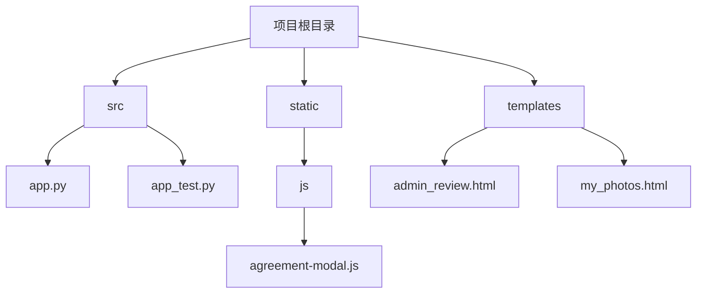
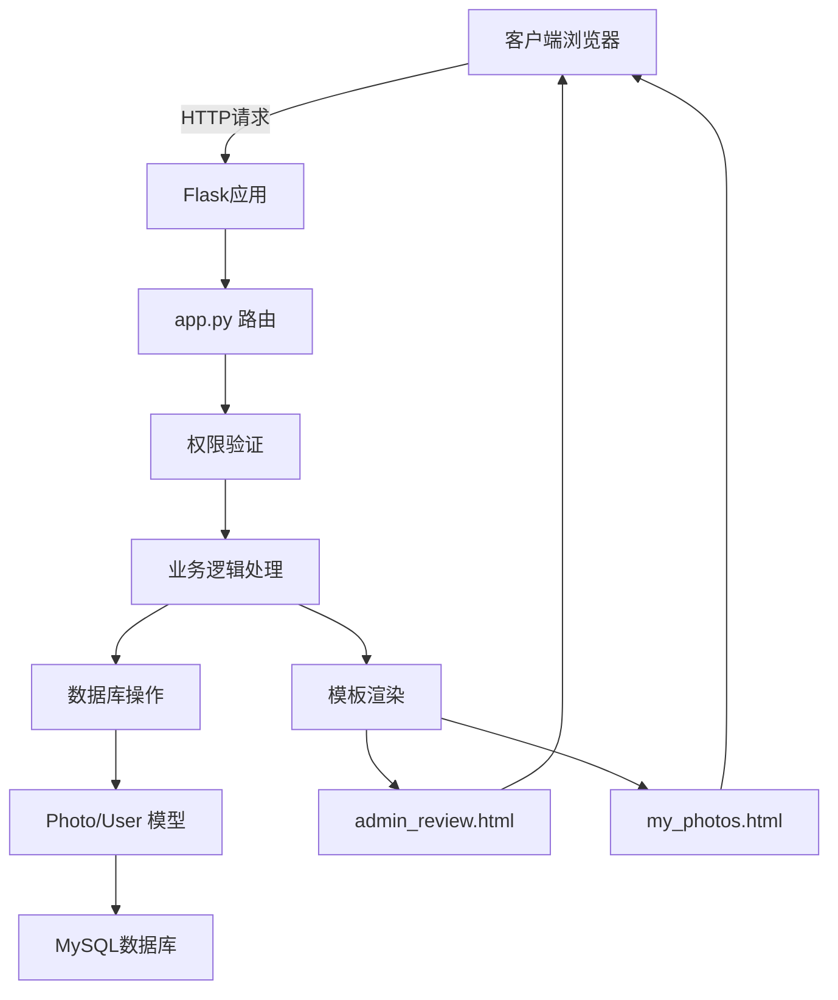
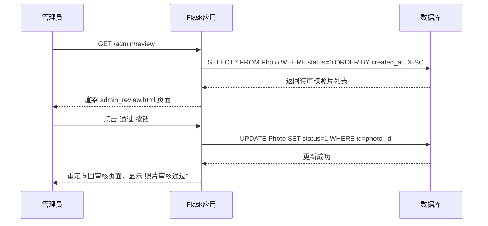
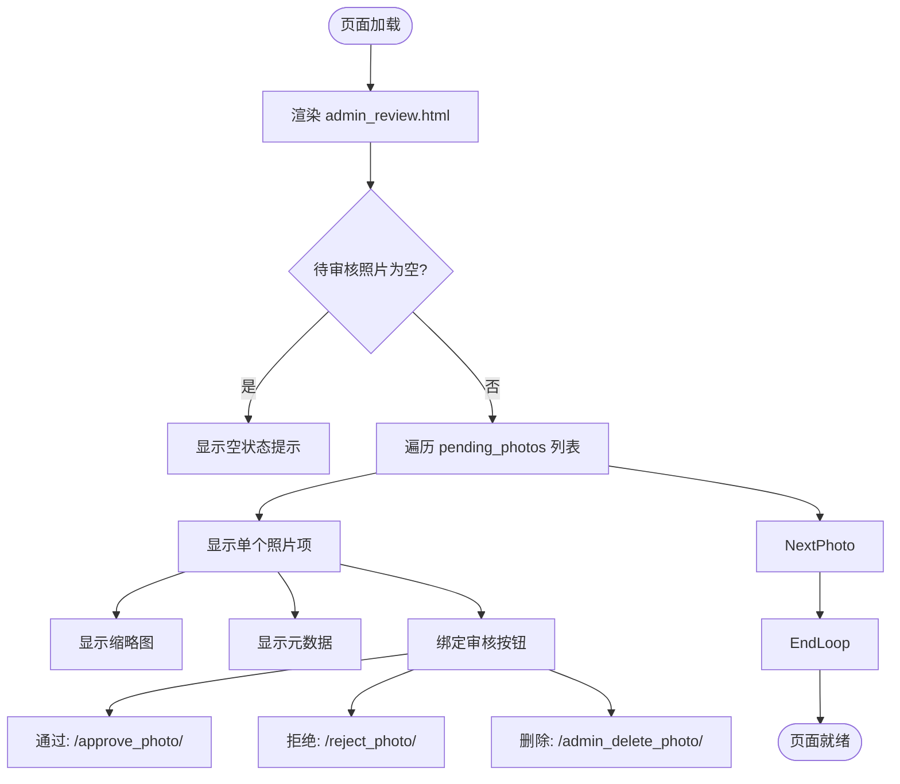
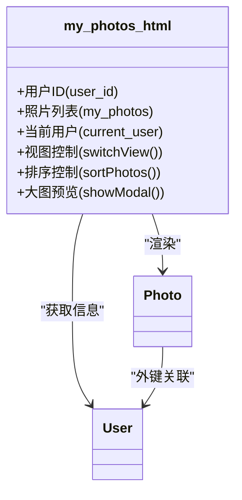
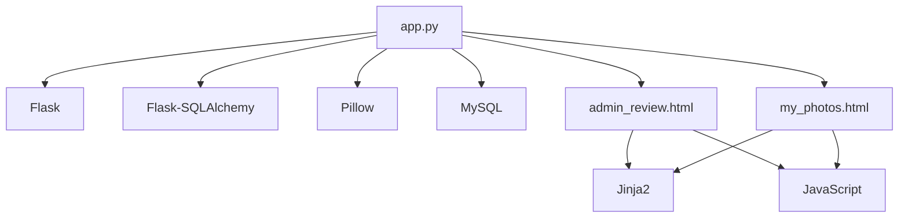

# 照片审核机制

<cite>
**本文档引用的文件**
- [app.py](file://src/app.py)
- [admin_review.html](file://templates/admin_review.html)
- [my_photos.html](file://templates/my_photos.html)
</cite>

## 目录
1. [简介](#简介)
2. [项目结构](#项目结构)
3. [核心组件](#核心组件)
4. [架构概述](#架构概述)
5. [详细组件分析](#详细组件分析)
6. [依赖分析](#依赖分析)
7. [性能考虑](#性能考虑)
8. [故障排除指南](#故障排除指南)
9. [结论](#结论)
10. [附录](#附录)（如有必要）

## 简介
本文档全面解析了照片审核流程的前后端实现。重点说明了`app.py`中`/review_photo`路由的权限控制与业务逻辑，包括如何查询待审核照片列表、更新审核状态（通过POST请求处理通过或拒绝操作），并触发相应通知或日志记录。文档还描述了`admin_review.html`页面的Jinja2模板渲染逻辑，包括照片预览、元数据展示与审核操作按钮的绑定。同时，解释了普通用户“我的照片”页面（`my_photos.html`）如何根据登录用户ID过滤Photo模型数据，并展示不同审核状态（待审核、已通过、已拒绝）的照片。讨论了审核状态变更对投票可见性的影响，并提供了审核流程的异常处理建议（如重复审核、数据一致性保障）。

## 项目结构
本项目采用典型的Flask Web应用结构，主要分为源代码、静态资源和模板三大部分。源代码位于`src`目录下，包含核心应用逻辑`app.py`和测试文件。静态资源（JavaScript、CSS、图片等）存放在`static`目录中，而HTML模板则位于`templates`目录下。这种分层结构清晰地分离了业务逻辑、表现层和静态资源，便于维护和扩展。

**图示来源**
- [app.py](file://src/app.py)
- [admin_review.html](file://templates/admin_review.html)
- [my_photos.html](file://templates/my_photos.html)

**本节来源**
- [app.py](file://src/app.py)
- [project_structure](file://)

## 核心组件
系统的核心组件围绕照片（Photo）的生命周期管理展开，主要包括照片上传、审核、投票和展示四大功能模块。`Photo`模型是数据核心，存储了照片的URL、缩略图URL、标题、班级、学生姓名、票数、用户ID、审核状态和创建时间等关键信息。`User`模型与`Photo`模型通过外键关联，实现了用户与照片的归属关系。权限系统通过`login_required`、`admin_required`和`super_admin_required`三个装饰器函数实现，分别控制普通用户、管理员和系统管理员的访问权限。

**本节来源**
- [app.py](file://src/app.py#L61-L74)

## 架构概述
系统采用经典的MVC（模型-视图-控制器）架构。`app.py`作为控制器，处理所有HTTP请求和路由逻辑。`Photo`和`User`等数据库模型构成模型层，负责数据的持久化。`admin_review.html`和`my_photos.html`等Jinja2模板构成视图层，负责数据的渲染和展示。前端通过AJAX与后端进行异步通信，实现了流畅的用户体验。

**图示来源**
- [app.py](file://src/app.py)
- [admin_review.html](file://templates/admin_review.html)
- [my_photos.html](file://templates/my_photos.html)

## 详细组件分析

### 照片审核路由分析
`/admin/review`路由是照片审核功能的入口点。该路由使用`@admin_required`装饰器，确保只有管理员角色的用户才能访问。当管理员访问此路由时，后端会查询数据库中所有状态为“待审核”（status=0）的照片，并按创建时间倒序排列，然后将结果传递给`admin_review.html`模板进行渲染。

#### 审核状态更新逻辑
审核状态的更新通过两个独立的GET路由实现：`/approve_photo/<int:photo_id>`和`/reject_photo/<int:photo_id>`。当管理员点击“通过”或“拒绝”按钮时，前端会发起相应的GET请求。后端接收到请求后，会根据`photo_id`查找对应的照片记录，并将其`status`字段更新为1（已通过）或2（已拒绝），最后提交数据库事务。此操作会自动触发日志记录（通过`flash`函数向用户显示消息）。

**图示来源**
- [app.py](file://src/app.py#L130-L148)
- [admin_review.html](file://templates/admin_review.html)

**本节来源**
- [app.py](file://src/app.py#L130-L148)
- [admin_review.html](file://templates/admin_review.html)

### 管理员审核页面分析
`admin_review.html`是管理员进行照片审核的前端界面。该页面使用Jinja2模板引擎动态渲染待审核的照片列表。每个照片项都包含缩略图预览、提交人信息、班级、学号、提交时间和照片ID等元数据。页面通过`onclick="showModal('{{ photo.url }}')"`实现了点击缩略图即可预览原图的功能。

#### 审核操作按钮绑定
审核操作按钮（通过、拒绝、删除）通过`href`属性直接绑定到后端的相应路由。例如，“通过”按钮的`href`为`{{ url_for('approve_photo', photo_id=photo.id) }}`，这会生成一个指向`/approve_photo/<photo_id>`的链接。这种设计简单直接，利用了HTTP GET请求的幂等性来处理审核操作。

**图示来源**
- [admin_review.html](file://templates/admin_review.html)

**本节来源**
- [admin_review.html](file://templates/admin_review.html)

### 普通用户照片页面分析
`my_photos.html`页面为普通用户提供了一个管理自己上传照片的界面。该页面通过`@login_required`装饰器确保只有登录用户才能访问。后端在`/my_photos`路由中，根据当前会话中的`user_id`从数据库中查询该用户的所有照片记录，并按创建时间倒序排列。

#### 状态过滤与展示
页面通过Jinja2的`selectattr`过滤器计算并展示不同审核状态的照片数量。使用CSS类`status-pending`、`status-approved`和`status-rejected`，结合不同的颜色，清晰地标识了每张照片的当前状态。用户可以在“网格视图”和“列表视图”之间切换，并按时间、票数或状态对照片进行排序。

**图示来源**
- [my_photos.html](file://templates/my_photos.html)
- [app.py](file://src/app.py#L150-L155)

**本节来源**
- [my_photos.html](file://templates/my_photos.html)
- [app.py](file://src/app.py#L150-L155)

## 依赖分析
系统的主要依赖关系集中在`app.py`文件中。它依赖于Flask框架进行Web服务，依赖于Flask-SQLAlchemy进行数据库操作，依赖于Pillow（PIL）进行图片处理。前端模板依赖于内联的CSS和JavaScript来实现交互功能。`admin_review.html`和`my_photos.html`都依赖于Flask的`url_for`函数来生成正确的路由URL。

**图示来源**
- [app.py](file://src/app.py)
- [admin_review.html](file://templates/admin_review.html)
- [my_photos.html](file://templates/my_photos.html)

**本节来源**
- [app.py](file://src/app.py)
- [admin_review.html](file://templates/admin_review.html)
- [my_photos.html](file://templates/my_photos.html)

## 性能考虑
系统的性能瓶颈主要在于数据库查询和图片处理。`/admin/review`和`/my_photos`路由中的查询操作应确保在`Photo`表的`status`和`user_id`字段上建立了索引，以加快查询速度。图片上传时生成缩略图的操作是I/O密集型的，可以考虑异步化处理。对于大型照片列表，前端的排序和过滤操作可能会导致页面卡顿，建议在后端实现分页。

## 故障排除指南
常见问题包括管理员无法访问审核页面、审核操作无响应、照片状态未更新等。首先应检查`session`中是否正确存储了`user_id`和`role`信息。其次，确认数据库连接正常，`Photo`表中的`status`字段值是否符合预期（0, 1, 2）。对于前端问题，检查浏览器控制台是否有JavaScript错误，确认`url_for`生成的URL是否正确。

**本节来源**
- [app.py](file://src/app.py#L130-L155)
- [admin_review.html](file://templates/admin_review.html)
- [my_photos.html](file://templates/my_photos.html)

## 结论
本文档详细解析了照片审核系统的前后端实现。系统通过清晰的路由设计、权限控制和模板渲染，实现了高效的照片审核流程。管理员可以方便地查看、通过或拒绝待审核照片，而普通用户则可以管理自己的照片并查看审核状态。系统设计合理，代码结构清晰，具备良好的可维护性和扩展性。