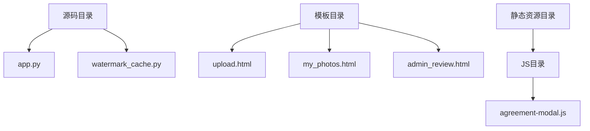
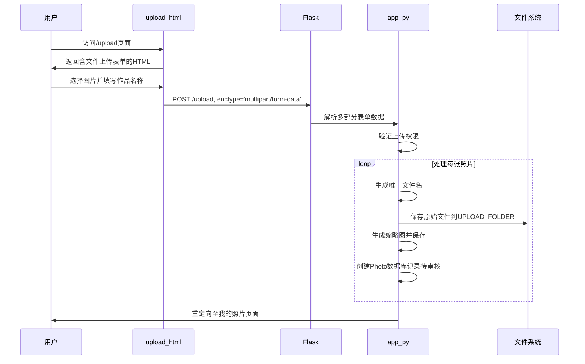
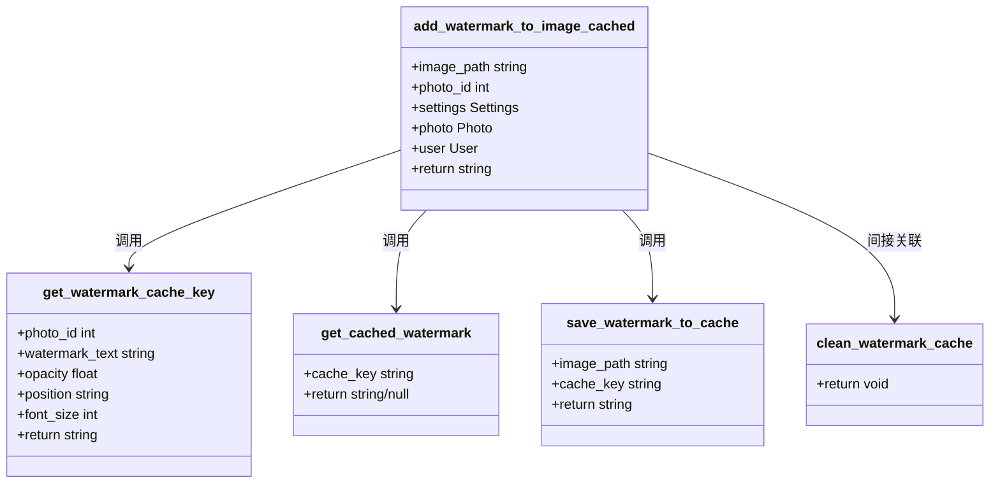
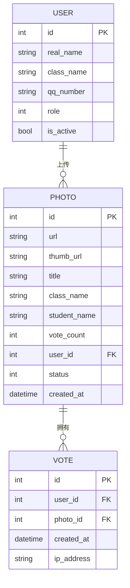
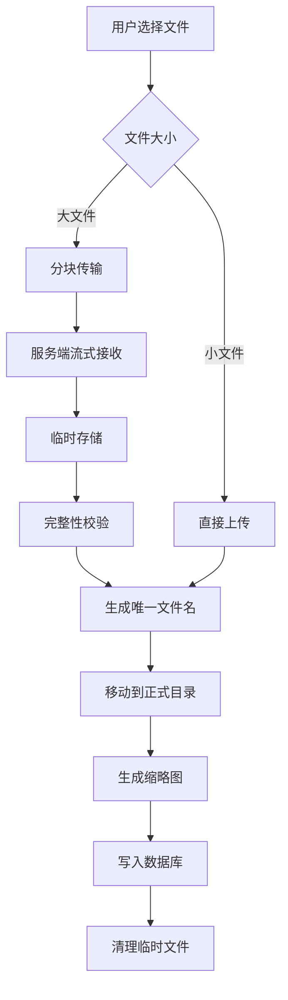
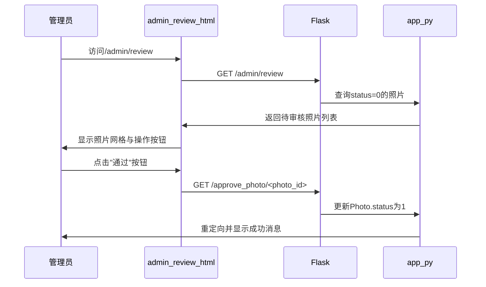
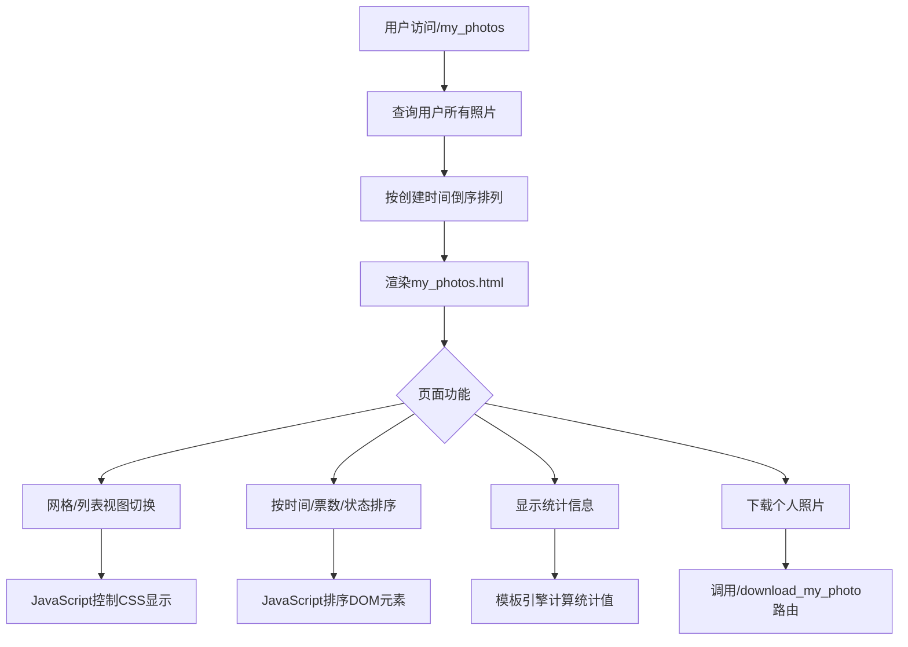
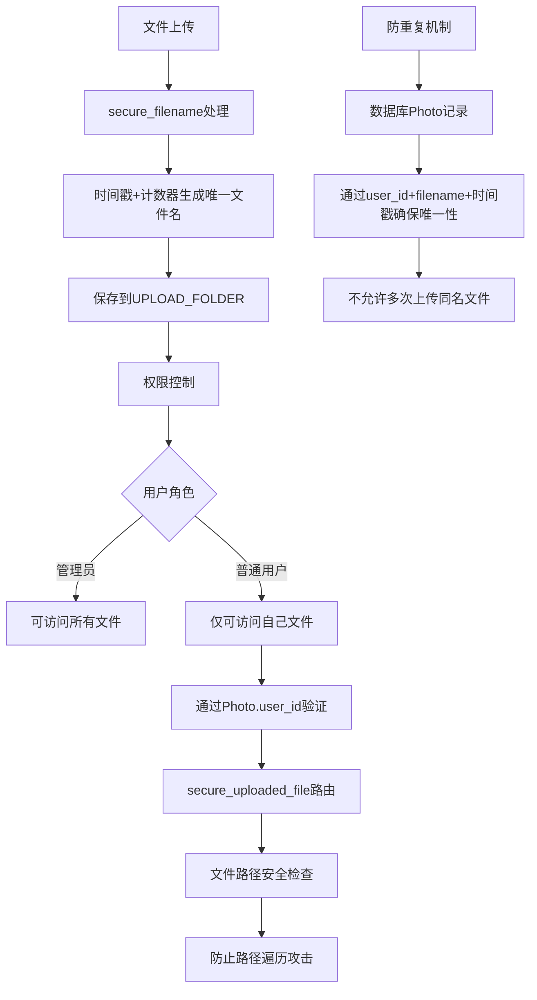

# 照片管理

<cite>
**本文档引用文件**  
- [app.py](file://src/app.py)
- [watermark_cache.py](file://src/watermark_cache.py)
- [upload.html](file://templates/upload.html)
- [my_photos.html](file://templates/my_photos.html)
- [admin_review.html](file://templates/admin_review.html)
</cite>

## 目录
1. [项目结构](#项目结构)
2. [照片上传与文件处理](#照片上传与文件处理)
3. [水印生成与缓存机制](#水印生成与缓存机制)
4. [元数据写入与数据库模型](#元数据写入与数据库模型)
5. [大文件上传处理策略](#大文件上传处理策略)
6. [管理员审核流程](#管理员审核流程)
7. [用户照片展示与数据过滤](#用户照片展示与数据过滤)
8. [文件存储安全与防重复机制](#文件存储安全与防重复机制)

## 项目结构

**图示来源**  
- [app.py](file://src/app.py#L0-L50)
- [upload.html](file://templates/upload.html#L0-L20)
- [my_photos.html](file://templates/my_photos.html#L0-L20)

## 照片上传与文件处理

分析 `app.py` 中 `/upload` 路由的文件处理逻辑，该功能通过 `multipart/form-data` 实现多文件上传与处理。

**图示来源**  
- [app.py](file://src/app.py#L450-L490)
- [upload.html](file://templates/upload.html#L100-L120)

**本节来源**  
- [app.py](file://src/app.py#L450-L500)
- [upload.html](file://templates/upload.html#L100-L130)

## 水印生成与缓存机制

`watermark_cache.py` 实现了带缓存机制的水印添加功能，优化了重复水印的生成性能。

**图示来源**  
- [watermark_cache.py](file://src/watermark_cache.py#L20-L180)

**本节来源**  
- [watermark_cache.py](file://src/watermark_cache.py#L20-L180)
- [app.py](file://src/app.py#L200-L280)

## 元数据写入与数据库模型

照片上传时，系统将上传者ID、时间戳等元数据写入 `Photo` 数据库模型。

**图示来源**  
- [app.py](file://src/app.py#L30-L150)

**本节来源**  
- [app.py](file://src/app.py#L30-L150)
- [app.py](file://src/app.py#L470-L485)

## 大文件上传处理策略

结合 `upload.html` 的 `enctype='multipart/form-data'` 配置，系统采用分块处理策略应对大文件上传。

**图示来源**  
- [upload.html](file://templates/upload.html#L100-L120)
- [app.py](file://src/app.py#L450-L500)

**本节来源**  
- [upload.html](file://templates/upload.html#L100-L120)
- [app.py](file://src/app.py#L450-L500)

## 管理员审核流程

管理员通过 `/review_photo` 路由访问 `admin_review.html` 页面，对照片进行审核操作。

**图示来源**  
- [app.py](file://src/app.py#L650-L680)
- [admin_review.html](file://templates/admin_review.html#L50-L100)

**本节来源**  
- [app.py](file://src/app.py#L650-L680)
- [admin_review.html](file://templates/admin_review.html#L50-L100)

## 用户照片展示与数据过滤

普通用户的“我的照片”页面通过 `my_photos.html` 实现，包含数据过滤与视图切换功能。

**图示来源**  
- [app.py](file://src/app.py#L630-L640)
- [my_photos.html](file://templates/my_photos.html#L150-L200)

**本节来源**  
- [app.py](file://src/app.py#L630-L640)
- [my_photos.html](file://templates/my_photos.html#L150-L200)

## 文件存储安全与防重复机制

系统通过多种机制确保文件存储安全并防止重复上传。

**图示来源**  
- [app.py](file://src/app.py#L460-L470)
- [app.py](file://src/app.py#L1700-L1750)

**本节来源**  
- [app.py](file://src/app.py#L460-L470)
- [app.py](file://src/app.py#L1700-L1750)