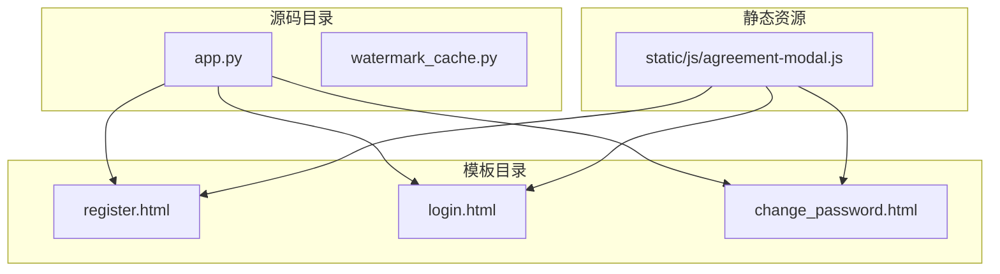
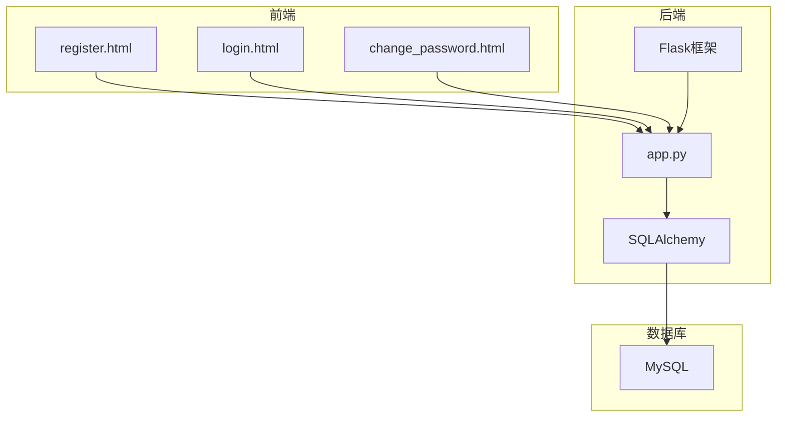
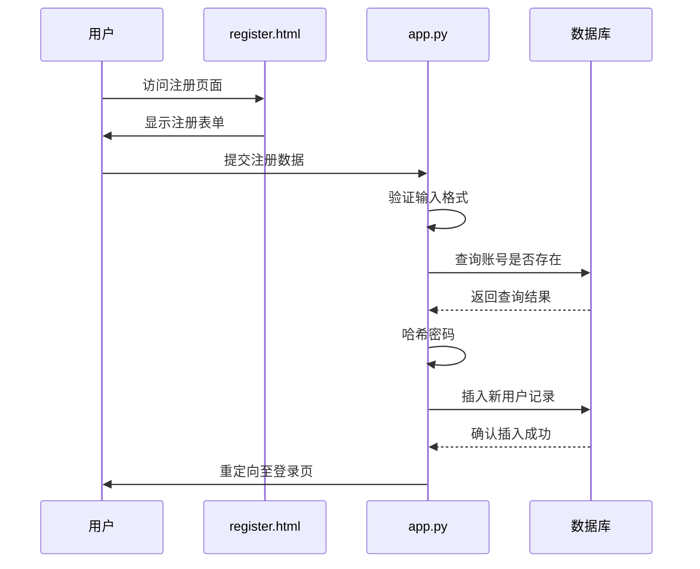
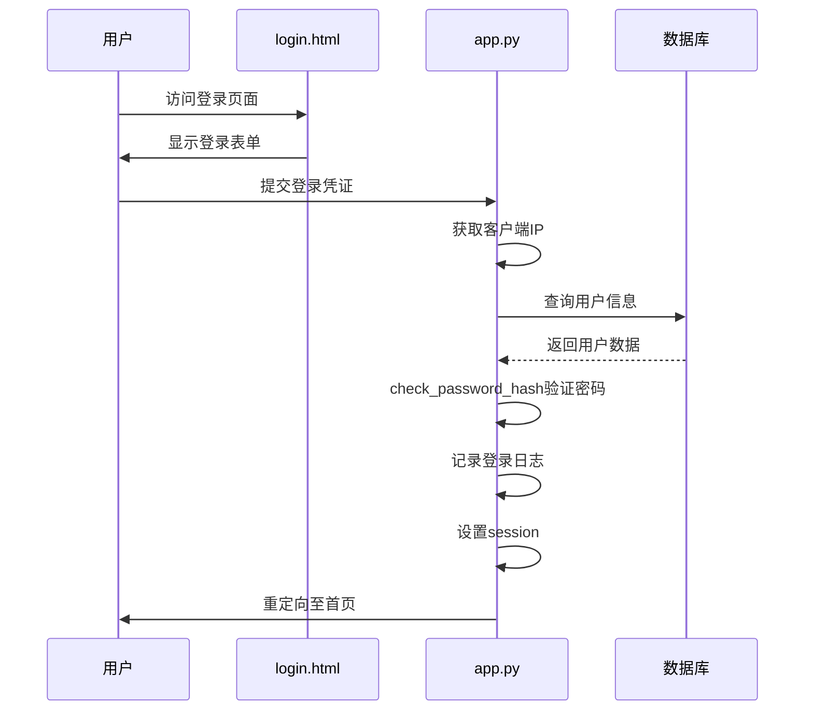
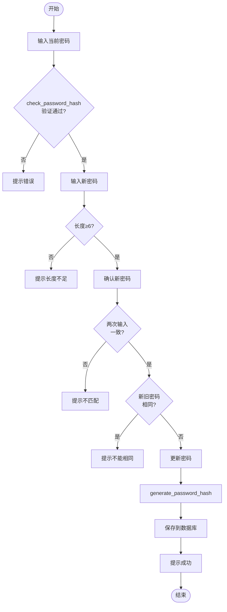
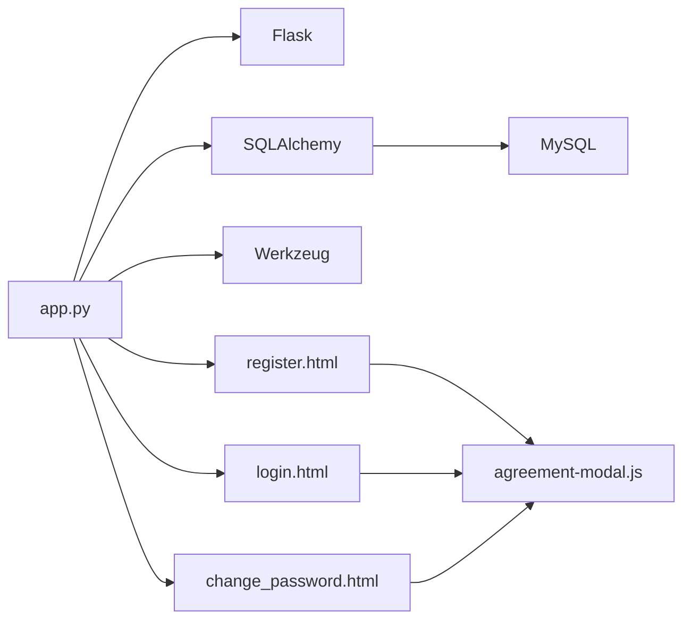

# 用户系统

<cite>
**本文档引用的文件**
- [app.py](file://src/app.py)
- [register.html](file://templates/register.html)
- [login.html](file://templates/login.html)
- [change_password.html](file://templates/change_password.html)
</cite>

## 目录
1. [简介](#简介)
2. [项目结构](#项目结构)
3. [核心组件](#核心组件)
4. [架构概述](#架构概述)
5. [详细组件分析](#详细组件分析)
6. [依赖分析](#依赖分析)
7. [性能考虑](#性能考虑)
8. [故障排除指南](#故障排除指南)
9. [结论](#结论)

## 简介
本文档详细阐述了用户系统的实现机制，涵盖注册、登录、密码修改和用户会话管理全流程。系统基于 Flask 框架构建，采用 Flask-WTF 表单验证、Werkzeug 密码哈希（generate_password_hash/check_password_hash）及 session 管理技术。通过分析 `/register`、`/login`、`/change_password` 等路由函数，解析前后端交互逻辑与安全机制。系统使用真实姓名作为登录账号，支持角色权限分级（普通用户、管理员、系统管理员），并集成风控策略防止暴力破解等攻击行为。

## 项目结构
系统采用典型的 Flask 项目结构，分为源码、静态资源和模板三大目录。核心逻辑集中在 `src` 目录下，其中 `app.py` 为应用主入口，定义了所有路由和业务逻辑；`watermark_cache.py` 提供图片水印功能。前端资源包括 JavaScript 脚本和 Jinja2 模板，实现用户交互界面与动态内容渲染。

**图示来源**
- [app.py](file://src/app.py#L1-L50)
- [register.html](file://templates/register.html#L1-L30)
- [login.html](file://templates/login.html#L1-L30)
- [change_password.html](file://templates/change_password.html#L1-L30)

**本节来源**
- [app.py](file://src/app.py#L1-L50)
- [project_structure](file://#L1-L20)

## 核心组件
系统核心组件包括用户认证模块、会话管理机制、密码安全策略和前端交互系统。用户认证通过 Flask 的路由装饰器实现，结合数据库模型完成身份验证。密码存储采用 Werkzeug 提供的 `generate_password_hash` 函数进行哈希处理，确保明文密码不会被保存。会话管理依赖 Flask 内置的 `session` 对象，将用户 ID 和角色信息存储在加密 Cookie 中。前端通过 Jinja2 模板引擎动态渲染页面，并利用 JavaScript 增强用户体验和安全性。

**本节来源**
- [app.py](file://src/app.py#L150-L200)
- [app.py](file://src/app.py#L500-L550)

## 架构概述
系统采用前后端分离的轻量级架构，后端基于 Flask 实现 RESTful 风格的路由接口，前端使用原生 HTML/CSS/JavaScript 构建响应式界面。数据持久化通过 SQLAlchemy ORM 与 MySQL 数据库交互，所有用户操作均受装饰器控制访问权限。整体架构强调安全性与可维护性，关键功能如登录、注册、密码修改均设有输入验证、错误提示和日志记录。

**图示来源**
- [app.py](file://src/app.py#L1-L100)
- [register.html](file://templates/register.html#L1-L20)
- [login.html](file://templates/login.html#L1-L20)
- [change_password.html](file://templates/change_password.html#L1-L20)

## 详细组件分析

### 注册流程分析
注册功能通过 `/register` 路由实现，支持真实姓名、班级、校学号、QQ号和密码的提交。系统对输入数据进行多层验证：校学号必须为纯数字且唯一，QQ号需为5-15位数字，真实姓名作为登录账号也必须唯一。后端使用 `generate_password_hash` 对密码进行哈希存储，防止敏感信息泄露。前端模板通过 Flash 消息机制反馈注册结果。

**图示来源**
- [app.py](file://src/app.py#L550-L600)
- [register.html](file://templates/register.html#L1-L284)

**本节来源**
- [app.py](file://src/app.py#L550-L600)
- [register.html](file://templates/register.html#L1-L284)

### 登录流程分析
登录功能由 `/login` 路由处理，用户通过真实姓名和密码进行身份验证。系统首先检查 IP 是否被封禁，然后查询用户是否存在并验证密码。成功登录后，系统记录登录日志并设置 session，包含用户 ID、角色和学号信息。风控机制会检测非管理员用户的登录频率，防止暴力破解攻击。

**图示来源**
- [app.py](file://src/app.py#L500-L550)
- [login.html](file://templates/login.html#L1-L250)

**本节来源**
- [app.py](file://src/app.py#L500-L550)
- [login.html](file://templates/login.html#L1-L250)

### 密码修改流程分析
密码修改功能受 `@login_required` 装饰器保护，仅登录用户可访问。用户需提供当前密码、新密码和确认密码。系统验证当前密码正确性、新密码长度（至少6位）、两次输入一致性以及新旧密码是否相同。前端模板提供实时密码强度检测和匹配提示，增强用户体验。

**图示来源**
- [app.py](file://src/app.py#L600-L650)
- [change_password.html](file://templates/change_password.html#L1-L407)

**本节来源**
- [app.py](file://src/app.py#L600-L650)
- [change_password.html](file://templates/change_password.html#L1-L407)

## 依赖分析
系统依赖关系清晰，`app.py` 为核心模块，依赖 Flask、SQLAlchemy、Werkzeug 等库。模板文件依赖 `app.py` 提供的数据上下文，通过 Jinja2 表达式渲染动态内容。JavaScript 脚本增强前端功能，如协议弹窗和防调试机制。数据库模型之间通过外键关联，形成用户、照片、投票、登录记录等实体的关系网。

**图示来源**
- [app.py](file://src/app.py#L1-L50)
- [pyproject.toml](file://pyproject.toml#L1-L20)

**本节来源**
- [app.py](file://src/app.py#L1-L50)
- [pyproject.toml](file://pyproject.toml#L1-L20)

## 性能考虑
系统在性能方面做了基本优化，如使用数据库索引加速查询（real_name、school_id 唯一索引），合理组织 SQL 查询减少冗余操作。水印功能通过临时文件处理，避免阻塞主线程。但未实现缓存机制，频繁访问可能导致数据库压力增大。建议对热门数据（如排行榜）添加 Redis 缓存，提升响应速度。

## 故障排除指南
常见问题包括注册时提示“真实姓名已存在”、登录失败、密码修改无效等。排查时应检查数据库连接状态、表单字段验证规则、session 是否正确设置。对于登录频繁被封禁的问题，需审查风控策略配置（max_accounts_per_ip、account_time_window）。前端问题可通过浏览器开发者工具检查网络请求和 JavaScript 错误。

**本节来源**
- [app.py](file://src/app.py#L650-L700)
- [login.html](file://templates/login.html#L200-L250)

## 结论
该用户系统实现了完整的注册、登录、密码修改和会话管理功能，具备良好的安全性和可扩展性。通过 Flask 装饰器实现权限控制，利用 Werkzeug 提供密码哈希保障数据安全，结合 Jinja2 模板实现前后端数据交互。系统还集成了风控机制防范异常行为，适合中小型 Web 应用场景。未来可进一步优化前端体验，增加验证码机制，并完善日志审计功能。