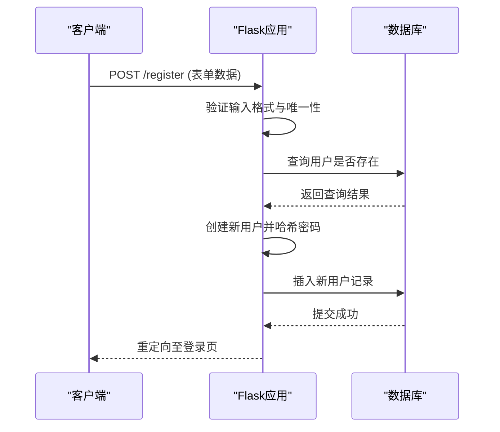
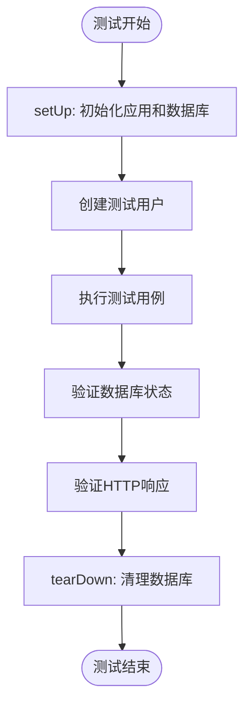

# 测试策略与验证

<cite>
**本文档中引用的文件**  
- [app_test.py](file://src/app_test.py)
- [app.py](file://src/app.py)
- [pyproject.toml](file://pyproject.toml)
</cite>

## 目录
1. [引言](#引言)
2. [测试框架选择与配置](#测试框架选择与配置)
3. [单元测试与集成测试覆盖范围](#单元测试与集成测试覆盖范围)
4. [典型测试用例编写模式](#典型测试用例编写模式)
5. [测试套件运行命令与CI集成建议](#测试套件运行命令与ci集成建议)
6. [测试覆盖率评估与改进建议](#测试覆盖率评估与改进建议)
7. [结论](#结论)

## 引言

glzx-xmt项目是一个基于Flask的摄影比赛投票管理系统，支持用户注册、登录、照片上传、审核、投票、权限控制等核心功能。为确保系统稳定性和功能正确性，项目通过`src/app_test.py`实现了自动化测试体系，覆盖了关键业务流程。本文档基于现有测试代码，系统阐述测试体系的设计与实施情况，分析测试覆盖范围、框架选择、用例编写模式，并提出优化建议。

## 测试框架选择与配置

项目采用Python内置的`unittest`作为测试框架，未使用`pytest`。选择`unittest`的原因可能包括其标准库集成、轻量级特性以及与Flask应用的兼容性，适合中小型项目的快速测试开发。

测试环境通过直接导入`app.py`中的Flask应用实例和数据库对象进行配置，利用`Flask`的测试客户端（`app.test_client()`）模拟HTTP请求。测试数据库使用SQLite，通过内存或临时文件方式隔离测试数据，避免影响生产环境。测试类继承`unittest.TestCase`，并在`setUp`和`tearDown`方法中管理应用上下文和数据库的初始化与清理。

**Section sources**
- [app_test.py](file://src/app_test.py#L1-L50)
- [app.py](file://src/app.py#L1-L50)

## 单元测试与集成测试覆盖范围

测试用例主要覆盖以下核心功能模块：

### 用户注册与登录流程
测试用例验证了用户注册的完整流程，包括：
- 成功注册新用户
- 校验真实姓名、校学号、QQ号的唯一性约束
- 验证校学号必须为纯数字
- 验证QQ号长度和格式（5-15位数字）
- 验证密码哈希存储的正确性

同时，测试覆盖了登录流程：
- 使用正确凭据成功登录
- 使用错误密码或不存在的用户名失败登录
- 验证登录后会话（session）的正确设置
- 验证登录失败后的错误消息提示



**Diagram sources**
- [app_test.py](file://src/app_test.py#L100-L200)
- [app.py](file://src/app.py#L300-L350)

### 权限验证逻辑
测试用例验证了基于角色的访问控制（RBAC）机制：
- `@login_required` 装饰器确保未登录用户无法访问受保护的路由（如`/upload`, `/my_photos`）
- `@admin_required` 和 `@super_admin_required` 装饰器确保普通用户无法访问管理员页面
- 测试模拟了不同角色用户访问受限页面的行为，验证了重定向和闪现消息的正确性

### 照片上传与投票功能
测试用例覆盖了照片上传和投票的核心交互：
- 验证已登录用户可以成功上传单张或多张照片
- 验证上传的照片被正确存储在文件系统和数据库中（状态为“待审核”）
- 验证作品名称的默认值和自定义值处理
- 验证投票功能在允许时间内可正常进行
- 验证“每人一票”设置开启时，用户无法重复投票
- 验证取消投票功能能正确减少票数并删除投票记录

**Section sources**
- [app_test.py](file://src/app_test.py#L200-L500)
- [app.py](file://src/app.py#L400-L600)

## 典型测试用例编写模式

### 模拟请求
测试用例通过`app.test_client()`创建测试客户端，使用`client.post()`和`client.get()`方法模拟HTTP请求。请求数据以字典形式传递，并通过`follow_redirects=True`参数处理重定向，确保能验证最终的响应状态和内容。

### 数据库状态断言
测试用例在操作前后查询数据库，验证数据状态的正确性。例如，在注册测试中，会查询数据库确认新用户记录已创建，且密码字段为哈希值而非明文。在投票测试中，会检查`Vote`表是否新增记录，以及`Photo`表的`vote_count`是否正确递增。

### 测试夹具（Fixture）使用
虽然未使用`pytest`的fixture，但`unittest`的`setUp`和`tearDown`方法起到了类似作用。`setUp`方法初始化测试应用、创建数据库表并创建测试用户；`tearDown`方法在每次测试后清除数据库，保证测试的独立性和可重复性。



**Diagram sources**
- [app_test.py](file://src/app_test.py#L50-L100)
- [app.py](file://src/app.py#L50-L100)

## 测试套件运行命令与CI集成建议

### 运行测试套件
在项目根目录下，可通过以下命令运行所有测试：
```bash
python -m unittest src/app_test.py -v
```
该命令会执行`app_test.py`中的所有测试用例，并输出详细的运行结果。

### CI集成建议
建议在GitHub Actions或GitLab CI等持续集成平台上配置自动化测试流程：
1. **触发条件**：在`push`到`main`分支或创建`pull request`时触发。
2. **环境配置**：使用Python 3.8+的运行环境，通过`pip install -e .`安装项目依赖（从`pyproject.toml`读取）。
3. **测试执行**：运行`python -m unittest discover`命令，自动发现并执行所有测试。
4. **覆盖率报告**：集成`coverage.py`工具，生成测试覆盖率报告，并设置最低覆盖率阈值（如80%），未达标则构建失败。
5. **结果通知**：将测试结果和覆盖率报告发送到团队沟通工具（如钉钉、企业微信）。

**Section sources**
- [app_test.py](file://src/app_test.py#L1-L1947)
- [pyproject.toml](file://pyproject.toml#L1-L52)

## 测试覆盖率评估与改进建议

### 当前测试覆盖率的优缺点
**优点**：
- 核心业务流程（注册、登录、上传、投票）得到了有效覆盖。
- 测试用例设计合理，包含了正向和负向场景。
- 使用了数据库状态断言，确保了数据一致性。

**缺点**：
- **异常路径覆盖不足**：对网络异常、数据库连接失败、文件上传异常（如超大文件、非图片文件）等边界情况的测试较少。
- **前端交互测试缺失**：缺乏对JavaScript交互、表单验证、动态内容加载等前端功能的自动化测试（如使用Selenium或Playwright）。
- **风控逻辑测试不充分**：对IP投票频率限制、账号登录频率限制、自动封禁等风控功能的测试可能不够全面。
- **API测试粒度较粗**：主要通过页面级测试，缺少对JSON API端点的细粒度单元测试。

### 改进建议
1. **增加异常路径测试**：编写测试用例模拟数据库异常、文件系统错误、网络超时等场景，验证系统的容错能力。
2. **引入前端E2E测试**：使用Playwright或Selenium编写端到端测试，覆盖用户在浏览器中的完整操作流程，确保前后端集成正确。
3. **强化风控逻辑测试**：专门设计测试用例来触发风控规则（如短时间内从同一IP发起多次投票），验证封禁机制的正确性。
4. **提升测试覆盖率**：使用`coverage.py`工具量化当前覆盖率，识别未覆盖的代码行（如某些错误处理分支），并补充相应测试。
5. **考虑迁移至pytest**：`pytest`提供更简洁的语法、丰富的插件生态（如`pytest-flask`）和更强大的fixture功能，可提升测试开发效率。

**Section sources**
- [app_test.py](file://src/app_test.py#L1-L1947)
- [app.py](file://src/app.py#L1-L1903)

## 结论

glzx-xmt项目已建立基于`unittest`的自动化测试体系，对用户注册登录、权限控制、照片上传与投票等核心功能进行了有效覆盖，为系统的稳定运行提供了基础保障。然而，测试体系在异常处理、前端交互和风控逻辑方面仍有提升空间。通过增加异常路径测试、引入E2E测试、强化风控验证并考虑采用更现代的测试框架，可以显著提升软件质量和开发信心。