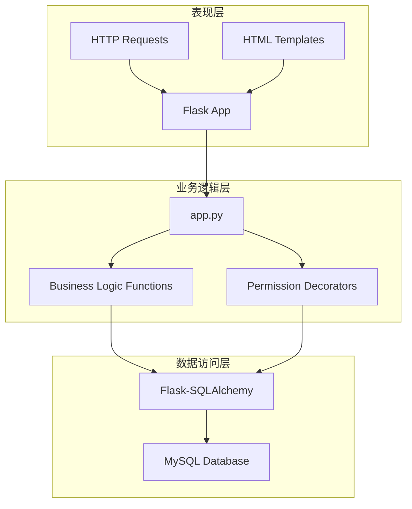
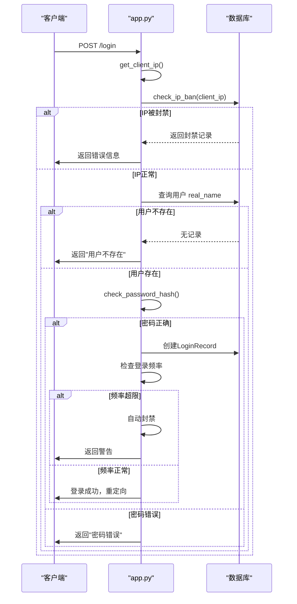
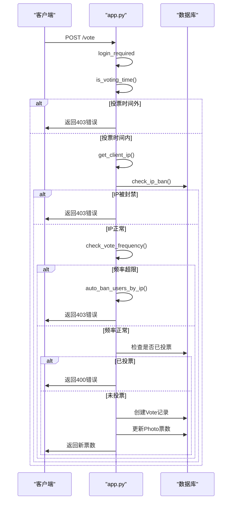
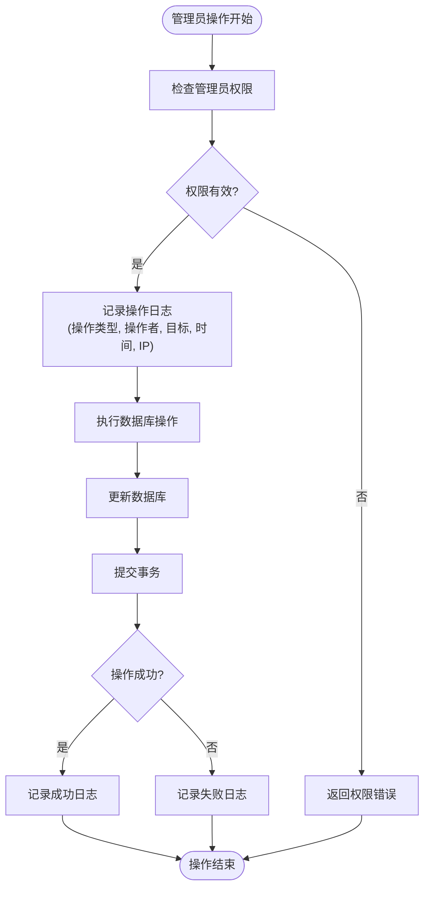
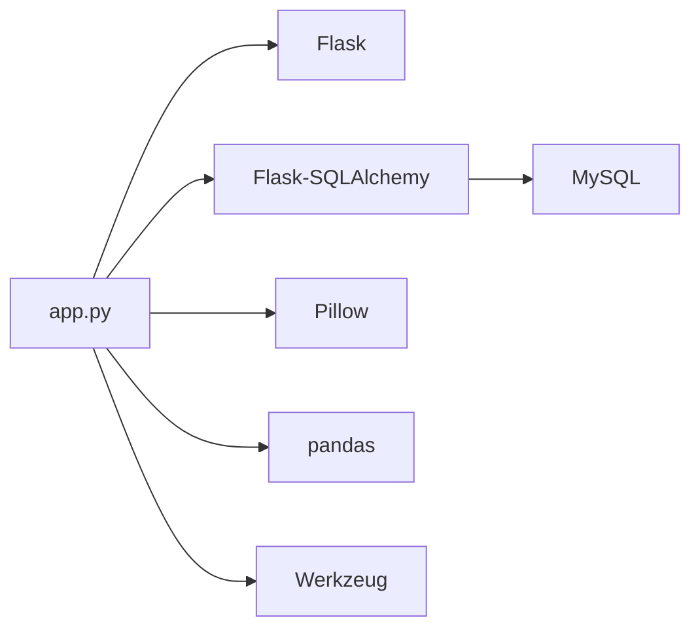

# 日志记录与系统监控

<cite>
**本文档引用的文件**
- [app.py](file://src/app.py)
</cite>

## 目录
1. [简介](#简介)
2. [项目结构](#项目结构)
3. [核心组件](#核心组件)
4. [架构概述](#架构概述)
5. [详细组件分析](#详细组件分析)
6. [依赖分析](#依赖分析)
7. [性能考虑](#性能考虑)
8. [故障排除指南](#故障排除指南)
9. [结论](#结论)
10. [附录](#附录)（如有必要）

## 简介
本文档基于 `app.py` 文件中的异常处理和业务逻辑，设计适用于生产环境的日志记录机制。文档详细说明如何配置 Python logging 模块，将应用日志输出到文件或系统日志服务（如 syslog），并设置合理的日志级别（DEBUG、INFO、ERROR）和格式（包含时间、IP、用户、操作）。同时，文档建议了对关键操作（如登录、投票、管理员操作）进行日志审计的策略，并提供了与 ELK 或 Prometheus 等现代监控系统集成的初步思路，旨在帮助运维人员快速定位和解决问题。

## 项目结构
本项目是一个基于 Flask 的 Web 应用，其结构清晰，主要分为以下几个部分：
- `src/` 目录包含核心的 Python 源代码，其中 `app.py` 是应用的主入口。
- `static/` 目录存放静态资源文件，如 JavaScript、CSS 和图片。
- `templates/` 目录存放 HTML 模板文件，用于渲染前端页面。
- 根目录下的 `pyproject.toml` 文件定义了项目的依赖和构建配置。

该结构遵循了典型的 Flask 应用布局，便于维护和扩展。

**Section sources**
- [app.py](file://src/app.py#L1-L50)

## 核心组件
`app.py` 文件是整个应用的核心，它定义了 Flask 应用实例、数据库模型、业务逻辑函数和 HTTP 路由。核心组件包括：
- **数据库模型**：定义了 `User`、`Photo`、`Vote`、`LoginRecord` 等数据表，用于持久化用户信息、照片数据和操作记录。
- **业务逻辑函数**：如 `add_watermark_to_image`（添加水印）、`is_voting_time`（检查投票时间）、`check_ip_ban`（检查IP封禁）等，封装了可复用的业务规则。
- **权限装饰器**：`login_required`、`admin_required`、`super_admin_required` 用于保护路由，确保只有经过身份验证和具有相应权限的用户才能访问。
- **HTTP 路由**：通过 `@app.route` 装饰器定义了丰富的 API 和页面路由，处理用户的登录、注册、上传、投票、管理等操作。

这些组件共同构成了应用的功能骨架。

**Section sources**
- [app.py](file://src/app.py#L25-L100)

## 架构概述
该应用采用经典的三层架构模式：
- **表现层**：由 Flask 框架处理 HTTP 请求和响应，通过 `render_template` 渲染 HTML 页面，或通过 `jsonify` 返回 JSON 数据。
- **业务逻辑层**：由 `app.py` 中定义的函数和类方法组成，负责处理具体的业务规则，如用户认证、投票逻辑、文件上传等。
- **数据访问层**：通过 `Flask-SQLAlchemy` 扩展与 MySQL 数据库交互，执行数据的增删改查操作。

此外，应用还集成了风控机制，通过 `IpBanRecord`、`IpWhitelist` 等模型对用户行为进行监控和管理，体现了安全设计的考量。



**Diagram sources**
- [app.py](file://src/app.py#L1-L20)

## 详细组件分析

### 关键操作日志审计策略
为了满足生产环境的审计需求，必须对关键操作进行详细的日志记录。虽然 `app.py` 中目前使用 `print()` 和 `flash()` 进行简单的信息输出，但这不适合生产环境。应将其替换为 `logging` 模块。

#### 登录操作审计
登录是最重要的安全入口。应在 `login` 路由中记录详细的登录事件，包括成功和失败的尝试。



**Diagram sources**
- [app.py](file://src/app.py#L500-L560)

**Section sources**
- [app.py](file://src/app.py#L500-L560)

#### 投票操作审计
投票是核心业务功能，需要记录每一次投票的详细信息，以防止刷票和便于事后审计。



**Diagram sources**
- [app.py](file://src/app.py#L690-L750)

**Section sources**
- [app.py](file://src/app.py#L690-L750)

#### 管理员操作审计
管理员操作（如审核照片、管理用户、封禁IP）具有高权限，必须进行严格审计。



**Diagram sources**
- [app.py](file://src/app.py#L850-L900)

**Section sources**
- [app.py](file://src/app.py#L850-L900)

### Python logging 模块配置
为了将 `app.py` 中的 `print()` 和 `flash()` 替换为专业的日志记录，需要配置 Python 的 `logging` 模块。

#### 基本配置
在 `app.py` 的顶部，导入 `logging` 模块并进行配置：

```python
import logging

# 配置日志记录器
logging.basicConfig(
    level=logging.INFO,  # 设置日志级别
    format='%(asctime)s - %(name)s - %(levelname)s - %(message)s - IP:%(ip)s - User:%(user)s - Action:%(action)s',
    handlers=[
        logging.FileHandler('app.log'),  # 输出到文件
        logging.StreamHandler()  # 同时输出到控制台
    ]
)

# 创建一个全局日志记录器
logger = logging.getLogger(__name__)
```

#### 定制化日志格式
为了满足审计要求，可以使用 `logging.LoggerAdapter` 来为每条日志添加上下文信息，如 IP 地址和用户信息。

```python
class ContextualLogger(logging.LoggerAdapter):
    def process(self, msg, kwargs):
        # 从Flask的request和session中获取上下文
        ip = get_client_ip()  # 使用app.py中已有的函数
        user = session.get('real_name', 'Anonymous')
        return f'{msg} - IP:{ip} - User:{user}', kwargs

# 使用适配器
logger = ContextualLogger(logging.getLogger(__name__), {})
```

#### 替换现有输出
将 `app.py` 中的 `print()` 和 `flash()` 替换为 `logger` 的相应方法：
- `print("成功加载字体: ...")` → `logger.debug("成功加载字体: %s", font_path)`
- `print("水印添加失败: ...")` → `logger.error("水印添加失败: %s", e)`
- `flash('账户已被禁用...')` → `logger.warning('账户已被禁用: %s', user.real_name)`

### 与监控系统集成

#### 集成 ELK Stack
ELK (Elasticsearch, Logstash, Kibana) 是一个强大的日志分析平台。
1.  **日志输出**：配置 `logging` 将日志以 JSON 格式输出到文件。
2.  **Logstash 收集**：使用 Logstash 读取 `app.log` 文件，解析 JSON 日志，并发送到 Elasticsearch。
3.  **Kibana 可视化**：在 Kibana 中创建仪表板，可视化登录失败率、投票频率、管理员操作等关键指标。

#### 集成 Prometheus
Prometheus 专注于监控和告警。
1.  **暴露指标**：使用 `prometheus_client` 库在应用中暴露自定义指标。
    ```python
    from prometheus_client import Counter, Gauge

    # 定义计数器
    login_attempts = Counter('login_attempts_total', 'Total number of login attempts', ['result'])
    votes_total = Counter('votes_total', 'Total number of votes', ['photo_id'])
    # 定义仪表盘
    active_users = Gauge('active_users', 'Number of currently active users')
    ```
2.  **更新指标**：在业务逻辑中更新这些指标。
    ```python
    # 在登录成功后
    login_attempts.labels(result='success').inc()
    # 在投票成功后
    votes_total.labels(photo_id=photo_id).inc()
    ```
3.  **Prometheus 抓取**：配置 Prometheus 服务器定期从应用的 `/metrics` 端点抓取指标。
4.  **Grafana 可视化**：使用 Grafana 连接 Prometheus，创建实时监控仪表板。

## 依赖分析
应用的主要依赖关系如下：
- **Flask**：作为 Web 框架，是整个应用的基础。
- **Flask-SQLAlchemy**：作为 ORM，简化了与 MySQL 数据库的交互。
- **Pillow (PIL)**：用于处理图片，如生成缩略图和添加水印。
- **pandas**：用于导出 Excel 文件。
- **Werkzeug**：提供密码哈希等安全功能。

这些依赖通过 `pyproject.toml` 进行管理，确保了开发环境的一致性。



**Diagram sources**
- [app.py](file://src/app.py#L1-L10)
- [pyproject.toml](file://pyproject.toml#L1-L10)

**Section sources**
- [app.py](file://src/app.py#L1-L10)
- [pyproject.toml](file://pyproject.toml#L1-L10)

## 性能考虑
- **数据库查询**：在 `ip_management` 路由中，`vote_analysis_query` 使用了复杂的聚合查询，可能在数据量大时成为瓶颈。应考虑添加数据库索引（如 `Vote.ip_address` 上的索引）或使用缓存。
- **文件操作**：`add_watermark_to_image` 函数在每次请求时都生成临时文件，可能影响性能。可以考虑实现水印缓存机制。
- **日志写入**：在高并发场景下，频繁的日志写入可能成为性能瓶颈。应确保日志文件位于高性能存储上，并考虑使用异步日志记录。

## 故障排除指南
当应用出现问题时，可以按照以下步骤进行排查：
1.  **检查日志文件**：首先查看 `app.log`，根据时间戳和错误级别定位问题。
2.  **验证数据库连接**：确认 MySQL 服务是否正常运行，数据库连接字符串是否正确。
3.  **检查文件权限**：确保 `static/uploads` 和 `static/thumbs` 目录具有正确的读写权限。
4.  **审查业务逻辑**：对于功能异常（如投票失败），检查 `app.py` 中相关函数的逻辑，特别是风控规则（`check_vote_frequency`）是否过于严格。
5.  **监控系统**：通过 ELK 或 Prometheus 的仪表板，观察系统指标（如请求延迟、错误率）的变化趋势，辅助定位问题。

**Section sources**
- [app.py](file://src/app.py#L300-L350)
- [app.py](file://src/app.py#L690-L750)

## 结论
通过对 `app.py` 的深入分析，我们设计了一套完整的生产环境日志记录和监控方案。该方案将现有的 `print()` 和 `flash()` 替换为专业的 `logging` 模块，实现了结构化、可审计的日志输出。同时，通过与 ELK 和 Prometheus 的集成，为运维人员提供了强大的监控和告警能力。这不仅有助于快速定位和解决问题，也为应用的长期稳定运行和安全审计提供了坚实的基础。