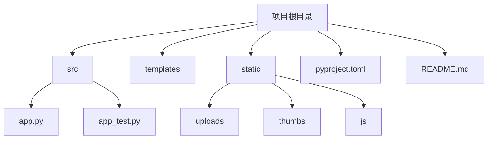
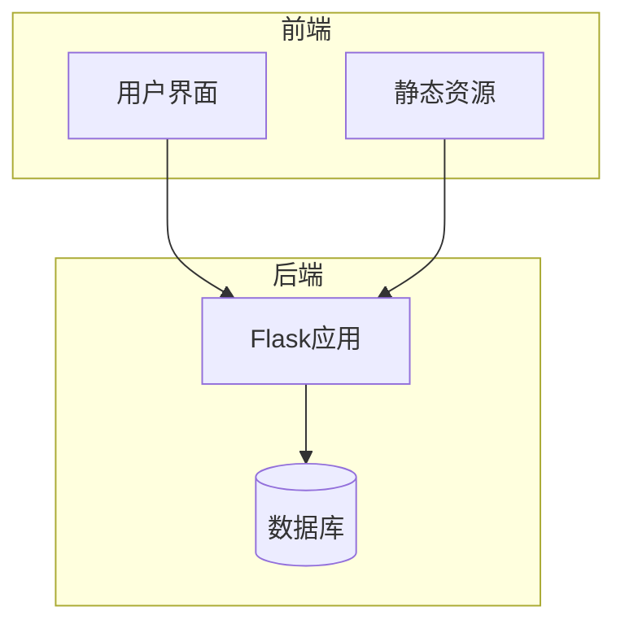
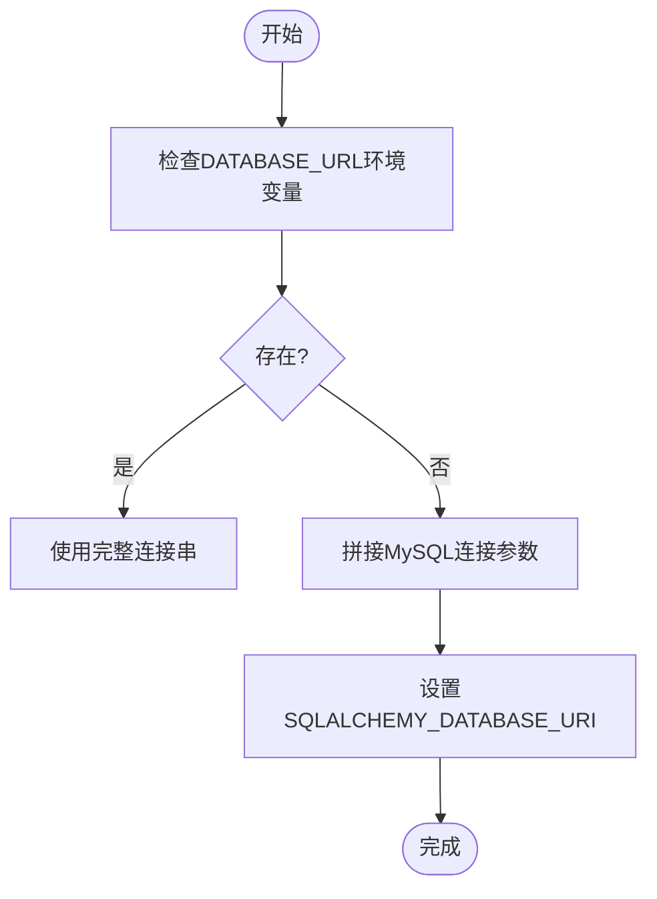
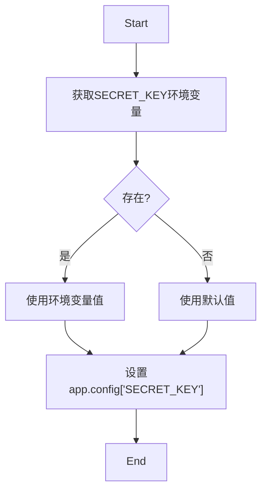
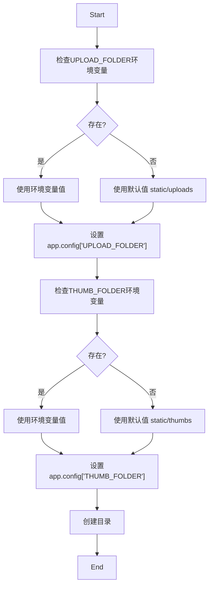
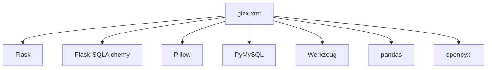

# 部署与配置管理

<cite>
**本文档引用文件**  
- [app.py](file://src/app.py)
- [pyproject.toml](file://pyproject.toml)
- [README.md](file://README.md)
- [README_DEPENDENCIES.md](file://README_DEPENDENCIES.md)
</cite>

## 目录
1. [简介](#简介)
2. [项目结构](#项目结构)
3. [核心组件](#核心组件)
4. [架构概述](#架构概述)
5. [详细组件分析](#详细组件分析)
6. [依赖分析](#依赖分析)
7. [性能考虑](#性能考虑)
8. [故障排除指南](#故障排除指南)
9. [结论](#结论)

## 简介
本指南提供glzx-xmt项目从开发环境到生产环境的完整部署说明。内容涵盖生产级WSGI服务器（如Gunicorn + Nginx）的配置方法、MySQL数据库的生产部署建议、静态文件服务优化、环境变量管理（如数据库连接字符串、SECRET_KEY）、日志记录配置以及系统性能调优参数。基于app.py中的配置逻辑和pyproject.toml中的依赖声明，说明如何构建可部署的包或Docker镜像。涵盖常见部署场景（如云服务器、内网部署）的注意事项，并提供健康检查、启动脚本和进程守护（如systemd）的配置示例。

## 项目结构
glzx-xmt项目采用典型的Flask应用结构，包含源代码、模板、静态资源和配置文件。主要目录包括src（存放Python源码）、templates（HTML模板）、static（前端资源）以及根目录下的配置和说明文件。

**Diagram sources**
- [app.py](file://src/app.py#L1-L50)
- [pyproject.toml](file://pyproject.toml#L1-L10)

**Section sources**
- [app.py](file://src/app.py#L1-L50)
- [pyproject.toml](file://pyproject.toml#L1-L10)

## 核心组件
项目核心由Flask应用构成，通过app.py启动，使用SQLAlchemy进行数据库操作，支持用户认证、照片上传、投票管理等功能。数据库连接通过环境变量灵活配置，支持MySQL和SQLite两种模式。系统具备三级权限控制机制，并集成风控策略防止刷票和异常登录行为。

**Section sources**
- [app.py](file://src/app.py#L25-L100)
- [pyproject.toml](file://pyproject.toml#L15-L30)

## 架构概述
系统采用前后端分离的轻量级Web架构，后端基于Flask框架处理业务逻辑和数据持久化，前端使用原生HTML/CSS/JavaScript实现响应式界面。数据存储支持MySQL和SQLite，图像处理依赖Pillow库生成缩略图和添加水印。

**Diagram sources**
- [app.py](file://src/app.py#L10-L50)
- [pyproject.toml](file://pyproject.toml#L5-L15)

## 详细组件分析

### 数据库配置分析
系统通过环境变量动态配置数据库连接，优先使用DATABASE_URL，否则通过DB_USER、DB_PASSWORD等片段拼接MySQL连接串。此设计便于在不同环境中灵活切换数据库配置。

**Diagram sources**
- [app.py](file://src/app.py#L24-L35)

### 安全配置分析
系统通过SECRET_KEY环境变量管理会话安全，若未设置则使用默认值。生产环境中必须通过环境变量提供强随机密钥以确保安全性。

**Diagram sources**
- [app.py](file://src/app.py#L39)

### 文件存储配置分析
上传文件和缩略图路径可通过UPLOAD_FOLDER和THUMB_FOLDER环境变量配置，默认指向static/uploads和static/thumbs目录。系统在启动时自动创建这些目录。

**Diagram sources**
- [app.py](file://src/app.py#L37-L38)

## 依赖分析
项目依赖通过pyproject.toml文件声明，核心依赖包括Flask、Flask-SQLAlchemy、Pillow、PyMySQL和Werkzeug。构建系统使用hatchling，可打包包含静态资源和模板的wheel包。

**Diagram sources**
- [pyproject.toml](file://pyproject.toml#L15-L25)

**Section sources**
- [pyproject.toml](file://pyproject.toml#L1-L30)

## 性能考虑
为提升生产环境性能，建议使用Gunicorn作为WSGI服务器，配合Nginx反向代理处理静态文件。数据库连接应使用连接池，静态资源可通过CDN加速。在高并发场景下，可考虑引入Redis缓存投票和用户状态数据。

## 故障排除指南
常见问题包括数据库连接失败、文件上传权限错误、环境变量未生效等。应检查环境变量配置是否正确，确保数据库服务正常运行，验证文件目录有适当读写权限。日志记录应启用以追踪请求和错误信息。

**Section sources**
- [app.py](file://src/app.py#L10-L50)
- [pyproject.toml](file://pyproject.toml#L1-L10)

## 结论
glzx-xmt项目具备完整的生产部署能力，通过环境变量实现配置解耦，支持灵活的部署方案。建议在生产环境中使用Gunicorn+Nginx架构，配置外部MySQL数据库，并通过环境变量管理敏感信息。系统架构清晰，易于维护和扩展。