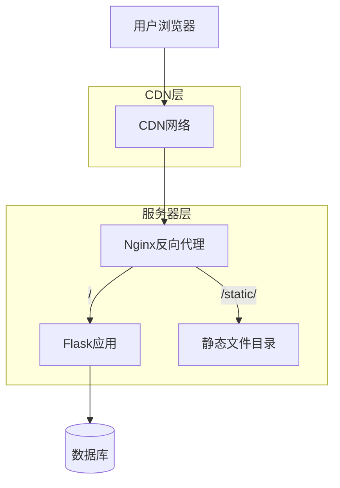

# 静态文件与资源优化

<cite>
**本文档引用文件**  
- [app.py](file://src/app.py#L41)
- [agreement-modal.js](file://static/js/agreement-modal.js)
- [pyproject.toml](file://pyproject.toml)
</cite>

## 目录
1. [引言](#引言)
2. [静态资源现状分析](#静态资源现状分析)
3. [Nginx直接服务静态资源](#nginx直接服务静态资源)
4. [缓存策略配置](#缓存策略配置)
5. [版本化文件名与CDN加速](#版本化文件名与cdn加速)
6. [构建流程优化建议](#构建流程优化建议)
7. [综合优化方案](#综合优化方案)

## 引言
本项目为基于Flask的摄影比赛管理系统，包含用户注册、作品上传、投票、协议管理等功能。前端使用原生HTML模板与少量JavaScript交互逻辑（如`agreement-modal.js`），静态资源集中存放于`static/`目录下。在生产环境中，静态资源的加载性能直接影响用户体验，因此有必要通过Nginx、缓存、构建工具等手段进行系统性优化。

## 静态资源现状分析
当前项目中静态资源主要包含：
- JavaScript文件：位于`static/js/`，如`agreement-modal.js`，用于协议弹窗交互
- 图片上传目录：`static/uploads` 和 `static/thumbs`，由用户上传生成
- 模板文件：位于`templates/`，使用Flask的`render_template`渲染

Flask应用通过以下配置指定静态文件夹：
```python
app.static_folder = 'static'
```
该配置表明所有`/static/`路径请求将由Flask处理，但在生产环境中应交由Nginx等高性能Web服务器直接响应。

**本节来源**
- [app.py](file://src/app.py#L41)

## Nginx直接服务静态资源
在生产环境中，应配置Nginx直接处理`/static/`路径请求，避免经过Flask应用，从而显著提升响应速度和并发能力。

### Nginx配置示例
```nginx
location /static/ {
    alias /path/to/your/project/static/;
    expires 1y;
    add_header Cache-Control "public, immutable";
    add_header ETag "";
    break;
}
```
- `alias` 指向项目`static`目录的绝对路径
- `expires 1y` 设置长期缓存
- `Cache-Control: public, immutable` 表示资源可被公共缓存且内容不会改变
- `ETag ""` 禁用ETag以减少头部开销（配合版本化文件名时可安全禁用）

此配置可使静态资源请求完全绕过Python应用，由Nginx以极低延迟响应。

**本节来源**
- [app.py](file://src/app.py#L41)

## 缓存策略配置
合理的缓存策略可大幅减少重复请求，提升加载速度。

### 缓存头设置建议
| 资源类型 | Cache-Control | ETag | 说明 |
|--------|--------------|------|------|
| JS/CSS/图片（版本化） | `public, max-age=31536000, immutable` | 禁用 | 长期缓存，内容不变 |
| 用户上传图片 | `public, max-age=604800` | 启用 | 一周缓存，支持变更 |
| HTML模板 | `no-cache` 或 `max-age=0` | 启用 | 每次验证，确保最新 |

### 实现方式
- **版本化资源**：使用`/static/js/agreement-modal.v1.2.3.js`格式，配合`immutable`实现永久缓存
- **Nginx自动设置**：通过`location`块为不同路径设置不同缓存策略
- **Flask辅助**：在开发环境可通过`send_file`手动设置头信息，生产环境交由Nginx处理

**本节来源**
- [app.py](file://src/app.py#L41)
- [agreement-modal.js](file://static/js/agreement-modal.js)

## 版本化文件名与CDN加速
### 版本化文件名
通过构建工具（如Webpack、Flask-Assets）在文件名中嵌入内容哈希，如：
```
agreement-modal.js → agreement-modal.a1b2c3d.js
```
优势：
- 实现`Cache-Control: immutable`的永久缓存
- 更新后自动失效旧缓存
- 避免手动管理缓存失效

### CDN加速
将`/static/`资源托管至CDN（如Cloudflare、阿里云CDN）：
- 全球边缘节点加速访问
- 自动Gzip/Brotli压缩
- DDoS防护与带宽优化
- 配合版本化文件名实现高效缓存

**本节来源**
- [agreement-modal.js](file://static/js/agreement-modal.js)

## 构建流程优化建议
### 推荐工具
| 工具 | 说明 |
|------|------|
| **Webpack** | 功能全面，支持JS/CSS压缩、代码分割、哈希命名 |
| **Flask-Assets** | 与Flask集成好，支持多种过滤器（jsmin、cssmin） |
| **Vite** | 现代化构建，开发体验优秀，适合未来扩展 |

### 优化目标
1. **压缩合并**：将多个JS/CSS文件合并为单个文件，减少HTTP请求数
2. **代码压缩**：移除空格、注释，缩短变量名
3. **Tree Shaking**：移除未使用的代码
4. **自动哈希**：生成`filename.[hash].js`格式的输出

### 示例构建流程（Webpack）
```javascript
// webpack.config.js
module.exports = {
  entry: './static/js/agreement-modal.js',
  output: {
    filename: '[name].[contenthash].js',
    path: path.resolve(__dirname, 'static/dist')
  },
  mode: 'production',
  optimization: {
    minimize: true
  }
};
```

**本节来源**
- [agreement-modal.js](file://static/js/agreement-modal.js)

## 综合优化方案
### 生产环境部署架构


**图示来源**
- [app.py](file://src/app.py#L41)
- [agreement-modal.js](file://static/js/agreement-modal.js)

### 优化实施步骤
1. **配置Nginx**：将`/static/`路径指向静态目录，设置缓存头
2. **引入构建工具**：使用Webpack或Flask-Assets压缩合并JS/CSS
3. **启用版本化**：输出带哈希的文件名，实现长期缓存
4. **接入CDN**：将`static`目录同步至CDN，配置缓存规则
5. **监控效果**：使用Lighthouse等工具验证性能提升

通过以上优化，可显著降低前端资源加载时间，提升用户体验和系统并发能力。

**本节来源**
- [app.py](file://src/app.py#L41)
- [agreement-modal.js](file://static/js/agreement-modal.js)
- [pyproject.toml](file://pyproject.toml)