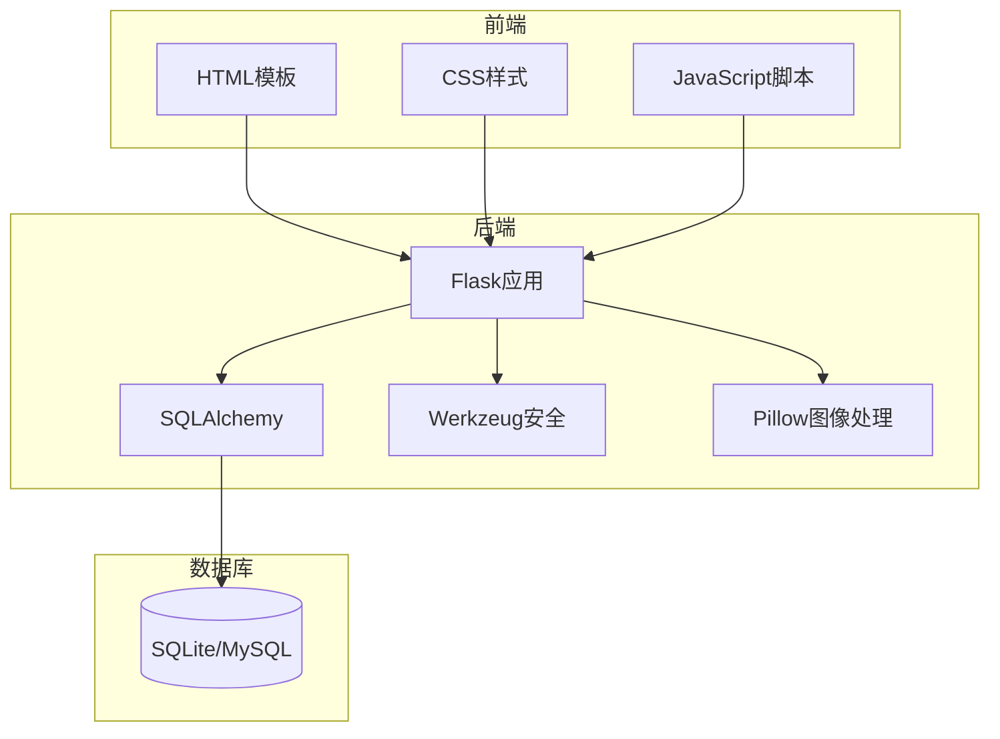
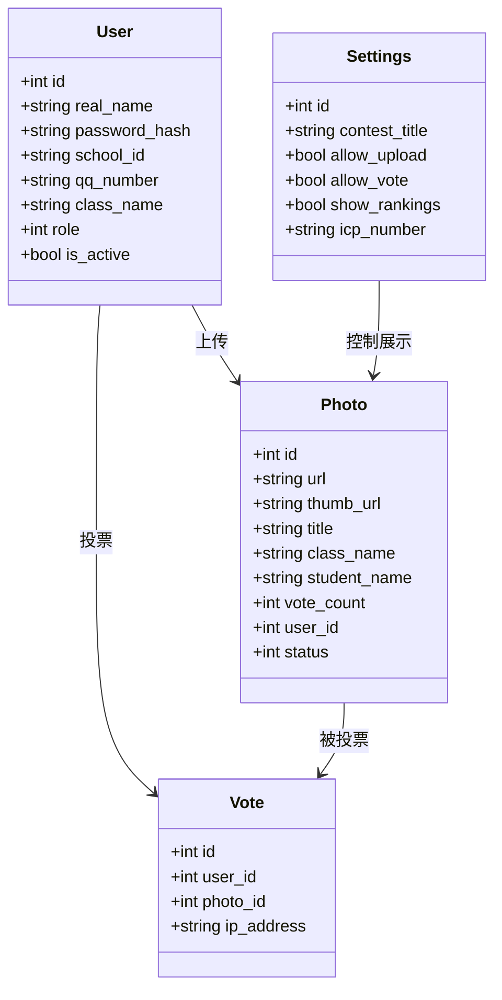
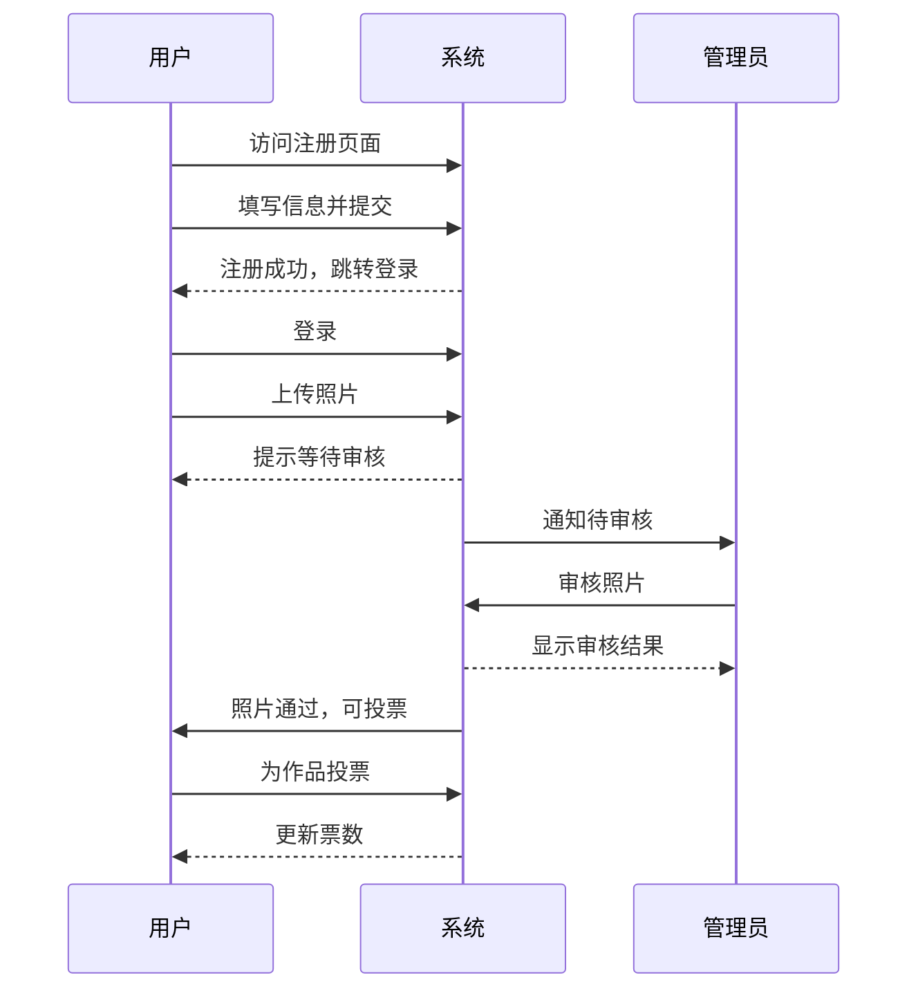

# 项目概述

<cite>
**本文档引用的文件**  
- [app.py](file://src/app.py)
- [app_test.py](file://src/app_test.py)
- [watermark_cache.py](file://src/watermark_cache.py)
- [README.md](file://README.md)
- [index.html](file://templates/index.html)
- [admin.html](file://templates/admin.html)
- [admin_review.html](file://templates/admin_review.html)
- [register.html](file://templates/register.html)
</cite>

## 目录

1. [项目简介](#项目简介)  
2. [系统架构与技术选型](#系统架构与技术选型)  
3. [核心功能模块分析](#核心功能模块分析)  
4. [项目结构与目录说明](#项目结构与目录说明)  
5. [典型用户工作流](#典型用户工作流)  
6. [安全机制与数据流设计](#安全机制与数据流设计)  
7. [扩展潜力与优化建议](#扩展潜力与优化建议)

## 项目简介

glzx-xmt 是一个基于 Flask 框架开发的摄影比赛投票管理系统，旨在为校园或组织内部的摄影比赛提供完整的线上投票解决方案。系统采用 MVC（模型-视图-控制器）架构设计，实现了用户注册、照片上传与审核、在线投票、排行榜展示以及多级权限管理等核心功能。

系统支持三级用户权限体系：普通用户可上传作品并参与投票；普通管理员负责审核照片和管理内容；系统管理员则拥有最高权限，可进行系统配置和用户管理。通过 SQLite 和 MySQL 两种数据库支持，系统既适用于本地测试，也可部署于生产环境。

系统前端采用响应式设计，适配电脑端和移动端浏览，界面风格为深色简约风格，提升用户体验。所有上传的照片需经管理员审核后方可公开显示，确保内容合规性。投票机制具备防重复投票、实时更新和可撤销投票功能，保障投票过程的公平与透明。

**Section sources**  
- [README.md](file://README.md#L1-L116)

## 系统架构与技术选型

本系统采用 Flask 作为后端 Web 框架，结合 SQLAlchemy 实现 ORM 数据访问层，构建了清晰的 MVC 架构。Flask 的轻量级特性使得系统具有良好的可扩展性和灵活性，适合中小型应用开发。

在数据持久化方面，系统支持 SQLite 和 MySQL 两种数据库引擎。`app.py` 文件配置为使用 MySQL，适用于生产环境；`app_test.py` 则使用 SQLite，便于快速测试和开发。这种双模式设计提高了系统的部署适应性。

图像处理依赖 Pillow（PIL）库，用于生成缩略图和添加水印。前端采用原生 HTML、CSS 和 JavaScript 技术栈，未引入复杂框架，降低了学习和维护成本。安全方面，系统使用 Werkzeug 提供的密码哈希功能保障用户密码安全，并通过会话（session）机制实现用户状态管理。

系统通过 Jinja2 模板引擎渲染 HTML 页面，实现了前后端的数据交互。所有敏感操作均需登录验证，并根据用户角色判断权限，确保系统安全性。

**Diagram sources**  
- [app.py](file://src/app.py#L1-L799)  
- [app_test.py](file://src/app_test.py#L1-L799)

**Section sources**  
- [app.py](file://src/app.py#L1-L799)  
- [app_test.py](file://src/app_test.py#L1-L799)

## 核心功能模块分析

### 用户注册与登录

用户可通过 `register.html` 页面注册账号，真实姓名作为唯一登录凭证。系统对校学号和 QQ 号进行格式校验，防止无效数据录入。注册成功后，用户可使用真实姓名和密码登录系统。

登录过程记录用户 IP 地址和 User-Agent，用于风控分析。系统具备登录频率限制机制，防止暴力破解。若检测到异常行为，将自动封禁相关 IP 和账户。

### 照片上传与审核

普通用户登录后可访问 `upload.html` 上传多张参赛照片。系统自动生成 180x120 缩略图用于列表展示，并将原图存储于 `static/uploads/` 目录。每张照片初始状态为“待审核”，需由管理员审批后才能在主页展示。

管理员通过 `admin_review.html` 界面查看所有待审核照片，可执行通过、拒绝或删除操作。审核结果实时更新，确保流程透明。

### 在线投票机制

投票功能具备多重防护机制。系统检查投票时间窗口、单 IP 投票次数上限，并支持“每人仅投一票”模式。投票时需二次确认，防止误操作。用户可撤销已投选票，提升操作灵活性。

投票数据通过 AJAX 异步提交，实现无刷新更新票数。系统记录投票 IP，便于后续审计。

### 排行榜展示

`rankings.html` 页面展示按票数排序的排行榜，支持并列排名计算。系统管理员可在设置中开启或关闭排行榜功能，灵活控制信息展示范围。

### 多级权限管理

系统定义三种角色：
- **Level 1（普通用户）**：上传、投票、管理个人作品
- **Level 2（普通管理员）**：审核照片、删除任意作品、访问管理面板
- **Level 3（系统管理员）**：用户管理、系统设置、全局控制

权限通过装饰器函数（如 `@login_required`、`@admin_required`）实现，代码复用性高，逻辑清晰。

**Diagram sources**  
- [app.py](file://src/app.py#L50-L300)  
- [index.html](file://templates/index.html#L0-L799)  
- [admin_review.html](file://templates/admin_review.html#L0-L293)

**Section sources**  
- [app.py](file://src/app.py#L300-L799)  
- [templates](file://templates)  

## 项目结构与目录说明

项目采用标准 Flask 项目结构，各目录职责明确：

- `src/`：核心源码目录，包含主应用文件 `app.py` 和测试版本 `app_test.py`，以及水印缓存优化模块 `watermark_cache.py`。
- `templates/`：HTML 模板文件存放目录，使用 Jinja2 模板语法实现动态内容渲染。
- `static/`：静态资源目录，包含 JavaScript 脚本、CSS 样式表、用户上传的原图和生成的缩略图。
- 根目录下 `README.md` 提供项目说明，`pyproject.toml` 定义项目元信息。

系统通过 `app.static_folder = 'static'` 显式指定静态文件目录，避免默认路由冲突。上传文件路径通过配置项 `UPLOAD_FOLDER` 和 `THUMB_FOLDER` 灵活设置，便于部署调整。

**Section sources**  
- [README.md](file://README.md#L100-L116)  
- [app.py](file://src/app.py#L20-L30)

## 典型用户工作流

### 新用户参赛流程

1. 访问 `/register` 页面填写真实姓名、班级、QQ 号等信息完成注册。
2. 使用注册信息登录系统。
3. 进入 `/upload` 页面选择多张照片并填写作品名称，提交上传。
4. 系统提示“照片上传成功，等待审核”，用户可在“我的照片”中查看状态。
5. 审核通过后，作品出现在主页供投票。
6. 用户可为其他作品投票，并在排行榜中查看排名。

### 管理员审核流程

1. 使用管理员账号登录系统。
2. 访问 `/admin_review` 页面查看所有待审核照片。
3. 点击“通过”使照片公开，或“拒绝”/“删除”处理不合格作品。
4. 可通过 `/admin` 管理所有已审核作品，支持网格/列表视图切换、按票数或时间排序。
5. 支持批量下载选中照片，便于归档。

**Diagram sources**  
- [register.html](file://templates/register.html#L0-L283)  
- [app.py](file://src/app.py#L500-L600)  
- [admin_review.html](file://templates/admin_review.html#L0-L293)

## 安全机制与数据流设计

系统构建了多层次安全防护体系：

- **身份验证**：基于 session 的登录状态管理，每次请求验证用户活跃状态。
- **权限控制**：通过装饰器实现三级权限校验，防止越权访问。
- **输入校验**：对学号、QQ 号等字段进行格式验证，防止非法数据。
- **IP 风控**：记录登录和投票 IP，限制单 IP 投票频率和登录账号数量。
- **自动封禁**：检测到异常行为时，自动封禁相关 IP 和用户账户。
- **前端防护**：禁用右键菜单、开发者工具快捷键，防止源码查看和截图。

数据流设计遵循清晰的处理路径：用户请求 → 路由分发 → 权限校验 → 业务逻辑处理 → 数据库操作 → 响应返回。所有敏感操作均记录日志，便于审计追踪。

**Section sources**  
- [app.py](file://src/app.py#L300-L400)  
- [register.html](file://templates/register.html#L200-L283)

## 扩展潜力与优化建议

本系统具备良好的扩展性，未来可进行以下优化：

1. **缓存优化**：引入 `watermark_cache.py` 中的缓存机制，减少重复水印生成开销。
2. **协议管理**：通过 `agreement_management.html` 实现用户协议动态配置。
3. **白名单机制**：支持 IP 和用户白名单，豁免风控检查。
4. **国际化支持**：提取文本常量，支持多语言切换。
5. **API 接口化**：将核心功能封装为 RESTful API，便于移动端集成。
6. **自动化测试**：补充单元测试和集成测试，提升代码质量。

系统当前已具备完整功能闭环，代码结构清晰，适合二次开发和功能拓展。

**Section sources**  
- [watermark_cache.py](file://src/watermark_cache.py#L0-L183)  
- [app.py](file://src/app.py#L400-L500)